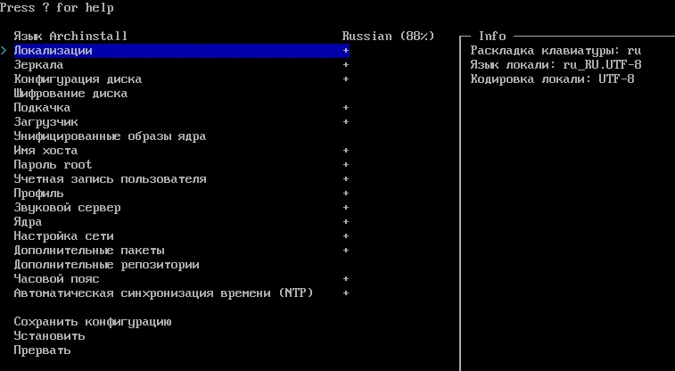

Советы, рекомендации и напутствия при установке и настройке Arch Linux.

<!--more-->

> [!important]
> Arch Linux предназначен для продвинутых пользователей, которые готовы сами
заниматься обслуживанием системы. Это руководство рассчитано на пользователей,
которые уже имеют опыт использования Linux и
[командной строки](/guides/how-to-use-console). Если это не так, то рекомендуем
пока воздержаться от использования Arch Linux и попробовать другой дистрибутив
Linux. Также посмотрите [страницу про Arch Linux](/software/arch-linux), чтобы
узнать для кого он предназначен, и какие производные можно использовать в
качестве альтернативы.

## Подготовка установочного носителя

Установочный носитель предназначен только для новых установок или
восстановления. Существующую систему Arch Linux всегда можно обновить командой
`pacman -Syu`.

[Скачайте](https://archlinux.org/download) установочный файл ISO. Рекомендуется
скачивать через [BitTorrent] — так обычно быстрее, и выполняется проверка на
целостность. Если вы скачиваете с зеркала, то стоит
[проверить подлинность файла]. Установочный образ с самым свежим программным
обеспечением выходит обычно в начале каждого месяца.

Скачанный ISO-файл нужно [записать на USB-накопитель] при помощи [balenaEtcher]
(кроссплатформенная) или [Rufus] (только Windows). Также можно воспользоваться
[Ventoy], чтобы иметь возможность загружаться с ISO напрямую, не перезаписывая
USB-накопитель.

[BitTorrent]: https://archlinux.org/download/#bittorrent-download
[проверить подлинность файла]: https://wiki.archlinux.org/title/Installation_guide_(Русский)#Проверка_подписи
[записать на USB-накопитель]: https://wiki.archlinux.org/title/USB_flash_installation_medium_(Русский)
[balenaEtcher]: https://etcher.balena.io
[Rufus]: https://rufus.ie
[Ventoy]: https://www.ventoy.net

> [!warning]
> Установка операционной системы потенциально ведёт к потере данных.
Подразумевается, что у вас уже есть актуальная и рабочая резервная копия всех
важных данных.

## Загрузка с установочного носителя

Установочный образ не поддерживает [Secure Boot] и режим [RAID]. Во время
установки это можно будет настроить, но пока отключите эти настройки в
BIOS/UEFI.

[Secure Boot]: https://wiki.archlinux.org/title/Unified_Extensible_Firmware_Interface/Secure_Boot
[RAID]: https://wiki.archlinux.org/title/RAID

При успешной загрузке с установочного устройства должен отобразиться терминал с
приветственным сообщением. Переключаться между сеансами терминала можно
сочетанием `Ctrl`+`Alt`+`[F1-F9]` (логин: root).


Вы можете выбрать русскую раскладку клавиатуры командой `loadkeys ru`, а затем
переключаться при помощи сочетания клавиш `Ctrl`+`Shift`. Загрузить символы
кириллицы командой `setfont cyr-sun16`.

Для установки системы требуется соединение с интернетом (вы будете скачивать
гигабайты программ). Подключиться к Wi-Fi можно при помощи [iwctl]. Проверить
соединение: `ping -c 5 archlinux.org`.

[iwctl]: https://wiki.archlinux.org/title/Iwd_(Русский)#iwctl

## Двойная загрузка с Windows

> **Основная статья:**
[Dual boot with Windows](https://wiki.archlinux.org/title/Dual_boot_with_Windows)
— ArchWiki

> [!caution]
> Этот раздел не был надёжно проверен и может содержать неточности и неполную
информацию. Рекомендуется исследовать другие ресурсы.

> [!note]
> Информация в этом разделе актуальна только для режима загрузки UEFI.

Сначала следует установить Windows, так как она может стереть загрузчик
Linux. Загрузчик Windows можно скопировать на другой носитель, а затем, после
установки загрузчика Linux, восстановить его на новом разделе. Systemd-boot умеет
находить загрузчик Windows автоматически по пути
`/EFI/Microsoft/Boot/Bootmgfw.efi`. Обратите внимание, что раздел загрузчика
Windows может иметь слишком маленький размер, которого не хватит для Linux. У
вас должен быть только один раздел EFI на компьютере.

Автоматические установщики должны уметь определять наличие установленной
системы Windows и настраивать двойную загрузку.

## Автоматическая установка

[Archinstall] — автоматический пошаговый установщик с текстовым интерфейсом.
Вы можете использовать его для лёгкой и быстрой установки системы.
Доступен экспорт конфигурации установки.

[Archinstall]: https://wiki.archlinux.org/title/Archinstall



Подключитесь к сети, а затем введите `archinstall`. Если обнаружена новая
версия, обновите командой `pacman -S archinstall`. Выбирайте желаемые опции
или оставляйте умолчания/оптимальные. После успешной установки можно
использовать chroot для завершения настройки.

Система, установленная при помощи Archinstall, может быть даже стабильнее
установленной вручную. Но иногда с установщиком могут возникнуть проблемы. В
таком случае вам нужно [найти решение]. Установщик [написан на языке Python],
может потребоваться изменить код для исправления ошибок.

[найти решение]: https://github.com/archlinux/archinstall/issues?q=is%3Aissue
[написан на языке Python]: https://github.com/archlinux/archinstall

Archinstall производит установку системы не совсем так, как это делают вручную.
При обращении за помощью необходимо прикладывать журнал установщика
(`/var/log/archinstall/install.log`).

> **Смотрите также:**
[Документация Archinstall](https://archinstall.archlinux.page)

## Ручная установка

Во время ручной установки вы **всегда** должны опираться на
[официальную инструкцию], [ArchWiki] и руководства команд ([Manual pages]).

[официальную инструкцию]: https://wiki.archlinux.org/title/Installation_guide_(Русский)
[ArchWiki]: https://wiki.archlinux.org/title/Main_page_(Русский)

Этот раздел **не является** полным руководством, здесь лишь содержатся
объяснения и дополнения к некоторым моментам во время ручной установки.
Информация, приведённая на этой странице, может быть уже
**устаревшей или недействительной**. Вы **всегда** должны сверяться с
официальными ресурсами, прежде чем выполнять какие-либо действия.

Ручная установка на самом деле не такая сложная, как может показаться. В
процессе такой установки можно узнать, как устроена работа Unix-подобных систем
и компьютеров в целом.

Ручная установка в целом не имеет определённого порядка. В разных источниках
процесс может незначительно отличаться. Этапы установки зависят от выбранного
программного обеспечения и оборудования.

Информация на этой странице актуальна только для режима загрузки UEFI. Проверьте
при помощи `cat /sys/firmware/efi/fw_platform_size` (должно вывести какое-либо
значение). В виртуальной машине VirtualBox режим EFI можно включить так:
Настройки машины (в выключенном состоянии) → Система → Материнская плата →
включить EFI.

### Диски

Используйте `lsblk` или `fdisk -l` для получения списка дисков и разделов.
Определите диск, на который вы собираетесь установить систему. Если желаемый
диск не отображается, отключите режим RAID в BIOS/UEFI.

> [!warning]
> Выполнение операций над дисками и разделами может привести к потере данных. У
вас всегда должна быть актуальная резервная копия. Запускайте все команды
осторожно.

> [!note]
> - Потратьте время на планирование долгосрочной схемы разметки, чтобы избежать
рискованных и сложных процедур преобразования или переразметки в будущем.
>
> - Если вы хотите настроить [LVM], [шифрование системы] или [RAID], сделайте
это сейчас.
>
> - Если на диске, с которого вы хотите загрузиться, уже есть системный раздел
EFI, не создавайте еще один, а используйте существующий раздел.

[LVM]: https://wiki.archlinux.org/title/Install_Arch_Linux_on_LVM
[шифрование системы]: https://wiki.archlinux.org/title/Dm-crypt
[RAID]: https://wiki.archlinux.org/title/RAID

#### Разметка

Очистить диск можно командой `gdisk` → `x` → `z` (разметка GPT). Разбить диск
на разделы можно командой `cgdisk`.

Для установки системы нужен как минимум один корневой раздел и раздел EFI в
режиме UEFI.

1. **boot** (`ef00`): 1GiB
    - Раздел загрузчика EFI.
2. **swap** (`8200`): Половина ОЗУ (не больше 16 GiB)
    - Раздел [подкачки](https://wiki.archlinux.org/title/Swap_(Русский)), куда
    будут выгружаться данные из оперативной памяти в случае необходимости.
3. **root** (`8300`): 80 GiB (на усмотрение)
    - Корневой раздел, где будут храниться все программы, библиотеки, журнал и
    конфигурация.
4. **home** (`8300`): Остаток
    - Вы можете создать раздел, где будут храниться данные пользователя отдельно
    от системы. В таком случае можно будет переустановить систему или сменить
    дистрибутив, не затрагивая данных пользователей.

Далее на этой странице будем считать раздел boot как `/dev/sda1`,
swap — `/dev/sda2`, root — `/dev/sda3`, home — `/dev/sda4`.

#### Форматирование

```sh
# Boot
mkfs.fat -n BOOT -F 32 /dev/sda1

# Swap
mkswap /dev/sda2
swapon /dev/sda2

# Остальные
mkfs.btrfs -L root /dev/sda3
mkfs.btrfs -L home /dev/sda4
```

Файловая система [Btrfs](https://wiki.archlinux.org/title/Btrfs_(Русский))
является наиболее современной. Она позволяет делать моментальные снимки системы,
которые не занимают лишнее место.

Для Btrfs требуется немного больше знаний. Если вы не готовы, то будет
достаточно файловой системы ext4. Тогда нужно использовать соответствующую
команду `mkfs.ext4`.

> **Смотрите также:** Статьи про Btrfs
> - https://christitus.com/btrfs-guide
> - https://ctlos.github.io/wiki/btrfs/btrfs-part1

#### Монтирование

Если вы выбрали файловую систему ext4, то нужно только смонтировать разделы в
нужные директории. Если у вас файловая система Btrfs, и вы хотите использовать
снимки, нужно сначала создать подразделы:

```sh
mount /dev/sda3 /mnt  # root
btrfs subvolume create /mnt/@
btrfs subvolume list /mnt  # Проверка
umount /mnt
```

Были созданы подразделы в верхнем уровне тома. Эти подразделы можно монтировать
отдельно. В них и будут храниться файлы. Потом можно делать снимки подразделов.

Чтобы смонтировать подраздел, нужно указать опцию монтирования `subvol=путь` или
`subvolid=номер`. Дополнительно можно указать алгоритм сжатия.

```sh
# Опции монтирования: https://btrfs.readthedocs.io/en/latest/Administration.html
mount -o compress=lzo,subvol=@ /dev/sda3 /mnt  # root
mount --mkdir /dev/sda1 /mnt/boot
mount --mkdir /dev/sda4 /mnt/home
ls /mnt  # Проверка
```

Аналогично можно создать подразделы для `/home`. Не ошибитесь при монтировании
нужного подраздела в нужную локацию.

### Необходимые пакеты

```sh
pacstrap -K /mnt base linux linux-firmware
```

Вы можете указать дополнительные пакеты:

|Название пакета|Описание|
|:-------------:|--------|
|`base`|Основные пакеты для системы
|`linux`|Ядро системы
|`linux-firmware`|Прошивка для оборудования (не нужна в виртуальной машине)
|`linux-lts`|Дополнительное ядро с долгосрочной поддержкой
|`linux-headers` / `linux-lts-headers`|Заголовки (headers) и скрипты для сборки модулей ядра. Необходимо для некоторых драйверов (NVIDIA, VirtualBox Guest Additions)
|`intel-ucode` / `amd-ucode`|[Микрокод] (не нужен в виртуальной машине)
|`btrfs-progs`|Управление файловой системой Btrfs
|`nano`|Текстовый редактор
|`man-db`|Руководства команд [Manual pages]

[Микрокод]: https://wiki.archlinux.org/title/Microcode_(Русский)
[Manual pages]: https://man.archlinux.org

### Локализация

Вы можете проследовать официальному руководству, чтобы установить одну локаль в
системе. Если вы хотите видеть интерфейс на языке, отличном от вашей локали, то
нужно дополнительно [указать переменную LANGUAGE].

[указать переменную LANGUAGE]: https://wiki.archlinux.org/title/Locale_(Русский)#LANGUAGE:_запасные_локали

```conf
# /etc/locale.conf

LANG=ru_RU.UTF-8
LANGUAGE=en_US:en:C:ru_RU
```

В таком случае большинство программ будет отображаться на желаемом языке по
умолчанию. Однако некоторые программы всё равно будут отображать язык в
зависимости от локали.

Примените переменные:

```sh
export LANG=ru_RU.UTF-8 LANGUAGE=en_US:en:C:ru_RU
```

В качестве проверки можно ввести `pacman -Syy`. Если дроби в скорости загрузки
отображаются через запятую — установлена русская локаль. Если показываются
русские буквы или квадраты — установлен русский язык (исправить отображение
символов можно командой `setfont cyr-sun16`).

### Сеть

Необходимо настроить сеть, иначе после загрузки в систему у вас не будет
интернета, и вам придётся заново загружаться с установочного образа.

```sh
pacman -S networkmanager
systemctl enable NetworkManager.service
```

### Пользователи

Установите [пароль](https://wiki.archlinux.org/title/Security_(Русский)#Пароли)
для пользователя root, а затем добавьте главного пользователя:

```sh
passwd
useradd -m -g users -G wheel,storage,power -s /usr/bin/bash имя_пользователя
passwd имя_пользователя
```

Настройте команду `sudo`:

```sh
pacman -S sudo
EDITOR=nano visudo
```

Уберите `#` перед строкой `%wheel ALL=(ALL:ALL) ALL`, чтобы дать себе
возможность пользоваться `sudo`. Для дополнительной безопасности можно добавить
в конце строку `Defaults rootpw`, чтобы вводить пароль root, а не пользователя.

### Загрузчик

Проверьте режим загрузки командой `ls /sys/firmware/efi/efivars`. Если она
выводит какие-то значения, то у вас EFI, и вы можете установить загрузчик
[systemd-boot]. Иначе вам подойдёт загрузчик [GRUB].

[systemd-boot]: https://wiki.archlinux.org/title/Systemd-boot
[GRUB]: https://wiki.archlinux.org/title/GRUB_(Русский)

#### systemd-boot

Установить загрузчик systemd-boot: `bootctl install`

> [!note]
> Если выводит предупреждения о дырах безопасности (Security hole), то
[установите](https://bbs.archlinux.org/viewtopic.php?id=287695) параметры
`fmask=0077,dmask=0077` для раздела boot в `/etc/fstab`, затем
[смонтируйте заново](https://bbs.archlinux.org/viewtopic.php?pid=2113977#p2113977)
с опциями `uid=0,gid=0,fmask=0077,dmask=0077`.

Создайте опцию в меню загрузчика, файл `/boot/loader/entries/arch.conf`:

```conf
title Arch Linux (linux)
linux /vmlinuz-linux
initrd /initramfs-linux.img
```

Добавьте путь к корневому разделу (в данном случае `/dev/sda3`) при помощи
команды:

```sh
# Для ext4
echo "options root=PARTUUID=$(blkid -s PARTUUID -o value /dev/КОРНЕВОЙ_РАЗДЕЛ) rw" >> /boot/loader/entries/arch.conf

# Для Btrfs
echo "options root=PARTUUID=$(blkid -s PARTUUID -o value /dev/КОРНЕВОЙ_РАЗДЕЛ) rootflags=subvol=@ rw" >> /boot/loader/entries/arch.conf
# `rootflags=subvol=@` Указывает на загрузку подраздела `@`. Без этого система не загрузится.

# После `rw` через пробел перечисляются параметры ядра.

nano /boot/loader/entries/arch.conf  # Проверка
```

Добавьте опции загрузки других ядер, например, linux-lts:

```sh
cp /boot/loader/entries/arch.conf /boot/loader/entries/arch-lts.conf
nano /boot/loader/entries/arch-lts.conf
# title Arch Linux (linux-lts)
# linux /vmlinuz-linux-lts
# initrd /initramfs-linux-lts.img
```

Также можно настроить загрузчик, чтобы указать задержку перед загрузкой:
`nano /boot/loader/loader.conf`.

```conf
timeout 3
```

### Перезагрузка

```sh
exit
umount -R /mnt
reboot
```

Должна быть установлена загрузка с диска, но вы можете извлечь загрузочное
устройство на этом этапе.

Если вы всё сделали правильно, то система должна загрузиться и пригласить вас
ввести логин и пароль. Авторизуйтесь под своим пользователем или root и
установите графическую среду, программы и важные компоненты.

> **Смотрите также:**
[Основные рекомендации](https://wiki.archlinux.org/title/General_recommendations_(Русский))
— ArchWiki

### NVIDIA

Установите проприетарные драйверы NVIDIA, следуя руководствам:

- [Только NVIDIA](https://wiki.archlinux.org/title/NVIDIA_(Русский))
- [Гибридная графика](https://wiki.archlinux.org/title/NVIDIA_Optimus_(Русский))

Перед установкой может потребоваться установить пакет `linux-headers`
(и `linux-lts-headers` для LTS-ядра).

Для гибридной графики (на ноутбуках) требуется установить `nvidia-prime`.
После установки работоспособность можно проверить командой
`prime-run glxinfo | grep "OpenGL renderer"`.

### Рабочий стол

> **Смотрите также:**
[Среды рабочего стола](https://wiki.archlinux.org/title/Desktop_environment_(Русский)),
[Сравнение рабочих столов](https://wiki.archlinux.org/title/Comparison_of_desktop_environments_(Русский))
— Arch Wiki

Установите нужные пакеты, перечислив их в `pacman -S`, и удалите ненужные при
помощи `pacman -Rns`.

Также стоит установить [важные пакеты](/software/arch-linux#пакеты).

#### KDE Plasma

> **Смотрите также:**
[Рекомендации по установке KDE](https://community.kde.org/Distributions/Packaging_Recommendations)

Основные программы:

|Название пакета|Описание|
|:-------------:|--------|
|`plasma-meta` / `plasma`|Рабочий стол
|`konsole`|Эмулятор терминала
|`dolphin`|Файловый менеджер
|`ark`|Управление архивами
|`kate`|Текстовый редактор
|`spectacle`|Создание снимков экрана
|`kdeconnect`|Связь телефона с компьютером
|`filelight`|Анализ занятого дискового пространства (+ интеграция с Dolphin)
|`kcron`|Планировщик заданий в параметрах системы

[^1]: `plasma-meta` — это мета-пакет, а `plasma` — группа. Смотрите
[разницу между мета-пакетом и группой пакетов]. Оба этих пакета установят
**рекомендованный** набор программ. Также есть вариант "минимальной" установки,
при котором будет установлена только оболочка рабочего стола, а остальные
программы и компоненты вы должны установить самостоятельно. "Минимальная"
установка **крайне не рекомендуется**, она приводит к
**отсутствию важной функциональности**, и вы можете долго не понимать в чём
проблема и как её исправлять.

[разницу между мета-пакетом и группой пакетов]: https://wiki.archlinux.org/title/Meta_package_and_package_group_(Русский)

Важные компоненты:

|Название пакета|Описание|
|:-------------:|--------|
|`qt6-imageformats`|Отображение изображений WebP и других форматов
|`ffmpegthumbs`|Рендер обложек видео в файловом менеджере
|`dolphin-plugins`|Плагины для файлового менеджера Dolphin (интеграция с Git, монтирование ISO)
|`xdg-desktop-portal-gtk`|Корректное отображение программ из Flatpak
|`flatpak-kcm`|Меню прав приложений в параметрах системы
|`print-manager`|Управление принтерами
|`markdownpart`|Рендер Markdown в Kate
|`qt6-quick3d`|Эффект куба
|`kio-admin`|Действия от имени администратора в файловом менеджере

Когда будете готовы, включите службу SDDM и перезагрузите компьютер:

```sh
systemctl enable sddm.service
reboot
```

> [!tip]
> Для отображения окна выбора файлов KDE в Firefox, установите параметр
`widget.use-xdg-desktop-portal.file-picker=1` в `about:config` в браузере.

#### Пользовательские директории

Можно переименовать [пользовательские директории] "Загрузки", "Рабочий стол" и
другие.

[пользовательские директории]: https://wiki.archlinux.org/title/XDG_user_directories_(Русский)

> [!important]
> Войдите под учётной записью вашего пользователя, прежде чем менять директории.

```sh
xdg-user-dirs-update --set DOWNLOAD ~/download
xdg-user-dirs-update --set PICTURES ~/pic
# ...
mkdir ~/download
mkdir ~/pic
# ...
xdg-user-dirs-update  # Создаст папки
ls ~  # Удалите лишние папки при помощи rm -r
```

Также это можно сделать в параметрах системы KDE Plasma. Выйдите из учётной
записи, чтобы изменения вступили в силу.

## Конфигурация

Вы можете настроить систему во время или после установки.

> **Смотрите также:** [Конфигурация Pacman](/software/arch-linux#конфигурация)

### Микрокод

Стоит установить [микрокод] для вашего процессора, чтобы получать патчи
безопасности и стабильности:

```sh
grep vendor /proc/cpuinfo  # Информация о производителе

pacman -S intel-ucode  # Для процессоров Intel
pacman -S amd-ucode  # Для процессоров AMD

sudo dmesg | grep 'microcode:'  # Проверить, загружен ли микрокод
```

### Оптимизация SSD

Если у вас есть SSD, то включите [периодический TRIM].

[периодический TRIM]: https://wiki.archlinux.org/title/Solid_state_drive_(Русский)#TRIM

Сначала проверьте поддержку командой `lsblk --discard`. Если значения DISC-GRAN
и DISC-MAX не нулевые, то диск поддерживает TRIM.
**Не используйте TRIM, если он не поддерживается.**

Затем включите таймер:

```sh
systemctl enable fstrim.timer
```

### Брандмауэр

```sh
sudo pacman -S ufw
sudo systemctl enable ufw.service
sudo systemctl start ufw.service
sudo ufw enable
sudo ufw status
```

Для работы KDE Connect нужно разрешить порты:

```sh
sudo ufw allow 1714:1764/udp
sudo ufw allow 1714:1764/tcp
```

## После установки

Теперь ваша система почти готова к использованию. Осталось только установить
нужные программы и настроить своё окружение.

Рекомендуем ознакомиться со страницей [Arch Linux](/software/arch-linux), чтобы
узнать о важных пакетах и полезных настройках.
