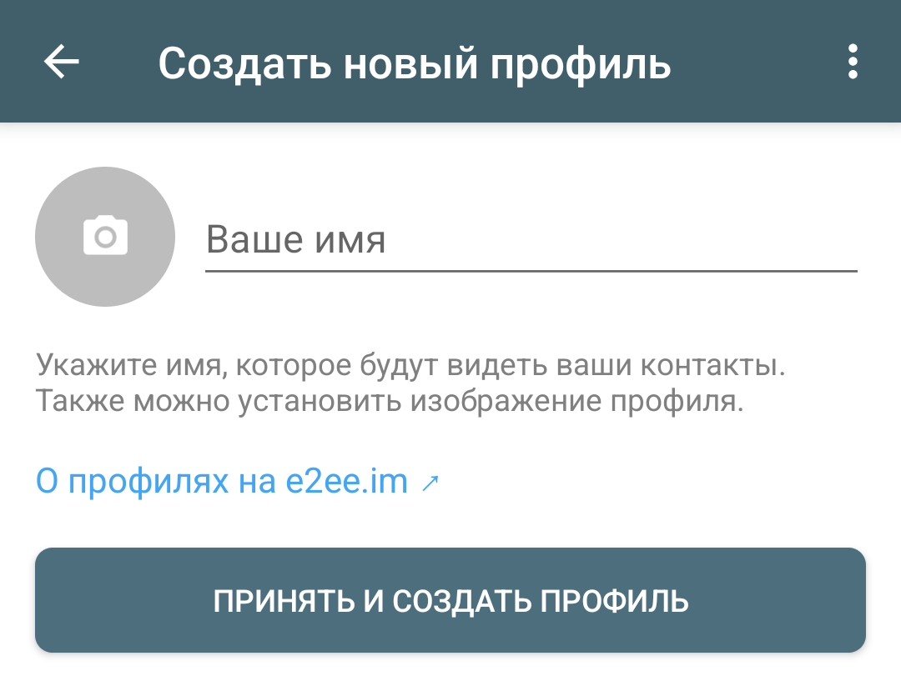
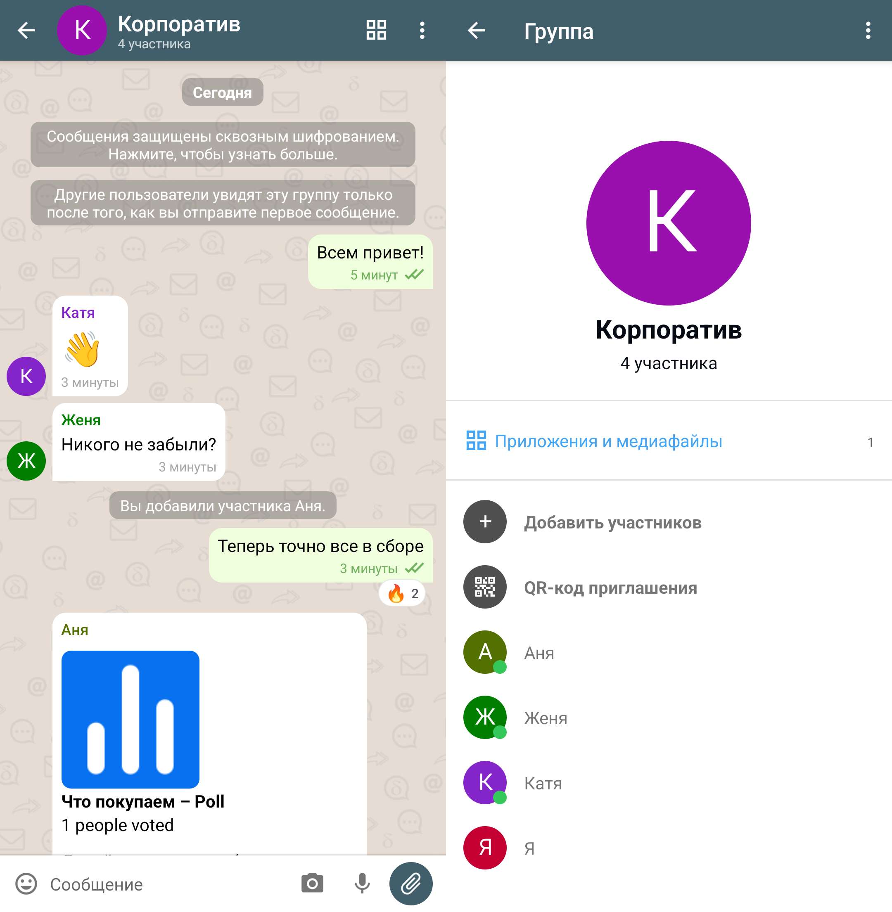
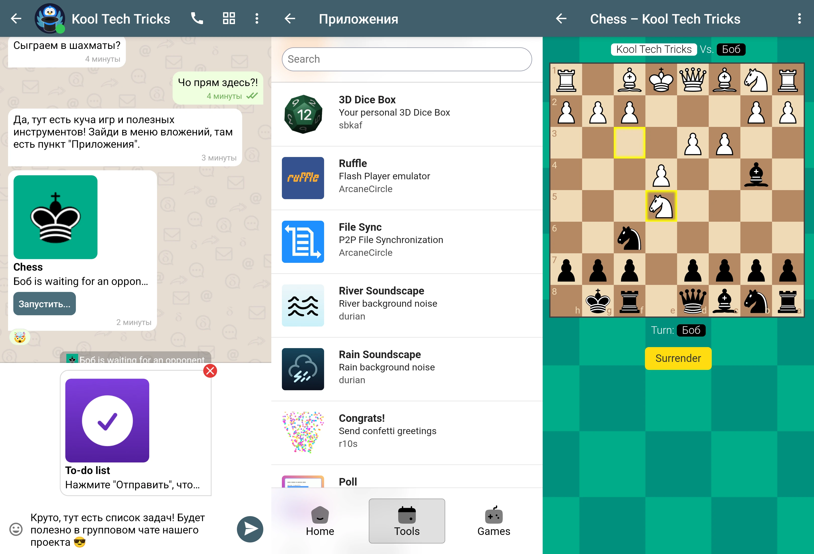
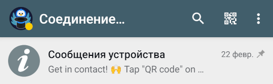
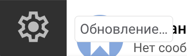

Узнайте, как использовать этот простой мессенджер для общения с друзьями,
близкими и коллегами.

<!--more-->

Это руководство является простым введением в основные функции Delta Chat.
Для более подробных и технических деталей, смотрите
[основную страницу](/software/delta-chat). Для использования Delta Chat с
вашим почтовым ящиком смотрите
[отдельное руководство](/guides/delta-chat-email).

## Скачать приложение

Официальное приложение Delta Chat доступно для [всех платформ]: [Android],
[iOS], [Windows], [macOS], [Linux]. Оно полностью бесплатно, без рекламы и с
[открытым исходным кодом].

Альтернативно, пользователи Android могут скачать [ArcaneChat] — это то же самое
приложение Delta Chat, но с расширенными и экспериментальными функциями.

[всех платформ]: https://get.delta.chat
[Android]: https://play.google.com/store/apps/details?id=chat.delta
[iOS]: https://apps.apple.com/app/delta-chat/id1459523234
[Windows]: https://apps.microsoft.com/detail/9pjtxx7hn3pk
[macOS]: https://apps.apple.com/app/delta-chat-desktop/id1462750497
[Linux]: https://flathub.org/apps/details/chat.delta.desktop
[открытым исходным кодом]: https://github.com/deltachat
[ArcaneChat]: https://play.google.com/store/apps/details?id=com.github.arcanechat

## Создать профиль

Для создания профиля в Delta Chat не нужно придумывать имя пользователя и
пароль, вводить номер телефона и прочие персональные данные.

Сначала вам нужно выбрать любой доступный сервер. Вы можете попросить у
кого-нибудь или найти самостоятельно. Есть [публичный список серверов] (могут
быть заблокированы в вашей стране).

Когда у вас есть адрес сервера, вы можете открыть его в браузере. На сайте будет
QR-код: нажмите на него или отсканируйте, чтобы использовать этот сервер в
Delta Chat. Также вы можете просто добавить `/new` к адресу сервера, чтобы
сразу открыть его в приложении.

Введите имя, по желанию выберите изображение профиля, а позже можно будет
добавить поле «О себе» — эти данные увидят только ваши собеседники.

Нажмите **«Принять и создать профиль»**. Над этой кнопкой указан сервер,
который вы будете использовать для отправки и получения сообщений. В будущем его
можно [сменить](#релеи) без потери данных. Если профиль не получается создать,
или вы испытываете проблемы с соединением, повторите вышеуказанные шаги, но
выберите другой сервер.

[публичный список серверов]: https://chatmail.at/relays

## Добавить контакт

На главном экране нажмите на **значок QR-кода** или **«+» → «Новый контакт»**.
Здесь располагается QR-код и ссылка. Другие люди могут отсканировать QR-код или
перейти по ссылке, чтобы связаться с вами.

После добавления контакта необходимо подождать установки соединения. Обычно это
занимает несколько секунд, когда оба пользователя онлайн. Затем появится
сообщение о том, что чат защищён сквозным шифрованием, и вы сможете начать
безопасное общение. Если всё равно не получается связаться, или сообщения не
доходят, то повторите шаги [создания профиля](#создать-профиль) с другим
сервером.

В Delta Chat нет публичных идентификаторов, имён пользователей или номеров
телефона, по которым вас можно было бы обнаружить. Вместо этого вы сами решаете,
кто вам может писать, когда вы делитесь ссылкой. Такой подход защищает от спама
и мошенничества. Для недоверенных людей можно [создать отдельный профиль],
изолированный от вашей семьи и друзей. Ссылку можно сбросить в любой момент, а
контакты можно блокировать.

Также вы можете поделиться контактом с другими людьми в Delta Chat: опция
доступна в меню вложений. Связанные таким образом пользователи не будут получать
уведомления, пока не примут запрос на сообщения.

[создать отдельный профиль]: #несколько-профилей-на-одном-устройстве

## Звонки

Поддерживаются аудио- и видеозвонки в личных чатах. Они хорошо интегрируются
с системой. Соединение устанавливается через те же серверы, которые вы и ваш
собеседник используют для текстовых сообщений.

В данный момент это экспериментальная функция, может работать нестабильно.
Сначала нужно включить: **Настройки → «Дополнительные параметры» →
«Debug Calls»**. Затем в личных чатах появится значок телефона, на который вы
можете нажать, чтобы позвонить. Необязательно просить собеседника активировать
настройку.

Групповые звонки и демонстрация экрана пока не поддерживаются, для этого
рекомендуем [Jitsi].

[Jitsi]: https://posts.kooltechtricks.org/@kooltechtricks/statuses/01K31JRXT0CRFP2ZTHVM1AJG09

## Группы

Чтобы создать групповой чат, нажмите **«+» → «Новая группа»**. Введите название,
по желанию выберите изображение и добавьте описание. Вы можете сразу добавить
туда участников среди ваших контактов, или позже по ссылке. После создания
группы отправьте первое сообщение, чтобы её увидели добавленные участники.

Группы в Delta Chat предназначены только для объединения **доверенных** людей.
Каждый участник имеет равные права и может удалять или приглашать других
пользователей. Ведение публичной группы может стать проблемой из-за отсутствия
каких-либо инструментов модерации, хотя в будущем это может быть доработано.

Группа может выдержать сотни участников. При добавлении участников история чата
не отправляется автоматически, нужно вручную нажимать «Отправить повторно».

## Каналы

Каналы — это инструмент вещания «один-ко-многим». Администратор может
публиковать сообщения всем подписчикам, а подписчики не видят друг друга.
Похожий концепт популярен в Telegram, но в Delta Chat имеет заметные отличия.

Каналы в данный момент являются экспериментальной функцией. Сначала нужно
включить их: **«Настройки» → «Дополнительные параметры» → «Каналы»**.
Затем вы сможете создать канал: **«+» → «Новый канал»**.

Введите название, по желанию выберите изображение и добавьте описание. Далее по
ссылке можно пригласить пользователей (их не нужно просить активировать
настройку). Администратор может сбросить ссылку.

При добавлении пользователей в канал устанавливается контакт: каждый подписчик
может лично написать администратору канала и наоборот. При этом первые сообщения
будут отмечены как «Запрос» и заглушены. Следовательно, только администратор
может видеть количество подписчиков, просмотров, время прочтения сообщений.

Если вы собираетесь приглашать недоверенных людей в свой канал, то, возможно,
стоит [создать для него отдельный профиль](#несколько-профилей-на-одном-устройстве),
чтобы не раскрывать свою личность, не захламлять список контактов и не получать
нежелательные сообщения.

Администратор канала может быть только один, и эту роль невозможно передать
другим пользователям. В данный момент не поддерживаются реакции, комментарии,
закреплённые сообщения. Новые участники не увидят старые сообщения, пока вы не
нажмёте «Отправить повторно».

Каналы в Delta Chat хорошо подходят для приватных микроблогов, объявлений,
списков рассылки. Но вести публичные сообщества и коммерческую деятельность
лучше в интернете и социальных сетях.

## Мини-приложения

Внутри Delta Chat доступны мини-приложения. Они работают только в контексте
текущего чата, и не имеют выхода в интернет. С их помощью можно выполнять
совместные задачи и развлекаться.

В меню вложений доступен пункт **Приложение**, который откроет каталог
приложений. Альтернативно его можно открыть
[в браузере](https://webxdc.org/apps).

Приложения являются специальными архивами с запакованными веб-сайтами (формат
`.xdc`). Вы можете скачать их отдельно и отправить как файл, аналогично
изображениям или документам. Собеседники смогут открыть приложение и начать с
ним взаимодействовать, а также добавить на главный экран телефона.

Примеры приложений:
- [Poll](https://github.com/davidsm10/poll-webxdc/releases/latest/download/app.xdc): Опросы.
- [To-do list](https://codeberg.org/durian/checklist/releases/download/latest/to-do%20list.xdc): Список задач.
- [TOTP](https://codeberg.org/rtn/totp/releases/download/latest/totp.xdc): Генератор кодов двухфакторной
аутентификации.
- [Realtime Editor](https://codeberg.org/durian/editor/releases/download/latest/editor.xdc): Текстовый редактор
в режиме реального времени.
- [Chess](https://github.com/ArcaneCircle/chess/releases/latest/download/app.xdc): Шахматы.
- [Quake III Arena](https://github.com/WofWca/quake3.xdc/releases/latest/download/quake3.xdc):
Многопользовательский шутер от первого лица.

Несмотря на отсутствие доступа к интернету, не рекомендуется пользоваться
приложениями от недоверенных людей. Кто угодно может прислать поддельную
версию, чтобы проще обманом заполучить чувствительные данные.

Смотрите [документацию](https://webxdc.org/docs), чтобы узнать, как создавать
свои приложения.

## Боты

В каждом мессенджере есть боты, и Delta Chat не исключение. Они могут добавлять
взаимодействия с внешним интернетом, связывать пользователей и автоматизировать
процессы. Боты хорошо интегрируются с [мини-приложениями](#мини-приложения),
иногда превращая их в онлайн-сервисы.

В [каталоге](https://deltachat-bot.github.io/public-bots) есть боты для
получения RSS-лент, связи с чатами Telegram, принятия приглашений,
распознавания голоса и текста на изображениях.

Смотрите [документацию по разработке ботов](https://bots.delta.chat), чтобы
научиться их создавать.

## Несколько профилей на одном устройстве

На главном экране нажмите на свой аватар и **«+ Добавить профиль»**, затем
[создайте профиль](#создать-профиль) в пару нажатий. Для создания профиля в
Delta Chat не требуется дополнительный номер телефона и прочие лишние данные,
как в других мессенджерах, поэтому вы можете создавать сколько угодно профилей
под разные нужды. Например, один профиль для общения с семьёй, второй для
друзей, третий по работе или учёбе. Чтобы ничего не перепутать, добавьте метки
(Сменить профиль → Удерживать/Правая кнопка мыши → «Метка профиля»). Здесь
также можно отключить уведомления для всего профиля.

Вы можете безопасно добавлять доверенные контакты в соответствующие профили, и
они не узнают о существовании других (пока вы сами не дадите об этом знать).
В профиле для работы или семьи потребуется использовать реальное имя и фото, а
в профиле для друзей и незнакомцев можно придумать забавный псевдоним и аватар.

В Delta Chat отсутствуют папки как в Telegram, поэтому распределять чаты проще
именно по профилям, хотя вы не можете переместить контакт в другой профиль без
добавления его заново по ссылке. Если держать всё в одном профиле, то
мессенджер быстро превратится в помойку, и вам будет тяжело находить важные
сообщения и отвечать на них.

Пользователи могут установить своё отображаемое имя для каждого контакта. Для
этого нужно открыть информацию о контакте и нажать на карандаш сверху
(«Редактировать имя»).

## Использование на нескольких устройствах

Для начала убедитесь, что оба устройства находятся в одной сети.

На первом устройстве перейдите в **Настройки → Добавить второе устройство**,
появится QR-код. Альтернативно можно скопировать строку в буфер обмена.

На втором устройстве на приветственном экране выберите
**У меня уже есть профиль → Добавить как второе устройство**, затем отсканируйте
QR-код на первом устройстве. Альтернативно можно загрузить QR-код как
изображение или вставить строку.

В случае возникновения проблем обратитесь к справке **«Устранение неполадок»**.
Соединение происходит по локальной сети, и ему может брандмауэр и VPN, поэтому
если не получается, то отключите.

Если всё завершилось успешно, то можете начать пользоваться своим профилем
Delta Chat на другом устройстве. Оба устройства работают независимо друг от
друга, и актуальные данные синхронизируются через ваш сервер.

## Резервное копирование

Все данные Delta Chat хранятся локально на вашем устройстве. Если вы
используете профиль только на одном устройстве, вам следует периодически делать
резервные копии, чтобы не потерять контакты в случае удаления приложения или
выхода устройства из строя.

Перейдите в **Настройки → Чаты → Экспорт резервной копии**. Это создаст архив
со всеми вашими сообщениями, вложениями, контактами и ключами шифрования.
Переместите его в надёжное место вне вашего устройства. Обратите внимание, что
архив не защищён паролем, и если он таком виде попадёт в руки злоумышленникам,
то они смогут получить доступ к вашим перепискам и отправлять сообщения от
вашего имени. Вы не сможете сбросить пароль или завершить активные сеансы.

Резервную копию можно восстановить на другом устройстве: на приветственном
экране **«У меня уже есть профиль» → «Восстановить из резервной копии»**.
Восстанавливайте только наиболее новый архив во избежание повреждения
целостности переписок и контактов. Это альтернативный способ
[добавить второе устройство](#использование-на-нескольких-устройствах). Если
вы уже используете профиль на нескольких устройствах, то они уже служат в
качестве автоматических резервных копий.

## Релеи

Когда вы создавали профиль, вы выбирали сервер, через который будут передаваться
сообщения. Если этот сервер внезапно окажется недоступен, то вы не сможете ни с
кем связаться. Чтобы этого избежать, добавьте дополнительные серверы (релеи).

Процесс добавления релеев идентичен [созданию профиля](#создать-профиль), но
перед этим переключитесь на свой профиль. *(В версии для iOS это пока не
работает, поэтому придётся добавить через настройки ниже.)* Будет предложено
добавить релей к вашему профилю. Откроется список подключённых релеев
(**Настройки → Дополнительные параметры → Релеи**).

Вы можете выбрать релей, который будет использоваться для отправки сообщений.
Если подключиться к этому релею не удаётся, то вы не сможете отправлять
сообщения. Другие релеи будут использоваться для получения сообщений даже когда
основной релей недоступен. Переключение основного релея не повлияет на
действующую ссылку-приглашение.

После добавления релея контакты не получат информацию о нём до тех пор, пока вы
не отправите им какое-нибудь сообщение. Вместе с вашими сообщениями контакты
получают список ваших актуальных релеев, через которые они смогут доставлять
вам сообщения.

Если вы хотите удалить релей, то должны быть уверены, что все контакты имеют
список ваших актуальных релеев. Иначе кто-то всё ещё сможет отправлять сообщения
на удалённый релей, и вы не получите их. Следует сначала скрыть релей, чтобы
контакты перестали получать информацию о нём, но при этом продолжать получать
сообщения через него.

## Очистка

Так как все чаты и вложения в Delta Chat хранятся на устройстве, спустя
продолжительное время Delta Chat может занимать много места. Удаляйте ненужные
файлы и чаты, или экспортируйте их на другое хранилище.

Можно настроить автоматическое удаление сообщений:
**Настройки → «Чаты» → «Удалять сообщения с устройства»**.
Также можно включить [исчезающие сообщения] для отдельных чатов.

[исчезающие сообщения]: https://delta.chat/ru/help#ephemeralmsgs

Вы можете удалить профиль целиком: **Сменить профиль →
Удерживать/Правая кнопка мыши → «Удалить»**, или просто удалите приложение.
Если не было резервных копий, это удалит ваши сообщения и контакты без
возможности восстановления. С серверов всё удалится автоматически через
некоторое время.

## Исправление проблем

### Долгое подключение, сообщения не отправляются или не приходят

Если наблюдаются проблемы с соединением, то, вероятно, вы можете увидеть
соответствующий статус на главном экране: **«Соединение...»** или
**«Обновление...»**. Вы можете нажать на это, чтобы посмотреть подробную
информацию (также доступно из меню профилей или настроек).

Здесь отображаются добавленные серверы, статус соединения и ошибки. Если вы
испытываете регулярные проблемы, попробуйте [сменить основной релей](#релеи)
(и по желанию удалить нерабочий). Затем отправьте сообщения заново, чтобы
начать использовать новый сервер.

