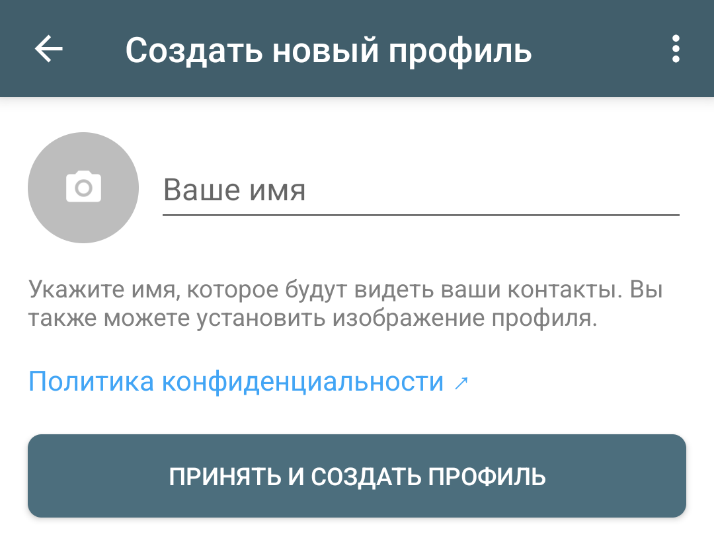
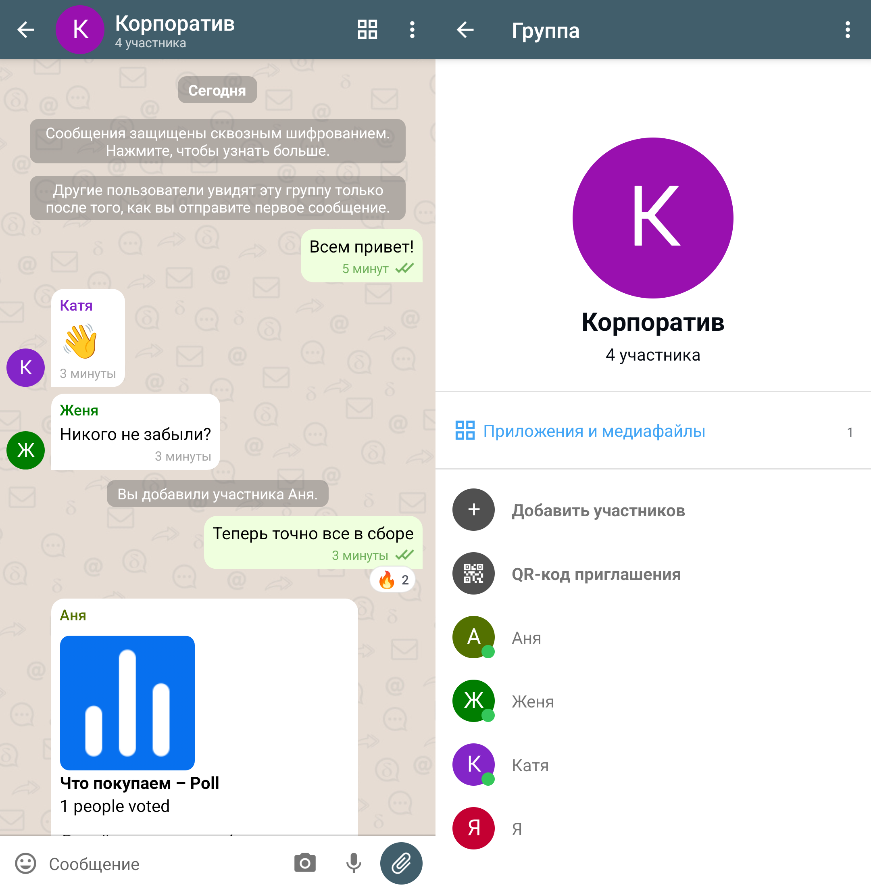
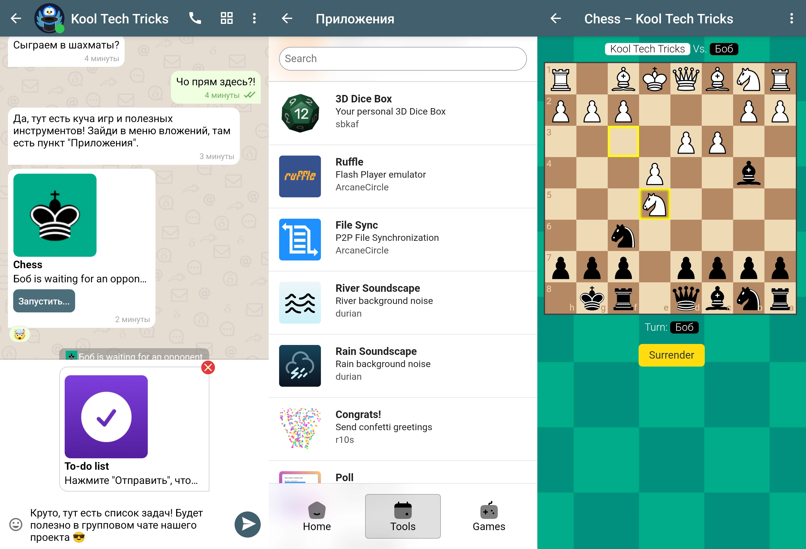
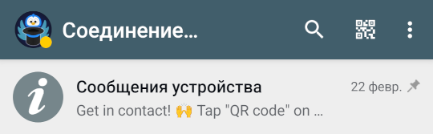
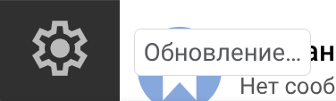

Узнайте, как использовать этот простой мессенджер для общения с друзьями,
близкими и коллегами.

<!--more-->

Это руководство является простым введением в основные функции Delta Chat.
Для более подробных и технических деталей смотрите [основную страницу](/software/delta-chat).
Для использования Delta Chat с вашим почтовым ящиком смотрите [отдельное руководство](/guides/delta-chat-email)
(для более продвинутых пользователей).

## Скачать приложение

Официальное приложение Delta Chat доступно для [всех платформ]: [Android],
[iOS], [Windows], [macOS], [Linux]. Оно полностью бесплатно, без рекламы и с
[открытым исходным кодом].

Альтернативно, пользователи Android могут установить [ArcaneChat] — это то же
самое приложение Delta Chat, но с расширенными и экспериментальными функциями.

Убедитесь, что у вас установлена последняя версия приложения. Это руководство
рассчитано на последние версии (2.62+).

[всех платформ]: https://get.delta.chat
[Android]: https://play.google.com/store/apps/details?id=chat.delta
[iOS]: https://apps.apple.com/app/delta-chat/id1459523234
[Windows]: https://apps.microsoft.com/detail/9pjtxx7hn3pk
[macOS]: https://apps.apple.com/app/delta-chat-desktop/id1462750497
[Linux]: https://flathub.org/apps/details/chat.delta.desktop
[открытым исходным кодом]: https://github.com/deltachat
[ArcaneChat]: https://play.google.com/store/apps/details?id=com.github.arcanechat

## Создать профиль

Для создания профиля в Delta Chat не нужно придумывать уникальное имя
пользователя, сложный пароль, вводить номер телефона и прочие персональные данные.
Достаточно ввести любое имя и по желанию выбрать изображение профиля, а позже
можно будет добавить поле «О себе» — эти данные увидят только ваши собеседники.

Когда вы нажмёте на **«Принять и создать профиль»**, будут использованы серверы
(релеи) по умолчанию. Если они недоступны, то создание профиля зависнет. В
таком случае нужно добавить другие релеи:

- Кто-то хочет пригласить вас пообщаться в Delta Chat и оставил ссылку-приглашение?
Откройте её или отсканируйте QR-код — релеи из ссылки-приглашения будут
использованы для создания нового профиля.

- В ином случае найдите доступные релеи самостоятельно ([публичный список],
могут быть недоступны в вашем регионе). Когда у вас есть адрес релея, вы можете
открыть его в браузере. На сайте будет QR-код: нажмите на него или отсканируйте,
чтобы использовать этот релей в Delta Chat. Также вы можете просто добавить
`/new` к адресу релея, чтобы сразу открыть его в приложении.

Не беспокойтесь насчёт выбора релея. Все релеи совместимы между собой: находясь
на одном релее вы можете свободно общаться с пользователями на других релеях.
Операторы релеев не смогут прочитать содержимое ваших сообщений и профилей.
Вы всегда можете быстро [сменить используемые релеи](#релеи) без потери данных.

[публичный список]: https://chatmail.at/relays

## Добавить контакт

На главном экране нажмите на **значок QR-кода** или **«+» → «Новый контакт»**.
Здесь располагается QR-код и ссылка. Другие люди могут отсканировать QR-код или
перейти по ссылке, чтобы связаться с вами.

После добавления контакта необходимо подождать установки соединения. Обычно это
занимает несколько секунд, когда оба пользователя онлайн. Затем появится
сообщение о том, что чат защищён сквозным шифрованием, и вы сможете начать
безопасное общение. Если всё равно не получается связаться, или сообщения не
доходят, то повторите шаги [создания профиля](#создать-профиль) с другим релеем.

> [!important]
> В Delta Chat нет публичных идентификаторов, имён пользователей или номеров
телефона, по которым вас можно было бы обнаружить. Вместо этого вы сами решаете,
кто вам может писать, когда вы делитесь ссылкой. Такой подход защищает от спама
и мошенничества.
>
> **Не добавляйте в контакты недоверенных людей.** Для этого следует
[создать отдельный профиль](#несколько-профилей-на-одном-устройстве),
изолированный от вашего круга знакомых. Ссылку можно сбросить в любой момент, а
контакты можно блокировать.

Также вы можете поделиться контактом с другими людьми в Delta Chat: опция
доступна в меню вложений. Связанные таким образом пользователи не будут получать
уведомления, пока не примут запрос на сообщения.

Пользователи могут установить своё отображаемое имя для каждого контакта. Для
этого нужно открыть информацию о контакте и нажать на карандаш сверху
(«Редактировать имя»).

## Звонки

Поддерживаются [аудио- и видеозвонки](https://delta.chat/ru/help#calls) в личных
чатах. Нажмите на значок телефона в личном чате, чтобы позвонить.
Устанавливается прямое (peer-to-peer) соединение со сквозным шифрованием через
те же серверы, которые вы и ваш собеседник используют для текстовых сообщений.

Групповые звонки и демонстрация экрана не поддерживаются, для этого рекомендуем
[Jitsi Meet].

[Jitsi Meet]: https://posts.kooltechtricks.org/@kooltechtricks/statuses/01K31JRXT0CRFP2ZTHVM1AJG09

## Группы

Чтобы создать [групповой чат](https://delta.chat/ru/help#groups), нажмите
**«+» → «Новая группа»**. Введите название, по желанию выберите изображение и
добавьте описание. Вы можете сразу добавить туда участников среди ваших
контактов, или позже по ссылке. После создания группы отправьте первое
сообщение, чтобы её увидели добавленные участники.

Группы в Delta Chat предназначены только для объединения **доверенных** людей.
Каждый участник имеет равные права и может удалять или приглашать других
пользователей. Ведение публичной группы может стать проблемой из-за отсутствия
каких-либо инструментов модерации, хотя в будущем это может быть доработано.

Группа может выдержать сотни участников. При добавлении участников история чата
не отправляется автоматически, нужно вручную нажимать «Отправить повторно».

## Каналы

[Каналы](https://delta.chat/ru/help#channels) — это инструмент вещания
«один-ко-многим». Администратор может публиковать сообщения всем подписчикам, а
подписчики не видят друг друга. Похожий концепт популярен в Telegram.

Создать канал: **«+» → «Новый канал»**. Введите название, по желанию выберите
изображение и добавьте описание. Далее по ссылке можно пригласить пользователей,
её можно сбросить в любой момент. Пользователи присоединятся, когда вы будете в
сети.

При добавлении пользователей в канал устанавливается контакт: каждый подписчик
может лично написать администратору канала и наоборот. При этом первые сообщения
будут отмечены как «Запрос» и заглушены. Следовательно, только администратор
может видеть количество подписчиков, просмотров, время прочтения сообщений. Если
вы собираетесь приглашать недоверенных людей в свой канал, то, возможно, стоит
[создать для него отдельный профиль](#несколько-профилей-на-одном-устройстве),
чтобы не раскрывать свою личность и не получать нежелательные сообщения.

Администратор канала может быть только один, и эту роль невозможно передать
другим пользователям. Подписчики могут отправлять одну из пяти разрешённых
реакций на сообщения в канале (👍, 👎, ❤️, 😂, 🙁). Комментарии не поддерживаются.
Новые участники увидят только 10 последних отправленных и закреплённых сообщений,
но вы можете разослать старые, нажав «Отправить повторно» на этих сообщениях.

Каналы в Delta Chat хорошо подходят для приватных микроблогов, объявлений,
списков рассылки. Но вести публичные сообщества и коммерческую деятельность
лучше в интернете и социальных сетях.

## Мини-приложения

Внутри Delta Chat доступны мини-приложения. Они работают только в контексте
текущего чата и не имеют выхода в интернет. С их помощью можно выполнять
совместные задачи и развлекаться.

В меню вложений доступен пункт **Приложения**, который откроет каталог
мини-приложений. Если он не загружается, вы можете заменить URL-адрес в
настройках (Дополнительные параметры → URL селектора приложений) на
https://wofwca.github.io/webxdc_website/apps/. Альтернативно вы можете открыть
каталог [в браузере](https://webxdc.org/apps).

Мини-приложения являются специальными архивами с запакованными веб-сайтами
(формат `.xdc`). Вы можете скачать их отдельно и отправить как файл, аналогично
изображениям или документам. Собеседники смогут открыть мини-приложение и
начать с ним взаимодействовать, а также добавить на главный экран телефона.

Примеры приложений:
- [Poll](https://github.com/davidsm10/poll-webxdc/releases/latest/download/app.xdc): Опросы.
- [To-do list](https://codeberg.org/durian/checklist/releases/download/latest/to-do%20list.xdc), [BetterList](https://github.com/breisa/betterlist/releases/latest/download/betterlist.xdc): Список задач/покупок.
- [TOTP](https://codeberg.org/rtn/totp/releases/download/latest/totp.xdc): Генератор кодов двухфакторной аутентификации.
- [Realtime Editor](https://codeberg.org/durian/editor/releases/download/latest/editor.xdc), [MD-Docs](https://github.com/experintellia/md-docs/releases/latest/download/md-docs.xdc): Текстовые редакторы в режиме реального времени.
- [Excalidraw](https://github.com/omidz4t/excalidraw-webxdc/releases/latest): Порт [одноимённой](https://excalidraw.com) коллаборативной доски.
- [Chess](https://github.com/ArcaneCircle/chess/releases/latest/download/app.xdc): Шахматы.
- [Quake III Arena](https://github.com/WofWca/quake3.xdc/releases/latest/download/quake3.xdc): Многопользовательский шутер от первого лица.
- [webxdcfishing](https://codeberg.org/pea/webxdcfishing/releases/download/latest/webxdcfishing.xdc): Многопользовательский симулятор рыбалки.
- [Radio Station](https://github.com/Amzd/radio-station-webxdc/releases/latest/download/app.xdc): Музыкальный проигрыватель с peer-to-peer синхронизацией.

Несмотря на отсутствие доступа к внешнему интернету, не рекомендуется
пользоваться мини-приложениями от недоверенных людей. Кто угодно может прислать
поддельную версию, чтобы проще обманом заполучить чувствительные данные.
Мини-приложения в режиме реального времени раскрывают ваш IP-адрес собеседникам.

Смотрите [документацию](https://webxdc.org/docs), чтобы узнать, как создавать
свои приложения.

## Боты

В Delta Chat есть боты, как и в других популярных мессенджерах. Они могут
добавлять взаимодействия с внешним интернетом, связывать пользователей и
автоматизировать процессы. Боты хорошо интегрируются с
[мини-приложениями](#мини-приложения), иногда превращая их в онлайн-сервисы.

Смотрите [документацию по разработке ботов](https://bots.delta.chat), чтобы
научиться их создавать.

## Несколько профилей на одном устройстве

На главном экране нажмите на свой аватар и **«+ Добавить профиль»**, затем
[создайте профиль](#создать-профиль) в пару нажатий. Для создания профиля в
Delta Chat не требуется дополнительный номер телефона и прочие лишние данные,
как в других мессенджерах, поэтому вы можете создавать сколько угодно профилей
под разные нужды. Например, один профиль для общения с семьёй, второй для
друзей, третий по работе или учёбе. Чтобы ничего не перепутать, добавьте метки
(Сменить профиль → Удерживать/Правая кнопка мыши → «Метка профиля»). Здесь
также можно отключить уведомления для всего профиля.

Вы можете безопасно добавлять доверенные контакты в соответствующие профили, и
они не узнают о существовании других (пока вы сами не дадите об этом знать).
В профиле для работы или семьи потребуется использовать реальное имя и фото, а
в профиле для друзей и незнакомцев можно придумать забавный псевдоним и аватар.

В Delta Chat отсутствуют папки как в Telegram, поэтому распределять чаты проще
именно по профилям, хотя вы не можете переместить контакт в другой профиль без
добавления его заново по ссылке. Если держать всё в одном профиле, то
мессенджер быстро превратится в помойку, и вам будет тяжело находить важные
сообщения и отвечать на них.

## Использование на нескольких устройствах

Для начала убедитесь, что оба устройства находятся в одной сети.

На первом устройстве перейдите в **Настройки → Добавить второе устройство**,
появится QR-код. Альтернативно можно скопировать строку в буфер обмена.

На втором устройстве на приветственном экране выберите
**У меня уже есть профиль → Добавить как второе устройство**, затем отсканируйте
QR-код на первом устройстве. Альтернативно можно загрузить QR-код как
изображение или вставить строку.

В случае возникновения проблем обратитесь к справке **«Устранение неполадок»**.
Соединение происходит по локальной сети, и ему может мешать брандмауэр и VPN,
поэтому если не получается, то отключите.

Если всё завершилось успешно, то можете начать пользоваться своим профилем
Delta Chat на другом устройстве. Оба устройства работают независимо друг от
друга, и актуальные данные синхронизируются через ваш сервер — больше не нужно
находиться в одной локальной сети.

## Резервное копирование

Все данные Delta Chat хранятся локально на вашем устройстве. Если вы
используете профиль только на одном устройстве, вам следует периодически делать
резервные копии, чтобы не потерять контакты в случае удаления приложения или
выхода устройства из строя.

Перейдите в **Настройки → Чаты → Экспорт резервной копии**. Это создаст архив
со всеми вашими сообщениями, вложениями, контактами и ключами шифрования.
Переместите его в надёжное место вне вашего устройства. Обратите внимание, что
архив не защищён паролем, и если он таком виде попадёт в руки злоумышленникам,
то они смогут получить доступ к вашим перепискам и отправлять сообщения от
вашего имени. Вы не сможете сбросить пароль или завершить активные сеансы.

Резервную копию можно восстановить на другом устройстве: на приветственном
экране **«У меня уже есть профиль» → «Восстановить из резервной копии»**.
Восстанавливайте только наиболее новый архив во избежание повреждения
целостности переписок и контактов. Это альтернативный способ
[добавить второе устройство](#использование-на-нескольких-устройствах). Если
вы уже используете профиль на нескольких устройствах, то они уже служат в
качестве автоматических резервных копий.

## Релеи

Создание профиля происходит на наборе случайных серверов (релеев), через которые
передаются сообщения. Если эти релеи внезапно окажутся недоступными, то вы не
сможете ни с кем связаться.

Вы можете добавить дополнительные релеи, чтобы этого избежать. Найдите доступный
релей ([публичный список], могут быть недоступны в вашем регионе) и
переключитесь на свой профиль. Когда у вас есть адрес релея, вы можете открыть
его в браузере. На сайте будет QR-код: нажмите на него или отсканируйте, чтобы
использовать этот релей в Delta Chat. Также вы можете просто добавить `/new`
к адресу релея, чтобы сразу открыть его в приложении.

Вы можете посмотреть состояние подключения к релеям через **Настройки → Соединение**.
Все добавленные релеи используются для получения сообщений. Для отправки
сообщений используется случайный доступный релей. Релеи временно хранят
сообщения, пока вы не в сети или используете несколько устройств. Хранилище на
релеях очищается автоматически, так что вам не нужно беспокоиться об этом.

Изменить или удалить релеи можно через **Настройки → Дополнительные параметры → Релеи**.
Один профиль может содержать максимум 5 релеев. Контакты автоматически получат
ваши новые релеи. В ссылке-приглашении перечисляются все релеи.

## Очистка

Так как все чаты и вложения в Delta Chat хранятся на устройстве, спустя
продолжительное время Delta Chat может занимать много места. Удаляйте ненужные
файлы и чаты, или экспортируйте их на другое хранилище.

Можно настроить автоматическое удаление сообщений:
**Настройки → «Чаты» → «Удалять сообщения с устройства»**.
Также можно включить [исчезающие сообщения] для отдельных чатов.

[исчезающие сообщения]: https://delta.chat/ru/help#ephemeralmsgs

Вы можете удалить профиль целиком: **Сменить профиль →
Удерживать/Правая кнопка мыши → «Удалить»**, или просто удалите приложение.
Если не было резервных копий, это удалит ваши сообщения и контакты без
возможности восстановления. С серверов всё удалится автоматически через
некоторое время.

## Исправление проблем

### Долгое подключение, сообщения не отправляются или не приходят

Если наблюдаются проблемы с соединением, то, вероятно, вы можете увидеть
соответствующий статус на главном экране: **«Соединение...»** или
**«Обновление...»**. В меню настроек можно посмотреть подробную информацию.

Посмотрите состояние соединения, добавьте или удалите [релеи](#релеи).
