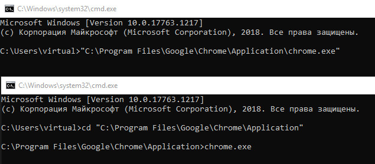
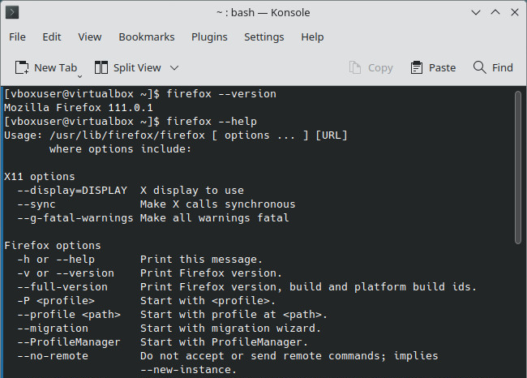
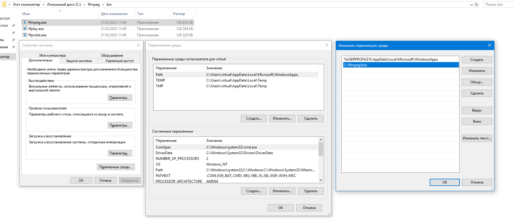
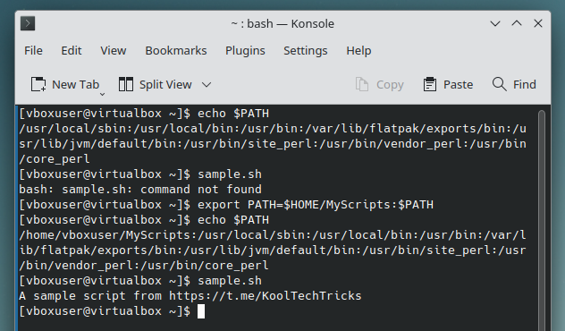

Консольные программы запускаются в терминале. У них нет окон и кнопок — нужно
вводить определённые команды, чтобы выполнять действия. Хотя для большинства это
не очень удобно, консольные программы предоставляют более обширные возможности.
Использование консольных программ — это очень полезный навык, который
рекомендуется к освоению каждому.

<!--more-->

## Применение

Существует множество полезных программ, у которых нет графического интерфейса.
Чтобы ими воспользоваться, необходимо открыть консоль и ввести команды.
Консольные программы по большей части предназначены для продвинутых
пользователей, так как требуют больше знаний и навыков. Однако они намного
функциональнее, чем графические аналоги.

Примеры консольных программ:
- [yt-dlp](/wiki/yt-dlp): Скачивание видео из интернета.
- [FFmpeg](/wiki/ffmpeg): Конвертация видео и аудио.
- [WinGet](/wiki/winget): Установка программ для Windows.
- [scrcpy](/wiki/scrcpy): Отображение экрана Android-устройства на компьютере.
- [mat2](https://t.me/KoolTechTricks/292): Очистка метаданных.

Через консоль можно запускать и обычные графические программы. Так можно менять
их поведение или просматривать логи, чтобы понимать причины вылетов.

В целом, использование консольных программ — это очень полезный навык, который
рекомендуется к освоению каждому.

## Взаимодействие с консолью

### Эмулятор терминала

Эмулятор терминала выступает в качестве интерфейса для взаимодействия с
терминалом.

В Windows можно использовать стандартные программы `cmd` или `powershell`, но в
современных версиях рекомендуется
[Windows Terminal](https://apps.microsoft.com/detail/9n0dx20hk701) (Терминал
Windows).

В macOS предустановлено приложение Терминал. Открыть его можно через Spotlight
или Launchpad.

В Linux эмулятор терминала обычно предустановлен вместе со средой рабочего
стола. Для GNOME это GNOME Terminal, для KDE — Konsole.

В Android можно использовать [Termux]. А на новейших устройствах доступно
официальное приложение [Linux Terminal], запускающее Debian в виртуальной среде.

[Linux Terminal]: https://www.androidpolice.com/android-15-linux-terminal-app
[Termux]: https://termux.dev

### Оболочка

Оболочка *(Shell)* интерпретирует введённые команды. Можно писать скрипты на
собственных языках программирования. Также оболочки позволяют использовать
какие-либо функции, сокращения, операторы.

В Windows по умолчанию используется оболочка cmd.exe, но ещё имеется PowerShell.

В Unix-подобных системах стандартом является Bash, но есть возможность
использовать другие оболочки, например Zsh, Fish, Sh и другие.

## Запуск консольных программ

Для запуска любой программы необходимо указать путь к ней. Возможно,
потребуется указать его в кавычках, чтобы не было проблем со спецсимволами
(пробел). Это может быть как полный путь с началом в корневой директории (`C:\`
или `/`), так и относительный — с началом в текущей директории.

Перемещаться по директориям можно при помощи команды `cd` *(change directory —
изменить директорию)*. В файловом менеджере может быть возможность открыть
терминал в текущей папке. В Windows для этого можно написать `cmd` в строке пути
проводника.

### Параметры

После исполняемого файла можно указывать параметры. Они обычно разделяются
через пробел и начинаются с дефиса. Чтобы узнать, какие есть параметры, нужно
написать `--help` или `-h`. С большей вероятностью будет выведена помощь, но
если её нет, то придётся обращаться к документации и интернету.

В Linux есть программа `man` *(manual — руководство)*. Если указать после неё
какую-либо программу, то, при наличии, отобразится подробная информация в
удобном виде.

Существует проект [tldr.sh], в котором собраны краткие руководства по
использованию консольных программ. Можно установить `tldr` или [Tealdeer], чтобы
получать эти руководства прямо в терминале.

[tldr.sh]: https://tldr.sh
[Tealdeer]: https://github.com/tealdeer-rs/tealdeer#readme

### Переменные среды

Переменные среды *(Environment variables)* изменяют поведение программ
аналогично параметрам. Отличие в том, что они могут влиять на текущую сессию, а
не только на одну программу.

В Windows переменные среды можно задать в [панели управления](#windows).

В Linux нужно написать команду `export НАЗВАНИЕ=значение`. Её можно указать в
файле конфигурации оболочки (`~/.bashrc` для Bash), чтобы изменения были
постоянными.

Чтобы задать переменную среды для одной программы, необходимо
указать переменную перед программой, например, `MOZ_ENABLE_WAYLAND=0 firefox`.

## Path

Чтобы постоянно не указывать путь к нужной программе, существует переменная
`PATH`, которая содержит список директорий. Если вы пишете название программы,
то оболочка проходится по всем директориям в списке, чтобы найти исполняемый
файл с введённым названием.

Вы можете добавить свою директорию в переменную Path, чтобы запускать свои
программы из любого места.

### Windows

1. Найдите в поиске "Изменение системных переменных среды" (или можно сразу
"Изменение переменных среды текущего пользователя" для пропуска 2-го пункта и
прав администратора). Также можно нажать `Win`+`R` и ввести
`SystemPropertiesAdvanced.exe`.

2. В открывшемся окне нажмите "Переменные среды".

3. Сверху появятся переменные для пользователя, а снизу — для системы. Можно
проделать операцию для текущего пользователя.

4. Нажмите два раза по переменной Path и добавьте путь к нужной папке.

5. Сохраните изменения и перезапустите окна командной строки. Также может
понадобиться перезайти в сессию.

### Linux

Переменную PATH можно вывести командой `echo $PATH`. Чтобы добавить туда
какую-либо директорию, нужно написать `export PATH=/путь/к/папке:$PATH`.
Команда `export` устанавливает значение переменной, `PATH` — название
переменной, `/путь/к/папке` — директория, `$PATH` — значение переменной до
изменения.

Это изменение будет активно только в текущей сессии терминала. Чтобы сделать
его постоянным, необходимо добавить эту команду в конец файла конфигурации
оболочки (`~/.bashrc` для Bash). Переменная `$HOME` содержит путь к домашней
директории текущего пользователя, можно писать её вместо `/home/user`.

