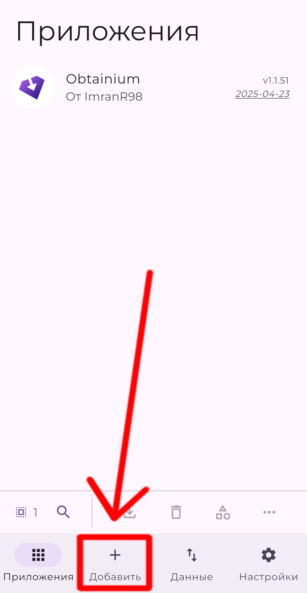
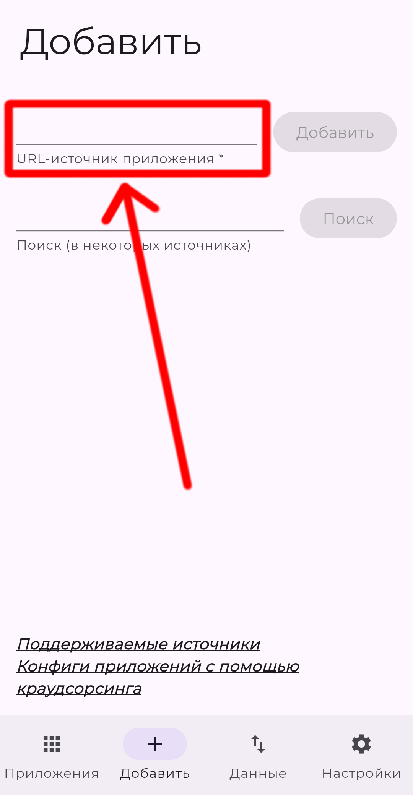
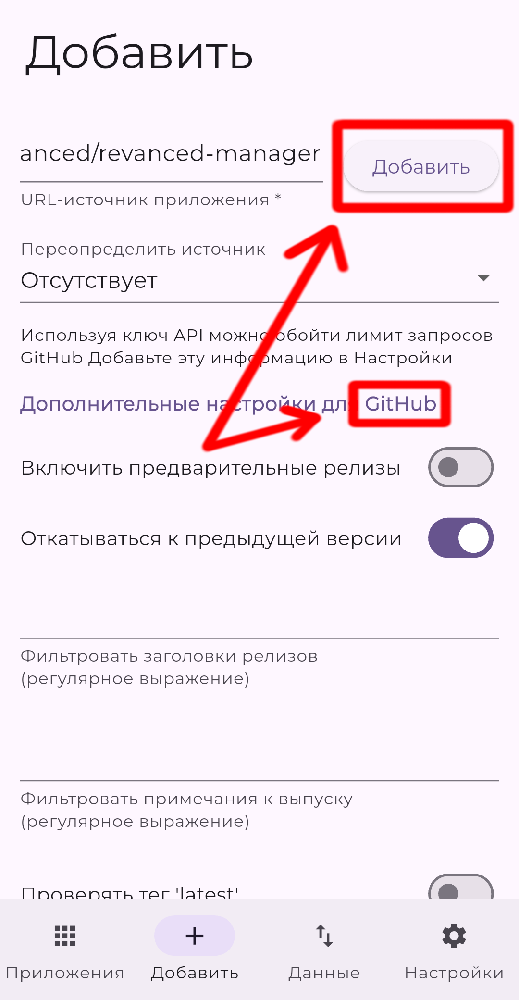
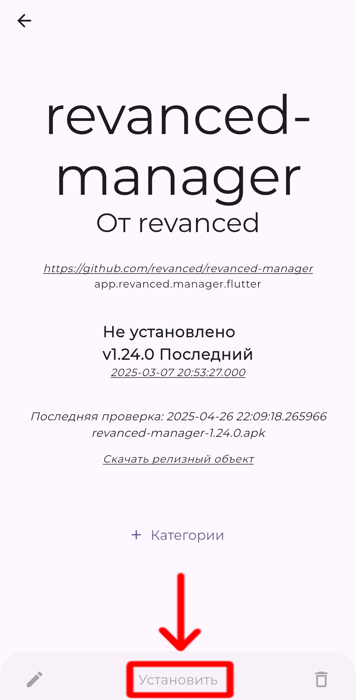
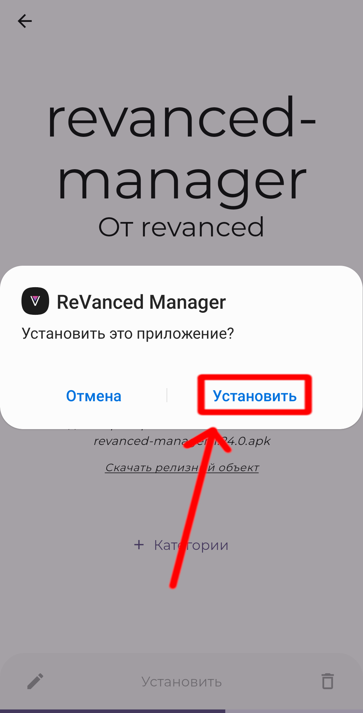

Не все приложения можно скачать из Google Play. Иногда они находятся либо в
других магазинах приложений, либо на сайтах в качестве отдельных APK. В итоге
вам приходится либо скачивать другие магазины приложений, либо искать
приложения в интернете как в Windows.

Obtainium — удобное решение этой проблемы. Он может объединить все магазины
приложений и источники в одном месте, чтобы получать обновления ваших
приложений с любых сайтов.

В этом простом руководстве вы научитесь добавлять приложения в Obtainium из
любых источников, чтобы автоматически получать обновления.

<!--more-->

## Установка Obtainium

1. Скачайте установочный APK-файл Obtainium с
[GitHub](https://github.com/ImranR98/Obtainium/releases/latest/download/app-release.apk).

2. Откройте скачанный APK-файл и установите Obtainium. Разрешите установку
приложений из неизвестных источников, если потребуется.

## Добавление приложений в Obtainium

### Скопируйте ссылку на источник

Для начала вам нужно скопировать ссылку на источник приложения.

Поддерживаются следующие источники: GitHub, GitLab, Forgejo (Codeberg),
Официальный и сторонние F-Droid, IzzyOnDroid, SourceHut, APKPure,
Aptoide, Uptodown, Huawei AppGallery, Tencent App Store, CoolApk, RuStore,
Jenkins Jobs, APKMirror. Также Obtainium может получать обновления по прямым
ссылкам на APK-файл и с любых сайтов, но для этого потребуется дополнительная
настройка.

В целях обучения можете попробовать следующие ссылки:

- [GitHub](https://github.com/ReVanced/revanced-manager)
- [F-Droid](https://f-droid.org/packages/ca.chancehorizon.paseo)
- [RuStore](https://www.rustore.ru/catalog/app/ru.ntv.client)

### Вставьте ссылку на приложение в Obtainium

Откройте Obtainium и нажмите на кнопку «Добавить» внизу.

В поле «URL-источник приложения» вставьте ссылку.

Появится куча настроек, но здесь только следует проверить, что источник
приложения определился правильно. В данном случае мы устанавливаем приложение
с GitHub. Далее нажмите «Добавить».

Начнётся скачивание файла, а после завершения откроется экран приложения, где
вам нужно нажать кнопку «Установить» (будет доступна после небольшого ожидания).

Может потребоваться разрешить установку из неизвестных источников для Obtainium.
После этого появится окно с установкой приложения. Нажмите «Установить».

Готово! Теперь ваше приложение установлено через Obtainium, и оно будет
автоматически проверяться на наличие обновлений.

## Обновление приложений в Obtainium

По умолчанию Obtainium проверяет наличие обновлений всех добавленных приложений
каждые 6 часов. Информацию о статусе обновлений вы узнаете из уведомлений.

Если будет найдено обновление, то Obtainium начнёт его скачивать. По возможности
Obtainium попытается его установить, но если не получится — вам придётся
открыть Obtainium, чтобы установить обновление.

В настройках Obtainium можно изменить частоту проверки обновлений или отключить
обновления в фоне.

## Готовые конфигурации

Некоторые приложения может быть сложно добавить. Однако существуют готовые
конфигурации на [специальном сайте](https://apps.obtainium.imranr.dev). Там вы
можете найти нужные вам приложения и сразу импортировать их в Obtainium по
нажатии на кнопку «Add to Obtainium».

Всё благодаря специальным ссылкам, начинающихся на `obtainium://`. Иногда их
можно встретить на сайтах. Вот, например, ссылка на добавление
[IronFox](obtainium://app/%7B%22id%22%3A%22org.ironfoxoss.ironfox%22%2C%22url%22%3A%22https%3A%2F%2Ffdroid.ironfoxoss.org%2Ffdroid%2Frepo%2F%22%2C%22author%22%3A%22IronFox%20OSS%22%2C%22name%22%3A%22IronFox%22%2C%22additionalSettings%22%3A%22%7B%5C%22appIdOrName%5C%22%3A%5C%22org.ironfoxoss.ironfox%5C%22%2C%5C%22pickHighestVersionCode%5C%22%3Afalse%2C%5C%22trackOnly%5C%22%3Afalse%2C%5C%22versionExtractionRegEx%5C%22%3A%5C%22%5C%22%2C%5C%22matchGroupToUse%5C%22%3A%5C%22%5C%22%2C%5C%22versionDetection%5C%22%3Atrue%2C%5C%22releaseDateAsVersion%5C%22%3Afalse%2C%5C%22useVersionCodeAsOSVersion%5C%22%3Afalse%2C%5C%22apkFilterRegEx%5C%22%3A%5C%22%5C%22%2C%5C%22invertAPKFilter%5C%22%3Afalse%2C%5C%22autoApkFilterByArch%5C%22%3Atrue%2C%5C%22appName%5C%22%3A%5C%22%5C%22%2C%5C%22shizukuPretendToBeGooglePlay%5C%22%3Afalse%2C%5C%22exemptFromBackgroundUpdates%5C%22%3Afalse%2C%5C%22skipUpdateNotifications%5C%22%3Afalse%2C%5C%22about%5C%22%3A%5C%22IronFox%20is%20a%20secure%2C%20hardened%20and%20privacy-oriented%20web%20browser%20for%20Android%2C%20based%20on%20Firefox.%5C%22%7D%22%2C%22overrideSource%22%3A%22FDroidRepo%22%7D).
Если у вас установлен Obtainium, и вы перейдёте по такой ссылке, то вам сразу
предложат добавить приложение в Obtainium.

> [!caution]
> Готовые конфигурации из неизвестных источников могут содержать вредоносное ПО.
Пожалуйста, проверяйте какие ссылки указаны в них для получения установочных
файлов.

## Смотрите также

Obtainium является достаточно функциональным приложением. В частности, доступны
следующие возможности:

- Фильтр APK-файлов и релизов.
- Экспорт и импорт списка приложений, чтобы восстанавливать их на других
устройствах без необходимости добавлять всё заново.

Чтобы узнать больше, ознакомьтесь со следующими ресурсами:
