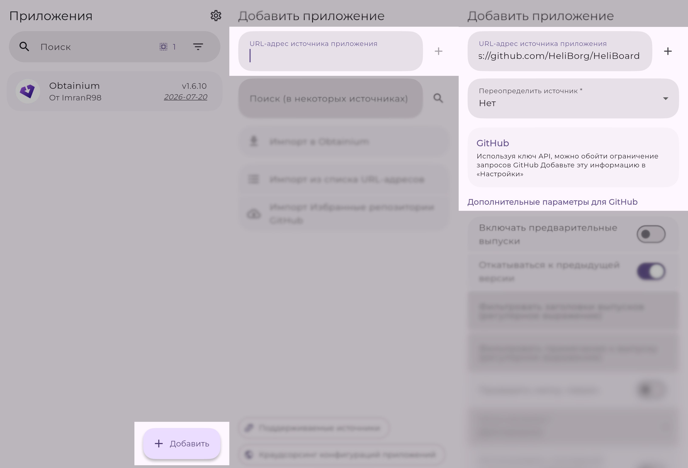
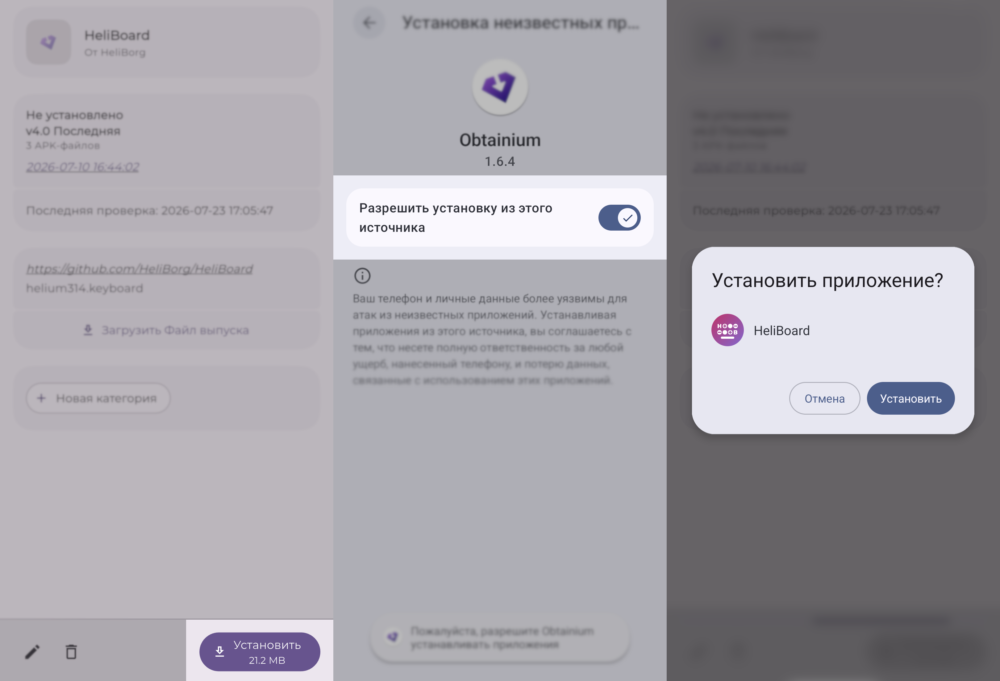
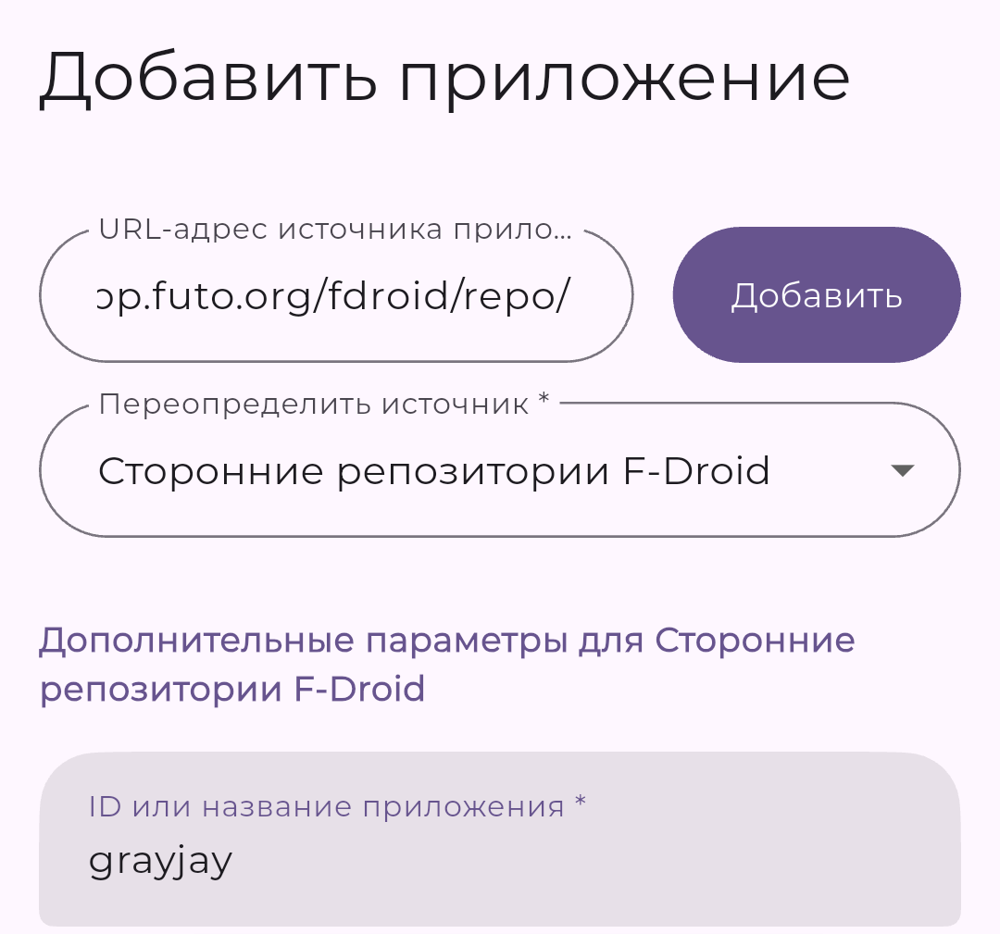
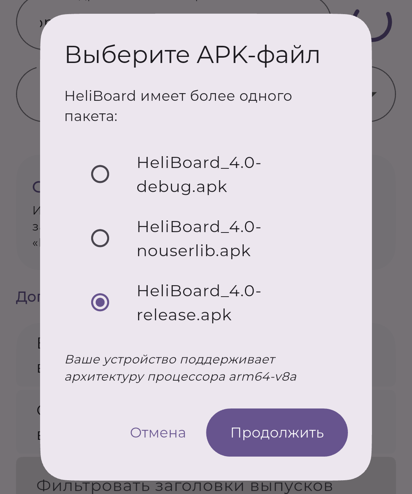
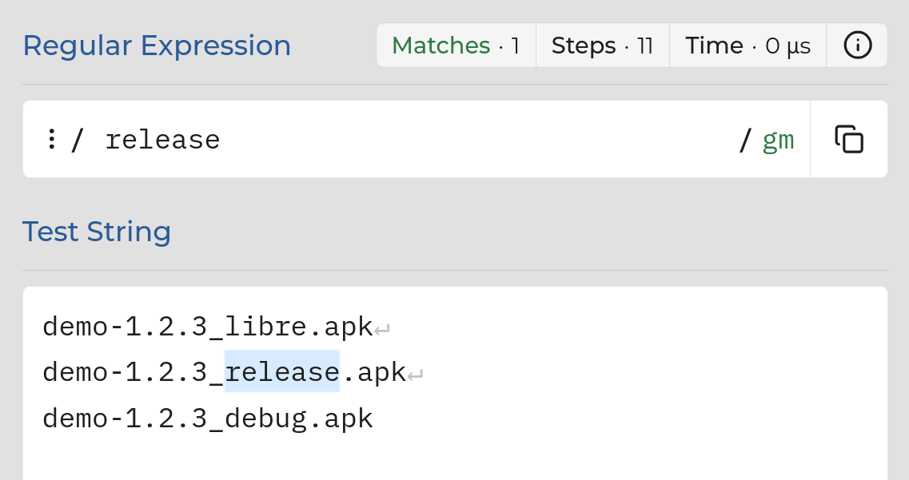

Не все приложения можно найти в Google Play: есть другие магазины приложений и
отдельные сайты с APK-файлами. Приходится содержать несколько клиентов магазинов
приложений или скачивать приложения из интернета как в Windows, что неудобно.

Obtainium позволяет объединить все источники приложений в одном месте. Он
поддерживает популярные каталоги приложений и любые сайты. Вставьте ссылку на
приложение — Obtainium попытается установить его и периодически проверять
наличие обновлений.

Хотя для большинства источников и приложений всё работает по умолчанию, вам
следует ознакомиться с дополнительными возможностями Obtainium, чтобы знать обо
всех крайних случаях.

<!--more-->

## Установка Obtainium

Скачайте Obtainium из [GitHub](https://github.com/ImranR98/Obtainium/releases/latest/download/app-release.apk).

Obtainium полностью бесплатный и с [открытым исходным кодом](https://github.com/ImranR98/Obtainium).
Он не содержит рекламу, платные функции и телеметрию.

## Нахождение приложений

Obtainium не является каталогом приложений. Это всего лишь инструмент для
установки и обновления приложений из разных источников. Хотя есть встроенный поиск
и [готовые конфигурации](#готовые-конфигурации), чаще всего вам нужно находить
приложения в каком-либо другом месте самостоятельно.

Поддерживаются следующие источники:
- [GitHub]
- [Codeberg] (Forgejo / Gitea)
- [F-Droid]
- [IzzyOnDroid](https://android.izzysoft.de/repo)
- [Aptoide](https://aptoide.com)
- [itch.io](https://itch.io/games/platform-android)
- [Huawei AppGallery](https://appgallery.huawei.com)
- [RuStore](https://www.rustore.ru)
- [APKMirror](https://www.apkmirror.com) (только отслеживание)
- Прямые ссылки на APK-файлы
- Любые страницы со ссылками на APK-файлы (HTML)
- [Другие](https://wiki.obtainium.imranr.dev/sources/#currently-supported-app-sources)

[GitHub]: https://github.com/search
[Codeberg]: https://codeberg.org/explore/repos
[F-Droid]: /software/f-droid

Найдите приложение в одном из поддерживаемых источников и скопируйте ссылку на
страницу с этим приложением.

> [!caution]
> Obtainium может устанавливать приложения из **любых источников**. Не исключено,
что они **могут оказаться вредоносными**. Проверяйте подлинность источников и
[приложений](/software/obtainium#безопасность) перед установкой.

## Добавление приложений в Obtainium

1. Откройте Obtainium.
2. Нажмите на кнопку **«Добавить»** снизу.
3. В поле **«URL-адрес источника приложения»** вставьте ранее скопированную
ссылку на страницу с приложением.
    - Также вы можете воспользоваться поиском: введите запрос в поле ниже и
    выберите источники. В результатах вы сможете открыть страницы приложений или
    получить одно приложение.

Obtainium попытается определить источник по ссылке. От источника зависит то, как
извлекаются метаданные и APK-файлы. Чаще всего Obtainium удаётся сделать это без
дополнительных параметров, но иногда потребуется настроить [фильтры](#фильтры)
для нахождения нужных APK-файлов. Ниже на этой странице предоставлена краткая
информация о некоторых источниках, подробнее описано в [документации](https://wiki.obtainium.imranr.dev/sources).

Если текущие параметры извлечения вас устраивают, то нажмите **«+»**.
Obtainium извлечёт APK-файл (или попросит [выбрать один из доступных](#варианты-приложения))
и начнёт скачивание. Появится уведомление с прогрессом загрузки. Затем откроется
страница приложения, где нужно нажать **«Установить»** снизу. В первый раз
потребуется разрешить Obtainium устанавливать приложения в настройках Android.

Если приложение уже было установлено, то его можно начать обновлять через
Obtainium. Это возможно только если приложение подписано тем же ключом (то есть
собрано одним и тем же разработчиком).

Если нужно изменить дополнительные параметры извлечения приложения из источника,
то нажмите на значок карандаша в левом нижнем углу на странице приложения. Для
изменения ссылки-источника требуется [удалить приложение из Obtainium](#удаление-приложений)
и добавить его заново.

### GitHub

Многие разработчики приложений с открытым исходным кодом (и не только) публикуют
свои приложения на [GitHub]. Если вы хотите получать версии, отмеченные как
нестабильные/ранние/бета/альфа, то отметьте параметр **«Включать предварительные
выпуски»**. Также доступны другие параметры для фильтрации и сортировки релизов:
смотрите [документацию](https://wiki.obtainium.imranr.dev/sources/#github).

GitHub имеет ограничение на количество запросов к API в определённый период
времени с одного IP-адреса (60 запросов за 1 час). Если вы добавите слишком
много приложений из GitHub и будете часто проверять наличие их обновлений, то
столкнётесь с ограничением, и временно не сможете получать обновления. Чтобы
обойти это, можно сделать следующее:

- Задать [токен доступа](https://wiki.obtainium.imranr.dev/sources/#creating-a-github-personal-access-token)
в настройках Obtainium (требуется аккаунт GitHub), чтобы увеличить лимит запросов до 5000.
- Уменьшить количество приложений из GitHub. Возможно, некоторые приложения публикуются в других источниках.

### Codeberg (Forgejo / Gitea)

[Codeberg] является популярной некоммерческой альтернативой GitHub. Логика
получения релизов приложений и дополнительные параметры почти идентичны [GitHub](#github).
Codeberg не ограничивает частоту запросов как GitHub.

Codeberg является сервером [Forgejo](https://forgejo.org) (который основан на
[Gitea](https://about.gitea.com)). Можно запустить свой сервер Forgejo или Gitea,
некоторые разработчики через них распространяют свои приложения. Obtainium может
работать и с ними, но так как по ссылке невозможно определить, что это сервер
Forgejo/Gitea, следует переопределить источник на **Forgejo (Codeberg)**.

### F-Droid

[F-Droid] является популярным каталогом свободных приложений. Приложения
независимо собираются из исходного кода. Если они не поддерживают [воспроизводимые сборки](https://f-droid.org/docs/Reproducible_Builds),
то подписываются ключом F-Droid, что вызовет конфликт при попытке обновить
установленное приложение из другого источника — нужно удалить его из всех
профилей.

Вы можете использовать F-Droid для нахождения приложений в браузере или через
встроенный поиск. Обычно приложения публикуются в нескольких источниках, часто в
[GitHub](#github) или [Codeberg (Forgejo / Gitea)](#codeberg-forgejo--gitea).
Скопируйте ссылку на исходный код, и если там публикуются релизы, то Obtainium
сможет получать их. Обратите внимание, что версии от F-Droid и разработчиков
могут отличаться, так как F-Droid запрещает включать проприетарные компоненты.

Некоторые разработчики размещают собственные репозитории F-Droid. Для того,
чтобы добавить приложение оттуда, вместе со ссылкой на репозиторий нужно указать
название приложения или идентификатор пакета, а также переопределить источник на
**«Сторонние репозитории F-Droid»**. Если вы не уверены, какие приложения есть
в этом репозитории, найдите через поиск.

Также есть два параметра, которые позволяют выбирать тип релиза. По умолчанию
активно **«Пробовать выбрать предложенный код версии APK»** — это получает
наиболее стабильную версию, отмеченную владельцами репозитория. Вы можете
включить **«Автовыбор актуального кода версии APK»**, чтобы получать самую
последнюю версию.

Приложения из F-Droid не поддерживают отображение списков изменений.

### RuStore

Obtainium поддерживает RuStore, однако из-за недоверенных сертификатов загрузка
может не удаваться. В параметрах приложения можно разрешить небезопасные HTTP-запросы.
Это должно быть безопасно только если приложение уже было установлено, и вы
уверены, что оно подлинно.

### Другие источники

- **GitLab**: Может потребоваться задать [токен доступа](https://wiki.obtainium.imranr.dev/sources/#gitlab) в настройках Obtainium.
- **APKMirror**: Поддерживает обнаружение новых версий, но устанавливать их требуется самостоятельно.
- **APKPure**: Поддерживает установку, но он [неоднократно распространял](https://x.com/EricParker/status/2058411298195661221) [вредоносное ПО](https://www.kaspersky.com/blog/infected-apkpure/39273).

### Страницы с загрузками (HTML, APK)

Obtainium может скачивать приложения с сайтов, которые предоставляют ссылки на
прямую загрузку APK. Это позволяет Obtainium получать приложения из практически
любых источников, даже если они не поддерживаются напрямую. Однако каждый сайт
устроен по-разному, и невозможно описать фиксированный алгоритм действий для
всех. Вам потребуется самостоятельно изучить сайт, найти ссылку и подобрать
параметры, по которым Obtainium сможет извлекать APK-файлы последней версии
приложения.

Источник **«Прямая ссылка на APK»** принимает ссылки, по которым скачивается
файл. Источник **«HTML»** принимает ссылки, которые содержат страницу со
ссылками на APK-файлы. Obtainium воспринимает ссылки так же, как и браузер, в
том числе следует перенаправлениям, но не может динамически загружать
содержимое посредством JavaScript.

Вы должны предоставлять Obtainium ссылку только если вы уверены, что она
содержит актуальные (не фиксированные) версии. Obtainium загрузит страницу,
затем посредством фильтров и сортировки попытается найти ссылку на актуальную
версию. Если до нужного файла можно добраться только через другие HTML-ссылки,
то необходимо добавить промежуточную ссылку.

Подробнее про источник HTML в [документации](https://wiki.obtainium.imranr.dev/sources/#html).

### Готовые конфигурации

Наконец, для наиболее популярных приложений существуют готовые конфигурации,
которые пользователи коллективно собирают на сайте [apps.obtainium.imranr.dev](https://apps.obtainium.imranr.dev).
Вы можете [запросить](https://github.com/ImranR98/apps.obtainium.imranr.dev/issues)
или [добавить](https://github.com/ImranR98/apps.obtainium.imranr.dev/blob/main/CONTRIBUTING.md)
собственные конфигурации. Также некоторые разработчики оставляют готовые ссылки
на добавление своих приложений в Obtainium.

При открытии ссылок готовых конфигураций Obtainium предлагает импортировать
приложения. Следует проверять ссылки и параметры конфигурации перед установкой
во избежание получения вредоносного ПО.

## Варианты приложения

Перед установкой приложения вы можете столкнуться с просьбой выбрать APK-файл.
Это происходит, когда ссылка содержит несколько APK-файлов, потому что
разработчики предоставляют несколько вариантов приложения.

Варианты приложения чаще всего различаются по архитектуре процессора. Obtainium
сообщает, какую архитектуру поддерживает ваше устройство, а также автоматически
пытается отсеять неподдерживаемые. Есть универсальные сборки (universal) для
всех архитектур, но они занимают больше места.

В других случаях варианты приложения отличаются по функциональности. Названия
файлов имеют соответствующую приписку. Их значение обычно описано на странице
приложения. Наиболее распространённые варианты:

- **free/libre/foss**: Свободный вариант без проприетарных библиотек. Может
отсутствовать зависящая от них функциональность. Рекомендуется выбирать на ОС
без сервисов Google.
- **debug**: Для отладки (не рекомендуется).
- **standard/release/_отсутствует_**: Обычный вариант без специфичных модификаций.

Чтобы отсеять лишние варианты приложения (в идеале до одного), задайте [фильтр](#фильтры)
в поле **«Фильтровать APK-файлы»** параметров приложения. Это регулярное
выражение, по которому выбираются APK-файлы. Ниже можно включить инверсию, чтобы
по этому регулярному выражению исключались APK.

Все доступные файлы можно посмотреть и загрузить, нажав на «Загрузить файл выпуска».

## Фильтры

Фильтры позволяют отсеять лишние [ссылки в источнике](#страницы-с-загрузками-html-apk),
[APK-файлы](#варианты-приложения) и извлечь корректные данные. Это можно задать
в параметрах приложения.

Фильтры являются [регулярными выражениями](https://ru.wikipedia.org/wiki/Регулярные_выражения).
Это специальный язык шаблона, по которому производится поиск подстроки во всём
тексте. Если вы не знакомы с регулярными выражениями, то они могут показаться
сложными. Но для Obtainium достаточно знать несколько простых правил. На сайте
[regex101](https://regex101.com) можно проверить регулярное выражение. Сверху
вводится регулярное выражение, снизу — проверочный текст.

## Обновление приложений

По умолчанию Obtainium проверяет наличие обновлений всех добавленных приложений
каждые 6 часов. В настройках можно изменить поведение: частота проверки,
ограничение при отсутствии Wi-Fi, проверка при запуске и прочее.

Obtainium будет скачивать обновления в фоне и пытаться установить их.
Автоматическая установка обновлений возможна на Android 12 и выше для приложений,
разработанных для современных версий Android. Также должен быть доступен
[только один APK-файл](#варианты-приложения) (если их больше, то добавьте
[фильтр](#фильтры) в параметрах приложения). Obtainium покажет уведомления в
случае ошибок, доступных или установленных обновлений.

Для некоторых источников и приложений возможно просматривать список изменений:
рядом с версией показывается дата выпуска, на которую можно нажать.

Некоторые приложения могут иметь встроенный механизм проверки наличия
обновлений. Если вы устанавливаете их через Obtainium, то следует отключить
внутреннюю проверку наличия обновлений, так как эту задачу выполняет Obtainium.

## Удаление приложений

Obtainium предлагает две опции при удалении приложения, которые вызывают разные
действия. Они могут быть включены оба одновременно или только одна из них:

- **«Удалить из Obtainium»**: Obtainium больше не будет отслеживать это
приложение на наличие обновлений. Оно будет убрано из списка приложений в
Obtainium.
- **«Удалить с устройства»**: Появится всплывающее окно Android с предложением
удалить приложение с устройства. Это очистит его данные и позволит установить
его заново с другой подписью.

Если вы хотите изменить ссылку-источник, то удалите приложение только из
Obtainium и добавьте его заново из другого источника. Подпись приложения при
этом должна совпадать.

## Экспорт и импорт данных

В меню настроек можно выбрать каталог, где будут храниться резервные копии
данных Obtainium. В меню добавления приложения можно импортировать данные из
файла или списка URL-адресов.

## Обратите внимание

- Obtainium извлекает APK-файлы путём веб-скрапинга. Любые незначительные
изменения в структуре сайта могут привести к тому, что Obtainium не сможет
получать обновления приложения оттуда. В таком случае придётся подождать новой
версии Obtainium с исправлением работы конкретного источника, или самостоятельно
попытаться изменить ссылку и дополнительные параметры (для источников HTML, APK).

- На Xiaomi приложения могут не устанавливаться, пока вы не отключите
[оптимизацию MIUI](https://androidinsider.ru/polezno-znat/zachem-otklyuchat-optimizacziyu-xiaomi-i-kak-eto-sdelat-na-miui-ili-hyperos.html).
