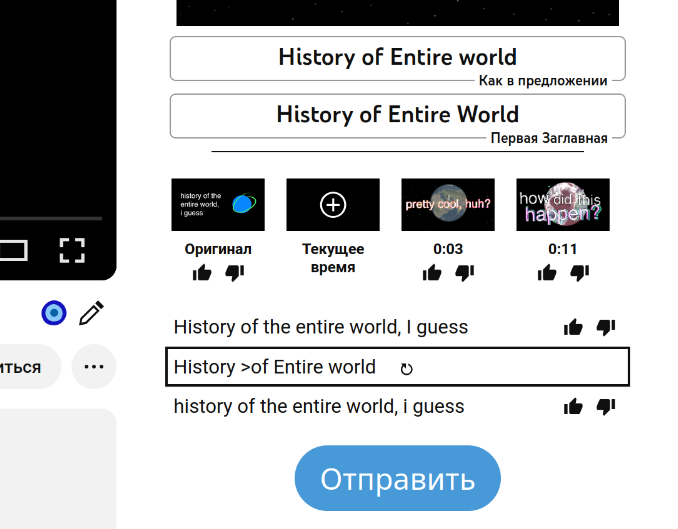

[DeArrow] — расширение для браузера, которое заменяет эмоциональные и вызывающие
обложки и названия видео на YouTube на более нейтральные и правдоподобные.
Пользователи предлагают свои названия, тем самым создавая базу данных, которой
может пользоваться любой желающий.

<!--more-->

[Демонстрационное видео](https://youtu.be/QjjpDhHh_QI)

[DeArrow]: https://dearrow.ajay.app

## Применение

«Кликбейт» уже давно является нормой на YouTube. Авторы делают вызывающие
обложки и называют видео так, чтобы как можно больше людей на них нажимало.
Порой совершенно не понятно что будет в видео по его названию. В то же время не
очень хочется тратить время на просмотр впустую.

DeArrow заменяет обложки на существующие кадры из видео, а также убирает из
названий лишние символы и заглавные буквы. Пользователи могут предлагать свои
названия видео, которые будут кратко содержать суть видео без лишних эмоций,
при этом сохраняя интерес к просмотру. Поведение расширения можно полностью
настроить под свои нужды.

## Установка

### Браузер

Официальное расширение:

- [Chromium](https://chromewebstore.google.com/detail/enamippconapkdmgfgjchkhakpfinmaj)
- [Firefox](https://addons.mozilla.org/firefox/addon/dearrow)
- [Safari](https://apps.apple.com/app/id6451469297)

> [!note]
> Официальное расширение платное, но присутствует пробный период. Купите ключ за
единоразовый платёж, чтобы поддержать разработчиков. Если вы не можете купить
ключ, то [запросите бесплатный доступ](https://dearrow.ajay.app/free) или
[сгенерируйте его](https://ashleygraves.eu/dearrow).

### Android

Официальное расширение доступно в
[Firefox для Android](https://addons.mozilla.org/android/addon/dearrow).

Сторонние приложения:
- [LibreTube](https://libretube.dev)
- [Clipious](https://github.com/lamarios/clipious#readme)

### Сторонние реализации

Благодаря открытому API и базе данных, разработчики могут создавать
[сторонние приложения и реализации], и вы можете пользоваться DeArrow
практически где угодно.

[сторонние приложения и реализации]: https://wiki.sponsor.ajay.app/w/DeArrow/Community

## Использование

По умолчанию расширение получает названия видео из базы данных, но вы можете
отказаться от этого. Если предложенных названий нет, то оригинальные
форматируются (поведение можно настроить): убираются лишние заглавные буквы,
символы, эмодзи.

Обложки видео заменяются на заданный или случайный кадр (при этом используется
база данных SponsorBlock для исключения попадания рекламы). Также отключено
A/B-тестирование обложек, когда авторы могут опубликовать несколько, и YouTube
будет показывать разные и измерять вовлечённость для каждой.

Изначальные сведения о видео можно показать нажатием на иконку возле него.
Можно добавить каналы в белый список, чтобы их видео не изменялись.

Данные и настройки можно экспортировать и импортировать.

## Краудсорсинг

Пользователи отправляют свои заголовки видео и кадры для обложек, затем путём
голосования выбираются наилучшие варианты. Вы всегда можете внести свой вклад,
чтобы улучшить опыт использования расширения для всех пользователей.

Внести свой вклад можно в официальном расширении или в любом поддерживаемом
приложении. Помощь является почти анонимной и не требует регистрации. Своё
отображаемое имя можно сменить в меню расширения.

Иконка с карандашом под плеером открывает панель, где можно проголосовать за
понравившийся заголовок или написать свой, а также указать предпочитаемый кадр
для обложки. Здесь также можно ознакомиться с краткими инструкциями.

Заголовок и обложка должны содержать достаточно информации для того, чтобы
зритель смог принять обоснованное решение, стоит ли выбирать это видео для
просмотра. Следует избегать излишних эмоций.

Не пишите каждое слово с заглавной буквы, но правильно оформляйте заглавие для
названий и аббревиатур. Их нужно начинать с `>` для игнорирования
автоматического форматирования.

Обратите внимание, что существуют особые форматы наименования для сериалов,
спидранов, музыкальных и художественных произведений. Читайте подробные
[принципы и методику](https://wiki.sponsor.ajay.app/w/DeArrow/Guidelines).

## Казуальный режим

Некоторым пользователям предложенные названия могут показаться скучными, когда
оригинальные описывают видео более остроумно и забавно. В таком случае можно
переключиться на [казуальный (обычный) режим] в настройках DeArrow.

[казуальный (обычный) режим]: https://wiki.sponsor.ajay.app/w/DeArrow/Casual_mode

Цель казуального режима — дать людям возможность голосовать за оригинальные
названия, которые им нравятся, чтобы те, кто предпочитает не видеть скучные
названия, могли их избегать. Однако для видео, где действительно нужны
изменения, DeArrow по-прежнему сможет заменять названия.

В казуальном режиме вы можете голосовать за оригинальные названия в следующих
категориях: забавные, креативные, хитроумные, информативные, прочие. Для этого
нажмите на иконку кисточки справа от названия видео. Вы можете настроить
минимальное количество голосов в каждой категории, при котором будут
показываться оригинальные названия.

## Открытость

Расширение и [API] с [открытым исходным кодом]. Это позволяет интегрировать
возможности DeArrow в [другие приложения].

[База данных] открыта и доступна всем для скачивания. Можно запустить
[собственный сервер] в случае отказа работы официального.

[API]: https://wiki.sponsor.ajay.app/w/API_Docs/DeArrow
[открытым исходным кодом]: https://github.com/ajayyy/DeArrow
[другие приложения]: https://wiki.sponsor.ajay.app/w/DeArrow/Community
[База данных]: https://sponsor.ajay.app/database
[собственный сервер]: https://github.com/mchangrh/sb-mirror

## Ссылки

- [Статус сервера](https://status.sponsor.ajay.app)
- [Отчёты об ошибках](https://github.com/ajayyy/DeArrow/issues)
- Чат и поддержка в [Matrix] и [Discord]
- Обновления и новости в [Fediverse (Mastodon)], [Bluesky] и [X]

[Matrix]: https://go.kde.org/matrix/#/#sponsor:ajay.app
[Discord]: https://discord.gg/SponsorBlock
[Fediverse (Mastodon)]: https://fosstodon.org/@sponsorblock
[Bluesky]: https://bsky.app/profile/sponsor.ajay.app
[X]: https://x.com/SponsorBlock
