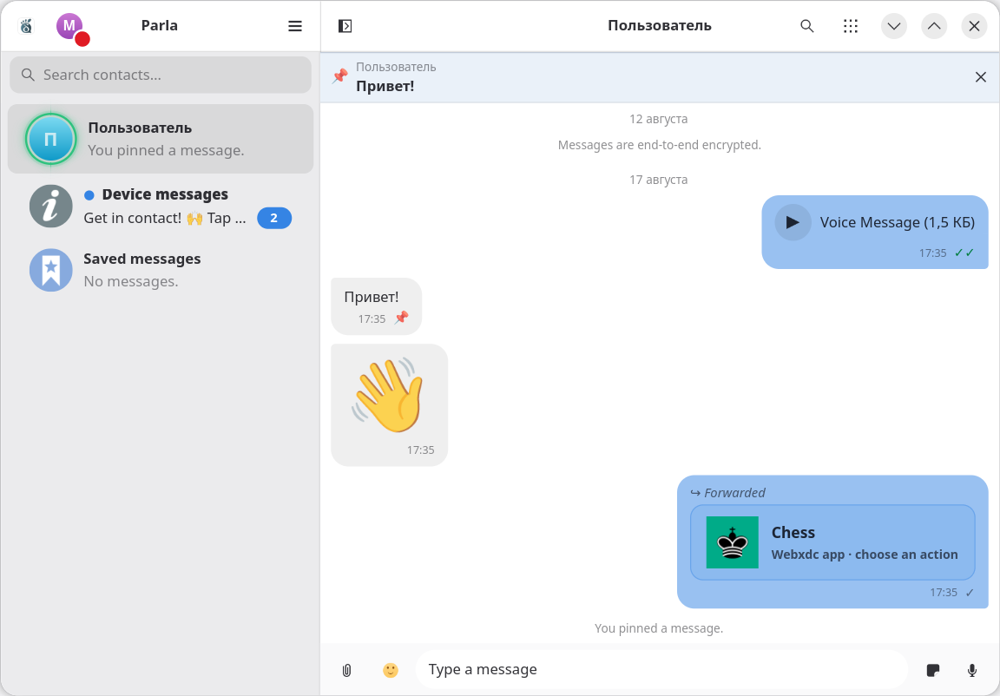

Delta Chat ориентирован на безопасное общение в частных кругах людей: семья,
друзья, коллеги — все, кому вы доверяете. Следовательно, он предоставляет
хорошую [приватность](#приватность) — посторонние не смогут прочитать ваши
переписки, связаться с вами и отправлять нежелательные сообщения. Но вести
публичную деятельность (группы, сообщества и каналы) может стать проблемой
из-за отсутствия подходящих функций.

Delta Chat достаточно удобный и функциональный, чтобы закрыть потребности в
общении при различных обстоятельствах. Рекомендуем прочитать эту страницу и
[руководство](/guides/delta-chat) полностью, а также попробовать мессенджер
самостоятельно, чтобы убедиться в его пригодности для вашего круга общения.

## Функции и возможности

**Поддерживается:**
- [Звонки](/guides/delta-chat/#звонки) в личных чатах.
    - Для групповых звонков с демонстрацией экрана рекомендуем использовать
    [Jitsi Meet](https://posts.kooltechtricks.org/@kooltechtricks/statuses/01K31JRXT0CRFP2ZTHVM1AJG09).
- Реакции с любыми эмодзи из Unicode.
- Голосовые сообщения.
- [Групповые чаты](/guides/delta-chat/#группы) на сотни участников. Каждый участник имеет равные права.
- [Каналы](/guides/delta-chat/#каналы).
- [Мини-приложения](/guides/delta-chat/#мини-приложения).
- [Боты](/guides/delta-chat/#боты).
- [Использование на нескольких устройствах](/guides/delta-chat/#использование-на-нескольких-устройствах).
    - Каждое устройство работает независимо друг от друга и выступает в качестве автоматической резервной копии профиля.
- Отправка изображений, видео, файлов. Максимальный размер может варьироваться несколькими десятками мегабайт.
    - Для передачи больших файлов в реальном времени можно воспользоваться мини-приложением [File Sync](https://github.com/ArcaneCircle/filesync/releases/latest/download/app.xdc).
- Поиск по чатам и сообщениям.
- Закрепление неограниченного количества чатов.
- Архив чатов.
- Отключаемая отметка прочтения и имитация времени последнего посещения.
- Сохранённые сообщения. Можно быстро сохранять сообщения в чатах и возвращаться к ним.
- Редактирование и удаление сообщений для всех.
- Черновики (не синхронизируются между устройствами).
- Push-уведомления и фоновая работа.
- Исчезающие сообщения.

**Частичная поддержка:**
- Опросы (только в виде [мини-приложений](https://github.com/davidsm10/poll-webxdc/releases/latest/download/app.xdc)).
- Стикеры. Нет наборов: можно добавить в коллекцию только отдельные стикеры. Создавать новые стикеры только через версию для компьютера или [бота](https://i.delta.chat/#9DE7DADDC37828D75499BBDC45CA5FACF50E9B18&a=stickersb%40mehl.cloud&n=StickersBot&i=tHkRoHiugej&s=n0x9TjRcUxo).
- На Android и iOS невозможно выделить часть текста сообщения.
- Отображение аудиофайлов, фоновое воспроизведение (зависит от приложения).
- Автоматическая отправка истории чата для новых участников.
    - Только 10 последних отправленных и закреплённых сообщений при присоединении к каналам.
    - «Отправить повторно» заново рассылает сообщения всем участникам. Новые
    участники увидят их, как будто были отправлены только что, но с сохранением
    изначального времени отправки. Старые участники не заметят ничего нового.
- Трансляция местоположения в реальном времени (экспериментальная функция).
- Закреплённые сообщения. В текущих версиях нет интерфейса, но поддержка реализована в ядре.

**Не поддерживается:**
- Несколько вложений в одном сообщении.
- Предпросмотр ссылок.
- Форматирование текста.
- Папки чатов.
- Выбор GIF (только в виде стикеров).
- Видеосообщения («кружочки»).
- Индикатор печатания.
- Упоминания в группах.
- Отложенные сообщения.
- Отправка сообщения без уведомления.
- Собственные эмодзи.
- Скрытый текст и изображения («спойлеры»).
- Комментарии в каналах.
- Группы с темами/ветками.
- Истории.

## Приватность

Delta Chat не требует вашего номера телефона и других идентифицирующих данных.
Как следствие:
- Посторонние люди [не смогут вас случайно обнаружить] и начать отправлять
нежелательные сообщения.
- Не существует какой-либо большой базы данных с личной информацией, которая
[могла бы утечь].

Профиль содержит имя, аватар и поле «О себе», но они защищены сквозным
шифрованием между собеседниками, и необязательно использовать настоящие.

Чтобы с вами могли связаться в Delta Chat, вы должны поделиться специальной
ссылкой или QR-кодом, которые содержат ваш публичный ключ шифрования. Следует
делиться ссылкой только с теми людьми, которым доверяете. Для общения с менее
знакомыми людьми лучше создавать
[отдельные профили](/guides/delta-chat#несколько-профилей-на-одном-устройстве).
Ссылки можно сбрасывать в любой момент.

Также возможно связаться не напрямую в следующих случаях:
- Пользователи могут делиться своими контактами с другими пользователями.
- Членам группы доступны контакты каждого участника.
- Подписчикам канала доступен контакт администратора канала, а администратору
доступны контакты каждого подписчика.

Личные сообщения от пользователей, с которыми вы не связывались напрямую, будут
поначалу отмечаться как [запрос] и приходить без уведомлений. Вы можете принять
запрос, чтобы отправлять сообщения и получать уведомления, или заблокировать
контакт.

Такая архитектурная особенность Delta Chat защищает пользователей от
нежелательных сообщений, спама и мошенничества, не полагаясь на какие-либо
службы модерации.

[не смогут вас случайно обнаружить]: https://www.wired.com/story/a-simple-whatsapp-security-flaw-exposed-billions-phone-numbers
[могла бы утечь]: https://kod.ru/darknet-sliv-baza-telegram-jun2020
[запрос]: https://delta.chat/ru/help#почему-чат-помечен-как-запрос

## Безопасность

[Приложения Delta Chat] и [релеи Chatmail](https://github.com/chatmail/relay),
основанные на библиотеке [Chatmail Core], полностью с открытым исходным кодом.
Они проходили множество независимых [аудитов безопасности].

Сквозное шифрование гарантирует, что содержимое сообщений, включая вложения и
профили пользователей, можно увидеть только на устройствах получателей. Все
сообщения в Delta Chat по умолчанию защищены сквозным шифрованием по стандартам
[OpenPGP] (используется реализация [rPGP]). Обмен ключами шифрования
производится по протоколу [SecureJoin], а установка сквозного шифрования
основана на [Autocrypt]. На данный момент не поддерживается
[Perfect Forward Secrecy] и постквантовая криптография, но эти возможности
появятся в [Autocrypt v2], полное внедрение которого запланировано на 2026 год.

Данные временно хранятся на серверах собеседников в зашифрованном виде, и
удаляются после доставки или через несколько недель. Операторы серверов не
смогут прочитать содержимое, так как у них нет ваших приватных ключей
шифрования. Видимыми [метаданными] для релеев Chatmail являются только случайно
сгенерированные адреса и размер сообщений.

[Приложения Delta Chat]: https://github.com/deltachat
[Chatmail Core]: https://github.com/chatmail/core
[аудитов безопасности]: https://delta.chat/ru/help#security-audits
[OpenPGP]: https://delta.chat/ru/help#openpgp-secure
[rPGP]: https://github.com/rpgp/rpgp
[SecureJoin]: https://securejoin.readthedocs.io/en/latest
[Autocrypt]: https://docs.autocrypt.org
[Perfect Forward Secrecy]: https://ru.wikipedia.org/wiki/Perfect_forward_secrecy
[Autocrypt v2]: https://autocrypt2.org
[метаданными]: https://delta.chat/en/2026-03-31-zero

## Анонимность

Пользователям Chatmail присваивается адрес, состоящий из случайных символов и
домена сервера (`u4nfg3gi@example.com`). Контакты могут увидеть адреса
[всех активных релеев](/guides/delta-chat#релеи) пользователя. Смена релеев не
утратит связи с контактами, так как у них сохраняется ключ шифрования.

Серверы могут видеть адреса отправителей и получателей, но они используются
только для определения маршрута. Никто не может отправлять сообщения напрямую
или идентифицировать конкретных людей по одному лишь адресу Chatmail. На
классических почтовых серверах проще идентифицировать личность. Для повышения
анонимности используйте серверы с большим количеством пользователей.

## Подключения

Delta Chat не делает лишних запросов в интернет без необходимости.

Delta Chat подключается к вашим серверам Chatmail или классической электронной
почты, чтобы отправлять и получать сообщения. Сервер можно выбрать при создании
профиля или добавлении релеев. При использовании звонков и мини-приложений в
режиме реального времени применяется технология WebRTC, что может раскрывать
ваш IP-адрес собеседникам.

Дополнительные сервисы могут включать:
- Push-уведомления от Google или Apple,
[реализованые конфиденциально](https://delta.chat/ru/help#privacy-notifications).
- Встроенный каталог мини-приложений [webxdc.org](https://webxdc.org/apps).
Опрашивается только при открытии соответствующего меню, адрес можно сменить в
дополнительных настройках.
- Резервный сервер `turn.delta.chat` для звонков, если сконфигурированные на
релеях Chatmail недоступны.
- Сервер Thunderbird `autoconfig.thunderbird.net` для автоматического
определения конфигурации почтового сервера при создании профиля.

## Некоммерческая основа

Проект Delta Chat разрабатывается и поддерживается сообществом на некоммерческой
основе. Его цель — предоставлять людям безопасный и надёжный инструмент
коммуникации, а не зарабатывать на продаже рекламы, персональных данных и
внимания пользователей, как другие популярные социальные сети и мессенджеры.
Как следствие, архитектура Delta Chat, где каждая часть независима и связана с
другими по открытым стандартам, не допускает появления рекламы и платных
функций.

## Хранение данных

Все сообщения в Delta Chat хранятся на устройствах пользователей. Серверы
используются лишь для передачи зашифрованных сообщений, и они удаляются оттуда
после доставки или через несколько недель.

Спустя продолжительное время Delta Chat может занимать много места,
и потребуется [очистка](/guides/delta-chat#очистка).

Обратите внимание, что удаление или редактирование сообщений для других
пользователей не гарантирует их исчезновение или изменение на их устройствах.
Так как на устройствах содержатся копии сообщений, их можно сохранить в
отдельное место или просто игнорировать команды. То же самое правило применимо
и ко всем другим способам коммуникации.

## Релеи Chatmail

Обмен сообщениями в Delta Chat осуществляется через специальные серверы, которые
называются [релеи Chatmail]. Для их использования не нужно создавать аккаунт,
вводить данные и придумывать пароль — профили создаются в пару нажатий.
Отправлять или получать незашифрованные сообщения через релеи Chatmail
невозможно, что предотвращает спам. Также они не хранят долго сообщения и не
оставляют лишних метаданных. Кроме того, поддерживаются push-уведомления и
звонки с видеосвязью.

Доступны десятки [публичных](https://chatmail.at/relays) и приватных релеев.
Вы можете использовать любой релей, если знаете его адрес.

Delta Chat основан на протоколах электронной почты, и вы можете использовать
свой обычный почтовый ящик. Однако такой подход предназначен для продвинутых
пользователей, так как можно столкнуться с проблемами и ограничениями.
Смотрите [руководство по использованию Delta Chat с классической электронной почтой](/guides/delta-chat-email).

Поддержка релея Chatmail для тысяч пользователей
[не занимает](https://fosstodon.org/@arcanechat/116037225917266409) много
ресурсов и часов администрирования. Для [запуска релея Chatmail] существуют
простые скрипты установки, но выполнять их необходимо с Unix-подобной
операционной системы (не Windows) на сервер Debian 12. Поддержка [Docker] на
данный момент является экспериментальной. На сервере необходимо открыть почтовые
порты, что на многих хостинг-провайдерах требует подтверждение личности.

[релеи Chatmail]: https://chatmail.at
[запуска релея Chatmail]: https://chatmail.at/doc/relay
[Docker]: https://github.com/chatmail/docker#readme

## Альтернативные клиенты

Экосистема Chatmail открыта для реализации
[альтернативных приложений](https://chatmail.at/clients), однако на данный
момент выбор весьма ограничен.

### ArcaneChat

[ArcaneChat] — расширенная версия Delta Chat для Android от того же
разработчика. Получает обновления и новые функции раньше официальных приложений.
Экспериментальные функции включены по умолчанию. При создании профиля
используется другой релей Chatmail по умолчанию.

Основные отличия:
- Форматирование текста Markdown (отображается на стороне клиента).
- Отправка и отображение анимированных стикеров Telegram (.tgs).
- Настройка цветовой схемы.
- Отключение профилей.
- Время последнего посещения в списке контактов.
- Видео проигрываются зациклено.
- Небольшие изменения в дизайне интерфейса. Некоторые действия выполняются за
меньшее число нажатий.
- Поддержка UnifiedPush.

[ArcaneChat]: https://arcanechat.me

### Parla

[Parla] — нативный кросс-платформенный клиент с дизайном рабочего стола GNOME.
Поддерживает многие функции официальных клиентов. Разрабатывается с применением AI/LLM.

Ядро Chatmail не интегрировано в Parla. Предлагается автоматически загрузить
его, но может потребоваться самостоятельно управлять установкой.

Уникальные функции:
- Организация стикеров в наборы.
- Настройка стиля блоков сообщений.
- Преобразование голосовых сообщений в текст с помощью локальной программы Whisper.
- Форматирование текста Markdown.

[Parla]: https://github.com/trufae/parla#readme

## Вопросы

### Разработчики Delta Chat отказываются от классической электронной почты?

[Изначально](https://delta.chat/en/2017-05-31-delta-makes-chatting-better#russian)
Delta Chat был построен на идее использования обычной электронной почты для
обмена мгновенными сообщениями. Электронная почта есть у каждого человека.
Не нужно просить других людей скачивать очередной мессенджер: можно отправлять
им электронные письма из Delta Chat, и они прочтут их из своего почтового
клиента. Не нужно создавать отдельный аккаунт — он уже есть на вашем почтовом
сервере. Эта идея, несмотря на критику, оказалась жизнеспособной. За несколько
лет разработки удалось внедрить полезные функции привычных мессенджеров:
аватары, группы, сквозное шифрование, [боты](https://delta.chat/en/2020-03-26-shining-some-light-on-bots)
и даже [мини-приложения](https://delta.chat/en/2022-06-14-webxdcintro).

Однако фундаментальная особенность Delta Chat оказалась главной слабостью
мессенджера. Хотя действительно у каждого человека есть адрес электронной почты,
на практике это редкий способ переписки. Большая часть людей пользуются услугами
электронной почты от крупных корпораций, таких как Google, Яндекс, VK.
Зависимость от техногигантов лишь вредит независимому проекту с открытым
исходным кодом. Они заинтересованы не в предоставлении удобного сервиса, а в
получении прибыли с пользователей: реклама, платные тарифы, продажа данных. Вы
не можете полагаться на серверы крупных корпораций, когда в любой момент можете
[лишиться доступа](https://habr.com/ru/news/1001172) через сторонние клиенты,
потому что им это не выгодно.

Сеть электронной почты крайне уязвима к спаму. Почтовые адреса легко попадают
злоумышленникам и используются для нежелательных рассылок. Почтовые провайдеры
вынуждены фильтровать не только содержимое писем, но и их происхождение: домен
и IP-адрес. Многие хостинг-провайдеры разрешают почтовые протоколы только после
подтверждения личности. В целом, запустить и поддерживать свой почтовый сервер —
задача не из лёгких.

Для решения этих проблем был создан проект [Chatmail](https://delta.chat/en/2023-12-13-chatmail).
Это тот же самый почтовый сервер, но оптимизированный для мгновенных сообщений.
Его легко запустить и настроить, он не хранит пользовательские данные и не
требует много ресурсов даже для десятков тысяч пользователей. Пользователи могут
начать использовать [релеи Chatmail](#релеи-chatmail) в пару нажатий, не вводя
никаких личных данных. Delta Chat не привязывается к конкретным почтовым адресам:
каждый сервер выступает лишь в качестве транспорта (релея), что позволяет
[легко мигрировать между серверами](/guides/delta-chat/#релеи) с минимальными
потерями связей. Злоумышленники не могут пользоваться релеями Chatmail для
рассылки спама, так как Chatmail не передаёт незашифрованные письма, а в
Delta Chat всегда используется шифрование по умолчанию.

С момента появления Chatmail стало в разы проще пользоваться Delta Chat без
головной боли классической электронной почты. Это позволило внедрить недоступные
ранее технологии: push-уведомления, peer-to-peer мини-приложения и звонки.
Поэтому разработчики сосредоточены на развитие Delta Chat в сторону Chatmail.

Важно отметить, что **Delta Chat и Chatmail всё ещё используют почтовые
протоколы для обмена сообщениями**. Вы [можете использовать классическую
электронную почту как релей в вашем профиле Delta Chat](/guides/delta-chat-email),
и общаться с пользователями на релеях Chatmail. Однако вышеупомянутые проблемы
электронной почты никуда не делись: почтовые провайдеры могут ограничить вам
доступ, зашифрованные сообщения могут считаться спамом и так далее. Поэтому это
предназначено для продвинутых пользователей, способных настраивать и держать
все нюансы в голове. Тем не менее [не поддерживается использование одного и
того же почтового ящика для классической электронной почты и Delta Chat одновременно](https://delta.chat/ru/help#могу-ли-я-использовать-обычный-адрес-электронной-почты-с-delta-chat).

### Могут ли взломать Delta Chat?

[Сквозного шифрования](#безопасность) в Delta Chat достаточно, чтобы посторонние
наблюдатели не смогли прочитать передаваемые сообщения — они доступны только на
конечных устройствах получателей. Конечно, предполагается, что устройства
собеседников не скомпрометированы, а в приложения и серверы не встроен бэкдор.

Релеи Chatmail не хранят личные данные пользователей, которые могли бы утечь.
Мошенники [не могут](#приватность) отправлять зашифрованные письма пользователям
Delta Chat, если они не заполучили ссылку-приглашение.

Экспорт профиля оставляет незашифрованный архив со всеми сообщениями и ключами
шифрования. Если он будет украден, то злоумышленники смогут отправлять сообщения
от вашего имени. Вы не сможете сбросить пароль и завершить активные сеансы, если
используете Chatmail.

### Могут ли заблокировать Delta Chat?

Delta Chat основан на электронной почте, которая используется повсеместно.
Попытки её блокировки могли бы привести к убыткам в корпоративном сегменте. Тем
не менее предпринимаются попытки блокировки TLS (шифрованный трафик,
использующийся как для обычных сайтов, так и для электронной почты), и
ограничивается мобильный интернет, что определённо пагубно влияет на экономику.
Вполне вероятен сценарий требования прекращения передачи зашифрованных писем на
популярных почтовых провайдерах, аналогично [SMS-кодам Telegram].
Поэтому в любом случае стоит ожидать попытки блокировки Delta Chat при
увеличении его популярности.

Однако Delta Chat всё ещё может работать [надёжно](https://techhub.social/@abbas_dp/116149942243658784)
в условиях [ограниченного интернета](https://techhub.social/@abbas_dp/115924794576948449).
Работают десятки независимых [релеев Chatmail](#релеи-chatmail), и можно
запустить свой. Их проще обслуживать, чем классическую электронную почту и
другие варианты. Альтернативно можно использовать
[существующий почтовый ящик](/guides/delta-chat-email) для передачи
зашифрованных сообщений.

Delta Chat не может работать без интернета, хотя все данные хранятся локально
в приложении и доступны в любое время. В таком случае рекомендуется искать
альтернативные офлайн решения, например, [Meshtastic](https://meshtastic.org).

[SMS-кодам Telegram]: https://kod.ru/telegram-i-whatsapp-bez-sms
