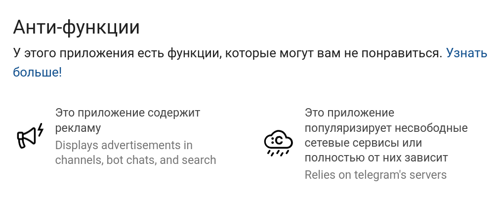
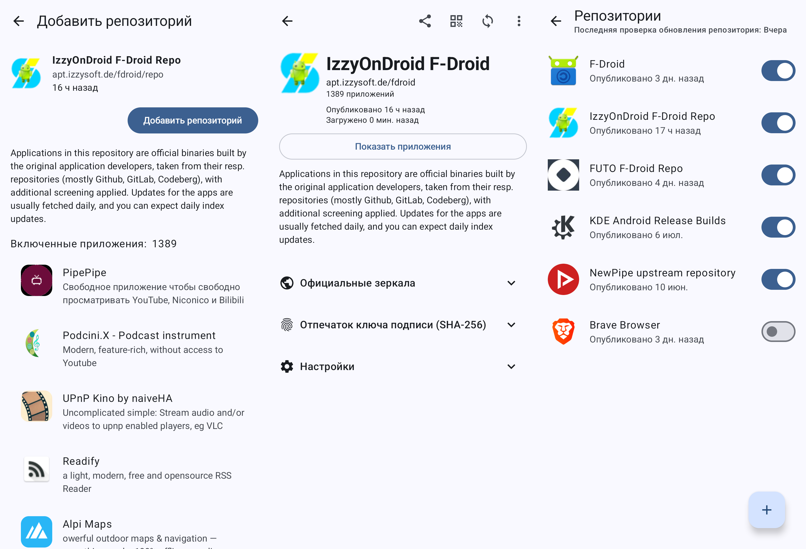
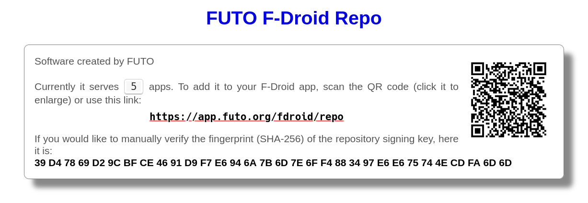
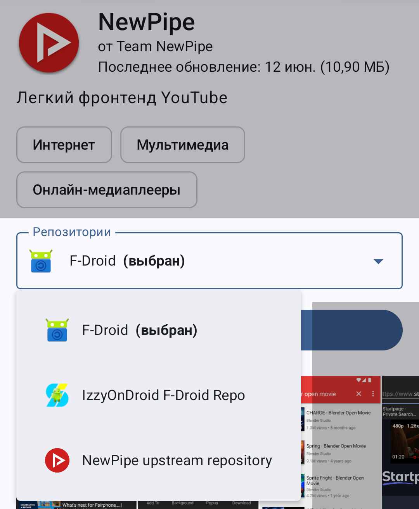

## Официальный репозиторий

Под словом F-Droid часто имеется в виду [официальный репозиторий](https://f-droid.org/packages) —
каталог приложений для Android, рассматривающийся как альтернатива Google Play и
другим коммерческим магазинам приложений.

### Философия

F-Droid отличается своей особенной [политикой включения](https://f-droid.org/docs/Inclusion_Policy),
которая разрешает только [свободные приложения с открытым исходным кодом](https://www.gnu.org/philosophy/free-sw.ru.html)
без проприетарных зависимостей (например, службы Google). Следовательно, как
правило, в F-Droid отсутствуют приложения с навязчивой рекламой, нежелательными
функциями и агрессивным отслеживанием.

В целом, это хорошо для пользователей. Свободные приложения создаются с целью
приносить пользу людям, а не извлекать выгоду для разработчиков, и F-Droid
является большим каталогом таких полезных приложений. Однако вы не найдёте
привычные [проприетарные приложения](https://www.gnu.org/proprietary/proprietary.ru.html).
Предлагается искать и пробовать свободные альтернативы, но их функциональность и
качество могут не достигать достойного уровня.

### Анти-функции

Свободные приложения, которые соответствуют всем требованиям для включения в
каталог F-Droid, всё ещё могут содержать нежелательную функциональность,
приносящую выгоду разработчикам. F-Droid называет это [анти-функциями](https://f-droid.org/ru/docs/Anti-Features).
Они необязательно означают злые намерения разработчика, так как не всегда легко
избежать их. Поэтому F-Droid просто информирует пользователей о наличии анти-функций.

Наиболее распространённые анти-функции:

- **Реклама** (Advertising): F-Droid запрещает внедрение проприетарных библиотек
для показа рекламы. Однако разработчики могут реализовать иные способы показа
рекламы, совместимые со свободным ПО.

- **Отслеживание** (Tracking): По умолчанию включено отслеживание без
информирования и согласия пользователя: отправка отчётов об использовании и
сбоях, проверка наличия обновлений. Так же, как и с рекламой, в F-Droid вы не
найдёте приложения с проприетарными библиотеками для отслеживания, но могут быть
свободные реализации.

- **Несвободные сетевые сервисы** (Non-Free Network Services): Взаимодействие с
проприетарным сервером, который вы не можете контролировать. (Например, вы не
можете запустить свой собственный независимый сервер Telegram и YouTube.)

- **Привязанные сетевые сервисы** (Tethered Network Services): Взаимодействие с
определёнными (свободными) серверами, которые невозможно заменить простой
настройкой в приложении. При их недоступности приложение перестаёт
функционировать полностью или частично. (Например, [приложение Википедии](https://f-droid.org/packages/org.wikipedia)
получает данные из `wikipedia.org`, что является свободным сервисом, но вы не
можете заменить сервер на собственный экземпляр в настройках.)

### Публикация приложений

Разработчики не загружают свои приложения в официальный репозиторий F-Droid. Они
лишь публикуют исходный код и метаданные. Сервер F-Droid отслеживает новые
версии приложений и автоматически пытается собрать их из исходного кода.
Собранные на сервере F-Droid версии приложения попадают в каталог и становятся
доступными для скачивания. Это не похоже на другие магазины приложений, но
аналогично поставке программ в дистрибутивах Linux, однако в случае с Android
имеет ряд недостатков.

Благодаря такому подходу функциональность приложений гарантированно
соответствует опубликованному исходному коду. Однако это не гарантирует
отсутствие вредоносного кода. Со стороны F-Droid проводится только поверхностный
контроль качества и автоматическая проверка.

Новые версии приложений в F-Droid становятся доступными не сразу, так как они
должны быть собраны на сервере. Из-за этого обновления приходится ждать от
нескольких дней до нескольких недель, иногда пропуская крупные релизы.
Пользователи F-Droid лишаются быстрых исправлений ошибок и уязвимостей.

Приложения, собранные F-Droid, [подписываются](/wiki/android-isolation/#песочница-приложений)
ключом F-Droid (уникальный для каждого приложения). Это значит, что вы не
сможете обновить установленное приложение из другого источника версией F-Droid
(и наоборот), так как у них, скорее всего, отличается подпись.

К счастью, F-Droid движется в сторону [воспроизводимых сборок](https://f-droid.org/docs/Reproducible_Builds).
При воспроизводимой сборке независимо собранные экземпляры приложения побитово
совпадают, что само по себе гарантирует соответствие опубликованному исходному
коду и устраняет необходимость подписывать приложение иным ключом. Однако не все
приложения поддерживают это, и для настройки требуются дополнительные усилия.

### Безопасность

Сложный подход к сборке и публикации приложений, который создаёт задержки
обновлений и несовместимость подписей, вызывает недопонимание у пользователей и
приводит к [проблемам безопасности](https://privsec.dev/posts/android/f-droid-security-issues).
Это не должно оказывать значительного влияния для большинства обычных
пользователей, так как F-Droid соблюдает необходимые [меры безопасности](https://f-droid.org/ru/docs/Security_Model).
Тем не менее вы должны оценивать возможные риски в зависимости от вашей модели
угроз. Официальный репозиторий F-Droid всё ещё полезен для нахождения приложений,
которые часто публикуются в нескольких источниках.

- Сборка приложений на сервере F-Droid не гарантирует отсутствие вредоносного
кода. Пользователи всё ещё должны доверять разработчикам приложения. Кроме того,
добавляется необходимость доверять F-Droid, так как с их стороны возможна
нежелательная модификация кода перед сборкой.

- Задержки новых версий и пропуск релизов оставляет пользователей без
исправлений ошибок и уязвимостей. Установить обновление из другого источника,
когда приложение было установлено с подписью F-Droid, невозможно.

- Официальный репозиторий F-Droid не устанавливает строгих требований для
минимальной целевой версии Android, как, например, [Google Play](https://developer.android.com/google/play/requirements/target-sdk).
Приложения с низкой целевой версией лишаются новых улучшений безопасности
Android. Кроме того, репозиторий содержит множество устаревших приложений, хотя
они периодически архивируются.

## Сторонние репозитории

Сторонние репозитории F-Droid являются каталогами приложений, совместимые с
[клиентами F-Droid](#клиент-f-droid). Каждый репозиторий управляется
независимыми группами людей, имеет собственную политику включения, модель
безопасности и подход к распространению приложений.

Это самый простой способ иметь собственный маленький магазин приложений.
Некоторые разработчики таким образом распространяют свои приложения.
[Смотрите список сторонних репозиториев F-Droid](https://forum.f-droid.org/t/known-repositories/721)

### IzzyOnDroid

[IzzyOnDroid] — самый крупный сторонний репозиторий F-Droid. [Политика включения](https://izzyondroid.org/docs/general/AppInclusionPolicy)
похожа на официальный репозиторий F-Droid. Имеются собственные пометки
анти-функций, самостоятельные проверки и [учёт статистики](https://stats.izzyondroid.org).
[Подробнее](https://apt.izzysoft.de/fdroid/index/info)

В отличие от официального репозитория F-Droid, IzzyOnDroid распространяет сборки
приложений, полученные от оригинальных разработчиков. Следовательно, это не
вызывает конфликтов подписей и задержки обновлений. Поддерживается проверка
[воспроизводимости сборок](https://izzyondroid.org/about/security/ReproducibleBuilds),
которая охватывает больше половины всех приложений в каталоге.

[IzzyOnDroid]: https://apt.izzysoft.de/fdroid

### Использование стороннего репозитория

Чтобы получать приложения из стороннего репозитория, его нужно добавить в ваш
[клиент F-Droid](#клиент-f-droid). В официальном клиенте на экране «Исследовать»
в верхней панели есть значок коробки, где можно управлять репозиториями.

Перейдите на страницу репозитория и нажмите на подчёркнутую ссылку, либо
отсканируйте QR-код в клиенте F-Droid или вставьте ссылку. Вы должны доверять
этому репозиторию. Для подтверждения подлинности репозитория используется
отпечаток ключа подписи — эта строка на странице и в клиенте должна совпадать.

После добавления репозитория вы можете просматривать приложения оттуда в вашем
клиенте F-Droid. Если приложение находится в нескольких репозиториях, то на
его странице отобразится список. Вы можете выбрать предпочтительный репозиторий,
откуда будет загружаться приложение. Метаданные приложения (описание, снимки
экрана и анти-функции) будут взяты из выбранного репозитория.

## Клиент F-Droid

Клиент F-Droid — это приложение, которое подключается к репозиториям F-Droid и
позволяет находить, устанавливать и обновлять приложения оттуда. Установите
клиент F-Droid для удобного просмотра каталога на устройстве и получения
автоматических обновлений.

- [Официальный клиент](https://f-droid.org/F-Droid.apk) рекомендуется для
большинства пользователей.
- [F-Droid Basic](https://f-droid.org/packages/org.fdroid.basic) — облегчённая
версия с минимально необходимой функциональностью. Отсутствует обмен
приложениями без интернета и тревожная кнопка.
- [Альтернативные клиенты](/collections/f-droid-clients) — сторонние реализации,
предлагающие иной интерфейс, дополнительные функции и больше сторонних
репозиториев по умолчанию. Рекомендуется для пользователей, привыкших к F-Droid
и желающих исследовать эту экосистему.
