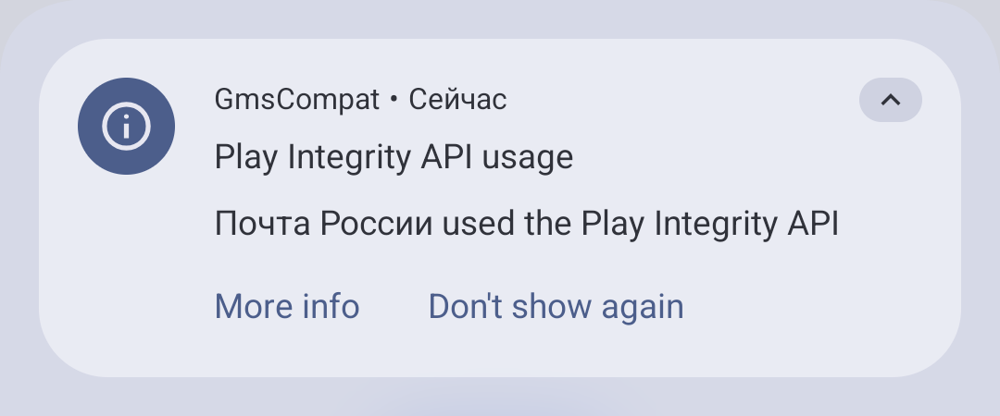

## Применение

### Проблема стандартных ОС Android

Смартфоны, продаваемые в магазинах, захламлены приложениями от производителей и
партнёров (значительная часть которых является своего рода рекламой). От них
почти невозможно полностью избавиться без root-прав. Большинство людей даже не
беспокоятся об этом и оставляют приложения на главном экране.

Во всех стандартных ОС Android встроены сервисы Google. С их помощью вы
можете скачивать приложения из Google Play и получать push-уведомления. Однако
сервисы Google имеют привилегированный доступ к системе, незаметно получают
обновления и постоянно отправляют данные в Google. Система фактически зависит от
этих проприетарных сервисов, даже если вы не вошли в аккаунт. Это ставит под
вопрос владение устройством.

В Android можно устанавливать любые приложения из APK-файлов в обход правил и
условий Google Play. Благодаря этому некоторые части системы можно заменить на
свободные альтернативы. Но теперь Google предпринимает шаги по
[ограничению установки любых приложений](https://posts.kooltechtricks.org/@kooltechtricks/statuses/01KJ2FXP3E080MP1NBY4PXHGWG).

### Чистая система

В GrapheneOS по умолчанию предустановлен минимум необходимых приложений. Вам не
нужно тратить время на удаление ненужных приложений, которые отнимают место и
ваше внимание. Всё, что вам нужно, вы можете установить самостоятельно.

[Сервисы Google](#google-play) нужно устанавливать отдельно. Они имеют
изолированный доступ к системе, как и любые другие приложения. Это ограничивает
Google в возможности следить за вашей активностью и трактовать условия
использования устройства.

### Безопасность и приватность по умолчанию

Вышесказанное может относиться к любым альтернативным прошивкам. Но GrapheneOS
отличает строгий ориентир на безопасность и приватность. Разработчики не
реализует функций, которые могли бы снизить уровень безопасности пользователей.

Смартфоны имеют обширный доступ к данным пользователей. Многие приложения ищут
способы отслеживать активность пользователей. Android предназначен для
повседневного использования людьми разной категорией технической
осведомлённости. Безопасность реализована таким образом, чтобы не нарушать
конфиденциальность пользователей без их ведома, но и не перегружать
самостоятельными решениями. Поэтому разработчики Android вынуждены идти на
компромиссы ради удобства для большинства пользователей.

GrapheneOS обеспечивает наилучшую защиту от уязвимостей и эксплойтов на низком
уровне. Она закрывает многие дыры в безопасности, которые присутствуют на
стандартных ОС Android. GrapheneOS даёт больше контроля над тем, как
используются приложения, что позволяет ограничить им сбор данных. При этом
баланс удобства использования сохраняется настолько, насколько это возможно.

Многие производители Android-устройств не поддерживают программное обеспечение
в актуальном состоянии. Устройства редко получают важные исправления
безопасности или вовсе остаются без обновлений, но ими продолжают пользоваться.
GrapheneOS обеспечивает длительный срок поддержки (7 лет) и регулярно получает
[обновления](#обновления) безопасности.

### Сохранение удобства использования

Обеспечение безопасности и приватности обычно приводит к ухудшению удобства
использования. Но GrapheneOS нацелена на всех пользователей, даже менее
технически осведомлённых. Поэтому разработчики стараются сохранять удобство
использования на уровне привычных операционных систем.

Вы всё ещё можете установить изолированные сервисы Google и скачивать ваши
привычные приложения. Большинство приложений, скорее всего, будут
функционировать без проблем благодаря обеспечению совместимости, включая банки,
стриминговые сервисы и платные приложения. Не будет работать только ограниченный
набор приложений, требующий жёсткой проверки сертификации устройства.

GrapheneOS разрабатывается небольшой командой профессионалов, а не энтузиастов.
Можно ожидать стабильную работу системы.

## Установка

### Приобретение устройства

На данный момент GrapheneOS поддерживается только на смартфонах Google Pixel.
Только эти устройства соответствуют всем требованиям безопасности, разработчики
не гонятся за обширной поддержкой устройств. Скоро список поддерживаемых
устройств пополнят новые модели [Motorola].

Если вы намереваетесь использовать GrapheneOS на основном телефоне, то
рекомендуется приобрести свежую модель Google Pixel, вышедшую не более трёх лет
назад. Начиная с Pixel 8, срок поддержки составляет семь лет вместо пяти.

Если вы не уверены, но хотите попробовать, то можете найти старую модель Pixel
на вторичном рынке за небольшую стоимость. Это позволит вам оценить возможности
GrapheneOS, чтобы в будущем проще перейти на более свежую модель.

Перед приобретением устройства убедитесь, что на нём возможно разблокировать
загрузчик в параметрах разработчика (может потребоваться подключение к
интернету). Эта функция может отсутствовать, если смартфон продаётся по
контракту с операторами связи (обычно только в США).

Смотрите список [поддерживаемых] и [рекомендуемых] устройств для GrapheneOS.
Также смотрите [даты прекращения поддержки Google Pixel].

[Motorola]: https://motorolanews.com/motorola-three-new-b2b-solutions-at-mwc-2026
[поддерживаемых]: https://grapheneos.org/faq#supported-devices
[рекомендуемых]: https://grapheneos.org/faq#recommended-devices
[даты прекращения поддержки Google Pixel]: https://endoflife.date/pixel

### Подготовка устройства

Установка операционной системы безвозвратно уничтожит все пользовательские
данные на устройстве. Убедитесь, что на телефоне нет важных данных, или
перенесите их на другой физический носитель.

Вам понадобится компьютер или другое Android-устройство со свободными 2 ГБ ОЗУ и
32 ГБ диска, а также качественный USB-кабель.

### Процесс установки

Рекомендуется проходить установку в браузере [(веб-установщик)], так как это
наиболее простой способ. Для него потребуется браузер на основе Chromium, так
как только здесь поддерживается [WebUSB]. Альтернативно можно воспользоваться
установкой [через консоль].

Внимательно следуйте инструкциям на странице, чтобы установить GrapheneOS.

[(веб-установщик)]: https://grapheneos.org/install/web
[через консоль]: https://grapheneos.org/install/cli
[WebUSB]: https://developer.mozilla.org/en-US/docs/Web/API/WebUSB_API

### После установки

При каждом запуске системы на несколько секунд будет показываться экран с
предупреждением о неофициальной прошивке. Здесь содержится ID сборки, который
вы можете сравнить с [хэшем ключа GrapheneOS], чтобы подтвердить целостность
установленной системы. Далее можно пройти аппаратную аттестацию в приложении
[Auditor] — для него потребуется второе Android-устройство или подключение к
серверу.

После установки GrapheneOS вы сможете [вернуть официальную прошивку Android]
или установить другую.

[хэшем ключа GrapheneOS]: https://grapheneos.org/install/web#verified-boot-key-hash
[Auditor]: https://attestation.app/tutorial
[вернуть официальную прошивку Android]: https://flash.android.com/back-to-public

## Функции

Функции GrapheneOS в основном сосредоточены на обеспечение безопасности и
приватности. Полный перечень на [официальном сайте](https://grapheneos.org/features).
Также смотрите страницу [руководства по использованию](https://grapheneos.org/usage).

GrapheneOS основана на Android Open Source Project (AOSP) — это значит, что
внешний вид и пользовательский опыт близок к стоковому Android. Варианты
Android от производителей смартфонов содержат гораздо больше функций, и часть
из них позже появляется в стоковом Android. В отличие от смартфонов
производителей, вы всегда будете получать последние версии Android в течении
всего срока поддержки устройства. Однако Google теперь публикует исходный код
AOSP [два раза в год](https://www.androidauthority.com/aosp-source-code-schedule-3630018),
что замедлит появление новой функциональности на альтернативных ОС. Это не
влияет на патчи безопасности в GrapheneOS, они выходят без задержек.

GrapheneOS не поддерживает локализацию на другие языки. Строки интерфейса
стокового Android будут на родном языке, а строки GrapheneOS — на английском.

### Разрешения

Доступно больше переключателей разрешений для ограничения сбора данных
приложениями:

- **Сеть (Network):** Доступ к интернету и локальной сети. Можно отозвать перед
установкой приложения. В отличие от блокировки соединений через брандмауэр,
GrapheneOS имитирует отсутствие сети через системные API, что вынуждает
приложения подстраиваться под соответствующие условия, а не падать в бесконечную
загрузку или сыпать ошибками.

- **Сенсоры (Sensors):** Такие датчики как акселерометр, гироскоп, компас,
барометр, термометр и другие.

- **Области хранилища (Storage scopes):** Выдача доступа только к конкретным
папкам, файлам или изображениям. Приложениям будет казаться, что вы предоставили
всю файловую систему, но в ней содержатся только выбранные папки и файлы.

- **Области контактов (Contact scopes):** По аналогии с областями хранилища,
можно выдавать доступ только к конкретным контактам, а не всей адресной книге.

### Пользователи

В стоковом Android можно создавать несколько пользователей, аналогично
настольным операционным системам. В GrapheneOS эта возможность улучшена:

- Лимит на общее количество пользователей увеличен с 4 до 32.
- Завершение сеанса.
- Пересылка уведомлений (отображается только название приложения и пользователь).
- Запрет на установку и обновление приложений.
- Перенос установленных приложений из Владельца в другие пользователи.
- Разрешено создание частных пространств для каждого пользователя.

Каждый пользователь является изолированным пространством со своими настройками,
приложениями, файлами и данными. Можно представлять их как отдельные 
виртуальные телефоны. Это отличная возможность огородить приложения, которые
потенциально могут отслеживать вашу активность. Подробнее на странице
[Изоляция приложений и пользовательских данных в Android](/wiki/android-isolation).

### Обновления

Вы всегда должны находиться на последней версии операционной системы.
Обновления содержат важные патчи безопасности и исправления уязвимостей.

В GrapheneOS реализована полностью автоматическая система обновлений. Вам не
нужно отвлекаться на установку обновлений и беспокоиться о прерываниях, сбоях
и ошибках: система сама обо всём позаботится, а в случае неуспеха откатит и
попробует заново.

Периодически в фоне происходит проверка на наличие обновлений. Когда обновление
найдено, оно начнёт устанавливаться на вторичный раздел. По завершении вы
получите уведомление, что необходимо перезагрузить телефон. Далее так же в фоне
будет выполняться оптимизация приложений, после которой нужно будет нажать на
уведомление, чтобы перезагрузить их.

Список изменений можно посмотреть в стандартном приложении «Info».

Обновления можно настроить (Настройки → Система → Обновление системы): канал
обновлений (включить нестабильные сборки), разрешённые сети, автоматическая
перезагрузка.

### Резервные копии

Вы можете делать резервные копии системы, для этого встроено приложение
[SeedVault]: **Настройки → Система → Резервное копирование**. Настройка
выполняется для каждого пользователя отдельно.

Нажмите «Start New», чтобы создать резервную копию. На экране появится 12 слов —
это кодовая фраза, которая нужна для восстановления. Запишите её и храните в
надёжном месте, иначе не сможете восстановить резервную копию.

Выберите хранилище: внешний USB-накопитель или сервер WebDAV. Если вы выбрали
USB-накопитель, то резервная копия запускается автоматически при подключении.

Вы можете выбрать содержимое резервных копий: файлы, данные приложений и их APK.
Можно посмотреть состояние по приложениям.

Восстановление производится при первоначальной настройке или в том же разделе
настроек.

[SeedVault]: https://github.com/seedvault-app/seedvault

### Экран блокировки

Настройки для улучшения безопасности экрана блокировки:
- **Двухфакторная разблокировка:** Требование ввода пин-кода и отпечатка пальца.
- **Меньше попыток ввода отпечатков пальца.**
- **Перемешивание кнопок ввода пин-кода.**
- **«Тревожный пароль» (Duress password):** Специальный пароль, при вводе
которого все данные устройства будут стёрты.

### Геолокация

GrapheneOS позволяет выбирать службы и серверы, которые будут использоваться для
определения геолокации.

Для корректного определения расположения необходимо включить следующие сервисы
в настройках геолокации: **Network location, Geocoder,
Secure User Plane Location (SUPL) и Predicted Satellite Data Service (PSDS)**.
В этом же разделе размещена информация об этих и других доступных службах.

### Защита от эксплойтов

По умолчанию для каждого приложения применяются оптимальные настройки для
защиты от эксплойтов. Вы можете посмотреть их в информации о приложении,
раздел «Exploit protection».

В редких случаях приложения могут работать некорректно или вылетать. Это
говорит либо о несовместимости параметров, либо о попытке применения эксплойтов.

Вы можете включить режим совместимости (Exploit protection compatibility mode)
или переключить отдельные параметры, если испытываете проблемы и готовы снизить
уровень защиты.

### Другие функции

- Автоматическая перезагрузка после периода неактивности. Это выгрузит ключи
шифрования из оперативной памяти, что сделает невозможным извлечение данных с
устройства.

- Автоматическое отключение Wi-Fi и Bluetooth после определённого времени
неактивности.

- Только зарядка по USB по умолчанию, для передачи файлов нужно переключать
режим и вводить пин-код.

- [Меньше утечек при использовании VPN.](https://grapheneos.org/features#improved-vpn-leak-blocking)
При первом подключении приложения оно устанавливается как постоянная VPN, и
отключение приводит к отсутствию интернета.

## Стандартные приложения

Предустановлены приложения от GrapheneOS и из Android Open Source Project
(AOSP). Некоторые приложения из AOSP сильно устаревшие, и их стоит заменить на
аналоги (например, [Fossify]). Отсутствует календарь, диктофон, заметки.

[Fossify]: https://github.com/orgs/FossifyOrg/repositories

### Магазин приложений (App Store)

Название не совсем корректное. Это репозиторий стандартных приложений
GrapheneOS, отсюда можно получать их обновления. Кроме того, можно установить
[Google Play и сервисы Google](#google-play).

### Камера

GrapheneOS предоставляет собственное современное приложение камеры с упором на
приватность. Оно использует все аппаратные возможности, поэтому качество
фотографий сравнимо с камерой на стоковой ОС. Это приложение можно установить
из [GitHub](https://github.com/GrapheneOS/Camera/releases/latest) или
[Google Play](https://play.google.com/store/apps/details?id=app.grapheneos.camera.play)
на любую ОС Android.

Однако программных возможностей камеры GrapheneOS крайне мало. Поддержка режимов
зависит от расширений CameraX, предоставленных производителем. На Google Pixel
доступна только ночная съёмка. По умолчанию разрешение фото не максимальное в
целях экономии места. Не сохраняются метаданные (EXIF и геолокация), но можно
включить их. Во время записи видео можно отключить звук. Сканирование QR-кодов
осуществляется в отдельной вкладке, выводится только текст.

Вы можете установить [Pixel Camera] — это стандартное проприетарное приложение
камеры в Pixel OS. Оно поддерживает больше режимов и различных программных
улучшений. Сервисы Google не требуются.

[Pixel Camera]: https://play.google.com/store/apps/details?id=com.google.android.GoogleCamera

### Браузер Vanadium

Укреплённая версия Chromium и реализация WebView, эксклюзивная для GrapheneOS.
Chromium лучше изолирует сайты и в целом более защищён, в отличие от Firefox.

В Vanadium мало дополнительной функциональности, опыт использования близок к
обычному Chromium. По умолчанию используется поисковая система DuckDuckGo и
включены поисковые предложения.

Встроен блокировщик контента со списками EasyList. Включаются региональные
фильтры при установке соответствующих языков в браузере, но реклама на местных
сайтах всё ещё может появляться. Нет возможности настраивать фильтры.

Хотя GrapheneOS рекомендует использовать Vanadium, возможно вы захотите
установить [другой браузер](/collections/browsers-mobile) с лучшей фильтрацией
контента.

### Просмотрщик PDF

Простое приложение для просмотра PDF на основе укреплённого и изолированного
WebView. Не требует никаких разрешений, содержимое не имеет доступа к интернету,
файлам и прочим внешним данным.

Это самый безопасный и неудобный способ просматривать PDF. Листать страницы
можно только кнопками сверху, нет поиска по тексту, по ссылкам нельзя перейти,
нельзя рисовать.

Более удобные приложения для просмотра PDF:
- [PDF](https://f-droid.org/packages/com.vayunmathur.pdf) (меньше
функциональности, частые обновления).
- [MJ PDF](https://apt.izzysoft.de/fdroid/index/apk/com.gitlab.mudlej.MjPdfReader)
(больше функциональности, нет обновлений с 2024 года).
- [Librera Reader](https://github.com/foobnix/LibreraReader#librera-reader)
(много функций и поддерживаемых форматов, больше подходит для чтения книг).

### Телефон

Приложение из AOSP для телефонных звонков со слегка устаревшим интерфейсом.

Поддерживается запись звонков при нажатии на кнопку во время вызова. Никаких
звуковых сигналов о начале записи для собеседника не воспроизводится. Это может
быть неэтично и незаконно в некоторых регионах, вы несёте за это
ответственность.

Также вы можете блокировать входящие вызовы с неизвестных номеров, чтобы
избавиться от спама и мошенничества. Это работает только если вы находитесь в
пользователе владельца (баг AOSP).

### Сообщения (SMS/MMS)

Устаревшее приложение для SMS из AOSP. Рекомендуется заменить приложением от
[Fossify](https://github.com/FossifyOrg/Messages#readme). У него более
современный интерфейс, и поддерживается фильтрация по ключевым словам.

Для общения по протоколам RCS нужно приложение
[Google Messages](https://play.google.com/store/apps/details?id=com.google.android.apps.messaging)
и сервисы Google. Оно работает только в пользователе Владельца.

### Галерея

Устаревшее и неудобное приложение для просмотра изображений и видео из AOSP.
Разработчики планируют заменить его на собственную версию
[ReFra](https://github.com/IacobIonut01/ReFra#readme). Также есть
хороший аналог от [Fossify](https://github.com/FossifyOrg/Gallery#readme).

### Файлы

Файловый менеджер из AOSP, который используется и в стандартных ОС. Интерфейс
выглядит современным, но некоторая функциональность отсутствует (например,
распаковка архивов).

### Клавиатура

Клавиатура из AOSP содержит только самую базовую функциональность. Вы можете
безопасно использовать проприетарные клавиатуры, такие как Gboard, если
запретите им доступ в интернет. Но лучше пробовать офлайн-клавиатуры с упором
на конфиденциальность: [HeliBoard] или [FUTO Keyboard].

[HeliBoard]: https://posts.kooltechtricks.org/@kooltechtricks/statuses/01JRNVKH68G851GYFN2G76H7CR
[FUTO Keyboard]: https://keyboard.futo.org

## Установка приложений

В GrapheneOS не предустановлено никаких магазинов приложений в привычном
понимании.

На Android магазином приложений по умолчанию является Google Play Store. Вы
можете использовать его на GrapheneOS, но вы вольны беспрепятственно
использовать любой другой, в зависимости от ваших нужд.

### Google Play

Сервисы Google и Google Play в GrapheneOS устанавливаются и функционируют как
обычные приложения. Они не имеют привилегированного доступа к системе и не
требуют специальных разрешений без необходимости. Это обеспечивает слой
совместимости, разработанный GrapheneOS. Вы можете поместить сервисы Google в
изолированный профиль, чтобы не давать всем приложениям доступ к ним.

Благодаря этому вы можете установить Google Play из стандартного магазина
приложений (App Store), войти в свой аккаунт, скачивать привычные приложения и
пользоваться ими как на обычных ОС Android. На GrapheneOS у вас больше контроля
приватности, и использование Google Play более безопасно, но могут встречаться
незначительные проблемы с определёнными приложениями.

Однако стоит иметь в виду, что функционирование проприетарных сервисов Google
зависит от корпорации Google, в чьи бизнес-интересы не входит поддержка
альтернативных операционных систем. Разработчики GrapheneOS прилагают все
возможные усилия по обеспечению неофициальной совместимости, чтобы вы могли с
комфортом пользоваться приложениями из Google Play. Однако в любой момент
Google может внести изменения, которые помешают стабильной работе на GrapheneOS,
что вынудит пользователей возвращаться на менее безопасные стандартные ОС
Android.

Чтобы не допустить такого расклада событий, следует обращать внимания на
альтернативны. Есть множество свободных приложений, которые всегда будут хорошо
поддерживаться на любых альтернативных операционных системах. Они не настолько
удобны, но стоит хотя бы попробовать, чтобы избежать больших проблем в будущем.

### Aurora Store

[Aurora Store] — свободный альтернативный клиент Google Play Store. Ориентирован
на приватность, не зависит от системных сервисов Google. Через Aurora Store
можно устанавливать приложения из Play Store (в том числе платные, если они
приобретены на вашем аккаунте). Есть возможность подмены модели устройства и
языка.

Для просмотра каталога Google Play Store и скачивания приложений оттуда
требуется аккаунт Google, и Aurora Store не исключение. Есть возможность
использовать анонимный аккаунт, но это не всегда надёжно. Рекомендуется
использовать свой аккаунт Google, но есть риск блокировки из-за нарушения
условий использования Google. В любом случае остаётся зависимость от Google,
которые могут в любой момент испортить поддержку этого стороннего способа
использования.

Некоторые приложения будут требовать наличие установленных сервисов Google,
но не всегда вход в аккаунт Google.

Подробнее в [вики](https://auroraoss.com/wiki).

[Aurora Store]: https://auroraoss.com/aurora-store

### Accrescent

[Accrescent] — новый магазин приложений для Android с упором на безопасность и
приватность. Можно установить через стандартный магазин приложений.

GrapheneOS рекомендует Accrescent, так как он поддерживает важные функции
безопасности, в отличие от других магазинов приложений. Гарантируется
подлинность устанавливаемых приложений. Поддерживаются автоматические
обновления и разделённые APK.

В данный момент Accrescent находится в альфа-версии. Интерфейс и опыт
использования оставляют желать лучшего. Доступно крайне мало приложений,
нет поиска, скриншотов, подробных описаний и списков изменений. По соображениям
безопасности не поддерживаются сторонние репозитории и зеркала.

[Accrescent]: https://accrescent.app

### F-Droid

[F-Droid] — это самый известный и большой каталог свободных приложений для
Android. Имеет [проблемы с безопасностью](https://privsec.dev/posts/android/f-droid-security-issues),
поэтому не рекомендуется проектом GrapheneOS.

Официальный репозиторий имеет строгую политику свободного ПО, поэтому там можно
найти не все приложения. Все приложения собираются не их разработчиками, поэтому
обновления выходят с задержками, и подписи часто несовместимы с оригинальными
версиями. Зато гарантируется соблюдение функциональности публикуемого исходного
кода.

Есть сторонние репозитории F-Droid, наиболее популярный — [IzzyOnDroid], в
котором больше приложений, и они публикуются из официальных источников.

Официальный клиент F-Droid устаревший, но ведётся активная разработка нового
клиента. Есть сторонние клиенты [Droid-ify] и [Neo Store].

[F-Droid]: https://f-droid.org
[IzzyOnDroid]: https://izzyondroid.org
[Droid-ify]: https://f-droid.org/packages/com.looker.droidify
[Neo Store]: https://f-droid.org/packages/com.machiav3lli.fdroid

### Obtainium

[Obtainium] — это универсальный инструмент для установки и обновлений приложений
из разных источников, таких как GitHub, F-Droid, RuStore, AppGallery, APKMirror
и любых сайтов. При правильном использовании может заменить собой все другие
клиенты магазинов приложений.

Это не каталог приложений. Встроен поиск по некоторым источникам, но нет
подробных описаний и скриншотов. Вы должны находить приложения через интерфейс
магазинов приложений в браузере. Привыкание к интерфейсу Obtainium может занять
некоторое время.

Obtainium является наиболее небезопасным и уязвимым способом получения
приложений, так как вы можете получать APK из любых источников, которые могут
оказаться вредоносными. Следует вручную проверять ссылки-источники и подписи
приложений.

[Obtainium]: /software/obtainium

## Push-уведомления

В GrapheneOS пока не предустановлено никакой службы для получения
push-уведомлений.

### Firebase Cloud Messaging

Многие приложения Android зависят от проприетарной библиотеки Firebase Cloud
Messaging (FCM) для доставки push-уведомлений. Поэтому для их получения
необходимо установить сервисы Google и отключить им оптимизацию заряда батареи.
Входить в аккаунт необязательно.

### UnifiedPush

[UnifiedPush] — это свободная система push-уведомлений, которую можно
использовать в качестве альтернативы проприетарной Firebase Cloud Messaging.
Однако она поддерживается лишь в
[небольшом количестве приложений](https://unifiedpush.org/users/apps).

Установите [Sunup] или [другой клиент (дистрибьютор)]. Выдайте клиенту
разрешения на уведомления и отключите оптимизацию заряда батареи. Он будет
постоянно работать в фоне и проверять наличие новых уведомлений (в Sunup по
умолчанию используется сервер Mozilla `push.services.mozilla.org`).
Поддерживаемые приложения автоматически будут зарегистрированы в клиенте на
получение push-уведомлений, но иногда может потребоваться включить это
в настройках.

[UnifiedPush]: https://unifiedpush.org
[другой клиент (дистрибьютор)]: https://unifiedpush.org/users/distributors
[Sunup]: https://codeberg.org/Sunup/android#readme

### Фоновая работа

Если UnifiedPush не поддерживается, и вы не хотите устанавливать сервисы Google,
то приложение должно постоянно работать в фоне, чтобы получать уведомления.

Фоновая работа поддерживается не во всех приложениях. Необходимо проверить,
включена ли фоновая работа в настройках приложения, и отключить оптимизацию
заряда батареи.

Это примитивный способ доставки уведомлений, который потребляет больше заряда.
Система может завершить фоновый процесс, из-за чего вы перестанете получать
уведомления, пока не откроете приложение снова.

## Поддержка служб и приложений

GrapheneOS в целом хорошо поддерживает службы, которые могут оказаться
проблемными на альтернативных операционных системах.

### Аттестация

Некоторые приложения могут требовать проверку подлинности устройства,
операционной системы и самого приложения. Обычно это относится к
государственным и банковским приложениям, а также приложениям магазинов,
стриминговых сервисов, онлайн-играм и платным приложениям. Им необходимо быть
уверенными, что среда, в которой они находятся, не взломана. Поэтому происходит
процесс аттестации.

Обычно для аттестации используется Play Integrity API. Для неё необходимы
установленные сервисы Google. GrapheneOS может пройти базовую проверку. Об этом
появляются уведомления: вы можете заглушить их или заблокировать попытки
аттестации (что может привести к неработоспособности приложения).

Приложения могут требовать полную проверку Play Integrity, что приводит к
неработоспособности на альтернативных операционных системах. Это может быть
сделано случайно или намеренно, в любом случае необходимо жаловаться
разработчикам приложения. GrapheneOS гораздо более защищённая, чем любая другая
ОС Android, и нет ни одной причины блокировать её. Требование наличия лицензии
Google укрепляет не безопасность, а бизнес-интересы корпорации.

GrapheneOS предлагает разработчикам использовать
[Android Hardware Attestation API], так как это более эффективная форма
аттестации, которая не требует сервисов Google.

[Android Hardware Attestation API]: https://grapheneos.org/articles/attestation-compatibility-guide

### Оплата смартфоном по NFC

Оплата смартфоном по NFC работает корректно на GrapheneOS как на обычных
ОС Android.

Поддержка банковских приложений на GrapheneOS является популярной проблемой.
Тем не менее значительная часть банков работает исправно. Смотрите
[информацию о совместимости банковских приложений](https://privsec.dev/posts/android/banking-applications-compatibility-with-grapheneos).

Оплата по NFC работает без интернета, можно отозвать разрешение на сеть. Но
обычно оплата офлайн реализована как временная возможность — приложению
регулярно нужно получать обновлённые токены или сертификаты с сервера. Поэтому
иногда придётся возвращать доступ к сети. Также интернет необходим для
взаимодействия с банковским приложением, но вы можете открывать его в браузере.

Если вы попытаетесь изолировать приложение для оплаты:
- Во вторичном пользователе перед оплатой нужно переключиться на этого
пользователя.
- В частном пространстве нельзя установить как кошелёк по умолчанию. Перед
оплатой нужно открыть приложение. Добавить ярлык на домашний экран нельзя.
- В рабочем профиле можно установить как кошелёк по умолчанию и добавить ярлык
на главный экран.

### DRM

GrapheneOS поддерживает воспроизведение медиа, защищённого DRM. По умолчанию
предоставление ключей осуществляется через прокси GrapheneOS, но вы можете
переключиться на сервер Google напрямую в настройках сети → Widevine
provisioning.

В браузере Vanadium DRM по умолчанию может быть отключён: Настройки → Настройки
сайтов → Защищённый контент.

Приложения стриминговых сервисов могут также запрашивать
[аттестацию](#аттестация), чтобы разрешать воспроизведение.

### eSIM

GrapheneOS [поддерживает eSIM](https://grapheneos.org/usage#esim-support)
без зависимости от сервисов Google.

Сначала нужно включить поддержку eSIM: Настройки → Сеть и интернет →
eSIM support. Затем добавьте eSIM стандартным образом. Необходимо подключение
к интернету по Wi-Fi.

### Игры

Игры обычно требуют [сервисы Google](#google-play) и иногда
[Play Integrity](#аттестация). Дополнительно можно установить [Google Play Games].

Производительность системы незначительно снижена из-за реализации защиты от
эксплойтов на уровне процессора.

[Google Play Games]: https://play.google.com/store/apps/details?id=com.google.android.play.games

## Исправление проблем

Большинство приложений должны работать на GrapheneOS по умолчанию как обычно.
Но в редких случаях приложения могут работать некорректно или не работать вовсе,
и от вас потребуется отладка и изменение настроек.

В первую очередь стоит обратить внимание на конфигурацию системы:
- [Защита от эксплойтов](#защита-от-эксплойтов).
- Нахождение во вторичном профиле ([пользователи](#пользователи), частное
пространство, рабочий профиль).
- Отсутствие [сервисов Google](#google-play).
- Запрет [нестандартных разрешений](#разрешения).

Если приложение всё равно не работает, то это может быть ошибка в GrapheneOS
или намеренная блокировка со стороны разработчиков. Рекомендуется сначала
поискать проблему в интернете и спросить в сообществе, прежде чем жаловаться
разработчикам приложения или GrapheneOS.

Смотрите также [решение проблем с совместимостью приложений](https://discuss.grapheneos.org/d/8330-app-compatibility-with-grapheneos).

> [!tip]
> Испытываете проблемы с приложением онлайн-сервиса (магазина, банка)? Обычно у
таких приложений есть веб-версии, которые можно использовать в браузере и
установить на домашний экран. В браузере они имеют меньше полномочий, поэтому
их безопаснее использовать. Кроме того, не стоит беспокоиться о поддержке
системных служб, так как работа веб-версии зависит только от браузера, которых
существует огромное множество на разных платформах.
