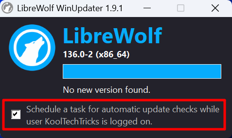
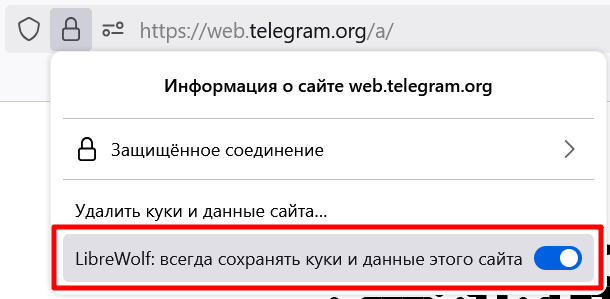
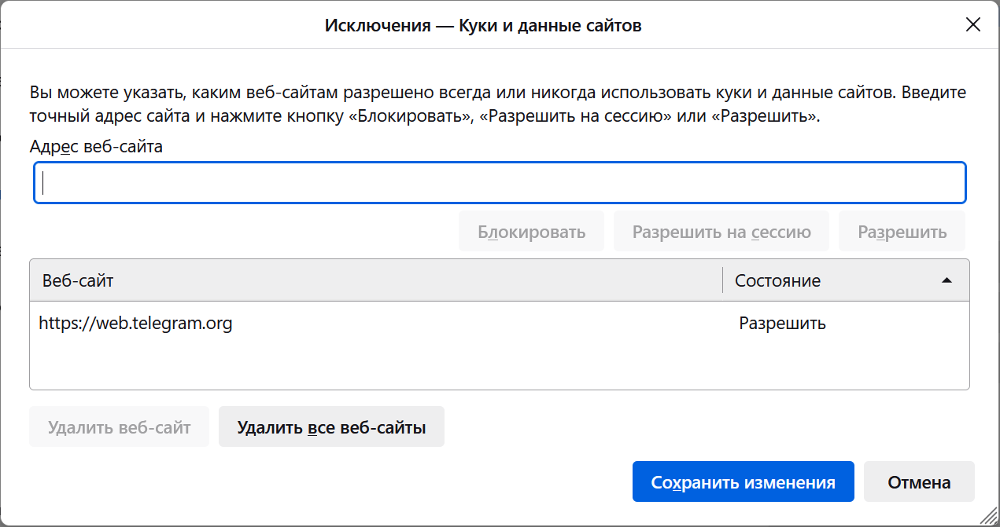

## Применение

LibreWolf можно описать как более чистую версию Firefox с настройками для
повышенной конфиденциальности по умолчанию:

- Удалена телеметрия Mozilla.
- Предустановлен uBlock Origin.
- Настройки по умолчанию снижают идентификацию (fingerprinting).
- Сохранён внешний вид и базовые функции Firefox, а также синхронизация через
службу Mozilla.
- Удалены функции искусственного интеллекта.

Похожего результата можно добиться и в обычной версии Firefox с помощью
конфигурации [arkenfox user.js]. Но это более трудоёмкая задача: в LibreWolf
подходящие настройки применены по умолчанию. Однако разработкой занимаются
энтузиасты, и иногда
[что-то может ломаться](https://codeberg.org/librewolf/issues/issues/2459).
Некоторые настройки могут доставлять неудобства и проблемы на сайтах, хотя их
[можно отключить](#менее-строгие-настройки).

Ни LibreWolf, ни arkenfox user.js не обеспечат максимальную защиту
конфиденциальности. Лучше использовать для этой задачи [Mullvad Browser] или
[Tor Browser].

[arkenfox user.js]: https://github.com/arkenfox/user.js
[Mullvad Browser]: https://mullvad.net/browser
[Tor Browser]: https://www.torproject.org

## Установка

Вы можете найти подробные инструкции для каждой платформы на
[официальном сайте](https://librewolf.net/installation).

### Windows

Проще всего установить LibreWolf для Windows через [Microsoft Store]. Эта версия
будет получать обновления автоматически, хотя они могут запаздывать.

[Microsoft Store]: https://apps.microsoft.com/store/detail/9NVN9SZ8KFD7

Установка классическим методом требует настройки автоматических обновлений:

1. Перейдите на [сайт](https://librewolf.net/installation/windows), скачайте и
запустите файл `librewolf-XXX-windows-x86_64-setup.exe`.

2. На этапе выбора компонентов (после первого нажатия «Next») поставьте галочку
**«LibreWolf WinUpdater»**.

3. После установки браузера найдите в поиске системы **«LibreWolf WinUpdater»**
и запустите его. Появится окно, где нужно поставить галочку
**«Schedule a task for automatic update checks while user is logged on»**. Это
запустит несколько скриптов в командной строке, которые создадут задачу в
планировщике задач. Когда в окне терминала появится
**«Done. Press any key to close this window.»**, его можно закрыть вместе с
программой WinUpdater.



Наличие обновлений для LibreWolf должно проверяться при запуске системы. Если
будет найдено, то появится уведомление.

### macOS

Установите LibreWolf для macOS, используя [Homebrew](https://brew.sh), так как
эта версия будет получать обновления автоматически:

```sh
brew install librewolf --no-quarantine
```

Иначе можно скачать файл `.dmg` с [сайта](https://librewolf.net/installation/macos),
но эту версию вам нужно обновлять вручную.

### Linux

Проще всего установить LibreWolf для Linux через [Flatpak]. Обратите внимание,
что эта версия будет находиться в песочнице, а некоторые взаимодействия с
системой будут ограничены.

Альтернативно можно установить через репозитории дистрибутива или [AppImage].

[Flatpak]: https://flathub.org/apps/io.gitlab.librewolf-community
[AppImage]: https://librewolf.net/installation/linux/#appimage

### Android

Разработчики не планируют выпускать LibreWolf для Android. В качестве
альтернативы рекомендуется использовать браузер [IronFox] со схожими целями.

[IronFox]: /collections/browsers-mobile#ironfox

## Менее строгие настройки

Возможно, вы бы хотели пользоваться LibreWolf на повседневной основе, но
раздражают некоторые настройки приватности? Если вы считаете их слишком
строгими, то можно отключить без весомого ущерба приватности.

> [!important]
> Изменение этих настроек приводят к снижению уровня конфиденциальности и
безопасности, поэтому изменяйте только в том случае, если это необходимо для
вашего удобства.

### Всегда светлая тема, часовой пояс UTC, ОС Windows, фиксированный размер окна при запуске

Это нужно для снижения идентификации с помощью определённых данных, отправляемых
на сайты. За это отвечает настройка **ResistFingerprinting**, которая делает ваш
браузер менее уникальным. На самом деле существует множество других данных, по
которым вас всё равно можно идентифицировать, поэтому отключение данной
настройки не приведёт к существенной потере конфиденциальности.

> Настройки браузера → LibreWolf (`about:preferences#librewolf`) → Отслеживание
→ Отключить «Препятствовать созданию отпечатков (ResistFingerprinting)»

### Сертификаты OCSP (SEC_ERROR_OCSP_SERVER_ERROR)

В LibreWolf Протокол состояния сетевого сертификата (OCSP) включён в режиме
принудительного отказа (hard-fail). Это означает, что если статус отзыва
сертификата не может быть проверен из-за невозможности связаться с центром
сертификации, то он будет считаться недействительным. Хотя это повышает
безопасность, это также может снизить удобство использования, поскольку серверы
OCSP часто выходят из строя.

Если вы столкнулись с этой ошибкой:
- Серверы OCSP обычно блокируются файлами хостов и списками блокировки по
ошибке, поэтому сначала проверьте свой брандмауэр и списки блокировки.
- OCSP не совместим с большинством прокси, так что это также следует учитывать.

Вы можете отключить OCSP hard-fail в настройках LibreWolf:

> Настройки браузера → LibreWolf (`about:preferences#librewolf`) → Безопасность
→ Отключить «Принудительная отмена подключения при ошибках OCSP»

### Синхронизация Firefox Sync

Пользуетесь синхронизацией Firefox через аккаунт Mozilla? Вы можете использовать
её точно так же и в LibreWolf:

> Настройки браузера → LibreWolf (`about:preferences#librewolf`) → Поведение
браузера → Включить «Синхронизация Firefox» и перезапустить браузер.

### WebGL

WebGL может понадобиться для видеоконференций.

> Настройки браузера → LibreWolf (`about:preferences#librewolf`) →
Fingerprinting → Включить «Использовать WebGL»

### Очистка cookie

По умолчанию LibreWolf после закрытия браузера очищает все cookie, то есть вам
придётся заново войти в аккаунты, как будто вы работаете в режиме инкогнито.

Вы можете добавлять сайты в исключения, чтобы их cookie не очищались. Нажмите на
значок замочка слева в адресной строке и активируйте переключатель
«LibreWolf: Всегда сохранять куки и данные этого сайта».



Чтобы посмотреть список разрешённых сайтов, у которых не будут очищаться cookie,
зайдите в настройки браузера и раздел «Приватность и защита»
(`about:preferences#privacy`). Ниже в разделе «Куки и данные сайтов» нажмите
«Управление исключениями...». Здесь можно редактировать список сайтов: разрешать
или блокировать cookie.



Если вам всё же неудобно вести этот белый список сайтов, то можете отключить
очистку cookie. В этом же разделе настроек уберите галочку с
«Удалять куки и данные сайтов при закрытии LibreWolf» и ниже с
«Удалять историю при закрытии LibreWolf».

## Вопросы

### Исходящие соединения

В LibreWolf удалена вся телеметрия Mozilla, но это не значит, что убраны все
исходящие соединения. Некоторые важны для корректной работы браузера. В
частности, обновление списков фильтров блокировщиков, сертификаты,
push-уведомления сайтов (push.services.mozilla.com).

Несмотря на это, LibreWolf по-прежнему стремится удалить все соединения,
нарушающие конфиденциальность, и свести все соединения к минимуму, необходимому
для обеспечения максимального баланса между конфиденциальностью и безопасностью.

## Файл конфигурации

Продвинутые пользователи могут создать файл конфигурации, чтобы переопределять
настройки по умолчанию автоматически. Этот файл формата JavaScript называется
`librewolf.overrides.cfg` и находится в папке данных LibreWolf (`.librewolf`).

Это похоже на файлы [user.js][arkenfox user.js], но задаётся глобально для
всех профилей. Готовые user.js обычно создаются для Firefox, и их слепое
применение для LibreWolf может привести к проблемам.

Ознакомьтесь с [документацией](https://librewolf.net/docs/settings), чтобы
узнать больше.
