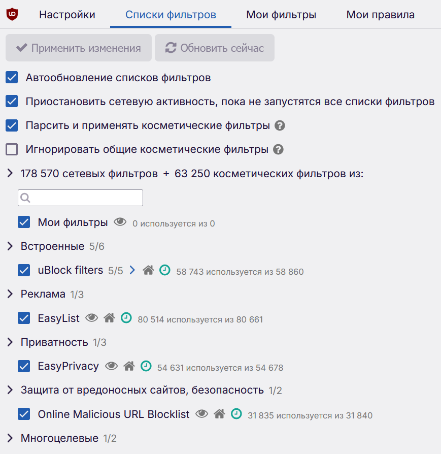
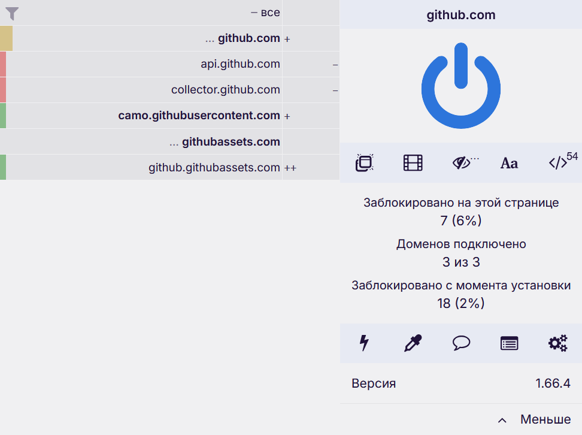
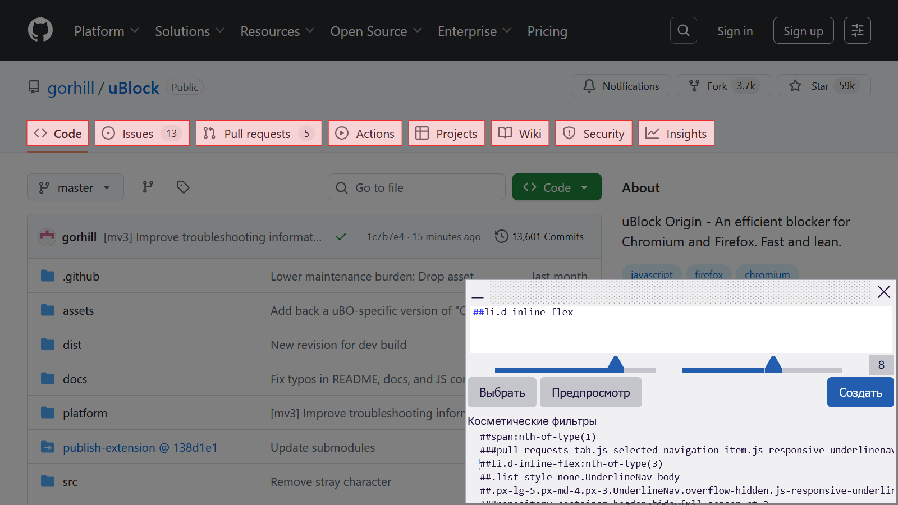
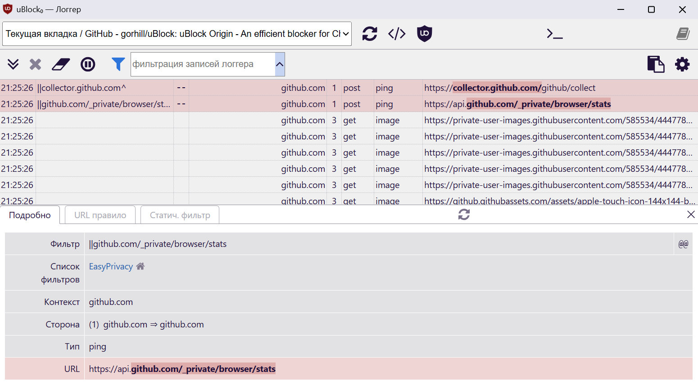
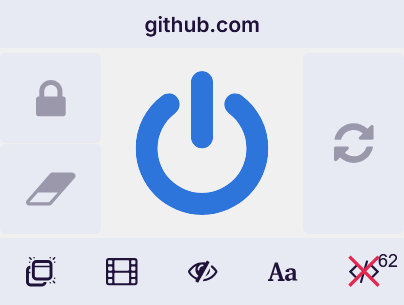

## Применение

Современные сайты часто наполнены лишними элементами. Всплывающие окна и реклама
отвлекают от чтения и раздражают, а невидимые скрипты отслеживают вашу
активность. Всё это замедляет загрузку страниц, нагружает устройство и
[расходует интернет-трафик]. Кроме того, существуют вредоносные сайты, куда
можно попасть через рекламные баннеры или случайно.

[расходует интернет-трафик]: https://t.me/kttrickster_pub/52

Блокировщики контента, такие как uBlock Origin, предназначены для фильтрации
нежелательного содержимого на сайтах. По умолчанию активно несколько списков
фильтров, содержащих адреса элементов для блокировки отслеживания, рекламы и
вирусов. Можно легко создавать и распространять собственные фильтры.

### Этичность

Блокировка нежелательного содержимого почти всегда включает в себя блокировку
рекламы. Таким образом владельцы сайтов, доход которых зависит от рекламы,
лишаются прибыли. Некоторые могут воспринимать это как [воровство] или
[нарушение авторских прав].

[воровство]: https://x.com/LeaVerou/status/518154828166725632
[нарушение авторских прав]: https://opennet.ru/63744

Что на этот счёт сказано в
[репозитории uBlock Origin](https://github.com/gorhill/uBlock#:~:text=It%20is%20important%20to%20note%20that%20using%20a%20blocker):

> Важно отметить, что использование блокировщика НЕ является кражей. Не
> поддавайтесь этой жуткой идее. Конечным логическим следствием
> `блокировки = кражи` является криминализация неотъемлемого права на
> неприкосновенность частной жизни.
>
> Реклама, "ненавязчивая" или нет, — это лишь видимая часть средств вторжения в
> частную жизнь, попадающих в ваш браузер при посещении большинства сайтов.
> Основная цель uBlock Origin — помочь пользователям нейтрализовать эти методы
> вторжения в частную жизнь таким образом, чтобы это было удобно для тех
> пользователей, кто не желает использовать более технические средства.

Согласно Этическим принципам сети
[Консорциума Всемирной паутины](https://www.w3.org):

> [2.12. Веб-страницы могут быть использованы любым удобным для пользователя способом.](https://www.w3.org/TR/ethical-web-principles/#render)
>
> Люди должны иметь возможность изменять веб-страницы в соответствии со своими
> потребностями. Например, люди должны иметь возможность устанавливать таблицы
> стилей, вспомогательные расширения для браузера и блокировщики нежелательного
> контента или скриптов. <...>

Вы всегда можете добавлять сайты в белый список, если не хотите блокировать
рекламу и доходы. Однако вы всё равно подвергаете свою конфиденциальность
опасности. Лучше финансово поддерживать любимых авторов напрямую.

## Установка

### Расширение

uBlock Origin работает [лучше] в браузерах на основе Firefox. Установите
расширение из [каталога Mozilla] для компьютера и Android.

В большинстве браузеров на основе [Chromium] работа uBlock Origin может
[ограничиваться] в связи с переходом платформы расширений на Manifest V3. Тем не
менее расширение всё ещё доступно для скачивания из каталогов [Chrome] и [Edge].
Некоторые браузеры основаны на модифицированном Chromium, и поддержка
Manifest V2 в них сохраняется.

Для Chromium-браузеров, в которых расширения Manifest V2 больше не
поддерживаются, нужно использовать [uBlock Origin Lite]. Это облегчённая версия
на основе Manifest V3, которая имеет свои преимущества и недостатки.

> [!important]
> Не забудьте разрешить работу в приватных окнах (режим Инкогнито) для
uBlock Origin.
>
> [Не используйте](https://x.com/gorhill/status/1033706103782170625) другие
похожие расширения для блокировки контента вместе с uBlock Origin: это может
потреблять больше ресурсов, снижать скорость загрузки страниц и нарушать работу
механизмов по предотвращению поломок сайтов и обнаружения.

[лучше]: https://github.com/gorhill/uBlock/wiki/uBlock-Origin-works-best-on-Firefox
[каталога Mozilla]: https://addons.mozilla.org/addon/ublock-origin
[Chromium]: /wiki/browser-engines/#chromium--blink
[ограничиваться]: https://github.com/uBlockOrigin/uBlock-issues/wiki/About-Google-Chrome's-%22This-extension-may-soon-no-longer-be-supported%22
[Chrome]: https://chromewebstore.google.com/detail/cjpalhdlnbpafiamejdnhcphjbkeiagm
[Edge]: https://microsoftedge.microsoft.com/addons/detail/ublock-origin/odfafepnkmbhccpbejgmiehpchacaeak
[uBlock Origin Lite]: /software/ublock-origin-lite

### Браузеры

В некоторых браузерах uBlock Origin предустановлен.

[LibreWolf] и [IronFox] основаны на Firefox, в uBlock Origin по умолчанию
активированы дополнительные фильтры.

[Helium] основан на Chromium, но сохраняет поддержку Manifest V2 и обеспечивает
[собственную поставку uBlock Origin](https://github.com/imputnet/ublock-origin-crx).

В [Brave] (для компьютеров и мобильных устройств) встроен собственный
блокировщик контента. Со своей задачей он справляется не хуже uBlock Origin,
поэтому устанавливать его не нужно.

[LibreWolf]: /software/librewolf
[IronFox]: /collections/browsers-mobile#ironfox
[Helium]: https://helium.computer
[Brave]: /collections/browsers-desktop#brave

## Конфигурация

uBlock Origin по умолчанию достаточно хорошо защищает от вредоносного и
навязчивого контента в интернете без серьёзных поломок сайтов. Однако вы можете
изменить конфигурацию, чтобы усилить защиту.

### Списки фильтров

uBlock Origin блокирует элементы согласно [спискам фильтров], которые
поддерживаются волонтёрами. Обновления списков производятся автоматически в
фоне. При запуске браузера это создаёт множество сетевых запросов на сайты, где
расположены списки.

[спискам фильтров]: https://github.com/gorhill/uBlock/wiki/Dashboard:-Filter-lists

Рекомендации по спискам фильтров:

- Не активируйте слишком много фильтров: это может понизить производительность и
повысить вероятность поломки сайтов. Дублированные строки в списках убираются.

- **Используйте необходимые вам региональные фильтры.** Если вы посещаете
русскоязычные сайты, то убедитесь, что включён **RU AdList**. Дополнительно
можно включить фильтр Counters для блокировки счётчиков, параметров отслеживания
и прочего.

- Вы можете подписываться на другие фильтры: добавьте ссылки на них в поле
импорта и примените изменения. uBlock Origin будет периодически обновлять
списки по ссылкам.

- Для очистки параметров отслеживания из ссылок включите
**AdGuard URL Tracking Protection** и импортируйте
[Actually Legitimate URL Shortener Tool](https://raw.githubusercontent.com/DandelionSprout/adfilt/master/LegitimateURLShortener.txt).

- Фильтры уведомлений о файлах куки лишь скрывают их, но не устанавливают
необходимые параметры для отключения сбора данных.

### Резервное копирование

Если в вашей конфигурации используется много нестандартных фильтров, правил и
настроек, то следует делать [резервные копии].

uBlock Origin имеет [поддержку облачного хранилища] через аккаунт вашего
браузера. Но это скорее не резервное копирование, а своеобразный буфер обмена.
Синхронизация с облаком осуществляется только вручную.

[резервные копии]: https://github.com/gorhill/uBlock/wiki/Dashboard:-Settings#backuprestore-section
[поддержку облачного хранилища]: https://github.com/gorhill/uBlock/wiki/Cloud-storage

## Использование

На этой странице предоставлена краткая ознакомительная информация с основными
функциями uBlock Origin. Для подробной информации по использованию читайте
[официальную документацию](https://github.com/gorhill/uBlock/wiki).

### Меню

[Меню uBlock Origin] (по нажатии на значок расширения) содержит информацию о
заблокированных элементах и быстрые действия. Отсюда можно использовать почти
любую функцию расширения. Меню можно раскрыть, чтобы показать больше
инструментов и информации.

[Меню uBlock Origin]: https://github.com/gorhill/uBlock/wiki/Quick-guide:-popup-user-interface

- **Большая кнопка "питания"** позволяет отключить uBlock Origin для текущего
сайта. Это состояние будет запомнено и добавлено в список доверенных сайтов.
Если нажать с зажатым `Ctrl`/`Cmd`, то будет отключено для текущей страницы,
а не всего сайта.

- **Список подключённых доменов** показывается при полностью раскрытом меню и
даёт информацию о том, как много было заблокировано и разрешено.

### Удаление элементов

Вы можете быстро удалять любые элементы на сайтах. Для этого есть два
инструмента в [меню uBlock Origin](#меню):

- [Молния] убирает элементы с текущей страницы и пытается восстановить
возможность прокручивания (в случаях когда она была отключена). После
перезагрузки убранные элементы восстанавливаются. Это простой аналог удалению
элементов через инструменты разработчика.

- [Пипетка] создаёт постоянный фильтр. Когда вы выбираете элемент, появляется
окно, в котором можно отрегулировать выбор. Здесь важно правильно подобрать
значения так, чтобы скрылись желаемые элементы. Созданные таким образом фильтры
появляются во вкладке «Мои фильтры» в настройках.

[Молния]: https://github.com/gorhill/uBlock/wiki/Element-zapper
[Пипетка]: https://github.com/gorhill/uBlock/wiki/Element-picker

### Логгер

[Логгер] позволяет проверять, что uBlock Origin делает с сетевыми запросами и
элементами страницы: заблокировано ли что-то, разрешено или перенаправлено, и
какой фильтр был применён.

Логгер можно открыть через [меню расширения](#меню), и для появления данных
нужно перезагрузить страницу.

Логгер больше предназначен для продвинутых пользователей. Отсюда можно
отлаживать работу фильтров и создавать свои.

[Логгер]: https://github.com/gorhill/uBlock/wiki/The-logger

### Блокировка JavaScript

В раскрытом [меню расширения](#меню) доступны [переключатели для каждого сайта].
Здесь можно быстро отключить JavaScript для текущего сайта (последняя кнопка).
Изменения будут временными. Чтобы сделать их постоянными, нажмите на появившийся
значок замочка. Вы можете отключить JavaScript глобально в настройках
uBlock Origin, тогда эта кнопка будет включать JavaScript.

uBlock Origin имитирует отключение JavaScript: блокирует загрузку и заменяет
элементы `<noscript>`. В редких случаях на этой почве могут возникать проблемы.

[переключатели для каждого сайта]: https://github.com/gorhill/uBlock/wiki/Per-site-switches

### Продвинутый режим

Продвинутые пользователи, которые имеют возможность ознакомиться с
[полной документацией uBlock Origin], могут включить [продвинутый режим]
и использовать [динамическую фильтрацию].

[полной документацией uBlock Origin]: https://github.com/gorhill/uBlock/wiki
[продвинутый режим]: https://github.com/gorhill/uBlock/wiki/Advanced-user-features
[динамическую фильтрацию]: https://github.com/gorhill/uBlock/wiki/Dynamic-filtering

## Исправление проблем

Если сайт отображается некорректно или не работает вовсе, то это может быть
вызвано многими факторами, поэтому для начала попробуйте следующее:

- Отключите uBlock Origin.
- Откройте страницу в другом браузере.
- Отключите дополнительные фильтры.

В случае некорректной работы фильтров uBlock Origin (поломка сайта, обнаружение,
реклама, помехи) можно сообщить о проблеме. Волонтёры постараются решить её как
можно быстрее. Используйте соответствующую функцию в меню расширения
(значок чата). Для создания отчёта потребуется аккаунт на GitHub и немного
времени, чтобы убедиться в том, что нет дубликатов, и вы делаете правильные
действия.
