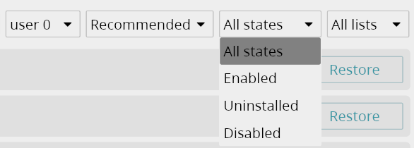

На этой странице говорится про [Universal Android Debloater Next Generation]
(UAD-ng) — активное продолжение [Universal Android Debloater от 0x192].
Оригинальный проект не получал обновлений с 2023 года, поэтому настоятельно не
рекомендуется им пользоваться.

[Universal Android Debloater Next Generation]: https://github.com/Universal-Debloater-Alliance/universal-android-debloater-next-generation
[Universal Android Debloater от 0x192]: https://github.com/0x192/universal-android-debloater

> [!caution]
> Используйте эту программу на свой страх и риск.

## Применение

Производители Android-устройств часто предустанавливают много ненужных
приложений. Это могут быть собственные, партнёрские или рекламные приложения,
которые занимают лишнее место, работают в фоне, собирают и отправляют данные
без вашего ведома. Часто их невозможно удалить штатными средствами Android.

Universal Android Debloater позволяет легко удалить любые предустановленные
приложения без root-прав, что улучшит приватность, безопасность и срок службы
батареи. Внутри программы содержатся описания каждого приложения и степень
безопасности их удаления.

## Устройство

Universal Android Debloater использует Android Debug Bridge (ADB) для управления
приложениями. ADB — это инструмент командной строки для отладки устройств
Android.

Приложения удаляются из раздела `/data`, который является пользовательским
пространством. Это предотвращает их загрузку в память после запуска устройства.

Приложения **не** удаляются из раздела `/system`. Это системный раздел, который
находится в режиме чтения. Только производитель может записывать туда что-либо
через обновления ПО.

Следовательно, удалённые приложения вернутся после сброса до заводских настроек
или обновления ПО. Благодаря этой особенности вы не сможете окирпичить телефон,
но в то же время вы сможете избавиться от приложений, которые могли бы
загружаться при запуске системы.

Тем не менее при бездумном удалении приложений возможно войти в состояние
бесконечной перезагрузки (boot loop), из-за чего вам придётся сбрасывать
телефон до заводских настроек.

> **Смотрите также:**
> [Universal Android Debloater FAQ](https://github.com/Universal-Debloater-Alliance/universal-android-debloater-next-generation/wiki/FAQ#how-is-it-possible-to-delete-a-system-package-without-root-permission).

## Установка

> **Основная статья:** [Getting started] — UAD Next Generation Wiki

Universal Android Debloater Next Generation доступен для Windows, macOS и Linux.
Перед началом ознакомьтесь с информацией на этой странице или в [FAQ] и
убедитесь, что у вас есть актуальная и рабочая резервная копия всех важных
данных на вашем телефоне.

[Getting started]: https://github.com/Universal-Debloater-Alliance/universal-android-debloater-next-generation/wiki/Getting-started
[FAQ]: https://github.com/Universal-Debloater-Alliance/universal-android-debloater-next-generation/wiki/FAQ

Включите параметры разработчика в настройках Android: для этого нажмите
несколько раз на номер сборки в разделе информации о ПО. В параметрах
разработчика нужно включить [отладку по USB].

[отладку по USB]: https://developer.android.com/tools/adb#Enabling

Рекомендуется выйти из учётной записи вашего производителя (Samsung Account,
Xiaomi Account, Huawei ID и т.д.), потому что удаление приложений производителя
может привести к блокировке телефона из-за потери возможности идентификации
пользователя.

Установите ADB: инструкция на сайте
[Android](https://developer.android.com/tools/releases/platform-tools#downloads)
и [XDA Developers](https://www.xda-developers.com/install-adb-windows-macos-linux/#how-to-set-up-adb-on-your-computer).

Скачайте последнюю версию Universal Android Debloater Next Generation с
[GitHub](https://github.com/Universal-Debloater-Alliance/universal-android-debloater/releases/latest):
- [Windows](https://github.com/Universal-Debloater-Alliance/universal-android-debloater-next-generation/releases/latest/download/uad-ng-windows.exe)
- [macOS](https://github.com/Universal-Debloater-Alliance/universal-android-debloater-next-generation/releases/latest/download/uad-ng-macos)
- [Linux](https://github.com/Universal-Debloater-Alliance/universal-android-debloater-next-generation/releases/latest/download/uad-ng-linux)

## Использование

> [!caution]
> Перед тем, как использовать Universal Android Debloater, вы должны убедиться,
что у вас есть актуальная и рабочая резервная копия всех важных данных на вашем
телефоне. Удаление системных приложений может привести к сбоям и вечной
перезагрузке устройства (boot loop), из-за чего может потребоваться сброс до
заводских настроек.
>
> Используйте эту программу на свой страх и риск.

### Запуск

Подключите телефон к компьютеру через USB. Запустите программу Universal Android
Debloater (UAD). На телефоне должен появится запрос на отладку по USB, разрешите
её. Возможно, потребуется обновить список приложений в UAD или перезапустить
программу.

### Список приложений

По умолчанию показываются только установленные и **включённые** приложения.
Если вы до этого отключали какие-либо приложения через интерфейс Android, то они
не будут отображаться в списке UAD. Если вы не можете их найти, установите
фильтр **«All states»** (Все пакеты).

Степени безопасности удаления приложений:

- **Recommended** (Рекомендованные) — бессмысленные или откровенно негативные
пакеты, а также приложения, которые можно скачать из Google Play (Gmail,
Google Maps, YouTube и др.[^1]).

- **Advanced** (Продвинутые) — нарушают неясные или незначительные части
функциональности, или приложения, которые не так просто включить/установить
через настройки/Google Play. Эта категория также используется для приложений,
которые полезны (клавиатура по умолчанию/галерея/домашний экран/музыкальное
приложение), но могут быть легко заменены лучшей альтернативой.

- **Expert** (Экспертные) — нарушают широко распространенную и/или важную
функциональность, но не имеют значения для базовой работы операционной системы.
Удаление таких приложений не должно привести к вечной перезагрузке устройства
(если это не указано в описании), но это не гарантировано на 100%.

- **Unsafe** (Небезопасные) — могут нарушить работу жизненно важных частей
операционной системы. При удалении таких приложений очень высок риск вечной
перезагрузки устройства.

По умолчанию установлен фильтр **«Recommended»**. Следует начать с удаления этих
приложений.

Поиск осуществляется только по идентификаторам пакетов вида `com.example.app`.
При нажатии на строку внизу появляется описание на английском языке.
[Его нельзя скопировать, а также перейти по ссылкам]. По этим причинам удобнее
смотреть список приложений в файле [uad_lists.json] в репозитории проекта.

[Его нельзя скопировать, а также перейти по ссылкам]: https://github.com/Universal-Debloater-Alliance/universal-android-debloater-next-generation/issues/49
[uad_lists.json]: https://github.com/Universal-Debloater-Alliance/universal-android-debloater-next-generation/blob/main/resources/assets/uad_lists.json

### Резервная копия

Перед тем, как удалять приложения, следует сделать резервную копию текущего
состояния устройства. Для этого зайдите в настройки UAD и внизу нажмите на
кнопку **«Backup»**. Это сохранит список текущих установленных и удалённых
приложений. В случае возникновения проблем вы сможете восстановить приложения
(**«Restore»**), но это не всегда помогает.

**Эта функция не сохраняет данные на вашем телефоне, сделайте это отдельно!**

### Удаление

Найдите приложение, которое хотите удалить. Внимательно прочитайте описание.
Вы можете нажать кнопку **«Uninstall»**, чтобы сразу избавиться от него, или
выбрать и удалить несколько приложений одновременно.

Для начала не рекомендуется массово удалять приложения, чтобы было проще
определять и решать проблемы.

### Отключение

Иногда полезно не удалять приложения, а отключать их. Для этого в настройках UAD
есть параметр **«Clear and disable packages instead of uninstalling them»**
(Очищать и отключать пакеты вместо их удаления). После его активации вместо
кнопок «Uninstall» (Удалить) будут кнопки «Disable» (Отключить).

### Восстановление

Удалённые и отключённые приложения можно восстанавливать нажатием на кнопку
«Restore» (Восстановить). По умолчанию такие приложения скрыты, выберите фильтр
**«All states»** (Все состояния), чтобы показать их.

## Исправление проблем

Если вы делали [резервную копию](#резервная-копия), то вы сможете легко
восстановить состояние устройства. Однако это не всегда помогает.

### Различные проблемы после удаления нескольких приложений

Попробуйте выполнить [двоичный поиск]:

1. Восстановите половину приложений, которые вы недавно удалили.
    - Если проблема сохраняется, восстановите другую половину и (опционально)
    удалите снова текущую половину.
    - Если проблема устранена, повторно удалите половину приложений из той
    половины, которую вы только что восстановили (четверть от общего числа).
2. Повторяйте, пока не найдёте нужное приложение.

У этого метода есть некоторые предостережения:

- Если проблема вызвана зависимостью нескольких приложений, будет трудно найти,
какие из них следует восстановить, поскольку выбор может быть не отсортирован.

- В худшем случае может быть несколько уровней зависимостей: несколько
приложений отвечают за одну и ту же функцию, и каждое приложение имеет несколько
рекурсивных зависимостей.

Вы можете попробовать линейный поиск после двоичного. Таким образом, вы можете
сузить набор пакетов до небольшой группы, а затем удалять/восстанавливать по
одному, пока не найдёте наименьший набор.

[двоичный поиск]: https://ru.wikipedia.org/wiki/Двоичный_поиск

### Вечная перезагрузка

Вам придётся сбросить телефон до заводских настроек. Это удалит все ваши данные
на устройстве и восстановит удалённые системные приложения.

1. Зажмите кнопки питания и уменьшения громкости;
2. Дождитесь вибрацию;
3. Мгновенно (при вибрации), удерживайте клавишу увеличения громкости;
4. Выполните «очистку данных» (clear data).

[^1]: После повторного скачивания системных приложений из Google Play вы всё
равно не сможете удалить их без специальных инструментов (ADB/Universal Android
Debloater).
