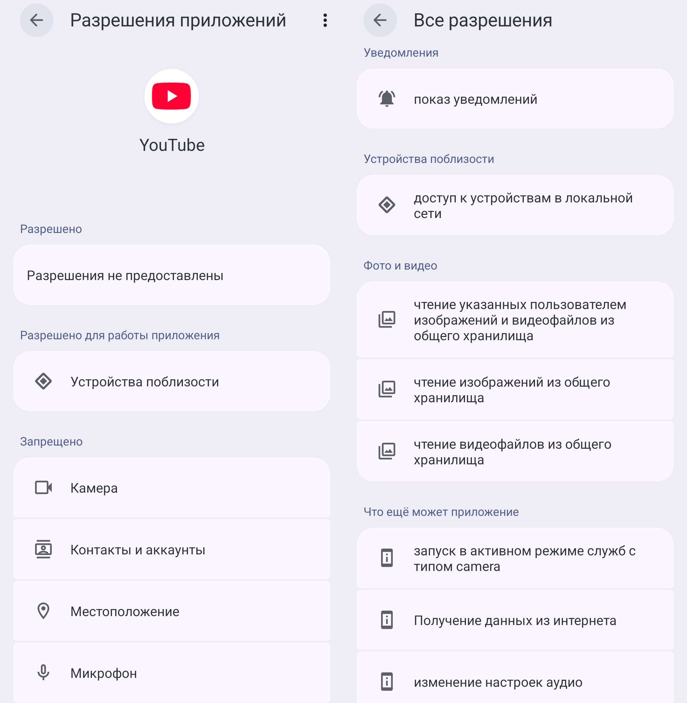
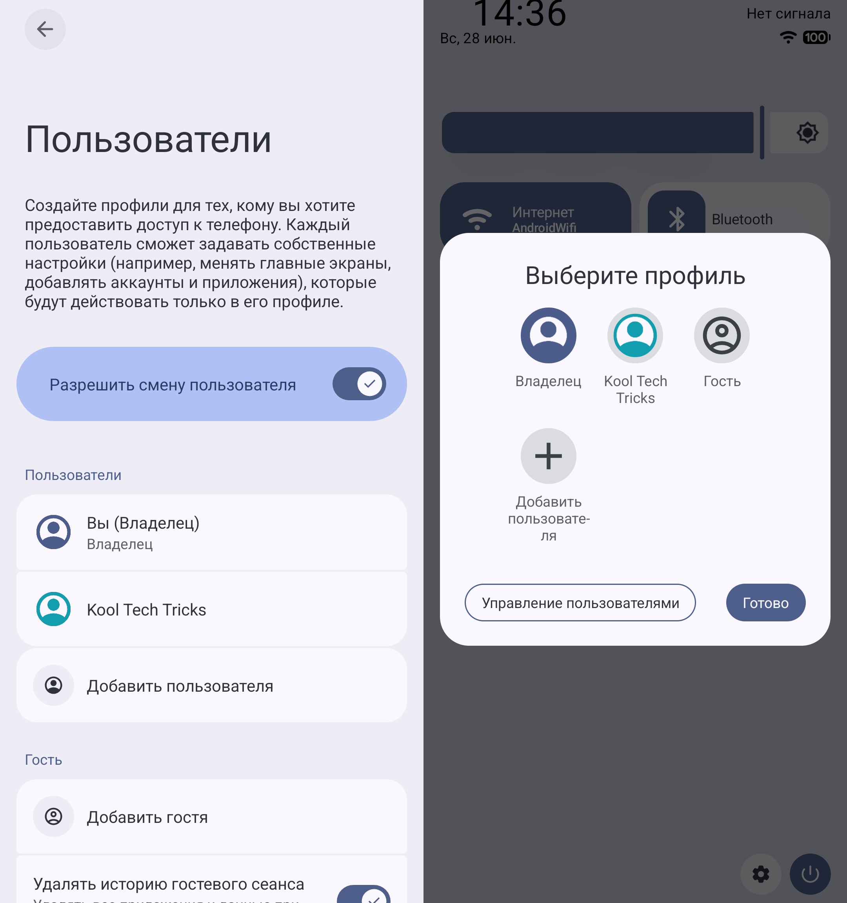

Как песочница приложений и система разрешений защищает ваши данные? Что такое
рабочий профиль, частное пространство и пользователи? Какие данные изолируются,
а какие остаются общедоступными?

<!--more-->

Мобильные устройства хранят большой объём чувствительных данных. В то же время
многие приложения потенциально могут собирать эти данные. Разработчики платформы
Android предусмотрели это при проектировании системы. Каждое приложение хранит
свои данные в своей [защищённой песочнице](#песочница-приложений), и не имеет
прямого доступа к другим приложениям. Доступ к пользовательским данным
осуществляется [разрешениями](#разрешения).

Тем не менее приложения всё ещё могут заполучить доступ к некоторым
чувствительным данным через скрытые разрешения или запросить доступ с "добрыми"
намерениями. Такие приложения можно поместить в отдельный изолированный профиль,
который не будет содержать ваших личных данных.

Но перед тем, как начать изолировать приложения в отдельных профилях, стоит
разобраться как устроена стандартная модель безопасности Android: какие
пользовательские данные изолируются, а какие — нет. Возможно, профили будут
излишними, а может и вовсе окажутся бесполезными.

> [!note]
> **Эта страница ориентирована на стандартную платформу Android.** Производители
устройств часто вносят серьёзные изменения в интерфейс, поэтому доступность
некоторых функций и порядок их управления может различаться в зависимости от
вашего варианта ОС Android. Тем не менее стандартная модель безопасности должна
соблюдаться, если вы **не** используете root, устаревшие версии или
непрофессиональные прошивки.

## Песочница приложений

Android изолирует каждое приложение в своих [песочницах]. Приложения хранят свои
внутренние данные в своём специально отведённом зашифрованном месте.
Пользователи и другие приложения не имеют прямого доступа к этим данным и не
могут прочитать или перезаписать их.

В целях предотвращения подмены функциональности третьими лицами, каждое
приложение [подписывается разработчиками]. Для этого необходим приватный ключ,
который должен храниться только у разработчика. Невозможно модифицировать и
собрать заново приложение с сохранением оригинальной подписи без приватного
ключа.

При первой установке приложения устанавливается доверие. Вы должны быть уверены,
что приложение получено из подлинного источника и не было подменено. Дальнейшие
обновления возможны только из пакетов, подписанных тем же самым ключом, что и
при первой установке.

Приложения различаются по идентификаторам пакета вида `com.example.appname`.
Даже если два установленных приложения выглядят одинаково, то у них отличаются
идентификаторы — Android считает приложения разными и изолирует друг от друга.

> [!caution]
> Выдача [root-прав](https://ru.wikipedia.org/wiki/Рутинг) значительно понижает
безопасность устройства и позволяет приложениям получать доступ к данным в обход
стандартной песочницы.

[песочницах]: https://source.android.com/docs/security/app-sandbox
[подписывается разработчиками]: https://source.android.com/docs/security/features/apksigning

## Разрешения

По умолчанию приложениям ограничен доступ к функциям устройства, операционной
системы и пользовательским данным. Для этого требуются отдельные [разрешения],
которые задаются разработчиками. Приложение **не может** воспользоваться
функциями, если соответствующие разрешения **не заданы** разработчиками или
**не выданы** пользователем.

Рекомендуется, чтобы приложения задавали минимально необходимое количество
разрешений. Однако часто популярные приложения с [раздутой функциональностью](https://ru.wikipedia.org/wiki/Раздутое_программное_обеспечение)
запрашивают слишком много разрешений. Не всегда со злыми намерениями, но нередко
оказывается плохим знаком: приложение *может* выполнять какие-либо нежелательные
действия без вашего ведома. Некоторые разрешения без проблем можно отозвать или
использовать одноразово, но иногда стоит поискать «чистые» альтернативы.

Наиболее опасным разрешением является **интернет**. Оно даёт возможность
обмениваться данными со внешними серверами или по локальной сети. Отсутствие
данного разрешения гарантирует, что приложение ничего не скачивает, обрабатывает
все данные локально, и они не покидают устройство без вашего ведома. Разрешение
на интернет необходимо для подавляющего большинства приложений, и в стандартном
Android его невозможно отозвать.

[разрешения]: https://developer.android.com/guide/topics/permissions/overview

### Управление разрешениями

В меню **«О приложении» → Разрешения** можно [посмотреть](https://support.google.com/android/answer/9431959?hl=ru)
все выдаваемые разрешения и отозвать их. Чтобы посмотреть все разрешения,
заданные разработчиком, нажмите **⋮ → Все разрешения**. Многие разрешения из
этого списка, такие как интернет и получение списка приложений (пакетов),
отозвать невозможно.

Есть особые разрешения, которые не перечислены здесь: отображение поверх других
приложений, VPN, специальные возможности, администратор устройства. Это даёт
повышенные привилегии, такие как просмотр интернет-трафика и экрана.

Очистка хранилища приложения отзывает все выданные разрешения. Начиная с
Android 11, разрешения у неиспользуемых приложений отзываются автоматически.

С обновлениями приложения список разрешений может изменяться без ведома
пользователя. Если им требуется согласие пользователя, то оно будет запрошено
при необходимости.

С каждой версией Android добавляются новые разрешения. Если приложение ещё не
было адаптировано под новую версию Android, то новые разрешения могут быть
выданы по умолчанию. Отзыв этих разрешений может привести к ошибкам.

## Профили

Профилем мы будем называть пространство, которое содержит пользовательские
данные.

В самой стандартной установке Android используется единственный личный профиль
владельца (Owner). Это по совместительству профиль администратора, откуда можно
управлять всеми настройками устройства.

Android позволяет создавать вторичные профили со своими пользовательскими
данными, которые не могут быть получены из другого профиля. Профили ничего не
меняют в стандартной модели безопасности Android. [Песочница приложений](#песочница-приложений)
и [разрешения](#разрешения) действуют по тем же правилам. Профили добавляют
логическую группировку и разделение пользовательских данных.

Есть три типа профилей: [рабочий профиль](#рабочий-профиль), [частное пространство](#частное-пространство)
и [пользователи](#пользователи). У них общая цель изоляции пользовательских
данных, но разное предназначение и реализация управления. В зависимости от ваших
нужд и удобства потребуется выбрать тот или иной тип профиля для изоляции.
Доступность типов профиля и их управление на вашем устройстве зависит от версии
Android и прошивки.

### Приложения в профилях

Каждый профиль содержит свой набор установленных приложений. Когда приложение
пытается получить список установленных пакетов, оно видит только то, что
установлено внутри текущего профиля.

Одно и то же приложение в разных профилях имеет своё хранилище данных, выданные
разрешения и настройки. Это даёт возможность, например, использовать разные
аккаунты в приложениях, которые не поддерживают несколько аккаунтов.

Версия приложения общая для всех профилей. Обновление приложения в одном профиле
обновит его во всех остальных. При этом во всех профилях видно
приложение-источник установки. Если приложение уже установлено в каком-либо
профиле, то не получится в другом профиле установить несовместимую версию того
же самого приложения (старая версия, другая подпись). Удаление приложения из
одного профиля оставит его экземпляры в других профилях нетронутыми. Экземпляры
приложений в разных профилях не занимают дополнительное место, кроме внутреннего
хранилища в каждом профиле.

### Сеть

Подключение к интернету (Wi-Fi, мобильные данные) и Bluetooth общее для всех
профилей.

Каждый профиль может иметь своё VPN-подключение. Для этого создаются виртуальные
сетевые интерфейсы, например, `tun0`, `tun1` и так далее. Список всех активных
сетевых интерфейсов доступен из любого профиля, но нельзя подключиться к ним.

Приложения с доступом к интернету могут запускать сервер на локальном адресе.
Например, локальный прокси-сервер с адресом `127.0.0.1` и портом `8080`. Другие
приложения с доступом к интернету могут подключиться к нему по этому адресу и
порту (даже если он изначально неизвестен, можно обнаружить сканированием) и
начать обмениваться данными друг с другом. Это происходит через сетевой
интерфейс **loopback**. Он общий для всех профилей и не изолируется. Приложения
в разных профилях не могут занять один и тот же порт. Приложение-сервер может
принимать подключения из других профилей, но начиная с Android 17 эти
подключения блокируются.

> [!tip]
> Отсутствие изоляции loopback может считаться уязвимостью, но бывает полезно
для передачи содержимого между профилями, так как штатными средствами это плохо
предусмотрено. Приложение [Inter Profile Sharing] выполняет эту задачу, но
начиная с Android 17 это больше невозможно.

[Inter Profile Sharing]: https://github.com/VentralDigital/InterProfileSharing#readme

### Файловая система

Каждый профиль имеет свою корневую директорию в файловой системе Android.
Для личного профиля это `/data/user/0/` (или `/storage/emulated/0/`), во
вторичных число отличается, например, `/data/user/10/`. В редких случаях
приложения не учитывают подобные случаи и всегда пытаются записывать в каталог
первичного профиля, что приводит к их неработоспособности во вторичных профилях.

### Телефония

Телефония работает по всей системе и независима от профилей. Звонки и SMS не
изолируются профилями, но можно запретить доступ к ним.

Контакты добавляются для каждого профиля отдельно. Они необязательно состоят
только из телефонного номера, это может быть электронная почта, адрес и прочее.

### Другие данные

В рамках профиля также изолируются аккаунты и уведомления. У профилей могут
быть заданы индивидуальные методы разблокировки, и они будут защищены
собственными ключами шифрования.

Информация об устройстве и системе остаётся общедоступной. Приложения могут
определить, что они запускаются во вторичном профиле.

### Рабочий профиль

Стандартным сценарием в организациях является использование определённых
приложений для работы и коммуникации, а также подключение к корпоративной
виртуальной частной сети (VPN). Сотрудники могут установить необходимые для
работы приложения на своё личное устройство. Но так организация не может
контролировать рабочий процесс. Совмещение личного и рабочего пространства
вызывает неудобства и риск утечки информации. Поэтому чаще всего сотрудникам
выдают отдельные устройства для работы.

В Android существует [рабочий профиль], который позволяет отделить рабочее
пространство от личного. Системные администраторы предоставляют инструкции по
его настройке на устройствах сотрудников. Организация [управляет](https://support.google.com/work/android/answer/7502354?hl=ru)
рабочим профилем и данными внутри него через специальное приложение, которое
выступает в качестве менеджера рабочего профиля.

Приложение-менеджер не может прочитать внутреннее хранилище приложений в
рабочем профиле, но может очистить его. Менеджер устанавливается в личный
профиль, и если у него заданы разрешения на чтение списка приложений и интернет,
то может отправить список личных приложений на внешний сервер. Вы должны
доверять приложению, которое управляет рабочим профилем.

[рабочий профиль]: https://www.android.com/enterprise/work-profile

#### Shelter

Хотя рабочий профиль ориентирован на использование в организациях, этой функцией
может воспользоваться любой желающий для того, чтобы создать изолированное
пространство для определённых приложений.

[Shelter] является простым менеджером рабочего профиля. Оно с [открытым исходным кодом](https://gitea.angry.im/PeterCxy/Shelter)
и не имеет доступа к интернету. Реализует дополнительные функции для управления
приложениями в рабочем профиле: клонирование, заморозка отдельных приложений,
установка APK.

[Insular] — более продвинутое приложение с расширенными возможностями.
Для большинства пользователей рекомендуется использовать Shelter.

[Shelter]: https://f-droid.org/packages/net.typeblog.shelter
[Insular]: https://f-droid.org/packages/com.oasisfeng.island.fdroid

#### Управление рабочим профилем

Оболочка Android позволяет [управлять](https://learn.microsoft.com/ru-ru/intune/user-help/enrollment/work-profile-android)
состоянием рабочего профиля, не взаимодействуя с приложением-менеджером.

Приложения в рабочем профиле находятся либо в отдельной вкладке в меню
приложений, либо в папке на домашнем экране. У иконок рабочих приложений есть
значок портфеля. Также он отображается в панели состояния или в углу экрана,
пока приложение открыто.

Рабочий профиль вместе со всеми его приложениями можно [приостановить](https://support.google.com/work/android/answer/7029561?hl=ru)
через кнопку в меню или плитку быстрого действия. Также можно настроить
расписание активности рабочих приложений.

В меню «Поделиться» можно переключиться на вкладку рабочего профиля и отправить
содержимое в этот профиль, и наоборот. Некоторые личные приложения можно
[связать с рабочими](https://support.google.com/work/android/answer/10064639?hl=ru).

В настройках уведомлений можно [скрыть](https://support.google.com/work/android/answer/7029165?hl=ru)
содержимое уведомлений из рабочего профиля на заблокированном экране.

В настройках конфиденциальности можно установить [отдельный метод разблокировки](https://support.google.com/work/android/answer/7029958?hl=ru)
рабочего профиля.

В настройках аккаунтов можно удалить рабочий профиль и все данные внутри него.
Это нужно сделать, если вы переустанавливаете приложение-менеджер рабочего
профиля, иначе оно не сможет связаться с рабочим профилем и управлять им.

### Частное пространство

В Android 15 добавлен новый тип профиля — [частное пространство]. Частное
пространство похоже на рабочий профиль, но предназначено для скрытия
чувствительных данных от посторонних глаз. Для него не требуется отдельное
приложение-менеджер, и оно проще устроено, отчего рекомендуется к использованию
вместо рабочего профиля, хотя есть дополнительные ограничения.

[Создать частное пространство](https://support.google.com/android/answer/15341885?hl=ru)
можно в настройках конфиденциальности устройства. Вы можете задать отдельный
метод разблокировки или оставить тот же.

В меню приложений появится частное пространство (если ваш лаунчер его
поддерживает), для доступа к которому нужно использовать заданный метод
разблокировки. По умолчанию частное пространство блокируется вместе с экраном,
но можно изменить поведение в его настройках. Там же можно скрыть частное
пространство, чтобы оно появлялось только в поиске приложений. Это очевидное
сокрытие, есть множество других способов определить наличие частного
пространства.

Вы можете копировать и перемещать файлы из личного пространства в частное, а
также пользоваться меню «Поделиться» для передачи содержимого между ними.

Как и в рабочем профиле, приложения из частного пространства обозначены
специальным значком, но вместо портфеля — ключ и щит.

В отличие от рабочего профиля, в частном пространстве вы не можете:
- добавлять приложения, ярлыки и виджеты на домашний экран;
- приостанавливать работу отдельных приложений;
- добавлять приложения в качестве метода оплаты (кошелька) по умолчанию.

Удалить частное пространство и все данные внутри него можно двумя способами:
- Настройки → Защита и конфиденциальность → Частное пространство → Удалить
частное пространство.
- Настройки → Система → Сброс настроек → Удалить частное пространство.

[частное пространство]: https://source.android.com/docs/security/features/private-space

### Пользователи

Android [поддерживает](https://source.android.com/docs/devices/admin/multi-user)
несколько пользователей на одном устройстве подобно настольным операционным
системам. Однако это не востребовано на мобильных устройствах, поэтому на
большинстве прошивок данная возможность отсутствует.

Это наиболее строгий способ изоляции. У каждого пользователя свой домашний
экран и метод разблокировки, видно только свои уведомления и недавние
приложения. Невозможно поделиться содержимым с другим пользователем через меню
«Поделиться» или прочими штатными средствами. Вторичные пользователи не могут
иметь свой рабочий профиль и частное пространство.

[Управление пользователями](https://support.google.com/android/answer/2865483?hl=ru)
из шторки быстрых действий или: Настройки → Система → Пользователи. Всего может
быть 3 пользователя и 1 гость. Можно запретить пользователям звонки и SMS.
Гостевой сеанс по умолчанию не сохраняет данные после выхода из него.

После входа в пользователя он будет работать в фоне. Штатными средствами нельзя
завершить сеанс пользователя. Пользователь-владелец всегда активен, без него
нельзя запускать другие профили.

## Стоит ли изолировать?

[Стандартной песочницы Android](#песочница-приложений) достаточно, чтобы
содержать ваши чувствительные данные в безопасности. Но в некоторых случаях всё
же полезно помещать в отдельные изолированные профили:
- приложения, которые запрашивают лишние разрешения и собирают личные данные;
- приложения, не поддерживающие несколько аккаунтов;
- приложения, которые нужно скрыть от посторонних глаз.

Изоляция приложений в профилях ограничит им доступ к списку приложений, файлам,
контактам и коммуникацию между некоторыми другими приложениями и сервисами.
В некоторых случаях можно приостанавливать работу приложений или всего профиля.

Частное пространство и рабочий профиль удобнее тем, что можно одновременно
использовать личные и приватные приложения, а также проще обмениваться
содержимым между профилями. Пользователи представляют более строгую изоляцию,
но доступны не на всех устройствах. Частное пространство проще и удобнее
рабочего профиля, но доступно с Android 15 и имеет свои ограничения.

> [!tip]
> Наилучший способ изолировать приложение от пользовательских данных на
устройстве (кроме переноса на отдельное устройство) — использовать эквивалентные
им веб-приложения в браузере. Браузеры представляют свою песочницу, которая
изолирует сайты друг от друга. Через браузер труднее получить доступ к данным
на устройстве, хотя всё ещё можно [найти дыры](https://habr.com/ru/articles/915732).
