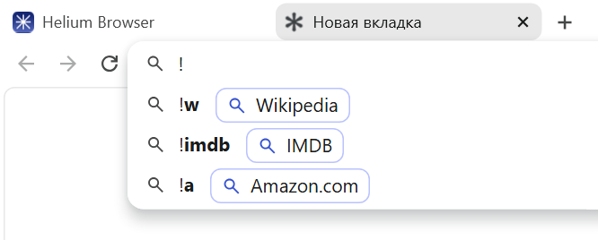
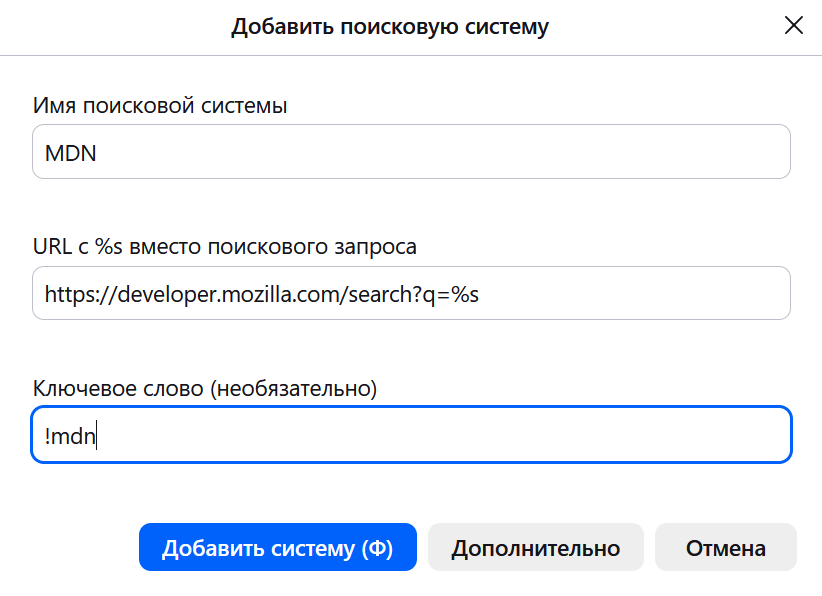

Сокращения для быстрого перенаправления поискового запроса сразу на нужный сайт.
Узнайте, как пользоваться этой возможностью в различных поисковых системах и
браузерах.

<!--more-->

Bangs позволяют перенаправить поисковый запрос сразу на нужный сайт.
К примеру, чтобы искать в Википедии, добавьте `!w` к запросу,
в YouTube — `!yt` и так далее для тысячи сайтов.

Например, если вы введёте запрос `!вики информационный пузырь`, то он сразу
откроется в Википедии. Не нужно искать конкретный сайт в поисковой выдаче или
открывать страницу поиска на нём. Это значительно сокращает время получения
нужного вам результата.

Изначально Bangs появились в [DuckDuckGo](/collections/search-engines#duckduckgo),
затем были добавлены в некоторые другие поисковые системы и браузеры. Однако
несмотря на полезность данной функции, она всё ещё довольно редкая.

На этой странице предпринимается попытка популяризации Bangs, а также справка
по использованию в различных поисковых системах и браузерах.

## История

Bangs впервые появились в [DuckDuckGo](https://web.archive.org/web/20100923234226/https://duckduckgo.com/bang.html)
в 2008 году. Название происходит от [shebang](https://ru.wikipedia.org/wiki/Шебанг_(Unix))
— специальная строка в текстовых файлах, которая при исполнении запускала
программу с данным файлом. Bangs имеют похожее назначение — открывать другой
сайт с текущим запросом.

Bangs не является каким-либо общим стандартом, но под таким названием
встречаются похожие реализации в других системах. Иногда может называться
"Сокращения (Shortcuts)", "Быстрые команды" и прочее.

В 2024 году Kagi начали поддерживать [открытый репозиторий со списком Bangs].

[открытый репозиторий со списком Bangs]: https://github.com/kagisearch/bangs

## Поисковые системы

Bangs полноценно поддерживаются в [DuckDuckGo](https://duckduckgo.com/bangs),
[Kagi](https://help.kagi.com/kagi/features/bangs.html), [Brave Search](https://search.brave.com/bangs)
и [SearXNG](https://docs.searxng.org/user/search-syntax.html#bang-external-bangs) (`!!`).
Другие поисковые системы могут частично реализовывать поддержку Bangs или
добавлять внутренние ключевые слова (например, для поиска картинок). Смотрите
поддержку Bangs в [таблице сравнения поисковых систем](/tables/search-engines).

Другие реализации Bangs могут брать список ключевых слов из этих поисковых
систем. Kagi поддерживает [открытый репозиторий со списком Bangs].
Список Bangs в DuckDuckGo доступен как [файл](https://duckduckgo.com/bang.js),
предложения принимаются на [отдельной странице](https://duckduckgo.com/newbang).

Иногда можно оставить восклицательный знак без ключевых слов, чтобы сразу
открыть первый результат поисковой выдачи, аналогично кнопке «Мне повезёт» в
Google.

В Kagi есть похожая на Bangs функция под названием [Snaps](https://help.kagi.com/kagi/features/snaps.html).
Она вызывается символом `@`, и ограничивает поисковую выдачу указанным сайтом
внутри Kagi. Это то же самое, что и `site:example.com`.

## Браузеры

Вы можете настроить работу Bangs в своём браузере, чтобы обрабатывать запросы
локально, минуя поисковую систему.

### Встроенная поддержка

[Браузер Helium](/collections/browsers-desktop#helium) имеет встроенную поддержку
Bangs. Предложения сайтов отображаются в адресной строке.

Список Bangs предоставляется Kagi и загружается через сервисы Helium. Убедитесь,
что загрузка списка Bangs включена: **Конфиденциальность и безопасность →
Сервисы Helium → «Разрешить загрузку списка !бэнгов»**.

Если поисковые предложения отключены, то вы будете видеть только текущий
совпадающий сайт.

### Расширение

[Yang!](https://github.com/dmlls/yang#readme) добавляет Bangs ко всем известным
поисковым системам. Оно доступно для [Firefox](https://addons.mozilla.org/addon/yang-addon)
и [Chromium](https://chromewebstore.google.com/detail/yang-yet-another-bangs-an/ecboojkidbdghfhifefbpdkdollfhicb).
Поддерживается в мобильных версиях браузеров.

Расширение считывает URL из заранее заданных адресов поисковых систем. Оно не
будет работать с непопулярными поисковыми системами и любыми серверами [SearXNG](/collections/search-engines#searxng)
и [4get](/collections/search-engines#4get).

Во время поиска не отображаются предложения Bangs. Если вы не знаете точного
ключевого слова для сайта, то придётся его угадывать.

В настройках расширения можно добавлять свои Bangs и сменить поставщика
(по умолчанию Kagi).

### Добавить вручную

В браузерах для компьютера на основе Firefox и Chromium, а также [Orion](/collections/browsers-desktop#orion),
можно добавлять любые сайты как поисковые системы и назначать им ключевое слово.
Это работает аналогично Bangs, и так можно задавать любое сочетание символов, а
не только восклицательный знак. Однако вам придётся добавлять сайты вручную, и
нет встроенной возможности импорта списка.

Мобильные версии Firefox и некоторых Chromium-браузеров позволяют добавлять
сайты как поисковые системы аналогичным образом, но выбирать их нужно из
интерфейса, а не вводом ключевых слов.

Вы можете найти эту возможность в настройках поиска браузера:
- **Firefox:** Настройки → Поиск → Значки поисковых систем → Добавить.
- **Chromium:** Настройки → Поисковая система → Управление поисковыми системами
и поиском по сайту → Поиск по сайту → Добавить.
- **Orion:** Параметры → Поиск → Управление поисковыми системами → `+`.

Заполните поля:
- **Имя:** Отображаемое название при поиске в адресной строке.
- **Быстрая команда / Ключевое слово:** Сочетание символов, которое будет
вызывать поиск по этому сайту.
- **URL:** Ссылка для поиска, где запрос заменён на `%s`. Чтобы получить эту
ссылку, выполните запрос на желаемом сайте, скопируйте ссылку и замените часть
введённого запроса на `%s`.

Теперь вы сможете искать на этом сайте напрямую в адресной строке браузера,
введя ключевое слово и нажав пробел.
