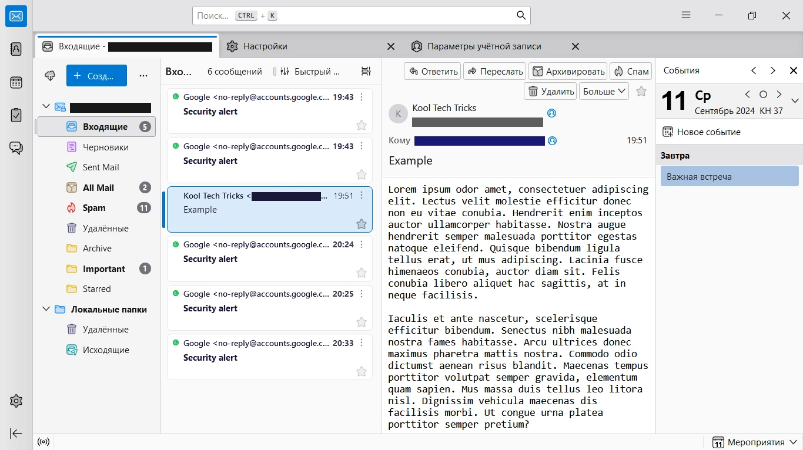
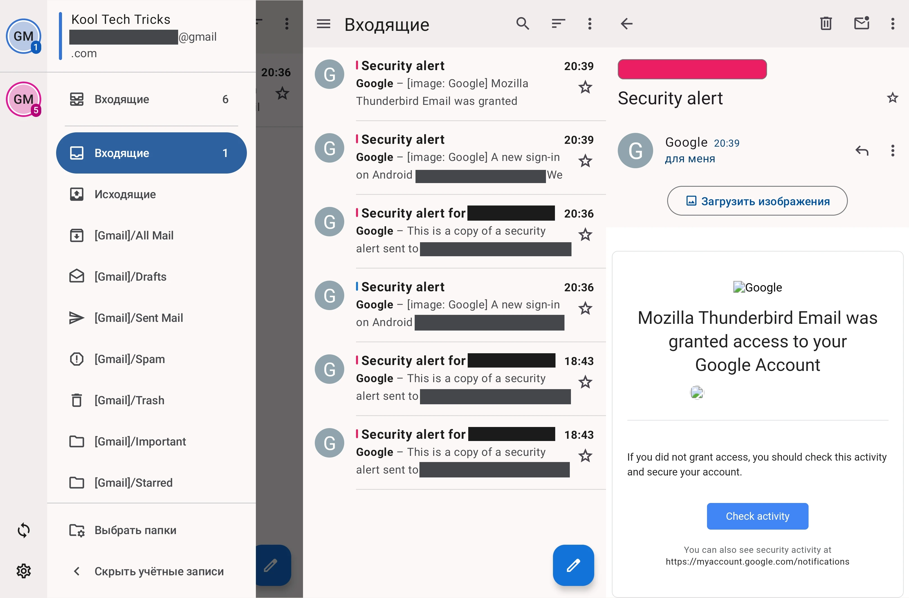

Почтовые клиенты — это специальные программы, которые позволяют получать и
отправлять электронные письма. Они более функциональные и конфиденциальные, чем
веб-почта.

<!--more-->

**Преимущества почтовых клиентов над веб-почтой:**
- Использование нескольких аккаунтов одновременно без необходимости
переключаться между ними.
- Дополнительные функции и возможности для управления письмами.
- Автономная работа.
- Отсутствие рекламы и прочих отвлекающих элементов.
- Защита от отслеживания в письмах по умолчанию.

Подробнее: [Почему стоит использовать почтовый клиент, а не веб-почту].

[Почему стоит использовать почтовый клиент, а не веб-почту]: https://blog.kooltechtricks.org/2024/09/why-use-a-mail-client-vs-webmail

Для авторизации в почтовом клиенте может потребоваться выполнение настройки.

|Почтовый сервис|Инструкция|
|---------------|----------|
|**Gmail**|Введите свой логин и пароль, разрешите доступ к своей учётной записи.
|**Яндекс Почта**|Разрешите использование почтовых программ в [настройках Почты], создайте [пароль приложения](https://id.yandex.ru/security/app-passwords) и используйте его для авторизации в почтовом клиенте.
|**Mail.ru**|Разрешите использование почтовых программ в настройках Почты, создайте [пароль приложения](https://help.mail.ru/mail/security/protection/external) и используйте его для авторизации в почтовом клиенте.
|**Proton Mail**|Оплатите [подписку](https://proton.me/mail/pricing), настройте [Proton Mail Bridge]
|**Tuta**|Сторонние почтовые клиенты [не поддерживаются](https://tuta.com/de/support/howto#imap)

[настройках Почты]: https://mail.yandex.ru/?dpda=yes#setup/client
[Proton Mail Bridge]: https://proton.me/mail/bridge

У каждого почтового сервиса должно быть руководство в справочной системе о том,
как настроить сторонние почтовые клиенты для вашей учётной записи.

## Thunderbird

|||
|-|-|
|**Платформы**|Windows, Linux, macOS
|**Технологии**|Основано на Firefox, Открытый исходный код
|**Сайт**|https://www.thunderbird.net
|**Поддержать**|https://www.thunderbird.net/?form=support
|**Документация**|https://support.mozilla.org/products/thunderbird
|**Информация актуальна для версии**|128.2.0

- Windows [winget](/wiki/winget): `Mozilla.Thunderbird`
- Linux: [Flathub](https://flathub.org/apps/org.mozilla.Thunderbird)

Почтовый клиент, управляемый Mozilla Foundation и поддерживаемый сообществом.
Полностью свободный, ставит безопасность и конфиденциальность на первое место.
Существует с 2003 года и обладает широким набором возможностей.

Поддерживаются [дополнения](https://addons.thunderbird.net) как в браузерах
Firefox и Chrome.

|||
|-|-|
|**Фоновая работа**|❌ Нет
|**Фильтры сообщений**|✅ Есть
|**Загрузка содержимого из Интернета**|✅ Отключена по умолчанию
|**Поддержка шифрования (PGP)**|✅ Есть
|**Экспорт/Импорт настроек**|✅ Есть (папка профиля)
|**Переводчик**|⚠️ Через [сторонние дополнения](https://addons.thunderbird.net/thunderbird/search/?q=translate)
|**Фильтрация спама**|✅ [Есть](https://support.mozilla.org/ru/kb/thunderbird-i-nezhelatelnye-spam-soobsheniya) ([Байесовская фильтрация спама](https://ru.wikipedia.org/wiki/Байесовская_фильтрация_спама))
|**Дополнительные функции**|Календарь, контакты, список задач, чат (IRC, XMPP, Matrix), чтение [лент RSS](/wiki/rss)

### Betterbird

Модификация Thunderbird с исправлением некоторых ошибок и добавлением
дополнительных функций, например, иконка в трее на Linux.
[Полностью совместим с Thunderbird], можно использовать тот же профиль, не
перенося аккаунты и настройки.

[Полностью совместим с Thunderbird]: https://betterbird.eu/support/index.html#switch-tb-bb

- [Скачать с официального сайта](https://betterbird.eu/downloads/index.php)
- Windows [winget](/wiki/winget): `Betterbird.Betterbird`
- Linux: [Flathub](https://flathub.org/apps/eu.betterbird.Betterbird)

## FairEmail

|||
|-|-|
|**Платформа**|Android
|**Технологии**|Java, C++, Открытый исходный код
|**Сайт**|https://email.faircode.eu
|**Поддержать**|https://email.faircode.eu/donate
|**Документация**|https://m66b.github.io/FairEmail
|**Исходный код**|https://github.com/M66B/FairEmail
|**Информация актуальна для версии**|1.2230

- [Google Play](https://play.google.com/store/apps/details?id=eu.faircode.email)
- [GitHub](https://github.com/M66B/FairEmail/releases/latest)
- [F-Droid](https://f-droid.org/packages/eu.faircode.email)

Почтовый клиент, разработанный специально для обеспечения конфиденциальности
пользователя. По умолчанию не загружает сторонние элементы в письмах и
анализирует внешние ссылки перед переходом.

Проверяет наличие сообщений в реальном времени, что может гарантировать
моментальную доставку, но повышать расход энергии.

В клиенте много различных настроек. Есть интеграции с [LanguageTool], DeepL,
VirusTotal, Send, ChatGPT, Gemini, но для большинства требуется API-ключ.

[LanguageTool]: /wiki/languagetool/plugins#fairemail

Некоторые функции требуют приобретения версии Pro. Это необходимо для
поддержания разработки проекта.

|||
|-|-|
|**Фоновая работа**|✅ В реальном времени
|**Фильтры сообщений**|✅ Есть
|**Загрузка содержимого из Интернета**|✅ Отключена по умолчанию
|**Поддержка шифрования (PGP)**|✅ Есть
|**Экспорт/Импорт настроек**|💰 В версии Pro
|**Переводчик**|⚠️ Через DeepL, но нужен API-ключ
|**Фильтрация спама**|✅ Есть, но [полагается на сервер](https://m66b.github.io/FairEmail/#faq92)

## Thunderbird для Android

|||
|-|-|
|**Платформа**|Android
|**Технологии**|Kotlin, Java, Открытый исходный код
|**Сайт**|https://www.thunderbird.net/mobile
|**Поддержать**|https://www.thunderbird.net/?form=support
|**Документация**|https://support.mozilla.org/products/thunderbird-android
|**Отчёты об ошибках**|https://github.com/thunderbird/thunderbird-android/issues
|**Исходный код**|https://github.com/thunderbird/thunderbird-android
|**Информация актуальна для версии**|8.0

- [Google Play](https://play.google.com/store/apps/details?id=net.thunderbird.android)
- [GitHub](https://github.com/thunderbird/thunderbird-android/releases/latest)
- [F-Droid](https://f-droid.org/packages/net.thunderbird.android)

Простой почтовый клиент с открытым исходным кодом для Android, который был
преобразован из K-9 Mail.

Вы можете [импортировать](https://support.mozilla.org/kb/thunderbird-android-import#w_how-to-import-from-thunderbird-desktop)
аккаунты из Thunderbird для компьютера, используя QR-код
(требуется версия 128.4.0 и выше).

|||
|-|-|
|**Фоновая работа**|✅ Периодически от 15 минут до 24 часов (настраивается индивидуально для каждого аккаунта)
|**Фильтры сообщений**|❌ Нет
|**Загрузка содержимого из Интернета**|✅ Отключена по умолчанию
|**Поддержка шифрования (PGP)**|✅ Есть
|**Экспорт/Импорт настроек**|✅ Есть
|**Переводчик**|❌ [Нет](https://github.com/thunderbird/thunderbird-android/issues/7482)
|**Фильтрация спама**|✅ Есть, но полагается на сервер
