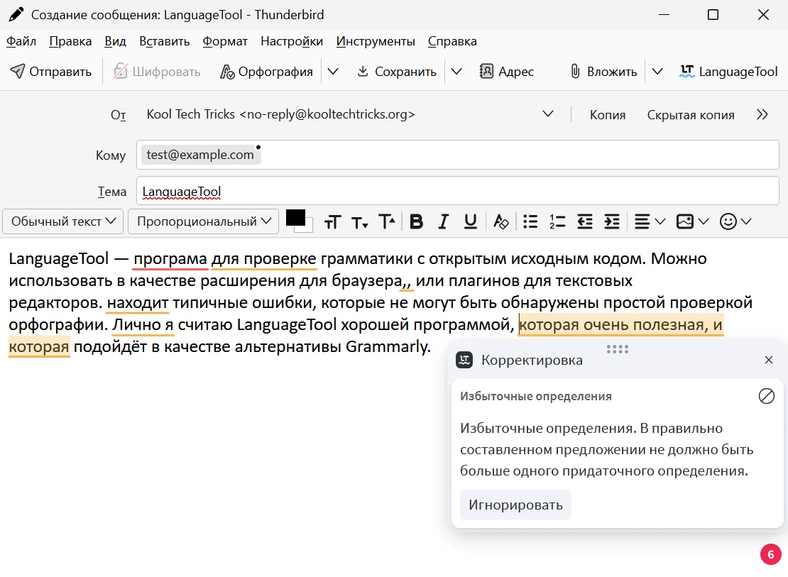
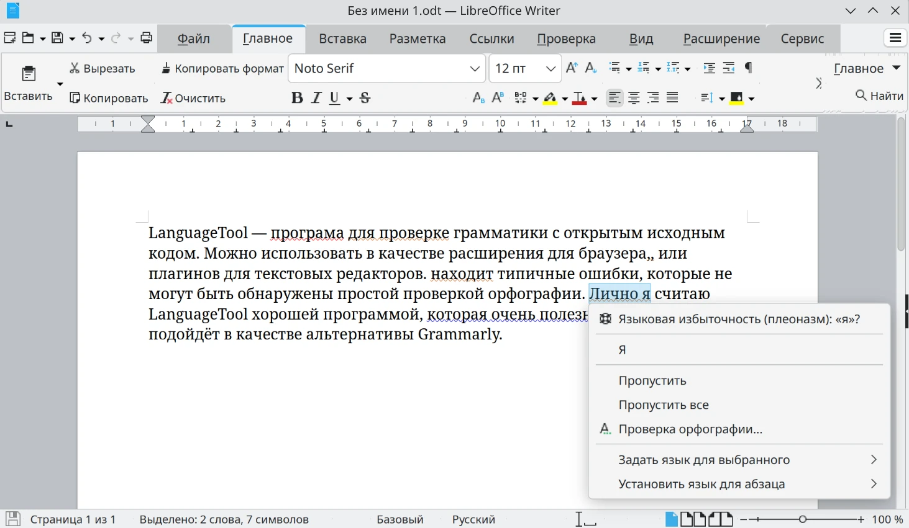
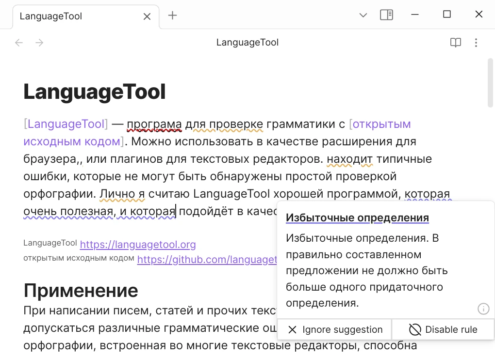
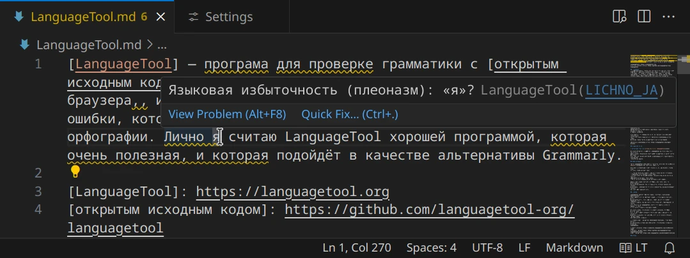

Плагины и дополнения для текстовых редакторов, которые добавляют поддержку
проверки грамматики, используя [LanguageTool].

<!--more-->

> [!note]
> На этой странице не рассматриваются [официальные приложения] LanguageTool для
Windows, macOS и iOS.

[LanguageTool]: /wiki/languagetool
[официальные приложения]: https://languagetool.org/services#operating_systems

## Расширение для браузера

Официальное расширение LanguageTool для браузера. По умолчанию используется
сервер `languagetool.org`, но в расширенных настройках можно выбрать локальный
сервер.

Скачать:

- [Chromium](https://chromewebstore.google.com/detail/oldceeleldhonbafppcapldpdifcinji)
    - [Edge](https://microsoftedge.microsoft.com/addons/detail/hfjadhjooeceemgojogkhlppanjkbobc)
    - [Opera](https://addons.opera.com/extensions/details/grammar-and-spell-checker-languagetool)
- [Firefox](https://addons.mozilla.org/firefox/addon/languagetool)
- [Safari](https://apps.apple.com/app/id1534275760)

Примечание: это расширение с [закрытым исходным кодом].

[закрытым исходным кодом]: https://forum.languagetool.org/t/about-the-browser-addon-privacy-and-open-source/7505/2

## Thunderbird

Официальное расширение LanguageTool для почтового клиента [Thunderbird]. Оно
аналогично браузерному расширению, так как Thunderbird основан на Firefox.

[Скачать](https://addons.thunderbird.net/thunderbird/addon/grammar-and-spell-checker)

[Thunderbird]: /wiki/email/clients#thunderbird

## LibreOffice

В [LibreOffice] начиная с версии 7.4 встроена интеграция LanguageTool.

1. Откройте параметры LibreOffice (**Инструменты → Параметры...** или сочетание
клавиш `Alt`+`F12`).
2. Во вкладке **«Языки и локализация (Languages and Locales)»** выберите пункт
**«Сервер LanguageTool»**.
3. Включите LanguageTool, установив соответствующий флажок.
4. Настройки API зависят от того, какой сервер вы используете:
    - **Бесплатный официальный сервер:** Базовый URL
    `https://api.languagetool.org/v2`, остальные поля пустые.
    - **Премиум-аккаунт на официальном сервере:** Базовый URL
    `https://api.languagetoolplus.com/v2`, ваш адрес электронной почты и
    API-ключ.
    - **Локальный сервер:** Базовый URL `http://localhost:8081/v2`
    (`/v2` в конце обязательно), остальные поля пустые.
5. Нажмите ОК и откройте текстовый документ.
6. Выберите во вкладке **«Сервис (Tools)»** или **«Проверка»** автопроверку
орфографии. Ошибки будут отображаться аналогично стандартной проверке
орфографии.

[Подробнее](https://languagetool.org/insights/post/product-libreoffice/#how-to-enable-languagetool-on-libreoffice)

[LibreOffice]: https://www.libreoffice.org

## Obsidian

Неофициальный плагин LanguageTool для [Obsidian], редактора заметок в формате
Markdown. По умолчанию используется сервер `languagetool.org`. Совместим с
мобильной версией Obsidian. Плагин и его настройки находятся внутри хранилища,
что позволяет беспрепятственно синхронизировать состояние между устройствами.

- [Добавить в Obsidian](obsidian://show-plugin?id=languagetool)
- [Исходный код](https://github.com/wrenger/obsidian-languagetool)

[Obsidian]: https://obsidian.md

## Visual Studio Code

[LanguageTool Linter] — простое расширение для проверки грамматики в Visual
Studio Code с помощью LanguageTool. По умолчанию используется локальный сервер.

- [Visual Studio Marketplace](https://marketplace.visualstudio.com/items?itemName=davidlday.languagetool-linter)
(для [VSCode] от Microsoft)
- [Open VSX](https://open-vsx.org/extension/davidlday/languagetool-linter)
(для [VSCodium] и [Code - OSS])

[LanguageTool Linter]: https://github.com/davidlday/vscode-languagetool-linter#readme
[VSCode]: https://code.visualstudio.com
[VSCodium]: https://vscodium.com
[Code - OSS]: https://github.com/microsoft/vscode

## LTeX

[LTeX] — языковой сервер (LSP) для LanguageTool. Предоставляет офлайн-проверку
грамматики в различных форматах разметки, таких как Markdown, Org,
reStructuredText, LaTeX, сообщения коммитов Git. Может использоваться как
отдельный инструмент командной строки, так и языковой сервер для различных
текстовых редакторов. В LTeX уже встроена Java и сервер LanguageTool.

Установка:
- [Visual Studio Code](https://valentjn.github.io/ltex/vscode-ltex/installation-usage-vscode-ltex.html)
- [Vim/Neovim](https://valentjn.github.io/ltex/vscode-ltex/installation-usage-coc-ltex.html)
- [Zed](https://github.com/vitallium/zed-ltex#readme)

[LTeX]: https://valentjn.github.io/ltex

## FairEmail

В почтовом клиенте [FairEmail] встроена интеграция LanguageTool. Однако
реализация интерфейса проверки грамматики не настолько хорошая и не интуитивно
понятная.

Включите LanguageTool в **настройках FairEmail → Интеграция**. Также можно
включить формальный стиль или всплывающие уведомления с описанием проблемы.
По умолчанию используется официальный сервер `languagetool.org`.

Чтобы выполнить проверку во время составления письма, зажмите кнопку
**«Сохранить черновик»** на нижней панели. Ошибки в тексте будут подчёркнуты.
Чтобы исправить их, выделите ошибки и найдите действие **«Заменить»** в вашей
клавиатуре или появившемся меню. Также через это меню можно добавить слова в
словарь.

Подробнее в [FAQ FairEmail].

[FairEmail]: /wiki/email/clients#fairemail
[FAQ FairEmail]: https://m66b.github.io/FairEmail/#faq180
