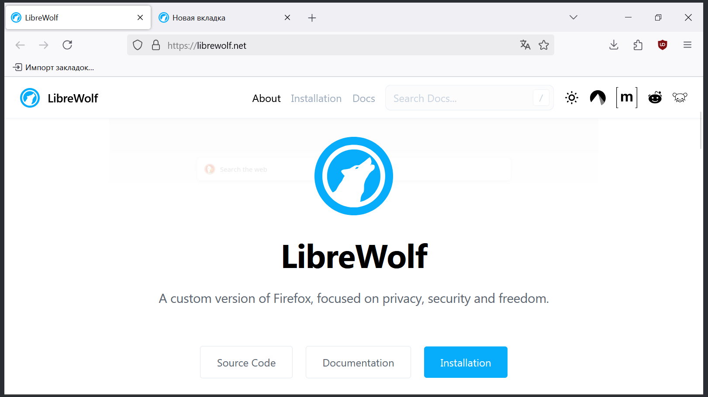
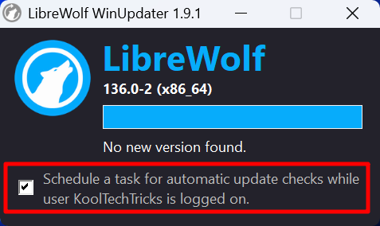
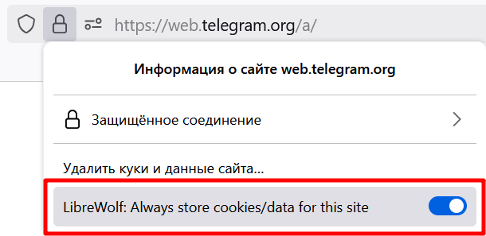
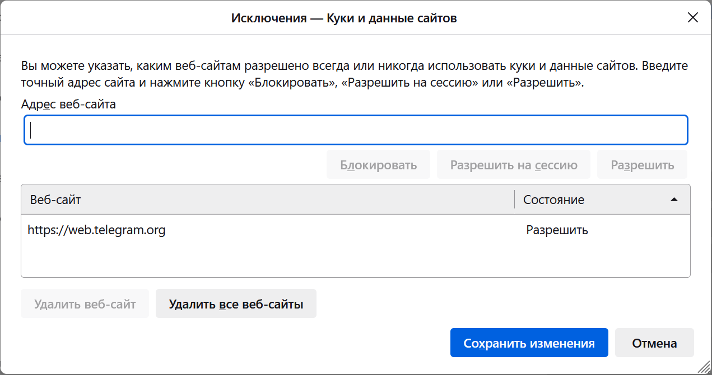

[LibreWolf] — модификация браузера Firefox, нацеленная на приватность
пользователей, безопасность и свободу без весомого ущерба для удобства
использования. Основана на последней стабильной версии Firefox с опозданием в
пару дней.

<!--more-->



[LibreWolf]: https://librewolf.net

## Применение

Браузер LibreWolf предназначен для повышения конфиденциальности пользователей:

- Удалена вся телеметрия Mozilla.
- Предустановлен uBlock Origin.
- Настройки по умолчанию снижают идентификацию (fingerprinting).

Внешний вид и функциональность почти не отличается от обычного Firefox, из-за
чего довольно просто перейти с Firefox на LibreWolf и обеспечить себе хорошую
конфиденциальность.

Firefox можно «укрепить» при помощи [arkenfox user.js], но это гораздо более
трудоёмкая задача. LibreWolf намного проще установить и начать использовать:
все важные настройки конфиденциальности активированы по умолчанию. Более того,
исходный код браузера модифицирован, чтобы удалить лишние компоненты и добавить
улучшения для удобства использования.

[arkenfox user.js]: https://github.com/arkenfox/user.js

Настройки LibreWolf по умолчанию могут доставлять неудобства и проблемы на
сайтах, но всё ради приватности. Тем не менее вы можете легко
[отключить эти настройки](#менее-строгие-настройки) и пользоваться браузером
как обычно.

## Установка

> **Основная статья:** [Официальные руководства по установке LibreWolf для всех
платформ всеми способами][Установка LibreWolf]

[Установка LibreWolf]: https://librewolf.net/installation

### Windows

#### Установщик

Перейдите на [сайт](https://librewolf.net/installation/windows), скачайте и
запустите файл `librewolf-XXX-windows-x86_64-setup.exe`.

> [!important]
> На этапе выбора компонентов (после первого нажатия «Next») поставьте галочку
на **LibreWolf WinUpdater**.

LibreWolf [не имеет встроенного механизма проверки наличия обновлений], поэтому
придётся один раз настроить специальную утилиту WinUpdater, которую вы только
что установили вместе с браузером.

[не имеет встроенного механизма проверки наличия обновлений]: https://codeberg.org/librewolf/issues/issues/915

После установки браузера найдите в поиске "LibreWolf WinUpdater" и запустите
его. Появится окно, где нужно поставить галочку «Schedule a task for automatic
update checks while user is logged on». Оно запустит несколько скриптов в
командной строке, которые создадут задачу в планировщике задач. Когда в окне
терминала появится «Done. Press any key to close this window.», его можно
закрыть вместе с программой WinUpdater.



После этого при каждом запуске системы будет проверяться наличие обновлений
LibreWolf. Если обновления будут найдены, то появится уведомление об их
установке.

#### Microsoft Store

Проще всего установить LibreWolf для Windows из [Microsoft Store]. Эта версия
будет получать обновления автоматически.

[Microsoft Store]: https://apps.microsoft.com/store/detail/9NVN9SZ8KFD7

### macOS

Установите LibreWolf для macOS, используя [Homebrew](https://brew.sh), так как
эта версия будет получать обновления автоматически:

```sh
brew install --cask librewolf
```

Иначе можно скачать файл `.dmg` с [сайта](https://librewolf.net/installation/macos),
но эту версию вам нужно обновлять вручную.

### Linux

Проще всего установить LibreWolf для Linux через [Flatpak]. Обратите внимание,
что эта версия будет находиться в песочнице, а некоторые взаимодействия с
системой будут ограничены.

Альтернативно можно установить
[через репозитории дистрибутива][Установка LibreWolf] или [AppImage].

[Flatpak]: https://flathub.org/apps/io.gitlab.librewolf-community
[AppImage]: https://librewolf.net/installation/linux/#appimage

### Android

Разработчики не планируют выпускать LibreWolf для Android. В качестве
альтернативы рекомендуется использовать браузер [IronFox] со схожими целями.

[IronFox]: /wiki/browsers#ironfox

## Менее строгие настройки

Возможно, вы бы хотели пользоваться LibreWolf на повседневной основе, но
раздражают некоторые настройки приватности? Если вы считаете их слишком
строгими, то можно отключить без весомого ущерба приватности.

> [!important]
> Изменение этих настроек приводят к снижению конфиденциальности и безопасности,
поэтому изменяйте только в том случае, если это необходимо для вашего удобства.

### Всегда светлая тема, часовой пояс UTC, ОС Windows, фиксированный размер окна при запуске

Это нужно для снижения идентификации с помощью определённых данных, отправляемых
на сайты. За это отвечает настройка **ResistFingerprinting**, которая делает ваш
браузер менее уникальным. На самом деле существует множество других данных, по
которым вас всё равно можно идентифицировать, поэтому отключение данной
настройки не приведёт к существенной потере конфиденциальности.

> Настройки браузера → LibreWolf (`about:preferences#librewolf`) →
Fingerprinting → Отключить «Enable ResistFingerprinting»

### Сертификаты OCSP (SEC_ERROR_OCSP_SERVER_ERROR)

В LibreWolf Протокол состояния сетевого сертификата (OCSP) включён в режиме
жёсткого отказа (hard-fail). Это означает, что если статус отзыва сертификата не
может быть проверен из-за невозможности связаться с центром сертификации, то он
будет считаться недействительным. Хотя это повышает безопасность, это также
может снизить удобство использования, поскольку серверы OCSP часто выходят из
строя.

Если вы столкнулись с этой ошибкой:
- Серверы OCSP обычно блокируются файлами хостов и списками блокировки по
ошибке, поэтому сначала проверьте свой брандмауэр и списки блокировки.
- OCSP не совместим с большинством прокси, так что это также следует учитывать.

Вы можете отключить OCSP hard-fail в настройках LibreWolf:

> Настройки браузера → LibreWolf (`about:preferences#librewolf`) → Security →
Отключить «Enforce OCSP hard-fail»

### Синхронизация Firefox Sync

Пользуетесь синхронизацией Firefox через аккаунт Mozilla? Вы можете использовать
её точно так же и в LibreWolf:

> Настройки браузера → LibreWolf (`about:preferences#librewolf`) → Browser
Behavior → Включить «Enable Firefox Sync» и перезапустить браузер.

### WebGL

WebGL может понадобиться для видеоконференций.

> Настройки браузера → LibreWolf (`about:preferences#librewolf`) →
Fingerprinting → Включить «Enable WebGL»

### Очистка cookie

По умолчанию LibreWolf после закрытия браузера очищает все cookie, то есть вам
придётся заново войти в аккаунты, как будто вы работаете в режиме инкогнито.

Вы можете добавлять сайты в исключения, чтобы их cookie не очищались. Нажмите на
значок замочка слева в адресной строке и активируйте переключатель
«LibreWolf: Always store cookies/data for this site».



Чтобы посмотреть список разрешённых сайтов, у которых не будут очищаться cookie,
зайдите в настройки браузера и раздел «Приватность и защита» (`about:preferences#privacy`).
Ниже в разделе «Куки и данные сайтов» нажмите «Управление исключениями...».
Здесь можно редактировать список сайтов: разрешать или блокировать cookie.



Если вам всё же неудобно вести этот белый список сайтов, то можете отключить
очистку cookie. В этом же разделе настроек уберите галочку с
«Удалять куки и данные сайтов при закрытии LibreWolf» и ниже с
«Удалять историю при закрытии LibreWolf».

## Вопросы

### Исходящие соединения

В LibreWolf удалена вся телеметрия Mozilla, но это не значит, что убраны все
исходящие соединения. Некоторые важны для корректной работы браузера. В
частности, обновление списков фильтров блокировщиков, сертификаты,
push-уведомления сайтов (push.services.mozilla.com).

Несмотря на это, LibreWolf по-прежнему стремится удалить все соединения,
нарушающие конфиденциальность, и свести все соединения к минимуму, необходимому
для обеспечения максимального баланса между конфиденциальностью и безопасностью.

## Ссылки

- [FAQ](https://librewolf.net/docs/faq) содержит ответы на большинство вопросов
и исправление проблем
- [Отчёты об ошибках](https://codeberg.org/librewolf/issues)
- Новости в [Fediverse (Mastodon)](https://chaos.social/@librewolf)
- Сообщество на [Reddit](https://www.reddit.com/r/LibreWolf) и в
[Fediverse (Lemmy)](https://lemmy.ml/c/librewolf)
- Чат в [Matrix](https://go.kde.org/matrix/#/#librewolf:matrix.org)
