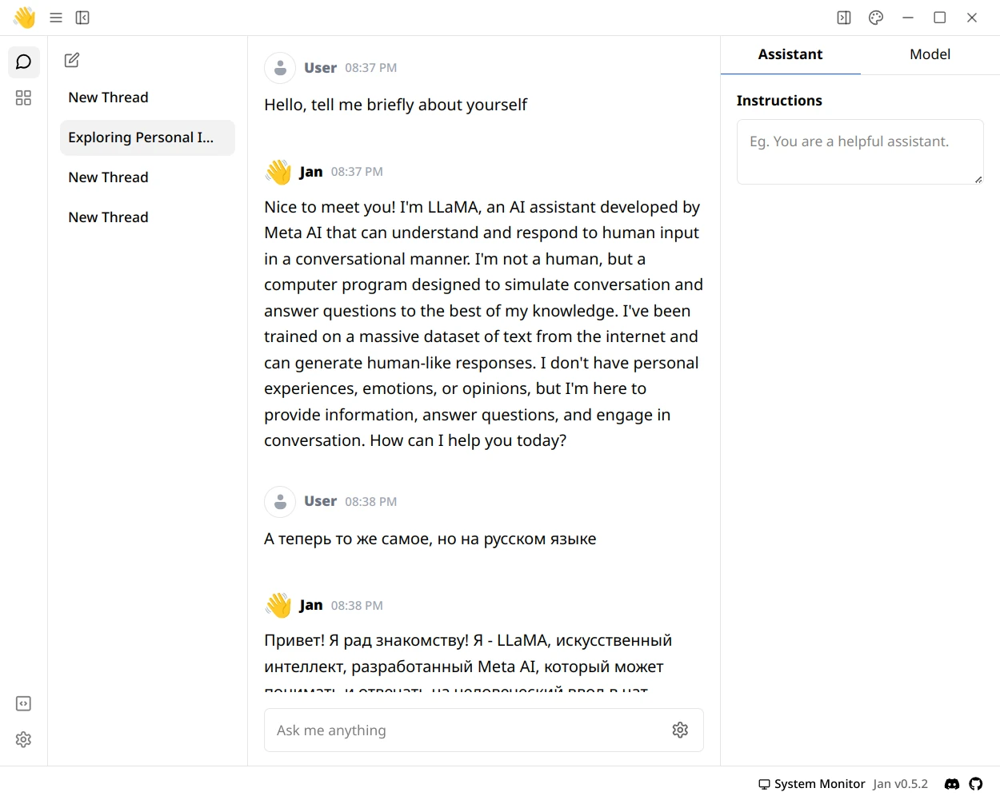
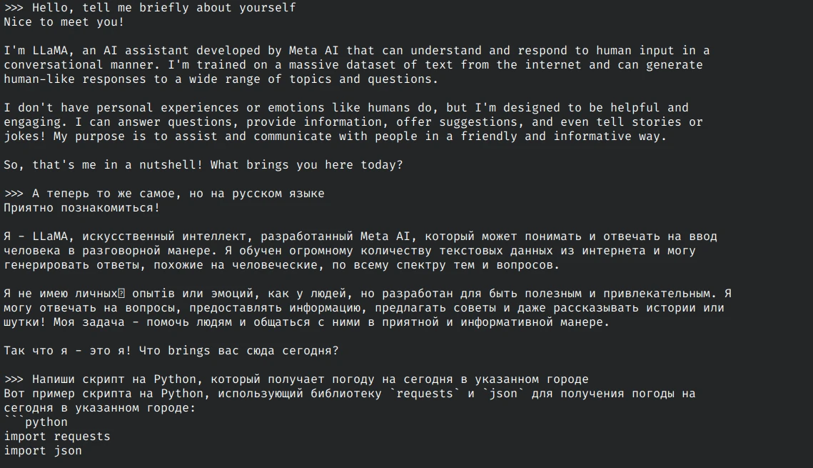

Генеративный искусственный интеллект для создания осмысленного текста локально
на вашем устройстве. Подойдут в качестве альтернативы ChatGPT.

<!--more-->

> [!note]
> Все программы на этой странице представлены в ознакомительном формате. Мы даём
лишь небольшое описание и обзор, а также краткую инструкцию для начала работы.
Если вы хотите узнать больше об определённом проекте, перейдите по указанным
ссылкам на его сайт, репозиторий и документацию.

> **Смотрите также:**
[Что такое локальный искусственный интеллект и как им пользоваться?](/wiki/local-ai)

Для работы с текстом ИИ нужны большие языковые модели (LLM), которые обучены на
большом объёме данных.

Закрытые языковые модели (OpenAI ChatGPT) обучены на неизвестном наборе данных.
Это могут быть материалы, защищённые авторским правом. Нет никакой возможности
узнать, на каких текстах основаны закрытые языковые модели.

[Открытые языковые модели] гораздо безопаснее использовать в коммерческих целях.
У каждой модели есть лицензия, которая может разрешать или запрещать её
использование в коммерческих или исследовательских целях. Однако не все
открытые модели можно назвать [полностью открытыми](https://opennet.ru/61448).

На этой странице перечислены программы для запуска больших языковых моделей. Вы
можете найти эти модели в каталогах, скачать из интернета или обучить самому.

[локальный искусственный интеллект]: /wiki/local-ai
[Открытые языковые модели]: https://github.com/eugeneyan/open-llms

## GPT4All

|||
|-|-|
|**Платформа**|Windows, macOS, Linux
|**Технологии**|C++, Qt, Открытый исходный код ([MIT](https://github.com/nomic-ai/gpt4all/blob/main/LICENSE.txt))
|**Сайт**|https://www.nomic.ai/gpt4all
|**Документация**|https://docs.gpt4all.io
|**Обсуждение**|[Discord](https://discord.gg/mGZE39AS3e)
|**Отчёты об ошибках**|https://github.com/nomic-ai/gpt4all/issues
|**Исходный код**|https://github.com/nomic-ai/gpt4all
|**Системные требования**|Диск: 3 — 8 ГБ; ОЗУ: 8 — 16 ГБ
|**Скачать**|[Windows](https://gpt4all.io/installers/gpt4all-installer-win64.exe), [macOS](https://gpt4all.io/installers/gpt4all-installer-darwin.dmg), [Linux](https://gpt4all.io/installers/gpt4all-installer-linux.run)
|**Метод установки и запуска**|Устанавливаемая программа
|**Информация актуальна для версии**|3.3.1

Бесплатный, локально работающий чат-бот, который уважает вашу
конфиденциальность. Не требуется видеокарта и подключение к интернету. GPT4All
[легко](https://docs.gpt4all.io/gpt4all_desktop/quickstart.html) установить и
запустить на своём компьютере.

При первом запуске у вас спросят согласие на анонимную аналитику и передачу
истории переписки в [общую базу данных GPT4All]. Это нужно для создания
общедоступной открытой базы данных, которую может скачать любой желающий. Сбор
данных производится на добровольной основе. Вы можете отказаться, если не
хотите, чтобы ваши чаты оказались в общем доступе.

В программе есть окно просмотра доступных языковых моделей. Для каждой модели
указаны характеристики, системные требования, лицензия. В списке есть и онлайн
модели (ChatGPT), но для них нужен API-ключ.

[LocalDocs] позволяет интегрировать информацию из ваших текстовых файлов в
языковую модель. Никакие файлы не покидают компьютер, если не использовать
онлайн модель. Поддерживаются форматы простого текста (.txt), Markdown (.md),
PDF. После генерации ответа можно посмотреть, на какие файлы ссылалась модель.

GPT4All может использоваться как
[библиотека Python](https://docs.gpt4all.io/gpt4all_python/home.html).

[общую базу данных GPT4All]: https://github.com/nomic-ai/gpt4all-datalake#readme
[LocalDocs]: https://docs.gpt4all.io/gpt4all_desktop/localdocs.html

## Jan

|||
|-|-|
|**Платформа**|Windows, macOS, Linux
|**Технологии**|Electron, Открытый исходный код ([GNU AGPL v3.0])
|**Сайт**|https://jan.ai
|**Документация**|https://jan.ai/docs
|**Обсуждение**|[Discord](https://discord.com/invite/FTk2MvZwJH)
|**Отчёты об ошибках**|https://github.com/janhq/jan/issues
|**Исходный код**|https://github.com/janhq/jan
|**Системные требования**|https://github.com/janhq/jan#requirements-for-running-jan
|**Скачать**|https://jan.ai/download
|**Метод установки и запуска**|Портативная программа
|**Информация актуальна для версии**|0.5.2

Запускайте модели искусственного интеллекта, такие как Llama или Mistral, прямо
на своем устройстве, чтобы повысить уровень конфиденциальности. Нет
необходимости в подключении к Интернету — все данные хранятся и обрабатываются
локально. Чаты, настройки и модели остаются на вашем компьютере под вашим
контролем.

В программе есть вкладка, где можно посмотреть и скачать языковые модели. Также
можно импортировать модель из каталога Hugging Face или файла GGUF. Системные
требования не отображаются, есть лишь метка о производительности на текущем
устройстве. Есть возможность воспользоваться удалёнными моделями (OpenAI, Groq,
Mistral API), которые работают в облаке, но вы теряете контроль над ними. Для
удалённых моделей требуется API-ключ вместо мощного оборудования.

На экране общения можно быстро настроить модель и задать инструкции.

Вы можете запустить локальный сервер и пользоваться API для взаимодействия с
моделью из других программ. Этот API эквивалентен API OpenAI.

В программе есть поддержка расширений. Их нужно где-то найти и установить из
файла.

[Видеообзор Jan](https://youtu.be/vPmUBf79rFA) [12:03]

## Ollama

|||
|-|-|
|**Платформа**|Windows, macOS, Linux
|**Технологии**|Go, Открытый исходный код ([MIT](https://github.com/ollama/ollama/blob/main/LICENSE))
|**Сайт**|https://ollama.com
|**Документация**|https://github.com/ollama/ollama/tree/main/docs
|**Обсуждение**|[Discord](https://discord.com/invite/ollama)
|**Отчёты об ошибках**|https://github.com/ollama/ollama/issues
|**Исходный код**|https://github.com/ollama/ollama
|**Системные требования**|[Видеокарта](https://github.com/ollama/ollama/blob/main/docs/gpu.md) (NVIDIA, AMD, Apple) или процессор (медленно)
|**Скачать**|https://ollama.com/download
|**Метод установки и запуска**|Устанавливаемая программа, сервер
|**Информация актуальна для версии**|0.3.2

Программа для получения и запуска больших языковых моделей (LLM) на своём
сервере.

Ollama представляет собой сервер с [интерфейсом командной строки]. После его
установки должна быть доступна команда `ollama`.

> **Смотрите также:**
[Инструкция по установке Ollama для Linux](https://itsfoss.com/ollama-setup-linux)

Ollama имеет [встроенный каталог языковых моделей], и через программу можно
легко ими управлять. Обратите внимание, что не все модели разрешено использовать
в коммерческих целях, поэтому смотрите файлы с лицензией. Установите модель
командой `ollama pull <название>` и запустите командой `ollama run <название>`.
Далее можно общаться с языковой моделью в окне терминала. Введите `/?`, чтобы
посмотреть доступные команды.

Для более удобного взаимодействия с искусственным интеллектом можно установить
отдельный [веб-интерфейс](https://itsfoss.com/ollama-web-ui-tools), например,
[Open WebUI]. У сервера есть API, который можно использовать для интеграции в
другие программы. Смотрите
[примеры использования](https://github.com/ollama/ollama/tree/main/examples).

[интерфейсом командной строки]: /wiki/cli
[встроенный каталог языковых моделей]: https://ollama.com/library
[Open WebUI]: https://github.com/open-webui/open-webui#readme

## KoboldCpp

|||
|-|-|
|**Платформа**|Windows, macOS, Linux
|**Технологии**|C++, Открытый исходный код ([GNU AGPL v3.0])
|**Сайт**|—
|**Документация**|https://github.com/LostRuins/koboldcpp/wiki
|**Обсуждение**|[Discord](https://koboldai.org/discord)
|**Отчёты об ошибках**|https://github.com/LostRuins/koboldcpp/issues
|**Исходный код**|https://github.com/LostRuins/koboldcpp
|**Системные требования**|ОЗУ: 4 — 16 ГБ
|**Скачать**|https://github.com/LostRuins/koboldcpp/releases/latest
|**Метод установки и запуска**|Портативная программа, сервер
|**Информация актуальна для версии**|1.69.1

Простая в использовании программа для генерации текста искусственным
интеллектом. Это единый самодостаточный дистрибутив, который основан на
llama.cpp и добавляет универсальный Kobold API, поддержку дополнительных
форматов, генерацию изображений Stable Diffusion, обратную совместимость, а
также пользовательский интерфейс с постоянными историями, инструментами
редактирования, форматами сохранения, памятью, информацией о мире, примечанием
автора, персонажами, сценариями.

Это единый исполняемый файл, который можно запустить как в графическом режиме,
так и в консольном. Сам же интерфейс открывается в браузере (адрес по умолчанию:
`localhost:5001`). С ИИ можно взаимодействовать через API.

KoboldCpp может работать и с изображениями (например, распознавать объекты) при
помощи Stable Diffusion, но для этого требуются отдельные модели.

[GNU AGPL v3.0]: https://www.gnu.org/licenses/agpl-3.0.html
