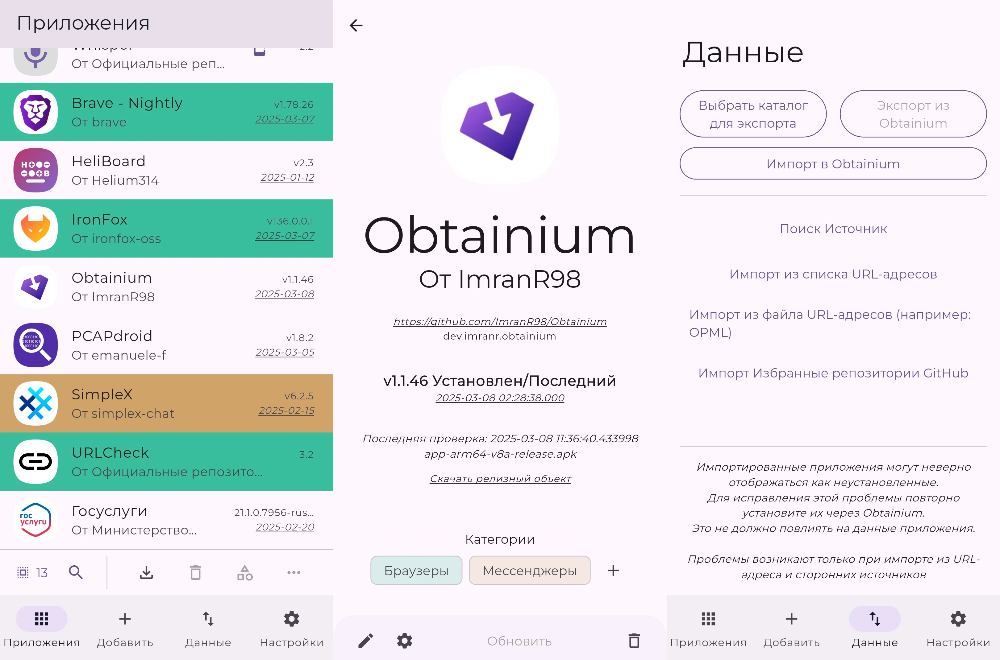

[Obtainium] — приложение с [открытым исходным кодом] для Android, которое
позволяет получать обновления напрямую из источников: GitHub, [F-Droid],
RuStore, Huawei AppGallery, GitLab, Forgejo (Codeberg), APKPure, APK/HTML и
другие.

<!--more-->

[Obtainium]: https://obtainium.imranr.dev
[открытым исходным кодом]: https://github.com/ImranR98/Obtainium
[F-Droid]: /wiki/f-droid

## Применение

Разработчики приложений, как правило, публикуют обновления в разных источниках,
чтобы каждому пользователю было удобно их получать. Однако существует множество
различных источников, и нет такого, в котором будут все приложения. Приходится
устанавливать несколько приложений для получения обновлений. В каждом есть свои
недостатки:

- Google Play есть не на всех прошивках Android, и разработчики приложений
вынуждены ждать проверки перед публикацией обновлений.

- Официальный каталог [F-Droid] содержит только приложения с открытым исходным
кодом, и их собирают другие люди, из-за чего обновления задерживаются, и версии
приложений отличаются.

- Проприетарные магазины приложений RuStore, Huawei AppGallery вызывают сомнения
безопасности. Они могут делать лишние запросы в интернет и отправлять данные
куда не надо.

- Через репозитории GitHub, GitLab, Forgejo (Codeberg) обычно нет автоматической
проверки наличия обновлений.

Obtainium решает эти проблемы. Он позволяет получать обновления приложений из
многих источников в одном месте. Добавьте ссылку на любой поддерживаемый
источник в Obtainium — и он будет периодически проверять наличие обновлений и
устанавливать их.

Obtainium делает запросы в интернет только для получения обновлений приложений.
Так как он с [открытым исходным кодом], возможно полностью убедиться в его
безопасности.

Изначально Obtainium задумывался для получения обновлений из репозиториев
GitHub, GitLab, Forgejo (Codeberg), так как именно туда они чаще всего
публикуются в первую очередь от самих разработчиков, а не посредников.

## Установка

[Скачайте Obtainium с GitHub], затем оно будет проверять наличие обновлений
самого себя.

[Скачайте Obtainium с GitHub]: https://github.com/ImranR98/Obtainium/releases/latest/download/app-release.apk

## Использование

> **Основная статья:** [Obtainium Wiki](https://wiki.obtainium.imranr.dev)

### Добавить приложение

#### Готовые конфигурации

Самый простой способ добавить приложение в Obtainium — импортировать готовую
конфигурацию JSON. Её можно встретить на сайтах в виде ссылок, начинающихся на
`obtainium://`. Например:

- [IronFox](obtainium://app/%7B%22id%22%3A%22org.ironfoxoss.ironfox%22%2C%22url%22%3A%22https%3A%2F%2Ffdroid.ironfoxoss.org%2Ffdroid%2Frepo%2F%22%2C%22author%22%3A%22IronFox%20OSS%22%2C%22name%22%3A%22IronFox%22%2C%22additionalSettings%22%3A%22%7B%5C%22appIdOrName%5C%22%3A%5C%22org.ironfoxoss.ironfox%5C%22%2C%5C%22pickHighestVersionCode%5C%22%3Afalse%2C%5C%22trackOnly%5C%22%3Afalse%2C%5C%22versionExtractionRegEx%5C%22%3A%5C%22%5C%22%2C%5C%22matchGroupToUse%5C%22%3A%5C%22%5C%22%2C%5C%22versionDetection%5C%22%3Atrue%2C%5C%22releaseDateAsVersion%5C%22%3Afalse%2C%5C%22useVersionCodeAsOSVersion%5C%22%3Afalse%2C%5C%22apkFilterRegEx%5C%22%3A%5C%22%5C%22%2C%5C%22invertAPKFilter%5C%22%3Afalse%2C%5C%22autoApkFilterByArch%5C%22%3Atrue%2C%5C%22appName%5C%22%3A%5C%22%5C%22%2C%5C%22shizukuPretendToBeGooglePlay%5C%22%3Afalse%2C%5C%22exemptFromBackgroundUpdates%5C%22%3Afalse%2C%5C%22skipUpdateNotifications%5C%22%3Afalse%2C%5C%22about%5C%22%3A%5C%22IronFox%20is%20a%20secure%2C%20hardened%20and%20privacy-oriented%20web%20browser%20for%20Android%2C%20based%20on%20Firefox.%5C%22%7D%22%2C%22overrideSource%22%3A%22FDroidRepo%22%7D)

Если у вас установлен Obtainium, то браузер предложит открыть эту ссылку в нём.
Это намного проще, чем добавлять приложения вручную, так как могут возникнуть
трудности.

> [!caution]
> Готовые конфигурации из неизвестных источников могут содержать вредоносное ПО.
Пожалуйста, проверяйте какие ссылки указаны в них для получения установочных
файлов.

Такие сложные конфигурации приложений можно найти на
[специальном сайте](https://apps.obtainium.imranr.dev). Найдите там нужные вам
приложения и нажмите «Add to Obtainium».

#### Вручную

Если готовой конфигурации нет, то добавить приложение вручную — не проблема.

Во вкладке «Добавить» в поле «URL-источник приложения» вставьте ссылку на
приложение, которое вы хотите установить. Это может быть ссылка на GitHub,
F-Droid, RuStore или любые другие поддерживаемые источники. Вы также можете
воспользоваться поиском внутри Obtainium, чтобы быстро найти нужное приложение.

Если ссылка корректная и содержит установочный файл, то Obtainium попытается его
скачать и установить. Если источник неизвестный, то придётся вручную задать
конфигурацию, чтобы указать, где взять установочный файл.

При первой установке потребуется разрешить установку из неизвестных источников.

Приложение появится в общем списке и будет периодически проверяться на наличие
обновлений (частоту проверки и поведение можно настроить). Приложения можно
распределить по категориям.

При частой проверке можно столкнуться с ограничением. Можно ввести API-ключ
GitHub, чтобы увеличить лимит запросов.

### Импорт/Экспорт

Список установленных приложений и настройки можно экспортировать. Для этого
зайдите в соответствующую вкладку и выберите каталог для экспорта. Файл JSON
можно экспортировать вручную или автоматически при внесении изменений.

Соответствующая кнопка позволит импортировать данные. Также доступен импорт из
списка URL и репозиториев, помеченных звёздочкой на GitHub.

Пока что нет возможности автоматически определить уже установленные приложения.
[Соответствующий отчёт на GitHub](https://github.com/ImranR98/Obtainium/issues/163)

## Ссылки

- Отчёты об ошибках на [GitHub](https://github.com/ImranR98/Obtainium/issues)
