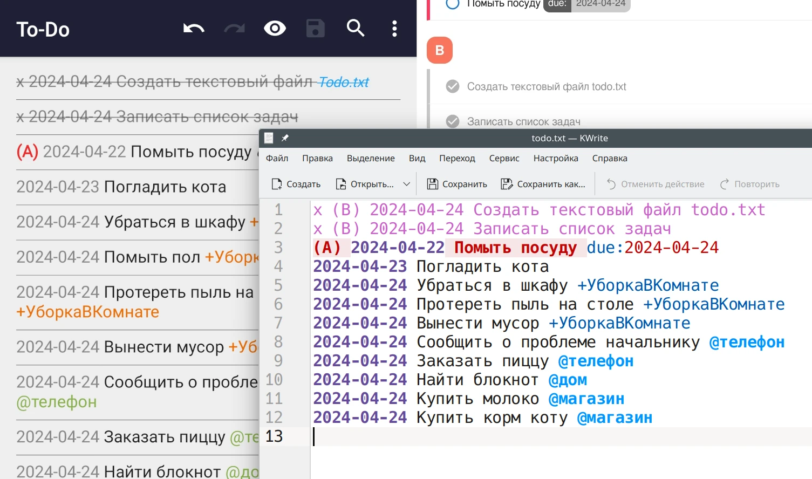

[Todo.txt](http://todotxt.org) — открытый текстовый формат файла списка задач,
который удобно просматривать и изменять в обычном текстовом редакторе.
[Специальные приложения](apps) дополняют функциональность.

<!--more-->



## Применение

Чтобы не забыть выполнить какую-нибудь задачу, вы записываете её на бумагу —
это можно сделать практически где угодно и когда угодно.

В цифровом формате вы создаёте текстовый файл и записываете в него задачи. Такой
файл открывается любым текстовым редактором на любой операционной системе. Его
легко читать, редактировать, перемещать и синхронизировать между устройствами.

Todo.txt является общепринятым стандартом чтения списка дел. Если вы запомните
простой набор правил, то сможете записывать задачи где угодно и когда угодно, а
затем открывать их в любом приложении без необходимости мигрировать данные.

Формат Todo.txt построен таким образом, чтобы было удобно читать и изменять
список дел в обычном текстовом редакторе без использования дополнительных
инструментов. В нём по умолчанию легко что-либо искать и сортировать.

Для хранения списка задач не обязательно скачивать приложения, которые могут
быть сложными, проприетарными или недоступными для всех платформ. Текстовый файл
в формате Todo.txt в паре со [сторонним приложением](apps) помогут надёжно
содержать список дел.

## Использование

> **Смотрите также:**
[Документация Todo.txt](https://github.com/todotxt/todo.txt)

Для начала работы с Todo.txt не обязательно скачивать какие-либо
[приложения](apps). Вы можете начать с них, но для понимания простоты формата
рекомендуется начать с обычного текстового файла.

Создайте текстовый файл с названием `todo.txt` в каком-нибудь месте, в котором
он не потеряется. Удобно поместить его в корневую папку проекта, над которым вы
работаете. Для быстрого доступа создайте ярлык или символьную ссылку.

Откройте этот файл в текстовом редакторе и запишите туда задачи. Каждая строка
представляет собой одну небольшую задачу. После выполнения удалите строку или
добавьте к ней икс (`x`) в начало.

> [!note]
> Для подсветки текста может потребоваться установка [плагинов](plugins).
Отсутствие подсветки не мешает ведению списка задач в текстовом файле. На
примере используется текстовый редактор KWrite, в котором встроена поддержка
синтаксиса Todo.txt.


При добавлении задачи лучше указывать дату создания в начале строки. Все даты
записываются в формате `ГГГГ-ММ-ДД` (Полный год, месяц, день). Срок окончания
указывается как `due:дата` в любом месте описания задачи.


Приоритет задачи указывается заглавной латинской буквой в начале строки.
`(A)` — наивысший приоритет.


```
x (B) 2024-04-21 Создать текстовый файл todo.txt
x (B) 2024-04-21 Записать список задач
(A) 2024-04-22 Помыть посуду due:2024-04-24
2024-04-23 Погладить кота
```

Файл построен таким образом, что его возможно читать и изменять в обычном
текстовом редакторе без дополнительных инструментов. Также применимы простые
операции поиска и сортировки.

### Метка проекта

Вы собираетесь выполнить какую-то большую задачу, например, убраться в комнате:

```
Убраться в комнате
```

Вы смотрите на ваш список дел и думаете о том, что убраться в комнате долго и
тяжело, и вместо этого откладываете задачу на потом.

Никогда не указывайте большие дела как одну большую задачу. Делите на мелкие
подзадачи. Так проще отслеживать прогресс и продвигаться в выполнении.
В Todo.txt для этого есть метки проекта (`+Проект`), которые располагаются
внутри описания задачи.

```
Убраться в шкафу +УборкаВКомнате
Помыть пол +УборкаВКомнате
Протереть пыль на столе +УборкаВКомнате
Вынести мусор +УборкаВКомнате
```

По таким меткам легко искать и фильтровать нужные задачи как в обычном
текстовом редакторе (`Ctrl`+`F`), так и в [сторонних приложениях](apps).

### Метка контекста

У вас есть разные задачи, которые можно выполнить в зависимости от места или
ситуации. Чтобы проще искать задачи под конкретную ситуацию, указывайте
`@контекст`:

```
Сообщить о проблеме начальнику @телефон
Заказать пиццу @телефон
Найти блокнот @дом
Купить молоко @магазин
Купить корм коту @магазин
```

Например, у вас есть время в машине на один звонок. Вы смотрите на список
задач `todo.txt` и ищите по контексту `@телефон`. Вам выдаёт несколько
результатов, и вы выбираете то, что имеет наивысший приоритет.

### Отдельные файлы

Кроме общего файла `todo.txt` у вас могут быть отдельные файлы для проектов
`<project>.todo.txt` или `project/todo.txt`. Это удобно, если есть какие-то
очень специфические задачи, которым не место в общем файле.

Всё же не стоит увлекаться делением задач на разные файлы todo.txt, так как
вы можете забывать про определённые проекты и не проверять каждый файл. Когда
всё записано в одном файле todo.txt и отмечено `+проектами` и `@контекстами`,
становится проще находить релевантные задачи и быстрее решать выполнять их.

Также может существовать отдельный файл для выполненных или архивированных
задач, например, `done.txt`. Некоторые [приложения](apps) и [плагины](plugins)
умеют автоматически или вручную перемещать туда выполненные задачи.

## Синхронизация

Следует как можно раньше начать заботиться о резервном копировании списка дел и
его синхронизацией между устройствами.

Так как `todo.txt` является обычным текстовым файлом, то синхронизировать его
не составит никакого труда. Подойдёт любое облачное хранилище (Google, Яндекс,
OneDrive, Nextcloud) или [Syncthing](/wiki/syncthing).

## Приложения

Для более удобного просмотра и редактирования файла списка задач можно
воспользоваться [сторонними приложениями](apps). Они полностью совместимы друг
с другом, благодаря чему вам не придётся тратить время на миграцию данных.

## Плагины

Так как Todo.txt является обычным текстовым файлом, то его могут читать
обычные текстовые редакторы. Установите [плагины](plugins) для них, чтобы
добавить подсветку синтаксиса Todo.txt, быстрые действия и сочетания клавиш.
В некоторых редакторах поддержка Todo.txt уже встроена, и её можно настроить.
