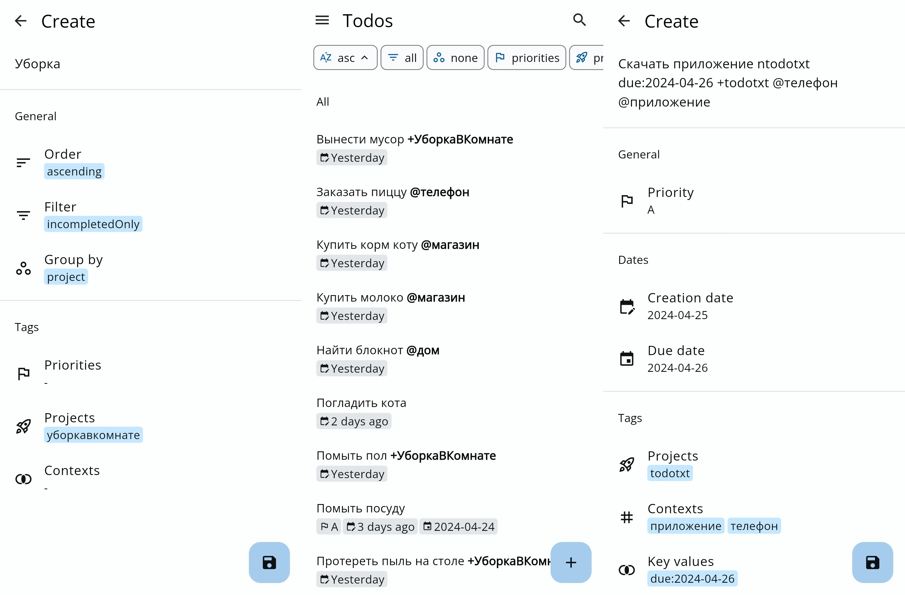

Приложения для ведения списка задач, использующие открытый текстовый формат
[Todo.txt](/wiki/todo-txt). Они полностью совместимы друг с другом, благодаря
чему вам не придётся тратить время на миграцию данных. Приложения Todo.txt не
только делают отображение списка задач ещё удобнее, но и добавляют
дополнительные возможности.

<!--more-->

## sleek

|||
|-|-|
|**Платформа**|Windows, macOS, Linux
|**Технологии**|Electron, Открытый исходный код ([MIT])
|**Документация**|https://github.com/ransome1/sleek/wiki
|**Отчёты об ошибках**|https://github.com/ransome1/sleek/issues
|**Поддержать разработчиков**|https://github.com/sponsors/ransome1
|**Исходный код**|https://github.com/ransome1/sleek
|**Информация актуальна для версии**|2.0.13

- [Mac App Store](https://apps.apple.com/app/id1614704209) (macOS)
- [Microsoft Store](https://www.microsoft.com/store/apps/9NWM2WXF60KR) (Windows)
- [Flathub](https://flathub.org/apps/details/com.github.ransome1.sleek) (Linux)
- [Snap Store](https://snapcraft.io/sleek) (Linux)
- [GitHub](https://github.com/ransome1/sleek/releases/latest) (Windows, macOS,
Linux)

Кроссплатформенное настольное приложение для управления Todo.txt.

**Возможности:**
- Работа с несколькими файлами;
- Сканирование изменений извне;
- Быстрые фильтры и поиск;
- Архивация задач;
- Повторяющиеся и отложенные задачи;
- Уведомления;
- Загрузка собственного стиля (CSS).

## Markor

|||
|-|-|
|**Платформа**|Android
|**Технологии**|Java, Открытый исходный код ([Apache License 2.0])
|**Обсуждения**|https://github.com/gsantner/markor/discussions
|**Отчёты об ошибках**|https://github.com/gsantner/markor/issues
|**Исходный код**|https://github.com/gsantner/markor
|**Информация актуальна для версии**|2.12.5

- [GitHub](https://github.com/gsantner/markor/releases/latest)
- [F-Droid](https://f-droid.org/packages/net.gsantner.markor)
- [Google Play](https://play.google.com/store/apps/details?id=net.gsantner.markor)
([Примечание](https://github.com/gsantner/markor/discussions/2157#discussioncomment-7744069))

Универсальный текстовый редактор для Android. Поддерживает Todo.txt, Markdown
и множество других текстовых форматов. Все создаваемые и редактируемые файлы
полностью совместимы с другими приложениями.

**Возможности:**
- Обзор файлов, добавление каталогов и файлов в избранное;
- Рендер текстовых форматов Markdown, CSV, XML, HTML, CSS;
- Просмотр изображений, видео, аудио и их метаданных;
- Экспорт как PDF, HTML, изображение;
- Вкладки для быстрой навигации, можно настроить пути по умолчанию;
- Быстрая заметка (Markdown);
- Многооконный режим;
- Гибкая настройка.

## ntodotxt

|||
|-|-|
|**Платформа**|Android
|**Технологии**|Flutter, Открытый исходный код ([MIT])
|**Отчёты об ошибках**|https://github.com/tmaegel/ntodotxt/issues
|**Исходный код**|https://github.com/tmaegel/ntodotxt
|**Информация актуальна для версии**|0.8.0

- [GitHub](https://github.com/tmaegel/ntodotxt/releases/latest)
- [F-Droid](https://f-droid.org/packages/de.tnmgl.ntodotxt)

Простое современное приложение для управления списками задач Todo.txt.
В будущем планируется выпустить для Windows и Linux.

Находится в активной разработке. Пока что нельзя выбирать разные файлы.

**Возможности:**
- Простое создание задачи;
- Собственные фильтры;
- Синхронизация через WebDAV, которая позволяет редактировать файлы на сервере
Nextcloud.

## Simpletask

|||
|-|-|
|**Платформа**|Android
|**Технологии**|Kotlin, Java, Открытый исходный код ([GNU GPL v3.0])
|**Исходный код**|https://github.com/mpcjanssen/simpletask-android
|**Информация актуальна для версии**|11.0.1

- [F-Droid](https://f-droid.org/packages/nl.mpcjanssen.simpletask)

> [!warning]
> Приложение больше не обновляется с 13 февраля 2024 года.

Наиболее функциональное мобильное приложение для управления списками задач
Todo.txt. Есть облачные версии через [WebDAV] и [Nextcloud].

**Возможности:**
- Классическое создание задач ручным вводом, можно добавлять метки
автоматически;
- Переключение между файлами, но это неудобный процесс;
- Уведомления;
- Виджеты для главного экрана;
- Фильтры и множественные сортировки;
- Создание напоминаний в календаре из приложения;
- Отправить задачи в другое приложение;
- Скрипты Lua.

[WebDAV]: https://f-droid.org/packages/nl.mpcjanssen.simpletask.webdav
[Nextcloud]: https://f-droid.org/packages/nl.mpcjanssen.simpletask.nextcloud

[MIT]: https://spdx.org/licenses/MIT.html
[Apache License 2.0]: https://www.apache.org/licenses/LICENSE-2.0
[GNU GPL v3.0]: https://www.gnu.org/licenses/gpl-3.0.html
