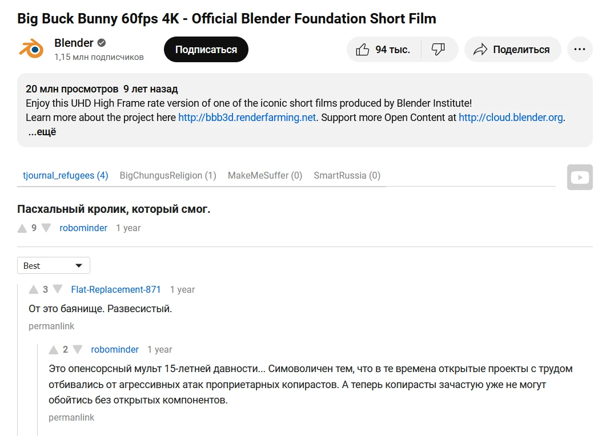
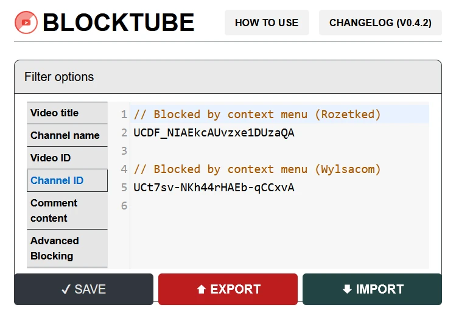

Более удобный просмотр видео в браузере.

<!--more-->

## Return YouTube Dislike

> **Основная статья:** [Return YouTube Dislike](/wiki/youtube/dislike)

[Return YouTube Dislike](https://returnyoutubedislike.com) возвращает счётчик
дизлайков. Это помогает правильно воспринимать видео перед просмотром и легко
узнавать мнение зрителей, а также помогает находить качественные руководства и
обзоры.

Количество дизлайков берётся из архивных данных до отключения счётчика и
экстраполированного поведения пользователей расширения. Это неточное значение,
но довольно реалистичное.

- [Chromium](https://chromewebstore.google.com/detail/gebbhagfogifgggkldgodflihgfeippi)
- [Firefox](https://addons.mozilla.org/firefox/addon/return-youtube-dislikes)
(Только ПК)
- [Пользовательский скрипт](https://raw.githubusercontent.com/Anarios/return-youtube-dislike/main/Extensions/UserScript/Return%20Youtube%20Dislike.user.js)
(Tampermonkey)

## Unhook

> **Основная статья:** [Unhook](/wiki/unhook)

[Unhook](https://unhook.app) убирает отвлекающие элементы интерфейса:
рекомендации, следующие видео и другое. Таким образом можно отучить себя от
бесконечной ленты видео и смотреть только тех авторов, на которых вы подписаны.

В расширении есть меню, в котором можно быстро переключать видимость отдельных
элементов.

- [Chromium](https://chromewebstore.google.com/detail/khncfooichmfjbepaaaebmommgaepoid)
- [Firefox](https://addons.mozilla.org/firefox/addon/youtube-recommended-videos)
(ПК и Android)

## SponsorBlock

> **Основная статья:** [SponsorBlock](/wiki/sponsorblock)

[SponsorBlock](https://sponsor.ajay.app) — расширение и API для пропуска
раздражающих сегментов в видео на YouTube. Пользователи отмечают напоминания о
подписке, заставки, рекламу, тем самым создавая базу данных, которой может
пользоваться любой желающий.

- [Chromium](https://chromewebstore.google.com/detail/mnjggcdmjocbbbhaepdhchncahnbgone)
- [Firefox](https://addons.mozilla.org/addon/sponsorblock) (ПК и Android)
- [Safari](https://github.com/ajayyy/SponsorBlock/wiki/Safari)

## DeArrow

> **Основная статья:** [DeArrow](/wiki/dearrow)

[DeArrow](https://dearrow.ajay.app) — расширение и API для замены эмоциональных
и вызывающих обложек и названий видео на YouTube. Пользователи предлагают свои
названия, тем самым создавая базу данных, которой может пользоваться любой
желающий.

- [Chromium](https://chromewebstore.google.com/detail/enamippconapkdmgfgjchkhakpfinmaj)
- [Firefox](https://addons.mozilla.org/firefox/addon/dearrow) (ПК и Android)
- [Safari](https://apps.apple.com/app/id6451469297)

> [!note]
> Официальное расширение является платным. Можно купить ключ за единоразовый
платёж. Это нужно для поддержки разработчиков и оплаты серверов. Однако вы
можете [запросить бесплатный доступ](https://dearrow.ajay.app/free).

## Закадровый перевод видео

[Закадровый перевод видео] от Яндекса доступен в любом браузере. Он берётся из
серверов Яндекса через прокси. Перевод и субтитры можно скачать. Поддерживаются
многие сайты, не только YouTube. Подробнее смотрите в
[вики](https://github.com/ilyhalight/voice-over-translation/wiki/[RU]-FAQ).

1. Установите расширение для пользовательских скриптов:
    - [Tampermonkey] для Chromium и Firefox
    - [Userscripts] для Safari
2. Установите [скрипт](https://raw.githubusercontent.com/ilyhalight/voice-over-translation/master/dist/vot.user.js)

Также есть [консольная программа](https://github.com/FOSWLY/vot-cli) для запроса
и скачивания перевода.

[Закадровый перевод видео]: https://github.com/ilyhalight/voice-over-translation#readme
[Tampermonkey]: https://www.tampermonkey.net
[Userscripts]: https://apps.apple.com/app/id1463298887

## Comet

Расширение, которое заменяет комментарии с YouTube на комментарии с Reddit.

На Reddit происходят гораздо более содержательные обсуждения, чем на YouTube.
Комментарии на Reddit расположены в виде дерева. Пользователи могут голосовать
за или против, чтобы продвинуть комментарии вверх или вниз.

Комментарии с Reddit появляются тогда, когда какой-либо пользователь Reddit
публикует ссылку на видео в любом сообществе. Расширение покажет все сообщества
и посты с обсуждениями этого видео. Подписчики разных сообществ имеют
собственные мнения, поэтому можно узнать мнение разных людей об одном видео.

Видео на Reddit публикуются очень редко, даже англоязычные популярных авторов.
Но когда это происходит, можно узнать что-то новое и интересное.

Также Comet позволяет смотреть комментарии с Reddit для любой страницы в
интернете.

Расширение будет запрашивать комментарии с Reddit каждый раз при открытии
страницы просмотра видео. Авторизация не требуется. Расширение с [открытым
исходным кодом](https://github.com/z0ccc/comet), не содержит рекламу и не
собирает данные.

- [Chromium](https://chromewebstore.google.com/detail/amlfbbehleledmbphnielafhieceggal)
- [Firefox](https://addons.mozilla.org/firefox/addon/comet_comments) (Только ПК)
- [Microsoft Edge](https://microsoftedge.microsoft.com/addons/detail/cccloigbofabjmobhmcnpaekcifmpjlb)

## BlockTube

[BlockTube](https://github.com/amitbl/blocktube#readme) — расширение, которое
позволяет блокировать нежелательный контент на YouTube: видео, каналы и
комментарии по ключевым словам, регулярным выражениям или функциями JavaScript.
Можно скрывать видео, просмотренные более определённого процента, или по
заданной общей длительности. Кроме того, можно блокировать автоматические
плейлисты (джемы), Shorts и прочие элементы интерфейса. У каждого видео и канала
будет есть кнопка в контекстном меню, позволяющая добавить в чёрный список.

Расширение полностью блокирует видео, как скрывая их с сайта, так и предотвращая
просмотр по ссылке или встроенному плееру. Такое поведение можно изменить в
настройках.

- [Chromium](https://chromewebstore.google.com/detail/bbeaicapbccfllodepmimpkgecanonai)
- [Firefox](https://addons.mozilla.org/firefox/addon/blocktube) (ПК и Android)
- [Руководство](https://github.com/amitbl/blocktube/wiki)

