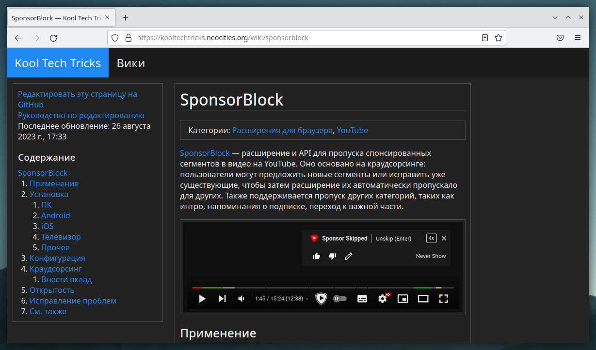
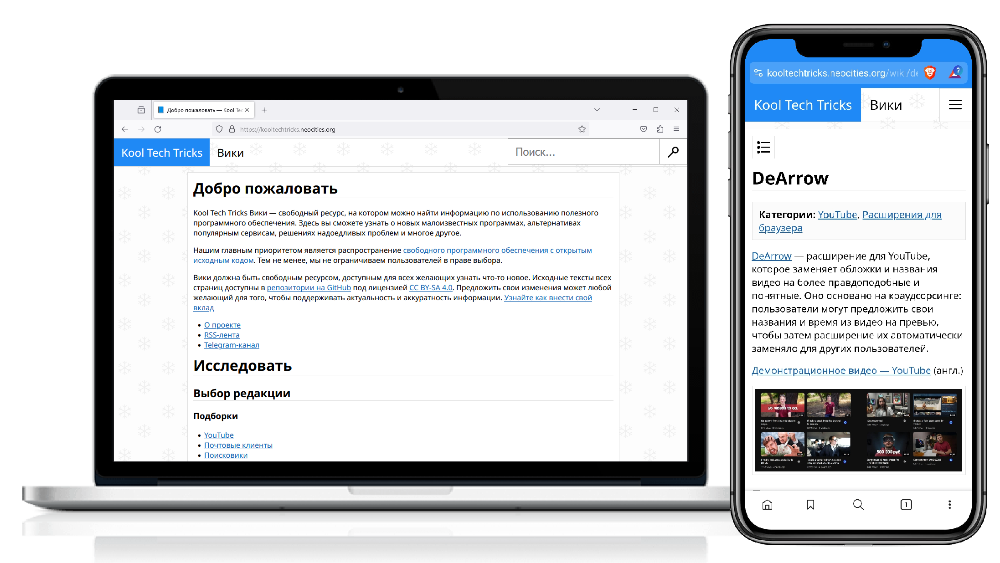
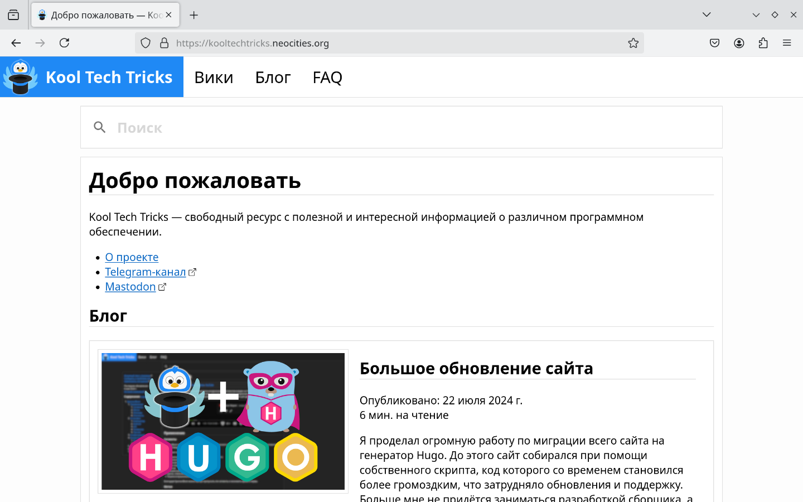
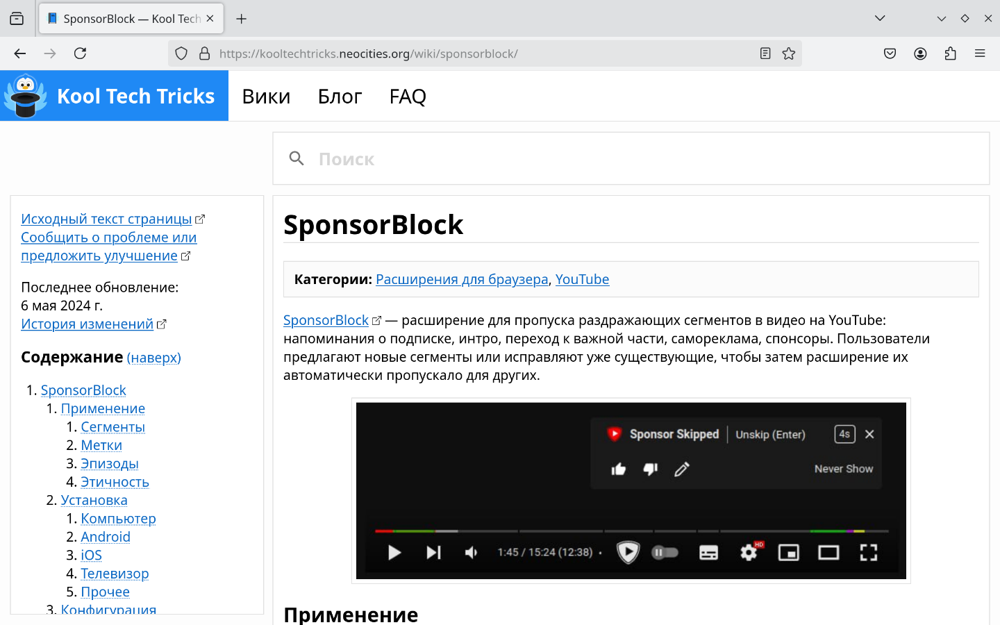

+++
title = 'История'
publishDate = 2024-07-22T13:30:00Z
lastmod = 2024-07-22T14:44:00Z
description = 'История развития Kool Tech Tricks.'
+++

# История

История развития Kool Tech Tricks.

## 2023

### 2 марта: Telegram-канал

[Telegram-канал](https://t.me/KoolTechTricks) был создан для того, чтобы иметь
возможность делиться интересными находками и полезным ПО с другими людьми.

### 27 августа: Вики

Со временем, Telegram-канал наполнялся различными полезными программами. Для
них требовались подробные руководства, но лимит символов и нежелание читать
длинные посты вынуждали сокращать информацию. Посты трудно архивировать, и они
легко теряются в истории. С ними не удобно делиться вне Telegram.

Для решения этих проблем был создан сайт Kool Tech Tricks Вики. Он размещён
публично в сети Интернет, что позволяет легко находить информацию и делиться
ею с другими людьми. Кроме того, становится удобнее поддерживать данные в
актуальном состоянии, благодаря системе контроля версий
[Git](https://git-scm.com) и размещению исходных текстов в публичном репозитории
на [GitHub](https://github.com/KoolTechTricks/content), что также открывает
возможность вносить свой вклад заинтересованным людям.

Для сборки сайта был написан скрипт на языке Python. Идея была взята с
[Neowiki](https://github.com/MineRobber9000/neowiki).

### 26 декабря: Обновление сайта

Сайт приходилось обновлять: это скрипт сборки (Python) и фронтенд (HTML, CSS,
JavaScript). Код становился громоздким, его нужно было переписывать. В таком
состоянии сайт трудно обновлять.

Было решено переписать сайт практически с нуля, используя освоенные навыки и
готовую базу. Новый скрипт был написан на языке Rust, а кодовая база поделена
на модули. Так стало проще отлаживать программу, при этом она собиралась в
единый исполняемый файл. Фронтенд был значительно улучшен, стало удобнее
просматривать страницы.

Также появились дополнительные возможности: поиск через DuckDuckGo, увеличение
изображений, боковая панель на мобильных устройствах, новогодний дизайн,
количество страниц в категориях и на домашней странице.

## 2024

### 22 июля: Миграция на Hugo

Скрипт сборки на Rust тоже со временем становилось труднее поддерживать.
Нужно было регулярно проводить рефакторинг кодовой базы. Чтобы добавить новый
раздел на сайте, например, блог, нужно было переписывать значительную часть
кода. Это очень тяжёлая задача для одного человека, которому нужно также
заниматься содержимым страниц.

[Hugo](https://gohugo.io) — это готовый генератор статичных сайтов, написанный
на языке Go. Изначально планировалось написать на нём блог, так как чаще всего
Hugo используется для этого. Оказалось, что Hugo достаточно мощный, чтобы
написать на нём сайт для Вики.

Было решено переписать сайт на Hugo, чтобы избавиться от задачи поддерживать
скрипт сборки сайта. Теперь необходимо поддерживать шаблоны, но это гораздо
проще, чем раньше.

В фронтенде исправлены многие вещи: индексация поисковыми системами, навигация
клавиатурой и экранными дикторами, опыт использования без JavaScript.

На сайте появились разделы Блог и FAQ. Появились ленты RSS для категорий.
Получилось упростить структуру репозитория со страницами, так как все метаданные
теперь находятся внутри страниц. Добавлен поиск на стороне клиента
[Pagefind](https://pagefind.app).

Подробнее про это обновление можно прочитать
[в блоге](/blog/2024/07/website-update).

