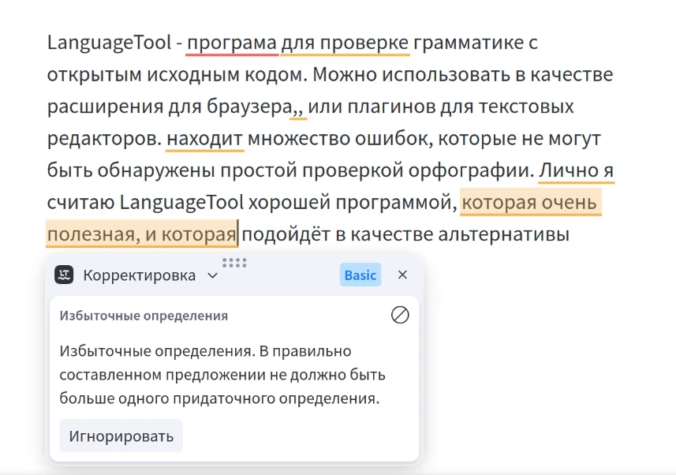

+++
title = 'LanguageTool'
categories = []
publishDate = 2024-11-02T16:33:00Z
lastmod = 2024-11-02T16:33:00Z
description = """Программа для проверки грамматики с открытым исходным кодом. \
Можно использовать расширение для браузера или плагины для текстовых \
редакторов. Находит типичные ошибки, которые не могут быть обнаружены простой \
проверкой орфографии. Подойдёт в качестве альтернативы Grammarly."""
layout = 'single'
cover = 'plugins/browser.webp'
featured = false
+++

# LanguageTool


[LanguageTool] — программа для проверки грамматики с
[открытым исходным кодом] [^1]. Можно использовать в качестве расширения для
браузера или [плагинов](plugins) для текстовых редакторов. Находит типичные
ошибки, которые не могут быть обнаружены простой проверкой орфографии. Подойдёт
в качестве альтернативы Grammarly.

[LanguageTool]: https://languagetool.org
[открытым исходным кодом]: https://github.com/languagetool-org/languagetool

## Применение

При написании писем, статей и прочих текстов формального стиля могут допускаться
различные грамматические ошибки. Простая проверка орфографии, встроенная во
многие текстовые редакторы, способна обнаруживать только неверное написание
слов. Чтобы находить более сложные ошибки, нужно использовать программы для
[обработки естественного языка]. Таковыми являются LanguageTool и Grammarly.

Grammarly — это наиболее популярная программа для проверки грамматики, однако
пользоваться ей крайне не рекомендуется. Это проприетарная программа, запущенная
на одном центральном сервере. У вас нет возможности убедиться в том, что она не
использует и не передаёт ваши конфиденциальные тексты третьим лицам. Известно,
что Grammarly [обучает искусственный интеллект] на ваших текстах по умолчанию.

LanguageTool, с другой стороны, с [открытым исходным кодом] [^1] и может быть
запущен на вашем компьютере. [Официальный сервер](#официальный-сервер)
`languagetool.org` не хранит и не передаёт ваши тексты третьим лицам. Но если
вы не доверяете, то можете запустить сервер [на своём компьютере](local). Так
все данные будут обрабатываться локально. Это настоятельно рекомендуется для
вашей конфиденциальности и снижения риска утечек данных.

LanguageTool находит типичные ошибки, основываясь на правилах. Он не сможет
обнаружить все ошибки, а только распространённые. Вы можете
[создать свои правила](#правила) и отправить их разработчикам.

[обработки естественного языка]: https://ru.wikipedia.org/wiki/Обработка_естественного_языка
[обучает искусственный интеллект]: https://support.grammarly.com/hc/en-us/articles/25555503115277-Product-Improvement-and-Training-Control

## Официальный сервер

Официальный сервер LanguageTool размещён по адресу
[languagetool.org][LanguageTool]. Он уже настроен в большинстве
[дополнений и плагинов](plugins). На сайте вы можете проверять грамматику
текстов или документов бесплатно и без регистрации. Однако для дополнительной
функциональности и улучшенного обнаружения ошибок вы можете зарегистрироваться
и оплатить подписку.

Утверждается, что официальный сервер не собирает и не использует отправляемые
тексты. Вы можете ознакомиться с [политикой конфиденциальности]. Однако
перефразирование текста обрабатывается на серверах OpenAI.

[политикой конфиденциальности]: https://languagetool.org/legal/privacy

## Локальный сервер

> **Основная статья:** [Локальный сервер LanguageTool](local)

Вы можете установить и запустить LanguageTool на своём компьютере или сервере.
Таким образом отправляемые тексты будут обрабатываться на устройстве под вашим
контролем. Это гарантирует полную конфиденциальность ваших данных и минимизирует
риски утечки данных.

## Использование

Обычно LanguageTool используется в качестве расширения для браузера и [плагинов]
для текстовых редакторов. Есть официальные приложения для [Windows], [macOS] и
[iOS], но они с закрытым исходным кодом и не позволяют выбрать
[локальный сервер], а также сохраняют тексты на сервере.

[плагинов]: plugins
[Windows]: https://languagetool.org/windows-desktop
[macOS]: https://languagetool.org/mac-desktop
[iOS]: https://apps.apple.com/app/id1534275760
[локальный сервер]: local

Интерфейс и конфигурация могут отличаться, но, как правило, всегда можно
встретить следующие настройки:

- Проверка текста на ошибки в реальном времени или при сохранении.
- Добавление слов и правил в исключения.
- «Родной язык» для предупреждений о «ложных друзьях» при проверке текстов,
написанных не на вашем родном языке.
- Адрес сервера (официальный по умолчанию), авторизация.

Также в настройках может быть доступен «Придирчивый режим». Он предоставляет
больше предложений по стилю и тональности, выявляет длинные или сложные
предложения, распознает просторечия и излишества, заранее предлагает синонимы
для часто употребляемых слов.

## Правила

LanguageTool находит типичные ошибки, основываясь на правилах. Каждое правило
имеет шаблон, который описывает ошибку. Простой шаблон может быть просто
последовательностью слов, например, "bed", за которым следует "English", что
является ошибкой, так как вместо этого должно быть "bad English". В тексте,
который проверяет LanguageTool, ищется этот шаблон, и если он найден, то текст
в этом месте считается содержащим ошибку.

Вы можете создать своё правило в [редакторе правил]. Доступен простой режим, в
котором вам требуется пошагово ввести информацию и параметры. На выходе вы
получите это правило в формате XML, которое вы сможете [отправить разработчикам]
или использовать локально.

Прочитайте [обзор разработки] (Development Overview), чтобы узнать больше о
формате правил, а также как использовать свои правила в локальной установке
LanguageTool.

[редакторе правил]: https://community.languagetool.org/ruleEditor2/index
[отправить разработчикам]: https://github.com/languagetool-org/languagetool/issues
[обзор разработки]: https://dev.languagetool.org/development-overview

## Ссылки

- [Википедия](https://en.wikipedia.org/wiki/LanguageTool)
- [Форум](https://forum.languagetool.org)

[^1]: Исходный код открыт только у сервера LanguageTool. Официальные расширения
и приложения с закрытым исходным кодом.
