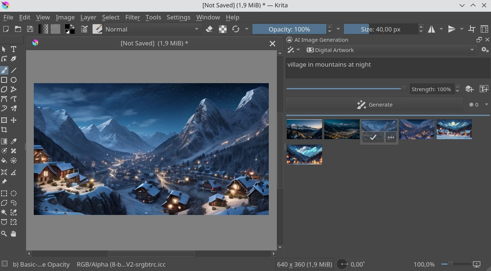

+++
title = 'Генерация изображений при помощи локального искусственного интеллекта'
categories = ['ai', 'software-collections']
publishDate = 2024-10-06T11:40:00Z
lastmod = 2024-10-06T11:40:00Z
description = """Генеративный искусственный интеллект для создания, \
дополнения, увеличения и редактирования изображений локально на вашем \
устройстве. Подойдут в качестве альтернативы Midjourney."""
cover = 'stable-diffusion-web-ui.webp'
featured = false
+++

# Генерация изображений при помощи локального искусственного интеллекта


Генеративный искусственный интеллект для создания, дополнения, увеличения и
редактирования изображений локально на вашем устройстве. Подойдут в качестве
альтернативы Midjourney.

> [!note]
> Все программы на этой странице представлены в ознакомительном формате. Мы даём
лишь небольшое описание и обзор, а также краткую инструкцию для начала работы.
Если вы хотите узнать больше об определённом проекте, перейдите по указанным
ссылкам на его сайт, репозиторий и документацию.

> **Смотрите также:**
[Что такое локальный искусственный интеллект и как им пользоваться?](/wiki/local-ai)

## Stable Diffusion web UI

|||
|-|-|
|**Платформа**|Windows, macOS, Linux
|**Технологии**|Python, Открытый исходный код ([GNU AGPL v3.0])
|**Сайт**|—
|**Документация**|https://github.com/AUTOMATIC1111/stable-diffusion-webui/wiki
|**Обсуждение**|[GitHub](https://github.com/AUTOMATIC1111/stable-diffusion-webui/discussions)
|**Отчёты об ошибках**|https://github.com/AUTOMATIC1111/stable-diffusion-webui/issues
|**Исходный код**|https://github.com/AUTOMATIC1111/stable-diffusion-webui
|**Системные требования**|ОЗУ: 8 ГБ, Видеопамять: 4 ГБ
|**Скачать**|Смотрите [инструкцию](https://github.com/AUTOMATIC1111/stable-diffusion-webui#installation-and-running)
|**Метод установки и запуска**|Устанавливаемая программа, сервер
|**Информация актуальна для версии**|1.9.4

Веб-интерфейс Stable Diffusion для генерации изображений с использованием
дискретной видеокарты. Можно запустить как на своём компьютере, так и в облаке —
обработка происходит локально. Для генерации используются готовые модели, но
можно натренировать на своих изображениях.

Этот интерфейс предоставляет огромное количество возможностей и настроек:
генерация изображения по текстовому запросу (txt2img), расширение холста
(Outpainting), вписывание (Inpainting), цветной набросок, увеличение разрешения,
акцент внимания.
[Полный список возможностей](https://github.com/AUTOMATIC1111/stable-diffusion-webui/wiki/Features)

В текстовых запросах можно добавлять негативные ключевые слова (Negative
prompt). Чтобы изменить вес элементов запроса, выделите текст и нажмите
`Ctrl`+`СтрелкаВверх/Вниз`.

## Krita AI Diffusion

|||
|-|-|
|**Платформа**|Windows, macOS, Linux
|**Технологии**|Python, Плагин для [Krita], Открытый исходный код ([GNU GPL v3.0])
|**Сайт**|https://www.interstice.cloud
|**Документация**|https://github.com/Acly/krita-ai-diffusion/wiki
|**Обсуждение**|[GitHub](https://github.com/Acly/krita-ai-diffusion/discussions)
|**Отчёты об ошибках**|https://github.com/Acly/krita-ai-diffusion/issues
|**Исходный код**|https://github.com/Acly/krita-ai-diffusion
|**Системные требования**|[В инструкции](https://www.interstice.cloud/plugin)
|**Скачать**|[Инструкция](https://www.interstice.cloud/plugin), [GitHub](https://github.com/Acly/krita-ai-diffusion/releases/latest)
|**Метод установки и запуска**|Плагин
|**Информация актуальна для версии**|1.20.1

Плагин для [Krita], свободной программы с открытым исходным кодом для рисования,
добавляющий возможность генерации изображений с минимальными усилиями.

Этот плагин призван обеспечить то же, что и «Генеративная заливка/расширение» в
Adobe Photoshop, и даже больше. Настройте силу, чтобы улучшить существующее
содержимое (img2img) или генерируйте изображения с нуля. Для опытных
пользователей доступны мощные настройки.

Пользователям доступны такие функции, как создание изображений с нуля по
текстовому описанию, вписывание части изображения и замена (Inpainting),
расширение холста (Outpainting), увеличение разрешения изображения,
[редактирование поз](https://youtu.be/-QDPEcVmdLI),
[интерпретация холста в реальном времени](https://youtu.be/AF2VyqSApjA),
[ControlNet](https://youtu.be/Ly6USRwTHe0).

Для работы плагина нужен сервер, который можно установить локально или на
облако, а также нужно скачать модели. Первоначальная настройка происходит
автоматически в настройках плагина.

В отличие от функций ИИ в [Adobe Photoshop], с Krita и этим плагином
гарантируется полный контроль над вашими данными, которые никогда не будут
использоваться для обучения моделей без вашего ведома. Krita полностью бесплатна
и с открытым исходным кодом.

**Системные требования:**
- **NVIDIA:** GTX 1060 6 ГБ или лучше. Вы можете столкнуться с
проблемами и ограничениями на старых видеокартах.
- **AMD:** 12 ГБ видеопамяти или больше. Медленно с ограниченным набором
возможностей. Требуется пользовательская установка для Linux.
- **Apple:** Apple Silicon через MPS (поддержка сообщества).
- **Процессор:** Работает, но очень медленно.

[Krita]: https://krita.org
[Adobe Photoshop]: https://x.com/SamSantala/status/1798292952219091042

## Upscayl

|||
|-|-|
|**Платформа**|Windows, macOS, Linux
|**Технологии**|Electron, Открытый исходный код ([GNU AGPL v3.0])
|**Сайт**|https://upscayl.org
|**Документация**|https://docs.upscayl.org
|**Обсуждение**|[GitHub](https://github.com/orgs/upscayl/discussions)
|**Отчёты об ошибках**|https://github.com/upscayl/upscayl/issues
|**Исходный код**|https://github.com/upscayl/upscayl
|**Системные требования**|Нужна видеокарта, поддерживающая Vulkan. Многие интегрированные видеокарты не работают. [Подробнее](https://github.com/upscayl/upscayl/wiki/Compatibility-List)
|**Скачать**|[Инструкция](https://github.com/upscayl/upscayl#-installation), [GitHub](https://github.com/upscayl/upscayl/releases), [Linux Flathub](https://flathub.org/apps/org.upscayl.Upscayl)
|**Метод установки и запуска**|Портативная / устанавливаемая программа
|**Информация актуальна для версии**|2.11.5

Бесплатная программа с открытым исходным кодом для увеличения разрешения
изображений при помощи искусственного интеллекта.

Upscayl увеличивает и улучшает изображения с низким разрешением, используя
продвинутые алгоритмы искусственного интеллекта. Обработка производится
локально, подключение к интернету не требуется.

По умолчанию предоставляется несколько моделей для разных стилей картинок, но
можно добавить [другие](https://github.com/upscayl/custom-models).

Upscayl подойдёт в качестве альтернативы платному и проприетарному Gigapixel AI.

## SuperImage

|||
|-|-|
|**Платформа**|Android, Windows
|**Технологии**|C++, Kotlin (Android), Java (Windows), Проприетарное ПО / Открытый исходный код ([GNU GPL v3.0])
|**Сайт**|https://superimage.io
|**Документация**|https://docs.upscayl.org
|**Обсуждение**|[Telegram](https://t.me/super_image)
|**Отчёты об ошибках**|https://github.com/upscayl/upscayl/issues
|**Исходный код**|https://github.com/Lucchetto/SuperImage
|**Системные требования**|Google Play может не давать установить приложение из-за системных требований, но если установить из другого источника, то проблем при использовании, возможно, не будет.
|**Скачать**|Проприетарная версия: [Google Play](https://play.google.com/store/apps/details?id=com.zhenxiang.superimage), [Windows](https://superimage.io/#download-section); Свободная версия: [GitHub](https://github.com/Lucchetto/SuperImage/releases/latest), [Архив F-Droid](https://f-droid.org/archive) (`com.zhenxiang.superimage`)
|**Метод установки и запуска**|Приложение / Портативная программа
|**Информация актуальна для версии**|3.0.3

Приложение для Android и Windows, которое позволяет увеличивать разрешение
изображений при помощи искусственного интеллекта на вашем устройстве.

Обработка производится локально, подключение к интернету не требуется. Скорость
зависит от мощности вашего устройства, и может сильно замедлять его работу во
время процесса.

Есть две версии приложения для Android: **свободная** и **проприетарная**
(для Windows доступна только проприетарная). Обе версии выполняют операции над
изображениями локально без подключения к интернету, но могут отслеживать
активность пользователя. Если вы обеспокоены за свою конфиденциальность, вы
можете запретить приложению доступ в интернет при помощи [TrackerControl] или
[NetGuard].

**Свободная версия** с открытым исходным кодом по лицензии [GNU GPL v3.0]. Она
больше не получает обновлений и поддержки, но продолжает функционировать. Доступ
к исходному коду приложения и возможность собрать его позволяет убедиться в том,
что оно работает как есть.

**Проприетарная версия** продолжает получать обновления. Здесь нет возможности
точно убедиться в том, что приложение работает как есть. Оно может содержать
больше трекеров. Также есть реклама и платная версия с большим набором
возможностей. Перед первой операцией для каждой настройки требуется скачать
модель, затем подключение к интернету не требуется.

[TrackerControl]: /wiki/trackercontrol
[NetGuard]: https://netguard.me

[GNU AGPL v3.0]: https://www.gnu.org/licenses/agpl-3.0.html
[GNU GPL v3.0]: https://www.gnu.org/licenses/gpl-3.0.html
