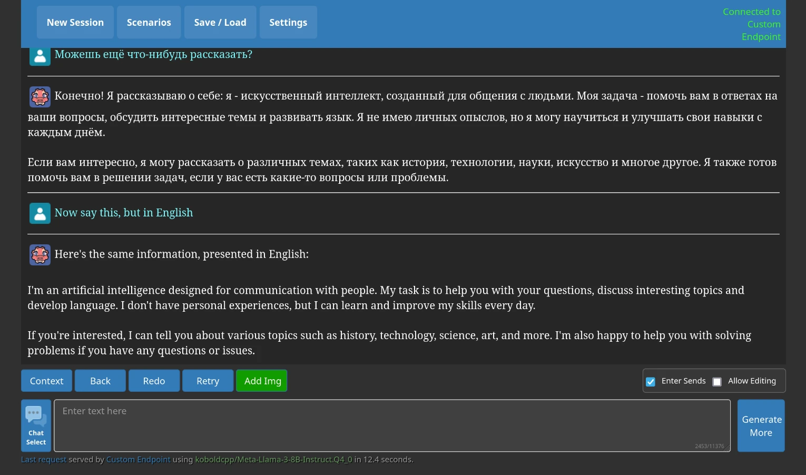
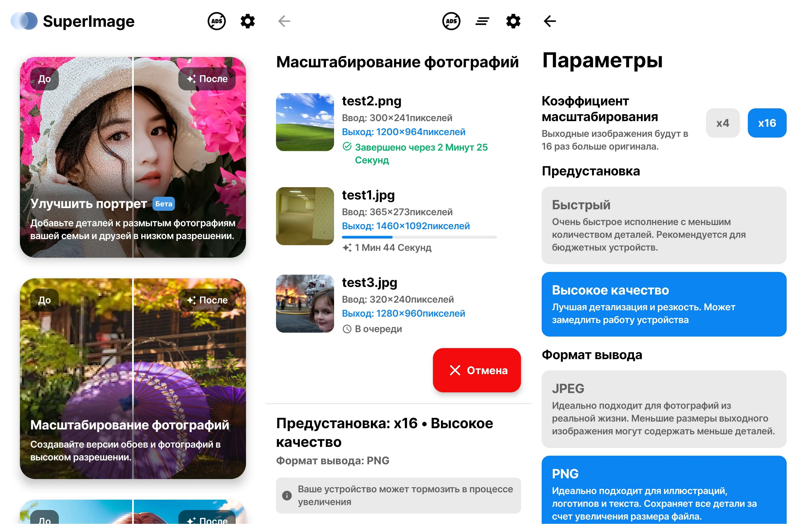

+++
title = 'Локальный искусственный интеллект'
categories = ['ai', 'software-collections']
publishDate = 2024-07-11T15:04:12Z
lastmod = 2024-09-24T17:49:00Z
description = """Подборка программ генеративного искусственного интеллекта \
(ИИ) и нейросетей, которые можно запускать локально на своём компьютере или \
сервере для обеспечения полного контроля и безопасности ваших данных. \
Локальные нейросети не подключаются к внешним серверам для обработки \
запросов."""
cover = 'gpt4all.webp'
featured = true
+++

# Локальный искусственный интеллект


Подборка программ генеративного искусственного интеллекта (ИИ) и нейросетей,
которые можно запускать локально на своём компьютере или сервере для обеспечения
полного контроля и безопасности ваших данных. Локальные нейросети не
подключаются к внешним серверам для обработки запросов.

> [!note]
> Все программы на этой странице представлены в ознакомительном формате. Мы даём
лишь небольшое описание и обзор, а также краткую инструкцию для начала работы.
Если вы хотите узнать больше об определённом проекте, перейдите по указанным
ссылкам на его сайт, репозиторий и документацию.

## Применение

Сервисами искусственного интеллекта и нейросетей от компаний OpenAI, Microsoft,
Google и других очень удобно пользоваться, но в то же время крайне небезопасно.
Во-первых, они натренированы на закрытом наборе данных, что может привести к
нарушению авторского права. Во-вторых, компании могут использовать ваши личные
данные для дальнейшего обучения моделей ИИ без вашего ведома, что может привести
к утечкам, особенно если ИИ используется для создания контента, который нужно не
разглашать. В-третьих, компании могут ограничивать доступ определённым людям, а
также требовать оплатить подписку для использования всех функций или снятия
ограничений.

Локальный ИИ запускается на вашем компьютере или сервере, который вы можете
контролировать. Он не использует внешние серверы для обработки запросов. Это
даёт гарантию, что ваши личные данные остаются при вас и не используются
третьими лицами в целях собственной выгоды. Вы можете использовать готовые
открытые модели или обучить свою, не беспокоясь о возможных утечках или
нарушениях авторского права.

Локальный ИИ использует мощности вашего оборудования, приобретённого на ваши
деньги. Это намного выгоднее, чем периодически оплачивать подписку для доступа
к ИИ от компаний. Вы можете не беспокоиться, что при интенсивном использовании
на вас наложат ограничения — они зависят лишь от вашего оборудования.

## Установка

Каждая программа имеет свои инструкции по установке. Вам нужно открыть
официальный сайт/документацию/руководство и следовать указаниям.

Перед началом убедитесь, что у вас соблюдены все требования к оборудованию и
программному обеспечению (установлены указанные версии библиотек).

Обычно, для установки используется скрипт, который автоматически выполняет
нужные действия. Но иногда возникают проблемы, из-за которых его нужно
отредактировать вручную.

Для работы локального ИИ требуется скачать модели. Они могут весить несколько
гигабайт.

## Исправление проблем

Если не получилось установить какую-либо программу, выполните следующие
действия:
1. Внимательно прочитайте сообщение об ошибке, оно может дать подсказку.
2. Внимательно перечитайте инструкцию, возможно вы упустили какое-то важное
действие или не выполнили требование (отсутствует библиотека нужной версии).
Попробуйте начать сначала.
3. Поищите решение в разделе **Отчёты об ошибках (Issues)** репозитория проекта.
Возможно, это баг программы. Искать нужно сначала среди открытых отчётов, а
затем среди закрытых.
4. Поищите решение в интернете.
5. Спросите у других людей в **обсуждении** проекта. При общении соблюдайте
правила сообщества, грамотно задавайте вопросы и пишите сообщения на английском
языке (если нет русскоязычной группы).

Если ваша проблема была вызвана багом программы, то, возможно, следует завести
отчёт об ошибке, если это не было сделано ранее.

# Создание текста

Генеративный искусственный интеллект для создания осмысленного текста.

Для работы ИИ нужны большие языковые модели (LLM). Они обучены на большом объёме
текста. Закрытые языковые модели (OpenAI ChatGPT) могут быть обучены на
материалах, защищённых авторским правом, из-за чего ответы ИИ могут тоже
нарушать авторское право. Нет никакой возможности узнать, на каких текстах
основаны закрытые языковые модели.

Открытые языковые модели гораздо безопаснее использовать в коммерческих целях.
У каждой модели есть лицензия, которая может разрешать или запрещать её
использование в коммерческих или исследовательских целях.

Список открытых моделей находится
[здесь](https://github.com/eugeneyan/open-llms). Обратите внимание, что
[не все модели можно назвать полностью открытыми](https://opennet.ru/61448).

## GPT4All

- **Платформа:** Windows, macOS, Linux.
- **Технологии:** C++, Qt, Открытый исходный код.
- **Ссылки:**
    - [Сайт](https://www.nomic.ai/gpt4all);
    - [Документация](https://docs.gpt4all.io);
    - [Отчёты об ошибках](https://github.com/nomic-ai/gpt4all/issues);
    - Обсуждение в [Discord](https://discord.gg/mGZE39AS3e);
    - [Исходный код](https://github.com/nomic-ai/gpt4all).
- **Системные требования:**
    - Процессор должен поддерживать инструкции
    [AVX](https://en.wikipedia.org/wiki/Advanced_Vector_Extensions);
    - Место на диске: от 3 ГБ до 8 ГБ (в зависимости от моделей);
    - Оперативная память: от 8 ГБ до 16 ГБ.
- **Скачать:**
    - Онлайн установщик (рекомендовано):
        - [Windows](https://gpt4all.io/installers/gpt4all-installer-win64.exe);
        - [macOS](https://gpt4all.io/installers/gpt4all-installer-darwin.dmg);
        - [Linux](https://gpt4all.io/installers/gpt4all-installer-linux.run).
    - [Офлайн установщик](https://github.com/nomic-ai/gpt4all/releases/latest)
    (нет автоматической проверки на наличие обновлений).

Бесплатный, локально работающий чат-бот с контролем конфиденциальности. Не
требуется видеокарта и подключение к интернету.

GPT4All [очень легко](https://docs.gpt4all.io/gpt4all_desktop/quickstart.html)
установить и запустить на своём компьютере, для этого предоставляются онлайн
установщики.

При первом запуске у вас спросят согласие на анонимную аналитику и передачу
историю переписки в
[общую базу данных GPT4All](https://github.com/nomic-ai/gpt4all-datalake#readme).
Это нужно для создания общедоступной открытой базы данных, которую может скачать
любой желающий. Сбор данных производится на добровольной основе. Вы можете
отказаться, если не хотите, чтобы ваши чаты оказались в общем доступе.

В программе есть окно просмотра доступных языковых моделей. Для каждой модели
указаны характеристики, системные требования, лицензия. В списке есть и онлайн
модели (ChatGPT). В отличие от локальных моделей, они работают на удалённых
серверах, к которым вы не имеете доступа и контроля, и для них нужен API-ключ.

[LocalDocs](https://docs.gpt4all.io/gpt4all_desktop/localdocs.html) позволяет
интегрировать информацию из ваших текстовых файлов в языковую модель. При этом
никакие файлы не покидают компьютер, если не использовать онлайн модель.
Поддерживаются форматы простого текста (.txt), Markdown (.md), PDF. После
генерации ответа можно посмотреть источники на эти файлы, на которых ссылалась
модель.

GPT4All может использоваться как библиотека
[Python](https://docs.gpt4all.io/gpt4all_python/home.html).

## Jan

|||
|-|-|
|**Платформа**|Windows, macOS, Linux
|**Технологии**|Electron, Открытый исходный код ([GNU AGPL v3.0])
|**Сайт**|https://jan.ai
|**Документация**|https://jan.ai/docs
|**Обсуждение**|[Discord](https://discord.com/invite/FTk2MvZwJH)
|**Отчёты об ошибках**|https://github.com/janhq/jan/issues
|**Исходный код**|https://github.com/janhq/jan
|**Системные требования**|https://github.com/janhq/jan#requirements-for-running-jan
|**Скачать**|https://jan.ai/download

[GNU AGPL v3.0]: https://www.gnu.org/licenses/agpl-3.0.html

Запускайте модели искусственного интеллекта, такие как Llama или Mistral, прямо
на своем устройстве, чтобы повысить уровень конфиденциальности. Нет
необходимости в подключении к Интернету — все данные и обработка выполняются
локально. Чаты, настройки и использование моделей остаются на вашем компьютере.
Они безопасны, могут быть экспортированы и удалены в любой момент. Jan
оптимизирован для любых устройств.

В программе есть вкладка, где можно посмотреть и скачать языковые модели. Также
можно импортировать модель из каталога Hugging Face или файла GGUF. Системные
требования не отображаются, есть лишь метка о производительности на текущем
устройстве. Есть возможность воспользоваться удалёнными моделями (OpenAI, Groq,
Mistral API), которые работают в облаке, но вы теряете контроль над ними. Для
удалённых моделей требуется API-ключ вместо мощного оборудования.

На экране общения можно быстро настроить модель и задать инструкции.

Вы можете запустить локальный сервер и пользоваться API для взаимодействия с
моделью из других программ. Этот API эквивалентен API OpenAI.

В программе есть поддержка расширений. Их нужно где-то найти и установить из
файла.

## Ollama

- **Платформа:** Windows, macOS, Linux.
- **Технологии:** Go, Открытый исходный код.
- **Ссылки:**
    - [Сайт](https://ollama.com);
    - [Отчёты об ошибках](https://github.com/ollama/ollama/issues);
    - Обсуждение в [Discord](https://discord.com/invite/ollama);
    - [Исходный код](https://github.com/ollama/ollama).
- **Системные требования:**
    - Подойдут видеокарты NVIDIA, AMD, Apple. Можно использовать процессор или
    интегрированную видеокарту, но будет работать очень медленно.
    [Подробнее](https://github.com/ollama/ollama/blob/main/docs/gpu.md)
- **Скачать:**
    - [Официальный сайт](https://ollama.com/download).

Программа для получения и запуска больших языковых моделей (LLM) на своём
сервере.

Ollama представляет собой сервер с [интерфейсом командной строки](/wiki/cli).
После его установки должна быть доступна команда `ollama`. Подробную
инструкцию по установке и настройке можно найти
[здесь](https://itsfoss.com/ollama-setup-linux).

Ollama имеет [встроенный каталог языковых моделей](https://ollama.com/library),
и через программу можно легко ими управлять. Обратите внимание, что не все
модели разрешено использовать в коммерческих целях, поэтому смотрите файлы с
лицензией. Установите модель командой `ollama pull <название>` и запустите
командой `ollama run <название>`. Далее можно общаться с языковой моделью в окне
терминала. Введите `/?`, чтобы посмотреть доступные команды.

Для более удобного взаимодействия с искусственным интеллектом можно установить
отдельный [веб-интерфейс](https://itsfoss.com/ollama-web-ui-tools), например,
[Open WebUI](https://github.com/open-webui/open-webui#readme). У сервера есть
API, который можно использовать для интеграции в другие программы. Смотрите
[примеры использования](https://github.com/ollama/ollama/tree/main/examples).

## KoboldCpp

- **Платформа:** Windows, macOS, Linux.
- **Технологии:** C++, Открытый исходный код.
- **Ссылки:**
    - [Документация](https://github.com/LostRuins/koboldcpp/wiki);
    - [Отчёты об ошибках](https://github.com/LostRuins/koboldcpp/issues);
    - Обсуждение в [Discord](https://koboldai.org/discord);
    - [Исходный код](https://github.com/LostRuins/koboldcpp).
- **Скачать:**
    - [GitHub](https://github.com/LostRuins/koboldcpp/releases/latest).

Простая в использовании программа для генерации текста искусственным
интеллектом. Это единый самодостаточный дистрибутив, который основан на
llama.cpp и добавляет универсальный Kobold API, поддержку дополнительных
форматов, генерацию изображений Stable Diffusion, обратную совместимость, а
также пользовательский интерфейс с постоянными историями, инструментами
редактирования, форматами сохранения, памятью, информацией о мире, примечанием
автора, персонажами, сценариями.

Это единый исполняемый файл, который можно запустить как в графическом режиме,
так и в консольном. Сам же интерфейс открывается в браузере (адрес по умолчанию:
`localhost:5001`). С ИИ можно взаимодействовать через API.

KoboldCpp может работать и с изображениями (например, распознавать объекты) при
помощи Stable Diffusion, но для этого требуются отдельные модели.

# Создание изображений

Генеративный искусственный интеллект для создания, дополнения, увеличения и
редактирования изображений.

## Stable Diffusion web UI

- **Платформа:** Windows, macOS, Linux.
- **Технологии:** Python, Открытый исходный код.
- **Ссылки:**
    - [Документация](https://github.com/AUTOMATIC1111/stable-diffusion-webui/wiki);
    - [Отчёты об ошибках](https://github.com/AUTOMATIC1111/stable-diffusion-webui/issues);
    - [Исходный код](https://github.com/AUTOMATIC1111/stable-diffusion-webui).
- **Системные требования:**
    - Работает для NVIDIA, AMD, Apple Silicon и Intel.
    - Рекомендуется больше 8 ГБ ОЗУ и 4 ГБ видеопамяти.
    - Может понадобиться старая версия Python. На Linux для установки нужной
    версии Python можно использовать
    [pyenv](https://github.com/pyenv/pyenv#readme). Обязательно укажите путь к
    другой версии Python в скрипте `webui.sh`.
    [Подробнее](https://github.com/AUTOMATIC1111/stable-diffusion-webui/issues/15667#issuecomment-2086724532)
- **Скачать:**
    - [Руководство](https://github.com/AUTOMATIC1111/stable-diffusion-webui#installation-and-running).

Веб-интерфейс Stable Diffusion для генерации изображений с использованием
дискретной видеокарты. Можно запустить как на своём компьютере, так и в облаке —
обработка происходит локально. Для генерации используются готовые модели, но
можно натренировать на своих изображениях.

Этот интерфейс предоставляет огромное количество возможностей и настроек:
генерация изображения по текстовому запросу (txt2img), расширение холста
(Outpainting), вписывание (Inpainting), цветной набросок, увеличение разрешения,
акцент внимания. С полным списком возможностей можно ознакомиться
[здесь](https://github.com/AUTOMATIC1111/stable-diffusion-webui/wiki/Features).

В текстовых запросах можно добавлять негативные ключевые слова (Negative
prompt). Чтобы изменить вес элементов запроса, выделите текст и нажмите
`Ctrl`+`СтрелкаВверх/Вниз`.

## Krita AI Diffusion

- **Платформа:** Windows, macOS, Linux.
- **Технологии:** Python, Плагин для [Krita](https://krita.org), Открытый
исходный код.
- **Ссылки:**
    - [Документация](https://github.com/Acly/krita-ai-diffusion/wiki);
    - [Отчёты об ошибках](https://github.com/Acly/krita-ai-diffusion/issues);
    - Обсуждения на
    [GitHub](https://github.com/Acly/krita-ai-diffusion/discussions);
    - [Исходный код](https://github.com/Acly/krita-ai-diffusion).
- **Системные требования:**
    - **NVIDIA:** GTX 1060 6 ГБ или лучше. Вы можете столкнуться с
    проблемами и ограничениями на старых видеокартах.
    - **AMD:** 12 ГБ видеопамяти или больше. Медленно с ограниченным набором
    возможностей. Требуется пользовательская установка для Linux.
    - **Apple:** Apple Silicon через MPS (поддержка сообщества).
    - **Процессор:** Работает, но очень медленно.
- **Скачать:**
    - [Руководство](https://www.interstice.cloud/plugin);
    - [GitHub](https://github.com/Acly/krita-ai-diffusion/releases/latest).

Плагин для [Krita](https://krita.org), свободной программы с открытым исходным
кодом для рисования, добавляющий возможность генерации изображений с
минимальными усилиями.

Этот плагин призван обеспечить то же, что и «Генеративная заливка/расширение» в
Adobe Photoshop, и даже больше. Настройте силу, чтобы улучшить существующий
контент (img2img) или генерируйте изображения с нуля. Для опытных пользователей
доступны мощные настройки.

Пользователям доступны такие функции, как создание изображений с нуля по
текстовому описанию, вписывание части изображения и замена (Inpainting),
расширение холста (Outpainting), увеличение разрешения изображения,
[редактирование поз](https://youtu.be/-QDPEcVmdLI),
[интерпретация холста в реальном времени](https://youtu.be/AF2VyqSApjA),
[ControlNet](https://youtu.be/Ly6USRwTHe0).

Для работы плагина нужен сервер, который можно установить локально или на
облако, а также нужно скачать модели. Первоначальная настройка происходит
автоматически в настройках плагина.

В отличие от функций ИИ в
[Adobe Photoshop](https://x.com/SamSantala/status/1798292952219091042), с Krita
и этим плагином гарантируется полный контроль над вашими данными, которые
никогда не будут использоваться для обучения моделей без вашего ведома. Krita
полностью бесплатна и с открытым исходным кодом.

## Upscayl

- **Платформа:** Windows, macOS, Linux.
- **Технологии:** Electron, Открытый исходный код.
- **Ссылки:**
    - [Сайт](https://upscayl.org);
    - [Документация](https://docs.upscayl.org);
    - [Отчёты об ошибках](https://github.com/upscayl/upscayl/issues);
    - Обсуждение на [GitHub](https://github.com/orgs/upscayl/discussions);
    - [Исходный код](https://github.com/upscayl/upscayl).
- **Системные требования:**
    - Нужна видеокарта, поддерживающая Vulkan. Многие интегрированные видеокарты
    не работают.
    [Подробнее](https://github.com/upscayl/upscayl/wiki/Compatibility-List)
- **Скачать:**
    - [Инструкция](https://github.com/upscayl/upscayl#-installation);
    - [GitHub](https://github.com/upscayl/upscayl/releases);
    - [Flathub](https://flathub.org/apps/org.upscayl.Upscayl) (Linux).

Бесплатная программа с открытым исходным кодом для увеличения разрешения
изображений при помощи искусственного интеллекта.

Upscayl увеличивает и улучшает изображения с низким разрешением, используя
продвинутые алгоритмы искусственного интеллекта. Обработка производится
локально, подключение к интернету не требуется.

По умолчанию предоставляется несколько моделей для разных стилей картинок, но
можно добавить [другие](https://github.com/upscayl/custom-models).

Upscayl подойдёт в качестве альтернативы платному и проприетарному Gigapixel AI.

## SuperImage

- **Платформа:** Android, Windows.
- **Технологии:** C++, Kotlin (Android), Java (Windows), Проприетарное /
с открытым исходным кодом.
- **Ссылки:**
    - [Сайт](https://superimage.io);
    - Обсуждение в [Telegram](https://t.me/super_image);
    - [Исходный код старой версии](https://github.com/Lucchetto/SuperImage).
- **Системные требования:**
    - Google Play может не давать установить приложение из-за системных
    требований, но если установить из другого источника, то проблем при
    использовании, возможно, не будет.
- **Скачать:**
    - **Проприетарная версия:**
        - [Google Play](https://play.google.com/store/apps/details?id=com.zhenxiang.superimage);
        - [Windows](https://superimage.io/#download-section).
    - **Свободная версия:**
        - [GitHub](https://github.com/Lucchetto/SuperImage/releases/latest);
        - [Архив F-Droid](https://f-droid.org/archive): `com.zhenxiang.superimage`

Приложение для Android и Windows, которое позволяет увеличивать разрешение
изображений при помощи искусственного интеллекта на вашем устройстве.

Обработка производится локально, подключение к интернету не требуется. Скорость
зависит от мощности вашего устройства, и может сильно замедлять его работу во
время процесса.

Есть две версии приложения для Android: **свободная** и **проприетарная**
(для Windows доступна только проприетарная). Обе версии выполняют операции над
изображениями локально без подключения к интернету, но могут отслеживать
активность пользователя. Если вы обеспокоены за свою конфиденциальность, вы
можете запретить приложению доступ в интернет при помощи
[TrackerControl](/wiki/trackercontrol) или [NetGuard](https://netguard.me).

**Свободная версия** с открытым исходным кодом по лицензии GNU GPL-3.0. Она
больше не получает обновлений и поддержки, но продолжает функционировать. Доступ
к исходному коду приложения и возможность собрать его позволяет убедиться в том,
что оно работает как есть.

**Проприетарная версия** продолжает получать обновления. Здесь нет возможности
точно убедиться в том, что приложение работает как есть. Оно может содержать
больше трекеров. Также есть реклама и платная версия с большим набором
возможностей. Перед первой операцией для каждой настройки требуется скачать
модель, затем подключение к интернету не требуется.
