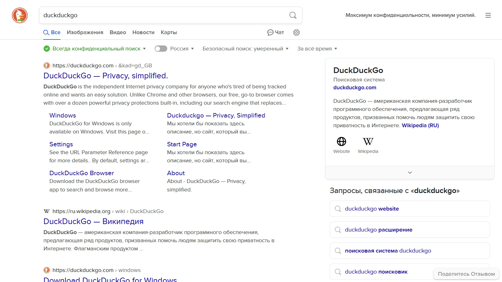
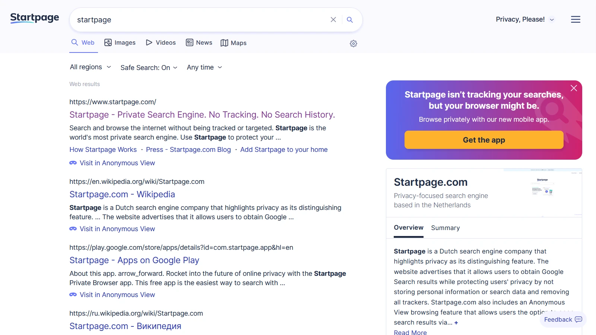
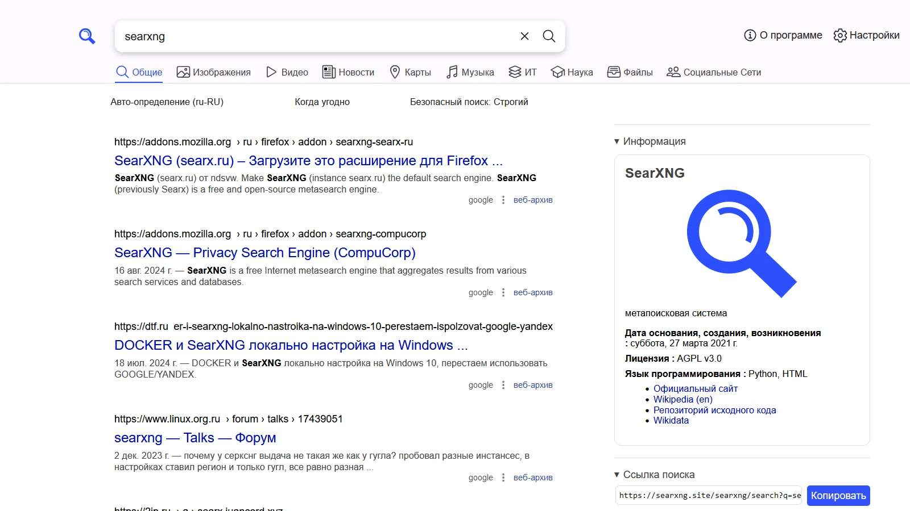
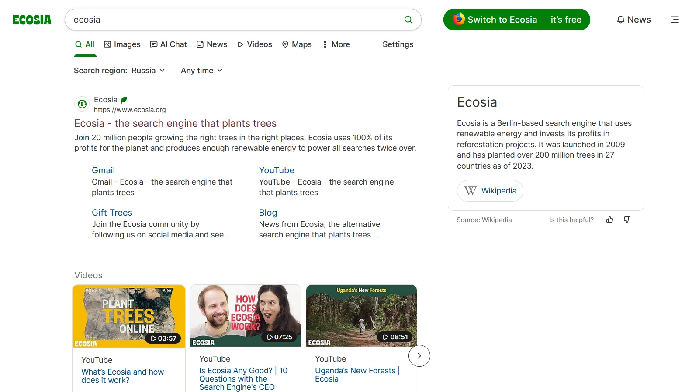
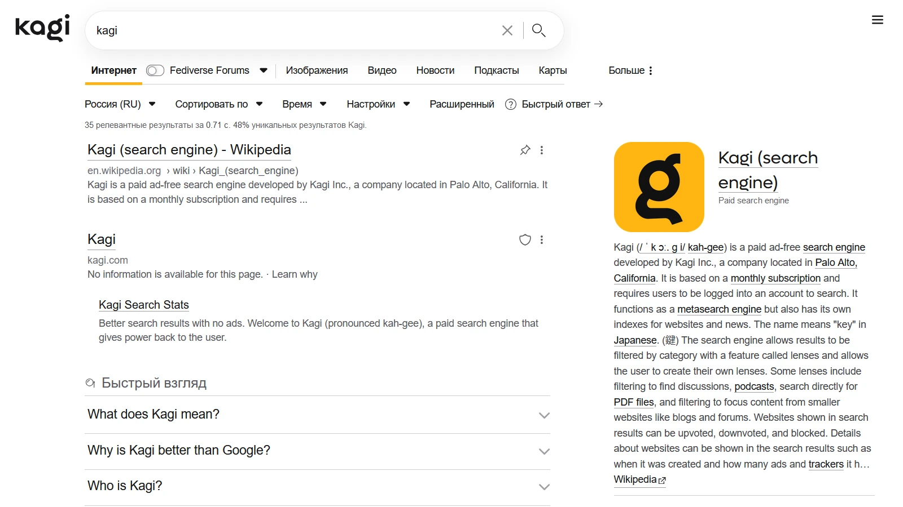
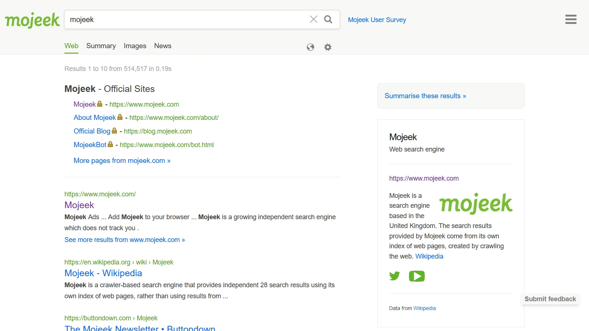

+++
title = 'Поисковики'
categories = ['internet', 'privacy', 'software-collections']
publishDate = 2023-12-16T17:01:34Z
lastmod = 2024-09-22T12:38:00Z
description = """Поиск в Интернете без опасений слежки и сбора персональных
данных в целях показа таргетированной рекламы."""
cover = 'image.webp'
featured = true
+++

# Поисковики


Популярные поисковые системы Google, Яндекс и Bing позволяют быстро найти нужную
информацию в Интернете. Однако эти корпорации будут собирать историю запросов и
персональные данные в целях показа таргетированной рекламы.

На этой странице перечислены альтернативные поисковики, которые уважают
конфиденциальность пользователей. Вы можете выбрать один или несколько для
повседневного использования, чтобы искать в интернете без опасений слежки и
сбора данных.

Альтернативные поисковики зачастую

- не имеют своего индексатора и получают данные из других поисковых систем;

- зарабатывают на более конфиденциальном виде рекламы, которая появляется
только по контексту текущего запроса;

- не содержат полезных дополнительных функций, однако во многих присутствуют
быстрые ответы и команды, чего вполне достаточно для комфортного использования.

## DuckDuckGo

|||
|-|-|
|**Сайт**|https://duckduckgo.com
|**Справка**|https://duckduckgo.com/duckduckgo-help-pages
|**Википедия**|https://en.wikipedia.org/wiki/DuckDuckGo

Самый известный альтернативный поисковик, который предустановлен в большинстве
браузеров. Его очень просто и удобно использовать.

**Общая информация:**
|||
|-|-|
|**Расположение**|🇺🇸 США
|**Год основания**|2008
|**Источники**|[Bing](https://techcrunch.com/2024/05/23/bing-is-down-bringing-duckduckgo-and-ecosia-down-too)
|**Монетизация**|[Реклама от Microsoft] по текущему запросу (можно отключить), подписка [Privacy Pro]. [Подробнее](https://duckduckgo.com/duckduckgo-help-pages/company/how-duckduckgo-makes-money)

[Реклама от Microsoft]: https://duckduckgo.com/duckduckgo-help-pages/company/ads-by-microsoft-on-duckduckgo-private-search
[Privacy Pro]: https://duckduckgo.com/duckduckgo-help-pages/privacy-pro

**Функции:**
|||
|-|-|
|**Типы поиска**|Видео, новости, карты
|**Команды**|Случайное число, калькулятор, переводчик, конвертер, color picker (выбор цвета), словарь, IP, User-Agent, 2048
|**Перенаправление запроса (!g)**|✅ [Есть](https://duckduckgo.com/bangs)
|**Фильтры сайтов**|❌ Нет
|**Сохранение настроек**|✅ [По URL](https://duckduckgo.com/duckduckgo-help-pages/settings/params) или [анонимно в облаке](https://duckduckgo.com/duckduckgo-help-pages/settings/cloud-save)
|**Метод HTTP[^1]**|GET по умолчанию, POST активируется в настройках
|**Официальный API для разработчиков**|❌ Нет

**Изображения:**
|||
|-|-|
|**Фильтры**|Время, размер, цвет, GIF, прозрачные, лицензия
|**Отображение лицензии**|❌ Нет

**Искусственный интеллект:**
|||
|-|-|
|**Функции**|[Чат](https://duckduckgo.com/chat)
|**Модели**|GPT-4o mini, Claude 3, Llama 3.1, Mixtral 8x7B
|**Справка**|https://duckduckgo.com/duckduckgo-help-pages/aichat

**Замечания:**

- Пользователи жалуются на низкое качество результатов поиска.

- В 2022 году было
[обнаружено](https://www.bleepingcomputer.com/news/security/duckduckgo-browser-allows-microsoft-trackers-due-to-search-agreement),
что мобильный браузер DuckDuckGo не блокировал трекеры Microsoft из-за
соглашения.

## Startpage

|||
|-|-|
|**Сайт**|https://www.startpage.com
|**Справка**|https://support.startpage.com/hc
|**Википедия**|https://en.wikipedia.org/wiki/Startpage.com

Первый в мире конфиденциальный поисковик.

**Общая информация:**
|||
|-|-|
|**Расположение**|🇳🇱 Нидерланды (🇪🇺 Евросоюз)
|**Год основания**|2006 (с корнями в [1998](https://en.wikipedia.org/wiki/Startpage.com#History))
|**Источники**|Google
|**Монетизация**|[Реклама](https://support.startpage.com/hc/en-us/articles/5381505381012) по текущему запросу

**Функции:**
|||
|-|-|
|**Типы поиска**|Видео, новости, карты
|**Команды (Быстрые ответы)**|Погода, калькулятор, конвертер, переводчик, словарь. [Полный список](https://support.startpage.com/hc/en-us/articles/5319208151444)
|**Перенаправление запроса (!g)**|❌ Нет
|**Фильтры сайтов**|❌ Нет
|**Сохранение настроек**|✅ По URL
|**Метод HTTP**|POST по умолчанию, GET активируется в настройках
|**Официальный API для разработчиков**|❌ Нет

**Изображения:**
|||
|-|-|
|**Фильтры**|Размер, цвет, GIF, прозрачные, лицензия
|**Отображение лицензии**|❌ Нет

**Искусственный интеллект:** Отсутствует

**Дополнительно:**

- Анонимный просмотр сайтов.

**Замечания:**

- В 2019 году рекламная компания [System1] приобрела Startpage, однако с тех
пор в Startpage ничего не изменилось в отношении конфиденциальности.

[System1]: https://en.wikipedia.org/wiki/System1

## Brave Search

|||
|-|-|
|**Сайт**|https://search.brave.com
|**Справка**|https://search.brave.com/help
|**Википедия**|https://en.wikipedia.org/wiki/Brave_Search

Новейший поисковик от создателей одноимённого
[конфиденциального браузера](https://brave.com).

**Общая информация:**
|||
|-|-|
|**Расположение**|🇺🇸 США
|**Год основания**|2021
|**Источники**|[Собственный индексатор](https://brave.com/blog/search-independence), [Google](https://search.brave.com/help/google-fallback)
|**Монетизация**|[Реклама](https://search.brave.com/help/ads) по текущему запросу, подписка [Brave Premium](https://search.brave.com/help/premium)

**Функции:**
|||
|-|-|
|**Типы поиска**|Видео, новости
|**Команды (Быстрые ответы)**|Погода, калькулятор, конвертер, словарь.
|**Перенаправление запроса (!g)**|✅ Есть
|**Фильтры сайтов**|✅ [Goggles](https://search.brave.com/help/goggles)
|**Сохранение настроек**|❌ Нет
|**Метод HTTP**|Только GET
|**Официальный API для разработчиков**|✅ [Есть](https://brave.com/search/api)

**Изображения:**
|||
|-|-|
|**Источники**|[Собственный индексатор](https://brave.com/blog/image-video-search)
|**Фильтры**|❌ Нет
|**Отображение лицензии**|❌ Нет

**Искусственный интеллект:**
|||
|-|-|
|**Функции**|[Ответ с помощью ИИ](https://brave.com/blog/answer-with-ai), избранные фрагменты, описания
|**Модели**|Собственная модель
|**Справка**|https://search.brave.com/help/ai

**Замечания:**

- Наличие излишних функций ради следования трендам: криптовалюты, искусственный
интеллект.

## SearXNG

|||
|-|-|
|**Список публичных серверов**|https://searx.space
|**Документация**|https://docs.searxng.org
|**Исходный код**|https://github.com/searxng/searxng
|**Википедия**|https://en.wikipedia.org/wiki/SearXNG

[Метапоисковая система], которая собирает результаты из разных поисковиков и
отдельных сайтов. Использование источников можно переключить в настройках.

SearXNG с открытым исходным кодом: вы можете запустить его на своём сервере
или использовать публичные серверы сообщества. Благодаря этому обеспечивается
максимальная конфиденциальность, но вы должны доверять администраторам сервера,
на котором вы используете SearXNG.

[Метапоисковая система]: https://ru.wikipedia.org/wiki/Метапоисковая_система
[SearX]: https://en.wikipedia.org/wiki/Searx

> [!note]
> Все свойства, функции и возможности, указанные ниже,
**зависят от сервера и/или настроек**.

**Общая информация:**
|||
|-|-|
|**Расположение**|🌍 По всему миру
|**Год основания**|2014 (как [Searx]), 2021 (как SearXNG)
|**Источники**|Google, Bing, Brave, Mojeek + отдельные сайты (Wikipedia, GitHub и др.)
|**Монетизация**|Пожертвования

**Функции:**
|||
|-|-|
|**Типы поиска**|Видео, новости, карты, музыка, IT, научные статьи, файлы, социальные сети
|**Команды (Быстрые ответы)**|Калькулятор, конвертер, IP, User-Agent, хеширование строки, среднее арифметическое, случайная строка или число
|**Перенаправление запроса (!g)**|⚠️ Внутри SearXNG
|**Фильтры сайтов**|⚠️ Ограничено
|**Сохранение настроек**|✅ По URL или хешу
|**Метод HTTP**|POST или GET
|**Официальный API для разработчиков**|✅ [Есть](https://docs.searxng.org/dev/search_api.html)

**Изображения:**
|||
|-|-|
|**Источники**|Bing, Google, Brave, DeviantArt, Flickr, Imgur, Openverse, Pinterest, Unsplash и другие
|**Фильтры**|Время, безопасный поиск
|**Отображение лицензии**|❌ Нет

**Искусственный интеллект:** [Отсутствует](https://github.com/searxng/searxng/issues/2163)

**Дополнительно:**

- Ссылка на страницы в [веб-архиве](https://web.archive.org).

- Удаление [отслеживающих параметров](/wiki/clearurls) из URL.

## Ecosia

|||
|-|-|
|**Сайт**|https://www.ecosia.org
|**Справка**|https://ecosia.helpscoutdocs.com
|**Википедия**|https://ru.wikipedia.org/wiki/Ecosia

Экологичный, но не конфиденциальный поисковик. Деньги с рекламы направляются
благотворительным организациям, которые сажают деревья по всему миру. Ecosia
уменьшает количество углекислого газа в атмосфере, а серверы питаются от
солнечных панелей. Компания публикует
[ежемесячные финансовые отчёты](https://ecosia.co/finreportsen).

**Общая информация:**
|||
|-|-|
|**Расположение**|🇩🇪 Германия (🇪🇺 Евросоюз)
|**Год основания**|2009
|**Источники**|[Bing, Google](https://ecosia.helpscoutdocs.com/article/505-new-search-providers)
|**Монетизация**|[Реклама](https://ecosia.helpscoutdocs.com/article/33-how-does-ecosia-make-money), [Магазин](https://plant.ecosia.org)

**Функции:**
|||
|-|-|
|**Типы поиска**|Видео, новости, карты
|**Команды (Быстрые ответы)**|Погода, калькулятор, конвертер, словарь, переводчик, IP
|**Перенаправление запроса (!g)**|✅ Есть
|**Фильтры сайтов**|❌ Нет
|**Сохранение настроек**|❌ Нет
|**Метод HTTP**|Только GET
|**Официальный API для разработчиков**|❌ Нет

**Изображения:**
|||
|-|-|
|**Фильтры**|Размер, цвет, GIF, прозрачные, лицензия
|**Отображение лицензии**|❌ Нет

**Искусственный интеллект:**
|||
|-|-|
|**Функции**|[Чат](https://www.ecosia.org/chat)
|**Модели**|ChatGPT
|**Справка**|https://ecosia.helpscoutdocs.com/article/534-ecosia-chat-ai
|**Примечание**|Доступно не во всех регионах. Возможно, ради этой функции Ecosia вынуждена платить за API вместо посадки деревьев.

**Замечания:**

- Сотрудничество с Bing или Google: Ecosia может собирать и отправлять ваш
[IP-адрес, поисковый запрос](https://ecosia.helpscoutdocs.com/article/377-ip-addresses),
[идентификатор](https://ecosia.helpscoutdocs.com/article/48-what-are-personalized-search-results),
[файлы cookie](https://www.ecosia.org/privacy).

## Kagi

|||
|-|-|
|**Сайт**|https://kagi.com
|**Справка**|https://help.kagi.com
|**Википедия**|https://en.wikipedia.org/wiki/Kagi_(search_engine)

[Платный](https://help.kagi.com/kagi/why-kagi/why-pay-for-search.html)
поисковик без рекламы. Есть пробный период — 100 запросов. Имеются семейные
подписки.

Поисковик собирает результаты из разных источников. Он приоритезирует
[малые сайты](https://blog.kagi.com/small-web) и занижает сайты с большим
количеством рекламы и трекеров (которые, как правило, содержат бесполезную
информацию).

**Общая информация:**
|||
|-|-|
|**Расположение**|🇺🇸 США
|**Год основания**|2018
|**Источники**|[Разные источники](https://help.kagi.com/kagi/search-details/search-sources.html) и собственный индексатор
|**Монетизация**|[Подписки](https://help.kagi.com/kagi/plans/plan-types.html), [Товары](https://store.kagi.com)

**Функции:**
|||
|-|-|
|**Типы поиска**|Видео, новости, карты, подкасты
|**Команды (Быстрые ответы)**|Калькулятор, конвертер, переводчик, IP
|**Перенаправление запроса (!g)**|✅ Есть
|**Фильтры сайтов**|✅ [Линзы](https://help.kagi.com/kagi/settings/lenses.html)
|**Сохранение настроек**|✅ В аккаунте
|**Метод HTTP**|Только GET
|**Официальный API для разработчиков**|✅ [Есть](https://help.kagi.com/kagi/api/search.html)

**Изображения:**
|||
|-|-|
|**Фильтры**|Новейшие, GIF, HD, размер, цвет, лицензия, кадрирование
|**Отображение лицензии**|❌ Нет

**Искусственный интеллект:**
|||
|-|-|
|**Функции**|Ассистент, быстрый ответ, краткое изложение страниц, вопросы по странице в чате
|**Модели**|Anthropic, OpenAI, Mistral AI, Google
|**Справка**|https://help.kagi.com/kagi/ai/kagi-ai.html

**Дополнительно:**

- Повышение и понижение [доменов](https://kagi.com/stats?stat=leaderboard).

- Информация о сайте (значок с щитом): количество рекламы и трекеров, категория
трекеров, популярность сайта, дата регистрации домена, язык и скорость сайта.

- Настройки: отображение поисковых виджетов, замена URL в поисковой выдаче,
персонализация интерфейса, загрузка пользовательского CSS.

## Mojeek

|||
|-|-|
|**Сайт**|https://www.mojeek.com
|**Справка**|https://www.mojeek.com/support
|**Википедия**|https://en.wikipedia.org/wiki/Mojeek

Нишевый независимый поисковик, который использует собственную индексацию.
Начинался как личный проект. Придерживается политике конфиденциальности
«без слежки».

Здесь вряд ли получится найти релевантные ответы, так как количество
проиндексированных страниц намного ниже, чем у поисковых гигантов. Тем не менее
Mojeek может пригодиться в определённых случаях.

Доступно очень мало регионов и языков. Русский язык не поддерживается.

**Общая информация:**
|||
|-|-|
|**Расположение**|🇬🇧 Великобритания
|**Год основания**|2004
|**Источники**|[Собственный индексатор](https://www.mojeek.com/bot.html)
|**Монетизация**|[Реклама без отслеживания](https://www.mojeek.com/support/ads)

**Функции:**
|||
|-|-|
|**Типы поиска**|Новости
|**Команды (Быстрые ответы)**|Калькулятор, конвертер
|**Перенаправление запроса (!g)**|✅ Через настраиваемые кнопки
|**Фильтры сайтов**|✅ [Focus](https://www.mojeek.com/focus/dashboard)
|**Сохранение настроек**|✅ По URL
|**Метод HTTP**|Только GET
|**Официальный API для разработчиков**|✅ [Есть](https://www.mojeek.com/support/api)

**Изображения:**
|||
|-|-|
|**Источники**|[Openverse] или [Pixabay]
|**Фильтры**|❌ Нет
|**Отображение лицензии**|✅ Есть

**Искусственный интеллект:**
|||
|-|-|
|**Функции**|[Краткая выжимка из результатов запроса](https://blog.mojeek.com/2024/04/mojeek-search-summary.html)
|**Модели**|[Mixtral] через [Lepton]

[Openverse]: https://openverse.org
[Pixabay]: https://pixabay.com
[Mixtral]: https://mistral.ai/news/mixtral-of-experts
[Lepton]: https://www.lepton.ai

## Ссылки

Дополнительные материалы с субъективным мнением о поисковиках.

### Видео

- [The ULTIMATE Search Engine Tier List (Based Tier to Surveillance Tier)](https://odysee.com/@ericnmurphy:9/the-ultimate-search-engine-tier-list:b)
(2023) — Eric Murphy [33:55]
- [BYE DUCK DUCK GO, here's my new search engine! Private Alternatives to Google](https://youtu.be/x9q3qPxrTqg)
(2022) — The Linux Experiment [17:40]

[^1]: При использовании метода GET ваш поисковый запрос будет отображаться в
адресной строке браузера и, следовательно, сохранится в истории браузера.
При методе POST поисковый запрос не отображается в адресной строке и не
сохраняется в истории, однако браузер может спрашивать о необходимости отправить
данные заново при перезагрузке страницы или отображать ошибку об истечении срока
действия документа. Метод POST считается более конфиденциальным.
