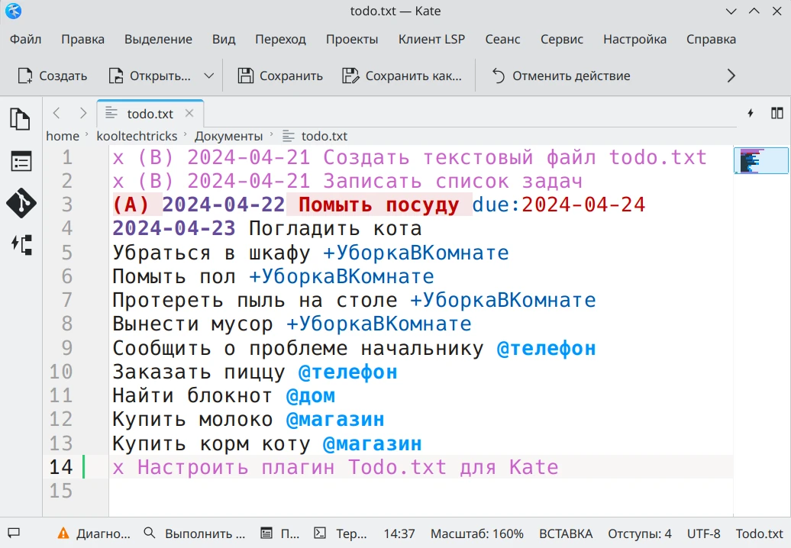
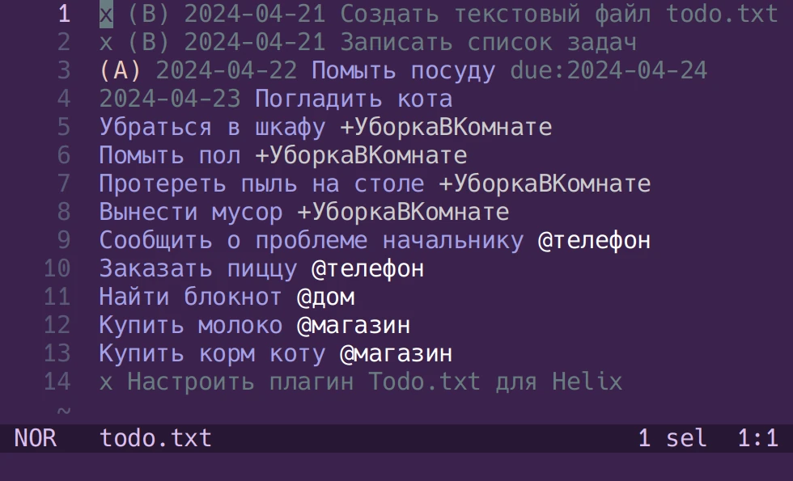

Добавьте поддержку открытого формата [Todo.txt](/wiki/todo-txt) в удобные для
вас текстовые редакторы.

<!--more-->

## Obsidian

### TodoTxt

Плагин [TodoTxt](https://github.com/mvgrimes/obsidian-todotxt-plugin#readme) для
[Obsidian](https://obsidian.md) дополнит текущую базу знаний списками задач в
открытом текстовом формате Todo.txt.

На данный момент (версия 2.1.7) формат файла по умолчанию записывается как
`*.todotxt`, что может быть не очень удобно для синхронизации и миграции. В
настройках плагина можно указать дополнительные расширения в качестве
экспериментальной настройки.

Плагин позволяет искать и фильтровать задачи, но нельзя сортировать и смотреть
время создания.

- [Добавить в Obsidian](obsidian://show-plugin?id=todotxt)


### TodoTxt Codeblocks

Плагин [TodoTxt Codeblocks] позволяет встраивать списки задач Todo.txt в
текстовые файлы Markdown.

Функциональность сильно ограничена в рамках встроенного элемента. Тем не менее
присутствует сортировка, предпросмотр в реальном времени, группировка по
проектам с возможностью сворачивания, архивация.

- [Добавить в Obsidian](obsidian://show-plugin?id=todotxt-codeblocks)


[TodoTxt Codeblocks]: https://github.com/benjamonnguyen/obsidian-todotxt-codeblocks#readme

## Visual Studio Code

### todotxt-mode

Этот плагин добавляет подсветку синтаксиса Todo.txt, а также команды для
выполнения действий (сортировка, перемещение, изменение). Команды можно найти
в палитре (`F1`) по запросу `todotxt-mode`, а также назначить им сочетания
клавиш.

Найти плагин todotxt-mode можно в каталогах расширений:
- [Visual Studio Marketplace](https://marketplace.visualstudio.com/items?itemName=davraamides.todotxt-mode)
(для [VSCode] от Microsoft)
- [Open VSX](https://open-vsx.org/extension/davraamides/todotxt-mode)
(для [VSCodium] и [Code - OSS])

[VSCode]: https://code.visualstudio.com
[VSCodium]: https://vscodium.com
[Code - OSS]: https://github.com/microsoft/vscode


## Kate / KWrite

В [Kate](https://kate-editor.org) и KWrite встроена поддержка синтаксиса
Todo.txt.

По умолчанию подсвечиваются только файлы `todo.txt`. Чтобы подсвечивать файлы
вида `<project>.todo.txt`, нужно изменить формат:

Настройки → Открытие и сохранение → Типы файлов → Тип файла: Разное/Todo.txt
→ Расширения файлов: `*todo.txt`.



## Vim

### todo.txt-vim

[Плагин](https://github.com/freitass/todo.txt-vim), который добавляет подсветку
синтаксиса Todo.txt в [Vim](https://www.vim.org) и сочетания клавиш для
выполнения действий (сортировка, изменение приоритета, добавление даты, отметка
завершённости).


## Helix

В [Helix](https://helix-editor.com) встроена поддержка синтаксиса Todo.txt и
автоматическая сортировка задач. Для этого необходимо [отредактировать] файл
`languages.toml`:

[отредактировать]: https://docs.helix-editor.com/languages.html

```toml
[[language]]
name = "todotxt"
scope = "text.todotxt"
file-types = [{ glob = "todo.txt" }, { glob = "*.todo.txt" }, "todotxt"]
auto-format = true  # false - не сортировать задачи при сохранении файла
```

