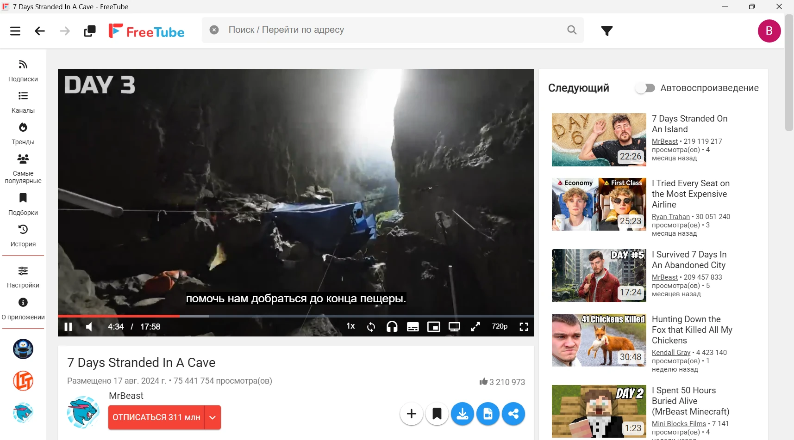
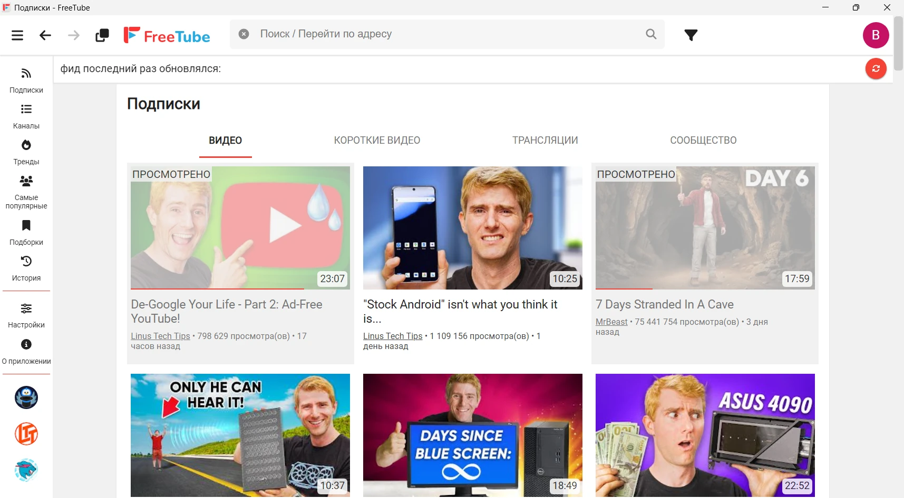
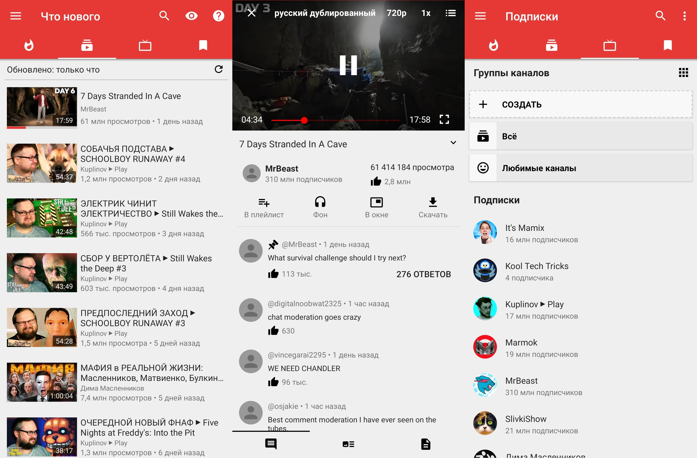
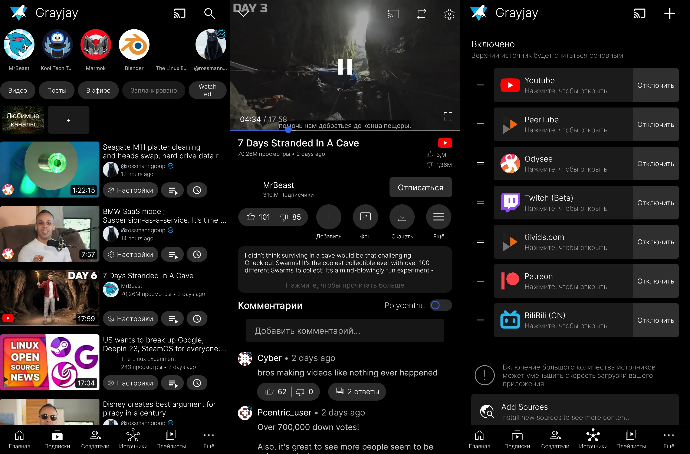

+++
title = 'Приложения YouTube'
categories = ['software-collections', 'privacy']
publishDate = 2024-08-27T17:25:00Z
lastmod = 2024-12-21T13:25:00Z
description = """Более удобный и конфиденциальный просмотр видео."""
cover = 'image.webp'
featured = false
+++

# Приложения YouTube


Официальные приложения YouTube хоть и стабильные и не имеют проблем с
воспроизведением, всё же не достают нужных функций и персонализации. Google
важно, чтобы пользователи больше проводили времени в приложении и смотрели
больше рекламы. Соответственно, приложения построены так, чтобы завлекать
внимание (Shorts, Playables и другое).

Сторонние приложения построены для максимального удобства просмотра и содержат
минимум излишних функций. Они получают данные с YouTube путём извлечения или
через Invidious/Piped, а затем интерпретируют их по-своему. Из-за этого могут
возникать проблемы со стабильностью и воспроизведением. Google не нравятся
подобные приложения, так как они позволяют смотреть видео в обход рекламы. Тем
не менее разработчики прикладывают все возможные усилия для того, чтобы вам
было удобно смотреть видео.

Большинство сторонних приложений не используют официальный API YouTube (это
запрещено условиями пользования) и работают в локальном режиме, получая данные
путём извлечения. Это значит, что подписки, история, плейлисты, настройки
хранятся на вашем устройстве и не отправляются на сторонние серверы. Это
значительно повышает ваш уровень конфиденциальности, ведь Google не сможет
узнать о ваших интересах. Соответственно, у вас теряется возможность смотреть
рекомендации.

Большинство сторонних приложений с открытым исходным кодом. Это даёт возможность
свободно их изучать, модифицировать и распространять, согласно лицензии.
Благодаря этому пользователи могут напрямую принимать участие в развитии
своих любимых приложений, сообщая об ошибках, предлагая новые функции и
внедряя их.

Некоторые приложения позволяют смотреть видео не только на YouTube, но и на
других платформах.

> [!caution]
> Так как в сторонних приложениях отсутствует реклама от YouTube, авторы не
смогут получать деньги за просмотр рекламы или Premium. Вам следует поддерживать
ваших любимых авторов другими способами.

## FreeTube

|||
|-|-|
|**Платформа**|Windows, macOS, Linux
|**Поддерживаемые сервисы**|YouTube
|**Технологии**|Electron, Открытый исходный код ([GNU AGPL v3.0])
|**Получение данных**|Извлечение YouTube / [Invidious](https://invidious.io)
|**Сайт**|https://freetubeapp.io
|**FAQ**|https://docs.freetubeapp.io/faq
|**Отчёты об ошибках**|https://github.com/FreeTubeApp/FreeTube/issues
|**Поддержать разработчиков**|https://github.com/FreeTubeApp/FreeTube#donate
|**Исходный код**|https://github.com/FreeTubeApp/FreeTube
|**Информация актуальна для версии**|0.22.0 Beta

- Windows, macOS, Linux:
[GitHub](https://github.com/FreeTubeApp/FreeTube/releases/latest)
- Linux: [Flathub](https://flathub.org/apps/io.freetubeapp.FreeTube)

FreeTube — это настольное приложение YouTube, созданное для более
конфиденциального просмотра видео. Вы можете наслаждаться любимым контентом и
авторами, не беспокоясь о том, что ваши интересы отслеживаются. Все ваши данные
хранятся локально и никогда не отправляются и не публикуются в интернете.
Благодаря многим функциям, схожим с YouTube, FreeTube стал одним из лучших
способов приватного просмотра YouTube на компьютере.

**Персонализация:**
|||
|-|-|
|**Тема**|✅ Множество тёмных и светлых
|**Выбор цветовой схемы**|✅ Есть

**Поддерживаемый контент:**
|||
|-|-|
|**Прямые трансляции и премьеры**|✅ Есть
|**Чат трансляции**|✅ Есть
|**Посты сообщества**|✅ Есть
|**Запланированное**|✅ Есть

**Просмотр:**
|||
|-|-|
|**Следующие видео**|✅ Есть, можно скрыть
|**История просмотра**|✅ Есть
|**Сохранение времени просмотра**|✅ Есть
|**Эпизоды**|✅ Есть
|**Субтитры**|✅ Есть
|**Выбор звуковой дорожки**|✅ Есть
|**«Картинка-в-картинке»**|✅ Есть
|**Скорость воспроизведения**|✅ Настраиваемый лимит и интервал
|**Скачивание видео**|⚠️ Есть, но неудобно
|**Только аудио**|✅ Есть
|**Передача экрана**|❌ Нет
|**Приватный режим («Инкогнито»)**|❌ Нет
|**Масштабирование видео**|❌ Нет
|**Скриншот видео**|✅ Есть (отключено по умолчанию)
|**Скрытие/блокировка контента**|✅ Скрытие каналов, фильтр контента по ключевым словам
|**[Return YouTube Dislike]**|❌ [Нет](https://github.com/FreeTubeApp/FreeTube/issues/1927)

**Подписки:**
|||
|-|-|
|**Группы каналов**|✅ Есть (в виде профилей)
|**Уведомления**|❌ Нет
|**Скрытие просмотренных видео**|✅ Есть
|**Импорт**|✅ FreeTube, YouTube, NewPipe
|**Экспорт**|✅ FreeTube, YouTube (CSV, JSON, OPML), NewPipe

**Плейлисты:**
|||
|-|-|
|**Управление локальными плейлистами**|✅ Есть
|**Сохранение плейлистов платформы**|✅ Есть
|**Скачивание плейлистов**|❌ Нет
|**Очередь воспроизведения**|❌ Необходимо создать плейлист вручную
|**«Смотреть позже»**|✅ Есть
|**Импорт**|✅ FreeTube
|**Экспорт**|✅ FreeTube

**Данные:**
|||
|-|-|
|**Хранение**|✅ Локально
|**Резервное копирование**|❌ Вручную
|**Экспорт данных**|⚠️ Всё отдельно, кроме настроек

**[SponsorBlock]:** Отключён по умолчанию
|||
|-|-|
|**Категории сегментов**|✅ Все
|**Настройка цвета сегментов**|✅ Есть
|**Поведение сегментов**|⚠️ Нет пропуска вручную
|**Белый список каналов**|❌ Нет
|**Пропуск до важного момента**|❌ Нет
|**Метки**|❌ Нет
|**Эпизоды**|❌ Нет
|**Внести свой вклад**|❌ Нет

**[DeArrow]:** Отключён по умолчанию
|||
|-|-|
|**Замена обложек и названий**|✅ Отдельно
|**Внести свой вклад**|❌ Нет

## NewPipe

|||
|-|-|
|**Платформа**|Android
|**Поддерживаемые сервисы**|YouTube, YouTube Music, PeerTube, SoundCloud, Bandcamp, media.ccc.de
|**Технологии**|Java, Kotlin, Открытый исходный код ([GNU GPL v3.0])
|**Получение данных**|Извлечение YouTube ([NewPipe Extractor](https://github.com/TeamNewPipe/NewPipeExtractor))
|**Сайт**|https://newpipe.net
|**FAQ**|https://newpipe.net/FAQ
|**Отчёты об ошибках**|https://github.com/TeamNewPipe/NewPipe/issues
|**Поддержать разработчиков**|https://newpipe.net/donate
|**Исходный код**|https://github.com/TeamNewPipe/NewPipe
|**Информация актуальна для версии**|0.27.2

- [GitHub](https://github.com/TeamNewPipe/NewPipe/releases/latest)
- F-Droid:
    - [Собственный репозиторий](https://newpipe.net/FAQ/tutorials/install-add-fdroid-repo)
    - [Официальный репозиторий](https://f-droid.org/packages/org.schabi.newpipe)

Свободный и легковесный клиент для просмотра видео на Android.

**Персонализация:**
|||
|-|-|
|**Тема**|✅ Светлая, тёмная и ночная
|**Выбор цветовой схемы**|❌ Нет

**Поддерживаемый контент:**
|||
|-|-|
|**Прямые трансляции и премьеры**|✅ Есть
|**Чат трансляции**|❌ Нет
|**Посты сообщества**|❌ Нет
|**Запланированное**|⚠️ Отображается в ленте, но не в проигрывателе

**Просмотр:**
|||
|-|-|
|**Следующие видео**|✅ Есть, можно скрыть
|**История просмотра**|✅ Есть
|**Сохранение времени просмотра**|✅ Есть
|**Эпизоды**|⚠️ Есть, но не отображаются на шкале
|**Субтитры**|⚠️ Поддерживается, но нельзя включить
|**Выбор звуковой дорожки**|✅ Есть
|**«Картинка-в-картинке»**|✅ Есть
|**Скорость воспроизведения**|✅ Регулировка скорости, тона и проматывание тишины
|**Скачивание видео**|✅ Видео (менеджер загрузок), обложки и аватарки
|**Только аудио**|✅ Есть
|**Передача экрана**|❌ Нет
|**Приватный режим («Инкогнито»)**|❌ Нет
|**Масштабирование видео**|❌ Нет
|**Скриншот видео**|❌ Нет
|**Скрытие/блокировка контента**|❌ Нет
|**[Return YouTube Dislike]**|❌ [Нет](https://github.com/TeamNewPipe/NewPipe/issues/7469#issuecomment-1003392155)

**Подписки:**
|||
|-|-|
|**Группы каналов**|✅ Есть
|**Уведомления**|✅ Частота проверки, тип подключения (Wi-Fi или мобильные данные)
|**Скрытие просмотренных видео**|✅ Есть
|**Импорт**|✅ NewPipe, YouTube, SoundCloud
|**Экспорт**|✅ NewPipe
|**Дополнительно**|Ссылка на RSS-ленту канала

**Плейлисты:**
|||
|-|-|
|**Управление локальными плейлистами**|✅ Есть
|**Сохранение плейлистов платформы**|✅ Есть
|**Скачивание плейлистов**|❌ Нет
|**Очередь воспроизведения**|✅ Есть
|**«Смотреть позже»**|❌ Необходимо создать плейлист вручную
|**Импорт**|❌ Только со всеми данными в формате NewPipe (SQLite)
|**Экспорт**|❌ Только со всеми данными в формате NewPipe (SQLite)

**Данные:**
|||
|-|-|
|**Хранение**|✅ Локально
|**Резервное копирование**|❌ Вручную
|**Экспорт данных**|✅ Всё сразу в Zip-архиве

**[SponsorBlock]:**
[Не будет добавлен](https://github.com/TeamNewPipe/NewPipe/issues/2554#issuecomment-732428678)

**[DeArrow]:**
[Не поддерживается](https://github.com/TeamNewPipe/NewPipe/issues/10288)

### Tubular

- [GitHub](https://github.com/polymorphicshade/Tubular/releases/latest)

Модификация NewPipe с добавлением поддержки SponsorBlock и Return YouTube
Dislike.

**[SponsorBlock]:** Включён по умолчанию
|||
|-|-|
|**Категории сегментов**|✅ Все
|**Настройка цвета сегментов**|✅ Есть
|**Поведение сегментов**|✅ Все
|**Белый список каналов**|✅ Есть
|**Пропуск до важного момента**|✅ Есть
|**Метки**|❌ Нет
|**Эпизоды**|❌ Нет
|**Внести свой вклад**|⚠️ Включено по умолчанию, нельзя указать ID пользователя

## Grayjay

|||
|-|-|
|**Платформа**|Android, Компьютер (Windows, Linux, macOS)
|**Поддерживаемые сервисы**|YouTube, PeerTube[^1], Odysee, Twitch, Kick, Patreon, SoundCloud, Spotify, Rumble, Nebula, BiliBili
|**Технологии**|Kotlin, Доступный исходный код ([Source First License 1.1])
|**Получение данных**|Извлечение YouTube / API платформ
|**Сайт**|https://grayjay.app
|**FAQ**|https://grayjay.app/faq.html
|**Отчёты об ошибках**|[Android](https://github.com/futo-org/grayjay-android/issues), [Компьютер](https://github.com/futo-org/Grayjay.Desktop/issues)
|**Поддержать разработчиков**|Купить лицензию внутри приложения (один ключ для Android и компьютера)
|**Исходный код**|[Android](https://gitlab.futo.org/videostreaming/grayjay), [Компьютер](https://gitlab.futo.org/videostreaming/Grayjay.Desktop)
|**Информация актуальна для версии**|Grayjay: 253, Плагин YouTube: 192

[Source First License 1.1]: https://gitlab.futo.org/videostreaming/grayjay/-/blob/master/LICENSE.md

- [APK](https://releases.grayjay.app/app-universal-release.apk)
- [F-Droid](https://app.futo.org/fdroid/repo) (репозиторий FUTO)
- [Google Play](https://play.google.com/store/apps/details?id=com.futo.platformplayer.playstore)
(ограниченная функциональность)
- [Компьютер](https://grayjay.app/desktop):
    - [Windows](https://updater.grayjay.app/Apps/Grayjay.Desktop/Grayjay.Desktop-win-x64.zip)
    - [Linux](https://updater.grayjay.app/Apps/Grayjay.Desktop/Grayjay.Desktop-linux-x64.zip)
    - [macOS](https://grayjay.app/desktop)

Grayjay позволяет просматривать видеоконтент на ваших собственных условиях,
полностью сохраняя право собственности и контроль над тем, что вы смотрите.

Смотрите видео и прямые трансляции, слушайте музыку и подписывайтесь на каналы
не только с YouTube, но и со множества других платформ. Система плагинов,
обновляющихся независимо от приложения, позволяет добавить поддержку любой
платформы.

Вы можете войти в аккаунт на платформах через меню «Источники». Это даёт
возможность просматривать ограниченный (платный) контент, импортировать подписки
и плейлисты. В YouTube также будут отображаться ваши рекомендации, и вы сможете
передавать информацию о просмотренных видео. Однако это может нарушать правила
использования YouTube, поэтому используйте на свой страх и риск.

В настройках источника YouTube также можно включить отображение дизлайков через
API [Return YouTube Dislike] и пропуск сегментов [SponsorBlock].

Для оценок и комментариев по умолчанию используется распределённая сеть
[Polycentric](https://docs.polycentric.io), в которой авторы не имеют никакого
влияния и не могут заглушать мнения пользователей. Для регистрации в Polycentric
не требуется почта или пароль — нужно только создать токен и хранить его в
надёжном месте. Этот токен позволит писать от вашего имени.

> [!note]
> Таблица функциональности приведена для мобильной версии Grayjay.

**Персонализация:**
|||
|-|-|
|**Тема**|❌ Только тёмная
|**Выбор цветовой схемы**|❌ Нет

**Поддерживаемый контент:**
|||
|-|-|
|**Прямые трансляции и премьеры**|✅ Есть
|**Чат трансляции**|✅ Есть
|**Посты сообщества**|❌ Нет
|**Запланированное**|✅ Есть

**Просмотр:**
|||
|-|-|
|**Следующие видео**|❌ Нет
|**История просмотра**|✅ Есть
|**Сохранение времени просмотра**|✅ Есть
|**Эпизоды**|❌ Только название текущего эпизода
|**Субтитры**|✅ Есть
|**Выбор звуковой дорожки**|✅ Есть
|**«Картинка-в-картинке»**|✅ Есть
|**Скорость воспроизведения**|✅ от 0,25x до 2,25x с шагом 0,25x
|**Скачивание видео**|✅ Есть (менеджер загрузок)
|**Только аудио**|❌ Нет
|**Передача экрана**|✅ [FCast](https://fcast.org), Chromecast, Airplay
|**Приватный режим («Инкогнито»)**|✅ Есть
|**Масштабирование видео**|✅ Есть
|**Скриншот видео**|❌ Нет
|**Скрытие/блокировка контента**|✅ Скрытие каналов и отдельных видео с домашней страницы
|**[Return YouTube Dislike]**|✅ Есть (отключён по умолчанию)

**Подписки:**
|||
|-|-|
|**Группы каналов**|✅ Есть
|**Уведомления**|✅ Частота проверки
|**Скрытие просмотренных видео**|✅ Есть
|**Импорт**|✅ NewPipe, С платформы (YouTube)
|**Экспорт**|❌ Только со всеми данными

**Плейлисты:**
|||
|-|-|
|**Управление локальными плейлистами**|✅ Есть
|**Сохранение плейлистов платформы**|✅ Есть
|**Скачивание плейлистов**|✅ Есть
|**Очередь воспроизведения**|✅ Есть
|**«Смотреть позже»**|✅ Есть
|**Импорт**|❌ Только со всеми данными в формате Grayjay
|**Экспорт**|❌ Только со всеми данными в формате Grayjay

**Данные:**
|||
|-|-|
|**Хранение**|✅ Локально
|**Резервное копирование**|✅ Автоматически с шифрованием
|**Экспорт данных**|✅ Всё сразу в Zip-архиве

**[SponsorBlock]:** Отключён по умолчанию
|||
|-|-|
|**Категории сегментов**|✅ Все
|**Настройка цвета сегментов**|❌ Не отображаются на шкале
|**Поведение сегментов**|⚠️ Только автоматически или вручную для всех категорий
|**Белый список каналов**|❌ Нет
|**Пропуск до важного момента**|❌ Нет
|**Метки**|❌ Нет
|**Эпизоды**|❌ Нет
|**Внести свой вклад**|❌ Нет

**[DeArrow]:** [Не поддерживается](https://github.com/futo-org/grayjay-android/issues/307)

## LibreTube

|||
|-|-|
|**Платформа**|Android
|**Поддерживаемые сервисы**|YouTube
|**Технологии**|Kotlin, Открытый исходный код ([GNU GPL v3.0])
|**Получение данных**|[Piped] / Извлечение YouTube
|**Сайт**|https://libretube.dev
|**FAQ**|https://libretube.dev/#faq
|**Отчёты об ошибках**|[LibreTube](https://github.com/libre-tube/LibreTube/issues), [Piped](https://github.com/TeamPiped/Piped/issues)
|**Поддержать разработчиков**|[LibreTube](https://github.com/libre-tube/LibreTube#donate), [Piped](https://github.com/TeamPiped/Piped#donations)
|**Исходный код**|https://github.com/libre-tube/LibreTube
|**Информация актуальна для версии**|0.25.1

- [GitHub](https://github.com/libre-tube/LibreTube/releases/latest)
- [IzzyOnDroid](https://apt.izzysoft.de/fdroid/index/apk/com.github.libretube)
- [F-Droid](https://f-droid.org/packages/com.github.libretube)

LibreTube — клиент [Piped], соответственно, получает видео и информацию через
серверы Piped. Благодаря этому вы никогда не подключаетесь к серверам Google,
что значительно повышает уровень конфиденциальности в отличие от других
приложений YouTube. Однако Google блокирует Piped, из-за чего появляются
различные ошибки, например [«Sign in to confirm that you're not a bot»]. Это
проблемы не LibreTube как приложения, а Piped как сервера.

При возникновении проблем с воспроизведением вы можете отключить прокси Piped и
включить локальное извлечение данных в настройках сервера. В таком случае
приложение будет получать данные с серверов Google аналогично NewPipe или
Grayjay.

Если вы не хотите отключать прокси Piped, но у вас нет доступа к частным
серверам, то придётся перезагружать видео несколько раз или менять серверы в
настройках.

Доступна авторизация в Piped для синхронизации подписок и истории. Рекомендуется
установить отдельный сервер для аутентификации, потому что вам придётся менять
серверы.

[Piped]: https://docs.piped.video
[«Sign in to confirm that you're not a bot»]: https://github.com/TeamPiped/Piped/issues/3658

**Персонализация:**
|||
|-|-|
|**Тема**|✅ Светлая и тёмная Material You
|**Выбор цветовой схемы**|✅ Есть

**Поддерживаемый контент:**
|||
|-|-|
|**Прямые трансляции и премьеры**|✅ Есть
|**Чат трансляции**|❌ Нет
|**Посты сообщества**|❌ Нет
|**Запланированное**|⚠️ Отображается в ленте, но не в проигрывателе

**Просмотр:**
|||
|-|-|
|**Следующие видео**|✅ Есть
|**История просмотра**|✅ Есть
|**Сохранение времени просмотра**|✅ Есть
|**Эпизоды**|⚠️ Не отображаются на шкале просмотра
|**Субтитры**|✅ Есть
|**Выбор звуковой дорожки**|✅ Есть
|**«Картинка-в-картинке»**|✅ Есть
|**Скорость воспроизведения**|✅ Регулировка скорости, тона и проматывание тишины
|**Скачивание видео**|✅ Есть (менеджер загрузок)
|**Только аудио**|✅ Есть
|**Передача экрана**|❌ Нет
|**Приватный режим («Инкогнито»)**|❌ Нет
|**Масштабирование видео**|❌ Нет
|**Скриншот видео**|✅ Есть
|**Скрытие/блокировка контента**|❌ Нет
|**[Return YouTube Dislike]**|✅ Есть (через Piped)[^2]
|**Дополнительно**|Таймер сна

**Подписки:**
|||
|-|-|
|**Группы каналов**|✅ Есть
|**Уведомления**|✅ Частота проверки, ограничение времени отправки
|**Скрытие просмотренных видео**|✅ Есть
|**Импорт**|✅ YouTube, NewPipe, FreeTube
|**Экспорт**|✅ NewPipe, FreeTube

**Плейлисты:**
|||
|-|-|
|**Управление локальными плейлистами**|✅ Есть
|**Сохранение плейлистов платформы**|✅ Есть
|**Скачивание плейлистов**|✅ Есть
|**Очередь воспроизведения**|✅ Есть
|**«Смотреть позже»**|❌ Необходимо создать плейлист вручную
|**Импорт**|✅ Piped, FreeTube, YouTube (CSV)
|**Экспорт**|✅ Piped, FreeTube

**Данные:**
|||
|-|-|
|**Хранение**|✅ Локально / Piped (при авторизации)
|**Резервное копирование**|❌ Вручную
|**Экспорт данных**|✅ Подписки, плейлисты и всё сразу

**[SponsorBlock]:** Включено по умолчанию
|||
|-|-|
|**Категории сегментов**|✅ Все
|**Настройка цвета сегментов**|✅ Есть (бесцветные по умолчанию)
|**Поведение сегментов**|✅ Отключено, показать в шкале, вручную, автоматически, автоматически один раз
|**Белый список каналов**|⚠️ Только глобально
|**Пропуск до важного момента**|✅ Есть
|**Метки**|❌ Нет
|**Эпизоды**|❌ Нет
|**Внести свой вклад**|✅ Есть (отключено по умолчанию, можно указать ID пользователя)

**[DeArrow]:** Отключено по умолчанию
|||
|-|-|
|**Замена обложек и названий**|⚠️ Вместе
|**Внести свой вклад**|✅ Есть (отключено по умолчанию)

## ReVanced

**Информация актуальна для версии YouTube 19.16.39**

[ReVanced](https://revanced.app) позволяет модифицировать приложения для
Android. Он содержит множество патчей, которые изменяют функциональность и
интерфейс. Для YouTube есть
[более 50 патчей](https://revanced.app/patches?pkg=com.google.android.youtube).

ReVanced исправляет большинство проблем с официальным приложением YouTube.
Однако приложение всё ещё зависит от служб Google и требует входа в аккаунт для
полноценного использования. Используя ReVanced, вы не избавляетесь от влияния
Google на вашу жизнь.

**Установка патчей ReVanced для официального приложения YouTube:**

1. Скачайте и установите приложение [ReVanced Manager]. Оно попросит выдать
разрешение на хранилище и установить необходимые файлы.

2. Откройте вкладку «Patcher» и найдите приложение YouTube.

3. Посмотрите рекомендованную версию («Suggested»). Вы можете нажать на эту
метку, чтобы открыть поиск в интернете.

4. Найдите и скачайте APK-файл предложенной версии YouTube. Для этого можете
воспользоваться сайтом [APKMirror].

5. В ReVanced Manager нужно импортировать скачанный APK-файл приложения YouTube
(«Storage»).

6. Вы можете выбрать применяемые патчи, но для максимальной стабильности
рекомендуется оставить по умолчанию.

7. Нажмите «Patch», чтобы начать процесс модификации. Не сворачивайте ReVanced
Manager во время этого процесса.

8. После успешного завершения установите модифицированное приложение YouTube
(«Install»). Оно имеет другой идентификатор пакета, а значит не конфликтует с
официальным.

9. Модифицированное приложение YouTube будет отображаться идентично
официальному. Если вам это не нравится, то вы можете сделать следующее:
    - Применить патч «Custom branding», чтобы изменить название и иконку
    приложения;
    - Переименовать приложение в лаунчере (если поддерживается);
    - Удалить официальное приложение YouTube. Если это невозможно, то либо
    отключите его, либо воспользуйтесь [Universal Android Debloater].

10. После запуска модифицированного YouTube может потребоваться установить
[форк microG GmsCore от ReVanced]. Для него требуется свободная реализация служб
Google. В ней нужна отдельная авторизация для использования аккаунта Google.

[ReVanced Manager]: https://revanced.app/download
[APKMirror]: https://www.apkmirror.com/uploads/?appcategory=youtube
[форк microG GmsCore от ReVanced]: https://github.com/ReVanced/GmsCore/releases/latest
[Universal Android Debloater]: /wiki/universal-android-debloater

**Персонализация:**
|||
|-|-|
|**Тема**|✅ Настройка в патче [Theme](https://revanced.app/patches?pkg=com.google.android.youtube&s=theme)
|**Выбор цветовой схемы**|❌ Нет

**Поддерживаемый контент:**
|||
|-|-|
|**Прямые трансляции и премьеры**|✅ Есть
|**Чат трансляции**|✅ Есть
|**Посты сообщества**|✅ Есть
|**Запланированное**|✅ Есть

**Просмотр:**
|||
|-|-|
|**Следующие видео**|✅ Есть
|**История просмотра**|✅ В аккаунте Google
|**Сохранение времени просмотра**|✅ В аккаунте Google
|**Эпизоды**|✅ Есть
|**Субтитры**|✅ Есть
|**Выбор звуковой дорожки**|✅ Есть
|**«Картинка-в-картинке»**|✅ Есть
|**Скорость воспроизведения**|✅ Можно задать свои скорости воспроизведения
|**Скачивание видео**|⚠️ Есть, но не для всех видео
|**Только аудио**|❌ Нет
|**Передача экрана**|✅ YouTube TV
|**Приватный режим («Инкогнито»)**|✅ Есть (если выполнен вход в аккаунт Google)
|**Масштабирование видео**|✅ Есть
|**Скриншот видео**|❌ Нет
|**Скрытие/блокировка контента**|✅ По ключевым словам
|**[Return YouTube Dislike]**|✅ Есть
|**Дополнительно**|Таймер сна

**Подписки:** Требуется аккаунт Google.
|||
|-|-|
|**Группы каналов**|❌ Нет
|**Уведомления**|✅ В реальном времени
|**Скрытие просмотренных видео**|✅ Есть
|**Импорт**|❌ Нет
|**Экспорт**|✅ [Google Takeout]

**Плейлисты:**
|||
|-|-|
|**Управление локальными плейлистами**|✅ В аккаунте Google
|**Сохранение плейлистов платформы**|✅ Есть, требуется аккаунт Google
|**Скачивание плейлистов**|❌ Нет
|**Очередь воспроизведения**|❌ Нет / требуется аккаунт Google
|**«Смотреть позже»**|✅ В аккаунте Google
|**Импорт**|❌ Нет
|**Экспорт**|❌ Нет

**Данные:**
|||
|-|-|
|**Хранение**|⚠️ В аккаунте Google
|**Резервное копирование**|❌ Нет
|**Экспорт данных**|✅ [Google Takeout]

**[SponsorBlock]:** Включено по умолчанию
|||
|-|-|
|**Категории сегментов**|✅ Все
|**Настройка цвета сегментов**|✅ Есть
|**Поведение сегментов**|✅ Отключено, показать в шкале, вручную, автоматически
|**Белый список каналов**|❌ Нет
|**Пропуск до важного момента**|✅ Есть
|**Метки**|❌ Нет
|**Эпизоды**|❌ Нет
|**Внести свой вклад**|✅ Есть (можно указать идентификатор пользователя)
|**Дополнительно**|✅ Статистика, импорт/экспорт настроек, минимальная продолжительность сегмента

**[DeArrow]:** Отключено по умолчанию
|||
|-|-|
|**Замена обложек и названий**|⚠️ Только обложки
|**Внести свой вклад**|❌ Нет

[Return YouTube Dislike]: /wiki/youtube/dislike
[SponsorBlock]: /wiki/sponsorblock
[DeArrow]: /wiki/dearrow
[GNU GPL v3.0]: https://www.gnu.org/licenses/gpl-3.0.html
[GNU AGPL v3.0]: https://www.gnu.org/licenses/agpl-3.0.html
[Google Takeout]: https://takeout.google.com

[^1]: По умолчанию в Grayjay используется сервер PeerTube от FUTO
([peertube.futo.org](https://peertube.futo.org)). Из-за этого может не удаваться
найти авторов с других серверов. Вам нужно добавить плагин с адресом другого
сервера PeerTube:
https://pluginhost.grayjay.app/peertube?url=https://peertube.futo.org.
[Релевантный отчёт о проблеме](https://github.com/futo-org/grayjay-android/issues/1350)

[^2]: LibreTube получает данные о дизлайках через Piped, поэтому при включении
локального извлечения данных отображается ноль дизлайков.
https://github.com/libre-tube/LibreTube/issues/6412
