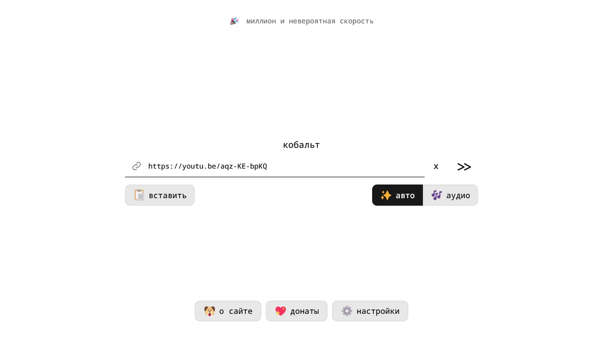

+++
title = 'Инструменты для YouTube'
categories = ['audio-video', 'software-collections']
publishDate = 2024-08-27T17:25:00Z
lastmod = 2024-09-17T17:26:00Z
description = """Полезные программы и сервисы для упрощения выполнения \
определённых действий."""
cover = ''
featured = false
+++

# Инструменты для YouTube


Полезные программы и сервисы для упрощения выполнения определённых действий.

## yt-dlp

> **Основная статья:** [yt-dlp](/wiki/yt-dlp)

[yt-dlp](https://github.com/yt-dlp/yt-dlp#readme) — универсальная программа с
открытым исходным кодом для скачивания видео и аудио из интернета: YouTube,
TikTok, X (Twitter), Reddit, Rutube и [сотни других сайтов]. Имеет гибкий
консольный интерфейс, возможно скачивать плейлисты и прямые эфиры.

[сотни других сайтов]: https://github.com/yt-dlp/yt-dlp/blob/master/supportedsites.md

yt-dlp также является библиотекой. На её основе существует множество
[сторонних приложений](/wiki/yt-dlp#сторонние-приложения), которые предоставляют
удобный интерфейс для скачивания видео.

> [!caution]
> Подобный способ скачивания аудио и видео из интернета может нарушать
авторские права и условия пользования сайтов. Используйте на свой страх и риск.

## cobalt

[cobalt](https://cobalt.tools) — это онлайн-загрузчик видео и аудио с разных
источников: YouTube, Reddit, Rutube, SoundCloud, TikTok, Twitch, Vimeo, X
(Twitter) и других. В cobalt нет рекламы, раздражающих ограничений и прочего
мусора, в отличие от других загрузчиков. Он с
[открытым исходным кодом](https://github.com/imputnet/cobalt) — каждый может
запустить свой сервер.

В настройках можно выбрать качество до 8K, форматы кодеков, битрейт аудио, язык
дубляжа, название файла. Поддерживается туннелирование всего трафика, чтобы
скрыть свой IP и устройство. На данный момент максимальная длина видео — 3 часа.

Используйте функцию [ремукса](https://cobalt.tools/remux) (remux) для того,
чтобы перекодировать файлы и исправить проблемы с поддержкой в старых
программах. Обработка производится быстро, без потери качества и на вашем
устройстве.

На мобильных устройствах сайт можно добавить на главный экран как
веб-приложение (Progressive Web App).

У официального сервера (cobalt.tools) есть бесплатный API, который вы можете
использовать в своих личных проектах. Однако вы не можете использовать
бесплатный API в коммерческих целях (платный доступ или показ рекламы), для
этого вы должны запустить свой экземпляр.

> [!caution]
> Вы (конечный пользователь) несёте ответственность за то, что вы загружаете,
как используете и распространяете этот контент. Пожалуйста, будьте внимательны
при использовании чужого контента и всегда отдавайте должное его авторам.

- [Состояние серверов](https://status.cobalt.tools);
- [Неофициальный список серверов сообщества](https://instances.hyper.lol/instances);
- [Отчёты об ошибках](https://github.com/imputnet/cobalt/issues);
- [Поддержать разработчиков](https://cobalt.tools/donate).

## Фронтенды

YouTube можно смотреть анонимно, не подключаясь к самому YouTube напрямую. Это
необходимо для того, чтобы избежать рекламных трекеров, исключить рекомендации
или просто использовать альтернативный интерфейс.

Такие фронтенды с открытым исходным кодом, и их может запустить любой желающий.
Доступно множество публичных серверов.

Google не нравятся такие сервисы, поэтому они могут иногда переставать работать,
пока их не починят разработчики. В случае возникновения проблем следует
переключаться между серверами. Серверы не используют API YouTube, а значит не
нарушают условия пользования.

Фронтенды также предоставляют свой API для взаимодействия с YouTube, так что
можно использовать это для получения данных.

Для автоматического перенаправления с YouTube, можно воспользоваться
расширением LibRedirect
([Firefox](https://addons.mozilla.org/firefox/addon/libredirect) /
[Chromium](https://libredirect.github.io/download_chromium.html))
или Predirect ([Firefox](https://addons.mozilla.org/firefox/addon/predirector) /
[Chromium](https://chromewebstore.google.com/detail/aiillidfcgfckfhkpiakhkkpbkknagnp)).

> [!caution]
> Использование альтернативных фронтендов вредит авторам, так как отсутствует
реклама. Подумайте о возможности поддержать авторов другими способами.

### Piped

[Piped](https://piped.video) — это альтернативный конфиденциальный фронтенд
YouTube, эффективный и масштабируемый по своей конструкции.

**Возможности:**
- Никаких подключений к серверам Google и YouTube.
- Локальные подписки, группы каналов, плейлисты и история просмотра.
- Система аккаунтов для синхронизации ваших подписок, плейлистов и истории
просмотра.
- Поддержка [Return YouTube Dislike](/wiki/youtube/dislike),
[SponsorBlock](/wiki/sponsorblock) и [DeArrow](/wiki/dearrow) через прокси.

Google блокирует Piped, из-за чего появляются различные ошибки, например
[«Sign in to confirm that you're not a bot»] [^1]. Они чаще всего появляются на
публичных серверах Piped, поэтому приходится перезагружать видео несколько раз
или менять серверы в настройках клиента. Если вы используете аккаунт в Piped, то
следует указать отдельный сервер для аутентификации.

[«Sign in to confirm that you're not a bot»]: https://github.com/TeamPiped/Piped/issues/3658

**Ссылки:**
- [Список публичных серверов](https://github.com/TeamPiped/Piped/wiki/Instances)
- [Документация](https://docs.piped.video/docs)
    - [Архитектура](https://docs.piped.video/docs/architecture)
    - [Почему Piped](https://docs.piped.video/docs/why)
    - [Запустить свой сервер](https://docs.piped.video/docs/self-hosting)
- [Сторонние приложения](https://github.com/TeamPiped/Piped#made-with-piped)
    - [LibreTube](/wiki/youtube/apps#libretube)
- [Исходный код](https://github.com/TeamPiped/Piped)
- [Поддержать проект](https://github.com/TeamPiped/Piped#donations)

### Invidious

[Invidious](https://invidious.io) — это альтернативный конфиденциальный фронтенд
YouTube. Он может работать в режиме прокси, но по умолчанию вы получаете видео
напрямую с серверов YouTube.

**Возможности:**
- Собственная система аккаунтов для подписок.
- Просмотр комментариев с Reddit.
- Использование без JavaScript.

**Ссылки:**
- [Список публичных серверов](https://docs.invidious.io/instances)
- [Документация](https://docs.invidious.io)
- [Исходный код](https://github.com/iv-org/invidious)
- [Поддержать проект](https://invidious.io/donate)

[^1]: Ошибка «Sign in to confirm that you're not a bot» в Piped **никак не
связана** с авторизацией в Piped. Это то, что показывает интерфейс YouTube
вместо данных о видео, потому что Google заблокировал IP-адрес сервера Piped.
Соответственно, «Sign in» здесь означает «войти в аккаунт Google».
